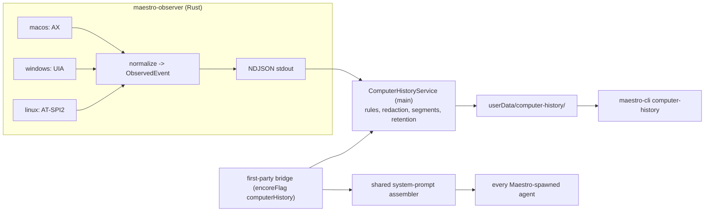

# Computer History - implementation plan

First-party plugin that records what the user does on their computer through the
OS accessibility API, stores it locally as JSONL, and exposes it to every
Maestro-spawned agent through the system prompt and `maestro-cli`.

Origin: teardown of ChatGPT desktop "Computer History" (Skysight), 2026-10-02.
Target branch: `rc` (the plugin system exists only there). Work branch:
`feat/computer-history`.

## Locked decisions

| #   | Decision                                                                                                                                                                                                                                                                                                                                |
| --- | --------------------------------------------------------------------------------------------------------------------------------------------------------------------------------------------------------------------------------------------------------------------------------------------------------------------------------------- |
| D1  | First-party plugin `com.maestro.computer-history`, Encore flag `computerHistory`, default off. Host code, not a sandboxed community plugin: the sandbox has no path to OS permissions or native code.                                                                                                                                   |
| D2  | One Rust helper binary, `maestro-observer`, with three platform adapters behind one event schema: macOS AX, Windows UI Automation, Linux AT-SPI2. All three platforms ship together. Parity is required.                                                                                                                                |
| D3  | No keystroke logging. Typed text comes from the field's committed value through the accessibility API (value-changed events, debounced, plus focus-out). No CGEventTap, no low-level keyboard hook, no Input Monitoring permission. A password typed into a remote-desktop viewer is never captured because the viewer exposes no text. |
| D4  | Store at `<userData>/computer-history/`. 15-minute UTC segments (:00/:15/:30/:45), an `index.jsonl` manifest, and a `SCHEMA.md` the app writes on start.                                                                                                                                                                                |
| D5  | System-prompt injection through a generic `systemPromptSection` on `FirstPartyPluginDefinition`. One shared assembler for desktop, CLI, and main-process spawns. Community plugins can NOT inject system-prompt text (every agent would carry it; prompt-injection surface).                                                            |
| D6  | The injected section is short; the full guide is a `{{REF:_computer-history}}` include.                                                                                                                                                                                                                                                 |
| D7  | CLI reads go straight to disk (work with the app closed). CLI writes go over the WS bridge to the same main-process service the UI calls.                                                                                                                                                                                               |
| D8  | Cue runs and group-chat agents receive the Maestro system prompt (and so the section). Today they receive none.                                                                                                                                                                                                                         |
| D9  | Maestro's own windows are excluded by default.                                                                                                                                                                                                                                                                                          |
| D10 | Retention defaults: 90 days, 25 GB. Oldest segments are deleted first when either limit is hit.                                                                                                                                                                                                                                         |
| D11 | Digests (agent-written 15-minute digests and 6-hour roll-ups, UTC blocks at 00/06/12/18) are an option, disabled by default. The user picks which agent writes them.                                                                                                                                                                    |
| D12 | Linux: when the accessibility bus is off, Maestro offers to turn it on (with consent) instead of only printing the fix.                                                                                                                                                                                                                 |
| D13 | SSH-remote agents do not get the section: the store path is local to the Maestro machine.                                                                                                                                                                                                                                               |
| D14 | No OCR, no screenshots, no cloud upload by Maestro itself.                                                                                                                                                                                                                                                                              |
| D15 | `computerHistory:` IPC channels go on `BRIDGE_DENIED_CHANNELS`: a signed-in browser must not read the user's screen history through `bridge.invoke`.                                                                                                                                                                                    |

## Components



| Piece                                        | Location                                                                                            |
| -------------------------------------------- | --------------------------------------------------------------------------------------------------- |
| Rust crate                                   | `native/maestro-observer/`                                                                          |
| Helper build script                          | `scripts/build-maestro-observer.mjs` -> `dist/native/<platform>-<arch>/maestro-observer[.exe]`      |
| Shared types, paths, reader                  | `src/shared/computer-history/`                                                                      |
| Secret redaction (canonical)                 | `src/shared/redactSecrets.ts` (agent-run/redact.ts imports it)                                      |
| Main service + supervisor                    | `src/main/computer-history/`                                                                        |
| First-party definition                       | `src/shared/plugins/first-party.ts` (`COMPUTER_HISTORY_FIRST_PARTY_PLUGIN`)                         |
| Shared system-prompt assembler               | `src/shared/maestroSystemPrompt.ts`                                                                 |
| System-prompt delivery (flag / file / embed) | `src/main/utils/system-prompt-delivery.ts`                                                          |
| Main-process system-prompt builder           | `src/main/utils/maestro-system-prompt.ts`                                                           |
| Prompts                                      | `src/prompts/computer-history-system.md` (section), `src/prompts/_computer-history.md` (full guide) |
| CLI                                          | `src/cli/commands/computer-history.ts`                                                              |

## Helper protocol (contract between Rust and TypeScript)

The helper is a long-lived child of the Electron main process.

- stdout: NDJSON, one `ObservedEvent` per line, UTF-8.
- stdin: NDJSON commands, one per line.
- stderr: free-form diagnostics; main logs it, never parses it.
- The helper MUST exit within 1 s when stdin reaches EOF (the parent died).
- `--version` prints `maestro-observer <semver>` and exits.
- `--probe` prints one `helper.status` line and exits (no observation). Used by `status` checks.

### ObservedEvent (protocol v1)

```jsonc
{
	"v": 1,
	"ts": "2026-10-03T14:10:00.123Z", // UTC, millisecond precision
	"kind": "app.activated", // see table
	"app": { "id": "com.tinyspeck.slackmacgap", "name": "Slack", "pid": 4242 },
	"window": { "title": "general - Acme", "url": "https://..." }, // optional; url only when known
	"element": { "role": "text_field", "label": "Message #general" }, // optional
	"text": "...", // optional, per kind
	"reason": "idle", // optional, per kind
	"truncated": false, // true when text was cut to the cap
}
```

| kind                | When                                                                                                                                                                                                                                 | Fields                                                                    |
| ------------------- | ------------------------------------------------------------------------------------------------------------------------------------------------------------------------------------------------------------------------------------ | ------------------------------------------------------------------------- |
| `app.activated`     | A different app comes to the front                                                                                                                                                                                                   | `app`, `window?`                                                          |
| `window.changed`    | Focused window or its title/url changes within the same app                                                                                                                                                                          | `app`, `window`                                                           |
| `text.committed`    | An editable field's value settles: 1.5 s without change (`reason: "idle"`), focus leaves it (`"blur"`), or it is emptied right after a non-empty value (`"cleared"`, usually a sent message; `text` holds the value before clearing) | `app`, `window`, `element`, `text` (full field value, cap `maxTextBytes`) |
| `selection.changed` | Selected text changes and stays for 1 s; empty selections are not emitted                                                                                                                                                            | `app`, `window`, `element?`, `text` (cap `maxTextBytes`)                  |
| `content.snapshot`  | Visible text of the focused window, flattened to lines (`role: text`, not a tree). On activation / window change, then at most every 30 s while it changes. Skipped when identical (hash) to the previous snapshot of that window    | `app`, `window`, `text` (cap `maxSnapshotBytes`)                          |
| `helper.status`     | On start, after any command, and when permission state changes                                                                                                                                                                       | `status` object (below)                                                   |
| `helper.error`      | A recoverable failure (an app's tree cannot be read, a D-Bus call fails)                                                                                                                                                             | `text` = message                                                          |

`app.id` per platform:

- macOS: bundle identifier (`com.apple.MobileSMS`).
- Windows: lowercase executable file name (`slack.exe`). Add `"aumid"` inside `app` when available.
- Linux: the `.desktop` id without suffix when known (`org.gnome.Nautilus`), otherwise the lowercase executable name from `/proc/<pid>/exe`.

`element.role` values are normalized: `text_field`, `text_area`, `combo_box`, `search_field`, `document`, `web_area`, `other`.

`helper.status`:

```jsonc
{
	"v": 1,
	"ts": "...",
	"kind": "helper.status",
	"status": {
		"version": "0.1.0",
		"platform": "macos", // macos | windows | linux
		"state": "running", // running | paused | blocked
		"permission": "granted", // granted | denied | not_required
		"accessibilityBus": "enabled", // linux only: enabled | disabled | unavailable
		"session": "wayland", // linux only: x11 | wayland | unknown
		"detail": "optional human-readable note",
	},
}
```

`state: "blocked"` means the helper cannot observe (permission denied, bus off). It keeps running and polls every 5 s so it starts on its own once the user grants access.

### Commands (stdin)

```jsonc
{ "cmd": "configure",
  "blockApps": ["com.1password.1password", "com.maestro.app"],
  "blockPids": [1234],
  "blockDomains": ["bank.example.com"],     // matches the domain and its subdomains
  "snapshots": true,
  "maxTextBytes": 8192,
  "maxSnapshotBytes": 32768 }
{ "cmd": "pause" }
{ "cmd": "resume" }
{ "cmd": "status" }                          // emits helper.status
{ "cmd": "enable-accessibility" }            // see below; emits helper.status
{ "cmd": "shutdown" }
```

The helper starts paused-until-configured: it emits `helper.status` and observes nothing until the first `configure`.

`enable-accessibility`:

- macOS: `AXIsProcessTrustedWithOptions` with the prompt option (opens the system dialog).
- Linux: set `org.a11y.Status.IsEnabled = true` on the session bus (what the GNOME/KDE accessibility toggles do). Apps started afterwards expose their trees.
- Windows: no-op (UIA needs no permission); reports `not_required`.

### Helper-side safeguards (mandatory, the TypeScript side re-checks)

- Never read anything from an app in `blockApps` / `blockPids`: no tree walk, no value read. Emit nothing for it, not even `app.activated`.
- Never read secure fields: macOS `AXSecureTextField` subrole, Windows `IsPassword`, Linux `ROLE_PASSWORD_TEXT`.
- Skip private / incognito browser windows: title markers `Incognito`, `Private Browsing`, `InPrivate`, `Private Window` (case-insensitive), and Safari private windows where AX exposes it.
- Drop events whose `window.url` host is in `blockDomains`.
- Chromium / Electron apps: on macOS set `AXManualAccessibility = true` on the app element (Electron) and `AXEnhancedUserInterface = true` (Chrome) once per app, so their web contents are exposed.

## Store layout

```
<userData>/computer-history/
  SCHEMA.md                 # written by the app on every start; the agent-facing format doc
  config.json               # retention, rules, digests (written by the service only)
  index.jsonl               # one line per closed segment
  segments/2026-10-03/1415Z.jsonl
  digests/2026-10-03/1415Z.md   # 15-minute digest, only when digests are on
  digests/2026-10-03/6h-1200Z.md  # 6-hour roll-up of 12:00-18:00, only when digests are on
```

- Segment file name = UTC start of its 15-minute window (`HHMM` + `Z`), folder = UTC date.
- Each line is an `ObservedEvent` after rules and redaction, plus `"seq"` (monotonic per segment).
- `helper.*` events are not stored.
- `index.jsonl` line: `{ "file": "segments/2026-10-03/1415Z.jsonl", "start": "...", "end": "...", "events": 312, "bytes": 81234, "apps": { "com.tinyspeck.slackmacgap": 120 } }`. The open segment has no index line until it closes; readers also scan the newest folder.
- Writes are append-only with a keyed write queue (pattern: `src/main/history-manager.ts`). `config.json` and `index.jsonl` rewrites go through `atomicWriteText`.

### config.json

```jsonc
{
	"version": 1,
	"retentionDays": 90,
	"maxBytes": 26843545600, // 25 GB
	"snapshots": true,
	"rules": [
		{ "match": "app", "value": "com.apple.MobileSMS", "action": "ignore" },
		{ "match": "domain", "value": "bank.example.com", "action": "ignore" },
	],
	"pausedUntil": null, // ISO timestamp, "forever", or null
	"digests": { "enabled": false, "agentId": null, "rollup": true },
}
```

Built-in exclusions (always on, not editable): password managers (1Password, Bitwarden, Dashlane, LastPass, KeePassXC, Keychain Access, Windows Credential Manager, GNOME Seahorse / KWallet), and Maestro itself.

## System prompt plumbing (A1)

1. `src/shared/maestroSystemPrompt.ts`: the one assembler. Inputs are already-resolved values (template text, template context, section texts), so it is pure and shared by renderer, CLI, and main. Also `systemPromptSectionPromptIds(encoreFeatures, { isSsh })`, derived from `FIRST_PARTY_PLUGIN_DEFINITIONS`.
2. `FirstPartyPluginDefinition.systemPromptSection?: { promptId: string }`.
3. Renderer `prepareMaestroSystemPrompt`, CLI `prepareMaestroSystemPromptCli`, and a new main builder all resolve their inputs and call the assembler. The CLI history-path bug (`.json` vs `.jsonl`) is fixed on the way.
4. `src/main/utils/system-prompt-delivery.ts`: the flag / Windows temp file / embed logic pulled out of `handle-spawn.ts` and reused by `cue-spawn-builder.ts` and `spawnGroupChatAgent.ts`.
5. Cue: build in `index.ts` `onCueRun` from the stored session, pass through `executeCuePrompt` to `buildSpawnSpec`.
6. Group chat: participants get the full Maestro system prompt for their agent. The moderator has no agent behind it, so it gets the plugin sections only.

## Phases

| Phase | Scope                                                                                                                                     |
| ----- | ----------------------------------------------------------------------------------------------------------------------------------------- |
| A1    | System-prompt plumbing above                                                                                                              |
| A2    | Rust helper: core, protocol, three adapters, build script, CI for all targets                                                             |
| A3    | Service: supervisor, ingest, rules, redaction, segments, retention, first-party definition, Extensions tile, boot/quit/flag-change wiring |
| A4    | CLI read verbs, prompts, SCHEMA.md, docs                                                                                                  |
| A5    | Control verbs + UI: pause/resume, rules, clear, permission flow (macOS prompt, Linux enable), recording indicator, CLI-UI-PARITY rows     |
| A6    | Digests (opt-in): 15-minute digest per closed segment, 6-hour roll-up per UTC block from those digests, catch-up on start                 |

## CLI surface

```bash
maestro-cli computer-history status [--json]
maestro-cli computer-history list [--since 2h] [--until ...] [--app <id>] [--json]
maestro-cli computer-history query [--since 30m] [--app <id>] [--kind text|selection|snapshot|app|window] [--grep <re>] [--limit N] [--json]
maestro-cli computer-history apps [--since 1d] [--json]
maestro-cli computer-history pause [--for 1h] | resume
maestro-cli computer-history rules list | add --app <id>|--domain <d> | remove <id>
maestro-cli computer-history clear (--since 1d | --all)
maestro-cli computer-history enable-accessibility
maestro-cli computer-history config [--retention-days N] [--max-gb N] [--snapshots on|off] [--digests on|off] [--digest-agent <id>] [--digest-rollup on|off]
maestro-cli computer-history digests [--since 1d] [--kind 15m|6h]
```

Text output fences captured content as `UNTRUSTED OBSERVED INPUT`.

## Risks

- R1 Prompt injection: every page the user reads reaches agents. Fence output, warn in the section, never act on captured text without the user.
- R2 Linux Chromium/Electron apps expose only titles unless accessibility is on before they start.
- R3 Windows UIPI: windows of elevated processes are not readable; recorded as app + title only.
- R4 Disk holds plaintext of messaging apps. Defaults and exclusions matter more than features.
- R5 macOS TCC identity differs between dev and signed builds; each needs its own grant.
