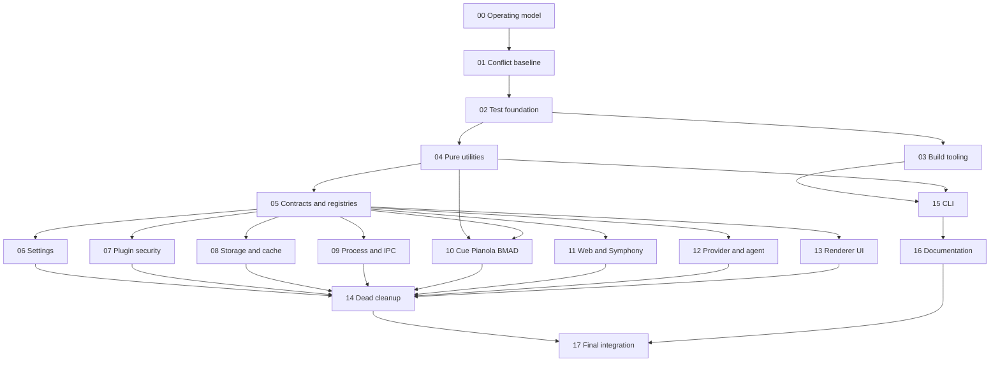

# Maestro Deduplication Execution Playbook

## Purpose

Safely implement every accepted cleanup track in `dedup-report.md` without changing behavior, weakening security boundaries, corrupting persisted state, or deleting code before every caller is migrated.

This playbook covers all **147** reviewed priorities exactly once. P1-P120 are the original audit scope; P121-P134 are Wave 14 additions accepted after saturation review; P135-P147 are Wave 15 implementation dispositions. The priority number is the stable cross-reference to `dedup-report.md`; line numbers and source paths may drift.

## Responsibility

The executor of a stage owns discovery, implementation, focused tests, smoke verification, cleanup, and the stage handoff. Never split a priority between agents or PRs. A fresh executor must be able to start from the stage file plus the current repository.

## Non-negotiable rules

1. Rebase or refresh against the current integration branch before each stage.
2. Read the cited priority and its surrounding evidence in `dedup-report.md` before editing.
3. Run LSP references before changing or deleting any exported symbol.
4. Establish current behavior with a focused test or executable reproduction before consolidation.
5. Preserve domain, trust, and lifecycle boundaries. Similar syntax is not sufficient reason to share code.
6. Migrate every caller in the same PR. Do not leave compatibility aliases unless the stage explicitly requires a migration window.
7. For persisted data, support old data through an explicit migration and test corrupt, missing, and prior-version states.
8. For IPC, preload, WebSocket, or plugin contracts, verify producer, transport, and every consumer together.
9. For security changes, add negative tests before refactoring and prove fail-closed behavior afterward.
10. For UI changes, render the affected flow in Chromium/Electron and verify keyboard, focus, Escape, pointer, and cleanup behavior as applicable.
11. Delete only after reference proof and a successful replacement smoke test.
12. One concern per commit where practical. Do not combine mechanical dedup with unrelated behavior changes.

## Stage map

| Stage | File                         | Purpose                                           |                                                                       Priorities | Count |
| ----- | ---------------------------- | ------------------------------------------------- | -------------------------------------------------------------------------------: | ----: |
| 00    | `00-operating-model.md`      | Baseline, branch, evidence, and mutation protocol |                                                                                - |     - |
| 01    | `01-conflict-baseline.md`    | Resolve source conflicts before structural work   |                                                                           75, 94 |     2 |
| 02    | `02-test-foundation.md`      | Canonical test factories and reliable coverage    |                                                        43, 45, 106, 109, 133-134 |     6 |
| 03    | `03-build-tooling.md`        | Scripts, packaging, CI, dependencies              |                                          11, 12, 24-29, 46-48, 105, 129-131, 135 |    16 |
| 04    | `04-pure-utilities.md`       | Low-risk pure helper consolidation                |                               2, 30, 40, 49, 56, 60, 66, 67, 74, 76, 82, 96, 120 |    13 |
| 05    | `05-contracts-registries.md` | Shared types, registries, and wire contracts      |                        4, 9, 14, 21, 35, 58, 97, 116-118, 121, 124, 137, 140-141 |    15 |
| 06    | `06-settings.md`             | Defaults, parsing, loading, and migrations        |                                                        6, 10, 18, 32, 41, 65, 92 |     7 |
| 07    | `07-plugin-security.md`      | Plugin persistence, ledger, sandbox limits        |                                                         50, 51, 59, 126, 142-144 |     7 |
| 08    | `08-storage-cache.md`        | Storage helpers, caches, provider reads           |                                                 5, 15, 54, 55, 98, 101, 102, 111 |     8 |
| 09    | `09-process-ipc.md`          | Process lifecycle, IPC, preload listeners         |                                  13, 16, 17, 20, 34, 57, 69, 71, 83, 85, 93, 110 |    12 |
| 10    | `10-cue-pianola-bmad.md`     | Cue, Pianola, debug package, BMAD                 |                                          3, 22, 44, 52, 53, 81, 84, 90, 100, 123 |    10 |
| 11    | `11-web-symphony.md`         | Web protocol, uploads, Symphony validation        |                                                                  7, 77, 112, 115 |     4 |
| 12    | `12-provider-agent.md`       | Agent/provider lookup, fetch, parsers             |                                                                  33, 80, 86, 113 |     4 |
| 13    | `13-renderer-ui.md`          | Renderer components, hooks, interactions          | 8, 19, 31, 36-38, 61-64, 70, 78, 79, 87-89, 99, 107, 114, 122, 125, 132, 145-147 |    25 |
| 14    | `14-dead-code-artifacts.md`  | Verified deletion after migrations                |                               1, 39, 42, 91, 95, 103, 104, 119, 127-128, 138-139 |    12 |
| 15    | `15-cli.md`                  | CLI envelopes, duration, environment, transport   |                                                                   23, 68, 72, 73 |     4 |
| 16    | `16-documentation.md`        | Canonical documentation references                |                                                                         108, 136 |     2 |
| 17    | `17-final-integration.md`    | Full regression, packaging, and audit closure     |                                                                                - |     - |

Total reviewed priorities: **147**. Current disposition invariant: **134 implemented + 11 retained + 2 already resolved = 147**. Partition invariant: no missing or duplicate priority numbers.

## Dependency graph

Stages 06-13 may run in parallel only after every incoming dependency shown above is complete and they do not share files introduced by Stage 05. In particular, Stage 10 depends on both Stage 04's utility/Cue groundwork and Stage 05's stabilized contracts. Stage 14 is deliberately late because deletion must follow all caller migrations.

## Pull request policy

- Default: one PR per stage.
- Split a stage only at the priority boundaries listed in that file.
- Never combine Stage 01 conflict resolution with semantic refactoring.
- Never combine security, persistence migration, and UI behavior in one PR.
- Use stacked PRs only when the dependency is explicit and the base branch is documented in the PR body.
- Every PR body must list covered priority numbers, behavior baselines, verification evidence, migrations, and rollback instructions.

## Plan mutation protocol

When source drift invalidates a step:

1. Stop before editing the affected priority.
2. Record the observed drift in the stage file's execution log or PR description.
3. Re-run references and compare the current behavior with the report evidence.
4. Choose one disposition: `execute`, `split`, `defer`, `already resolved`, or `reject finding`.
5. If priorities move between stages, update this index and prove the 1-147 partition remains complete and duplicate-free.
6. Never silently drop an item because its original line number changed.

## Definition of complete

The playbook is complete only when every priority is marked with evidence, all stage exit criteria pass, the final integration stage succeeds, and `dedup-report.md` is updated with implementation status and any evidence-backed rejected findings.
