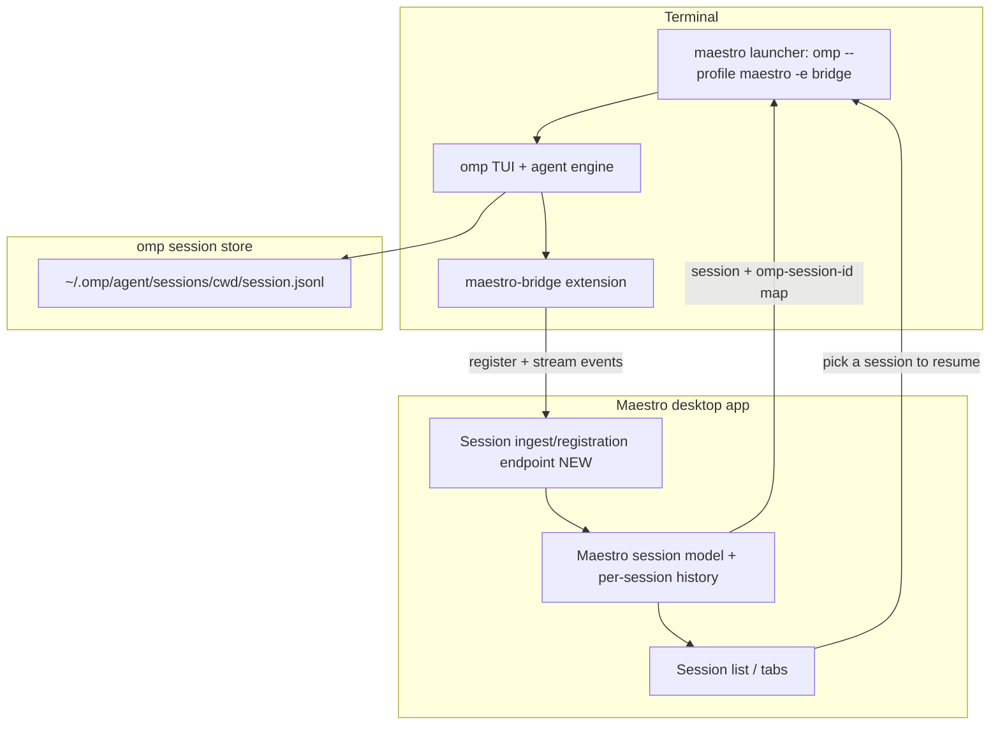

# Maestro TUI on Oh My Pi (omp) — Design

Status: design + initial implementation. The Bun-side product (launcher,
extension, protocol, session-map, scoped client, reference ingest server) is
implemented and tested under `src/mae/`; see section 11 for what is built vs.
what remains (desktop-app hosting of the ingest contract). This RFC remains the
source of truth for the architecture.
Branch: `feat/maestro-coding-agent`. Worktree: `.worktrees/maestro-coding-agent`.
Base: `rc` @ `2f4c26aa0`.

**Corrected intent (this supersedes an earlier, mis-framed draft).** The goal is
a **new Maestro TUI**: a terminal coding agent that takes omp's _interface and
power_ and integrates perfectly with the Maestro ecosystem. Concretely it must:

1. **Pick up sessions you have in Maestro** (resume a desktop session from the
   terminal).
2. **Have Maestro track every session you run in the TUI** (TUI runs show up
   live in the desktop app and are resumable from the GUI).
3. **Use the Maestro toolset to augment the TUI agent.**
4. **Be based on omp.**

This is explicitly **NOT**: an extension of the existing `maestro-cli` command
surface, and **NOT** the desktop GUI spawning omp as a subordinate agent. The
existing `maestro-cli` is out of scope and is not a model for this work.

> **Note on the prior draft.** An earlier version of this doc inverted the
> design: it had the Maestro _desktop app_ drive omp as a "spawnable external
> agent," mediated by an ACP client, packaged as a GUI plugin, with session sync
> as a footnote. That is the wrong center of gravity. The product is **omp's own
> TUI**, made a first-class Maestro citizen, with **session continuity as the
> spine.** Material reused from that draft: omp's surface inventory (section 2),
> the Maestro toolset extension (section 4.2), and the security model
> (section 5).

---

## 0. Product definition

> **Maestro TUI** = omp's terminal interface and agent engine, shipped as a
> first-class Maestro client. It is omp running under a **Maestro profile** + a
> **Maestro toolset extension** + a **two-way session bridge** to the desktop
> app. Not a fork of omp; not the legacy `maestro-cli`; not the GUI driving omp.

Launcher name: **`mae`** (chosen). It is a thin wrapper that invokes the
host's `omp` with a fixed, opinionated configuration (profile, extension,
system-prompt append, skills/rules, session bridge). omp does the heavy lifting
(the interactive TUI, the agent loop, tool rendering, approvals, streaming,
resume); Maestro integration is layered through omp's own extensibility plus a
bridge to the running app.

What the user gets:

- Launch `maestro` in any repo and get omp's full interactive coding TUI.
- `maestro --resume` (or a picker) lists and continues **Maestro** sessions, not
  just local omp ones (true engine-resume for omp-backed sessions; other engines
  import as context, see 3.2).
- Whatever they run in the TUI appears in the desktop app's session list, live,
  and can be opened/continued there.
- The agent can reach Maestro ecosystem capabilities (sibling agents, cues,
  playbooks, notifications, session metadata) as tools.

---

## 1. Why omp is the right base (its interface, not just its engine)

`omp` is `@oh-my-pi/pi-coding-agent`. Verified: `omp v16.1.20` at
`~/.bun/bin/omp.exe`. It is the very harness this design was written in.

We adopt omp's **whole interactive experience**, not merely call it headless:
the REPL, streaming output, thinking display, tool-call rendering, approval
prompts, session save/resume, model cycling, slash commands, collab. Building a
TUI of that quality from scratch is the bulk of the work, and omp already has it.

### Decision: wrap omp via its extension API; do not fork

omp exposes a documented, typed, first-class extension API (`ExtensionAPI`,
exported from the package root; see omp docs `extensions.md` / `custom-tools.md`
/ `hooks.md` / `sdk.md`). A single `-e` extension module covers all three
pillars without touching omp source:

- **Toolset (pillar 3):** `pi.registerTool({...})` registers LLM-callable
  `maestro_*` tools into the same pipeline as built-ins; `pi.registerCommand`
  adds slash commands.
- **Tracking (pillar 2):** `pi.on('session_start' | 'turn_start/end' |
'message_*' | 'tool_call'/'tool_result' | 'session_stop')` is the full
  lifecycle event bus - hook it to stream to the Maestro ingest endpoint;
  `pi.setSessionName` / `pi.appendEntry` persist the identity map.
- **Pickup (pillar 1):** launcher-level `omp --resume`, plus `ctx.sessionManager`
  (read transcript/branch) and command-context `newSession`/`switchSession`/
  `branch` for cross-engine import.
- **TUI presence:** `ctx.ui` (status line, widgets above/below editor, title,
  custom overlays) + custom renderers, without forking the renderer.

Extension code is trusted first-party TS executed inside omp's process, so it
can open the outbound socket to Maestro's scoped bridge endpoint directly.
(Hooks are now an alias for extensions; an MCP server is an available fallback
for the tools.)

**Why not fork:** omp ships fast (16.1.20 installed vs 16.1.23 latest) over a
Bun/TS tree with a native Rust addon layer; a fork is a perpetual-rebase
treadmill that also owns omp's build/sign/notarize pipeline and forfeits
upstream providers/models/security fixes - for capabilities the extension API
already provides. Fork would only pay off for core agent-loop or deep-chrome
changes none of the pillars need, and it does not even remove the Bun runtime
dependency. **The SDK (`createAgentSession`, in-process) is the fallback only if
we later need headless/in-process control** - it yields the agent, not the TUI,
so it loses the omp interface we explicitly want.

**Security caveat (load-bearing):** omp extensions are NOT sandboxed. The
`maestro-bridge` extension MUST therefore ship as **first-party, version-pinned**
code, never as a third-party plugin surface. Pin a minimum omp version; the
extension API is the integration contract.

Properties that make wrapping (not forking) the right call, all verified from
`omp --help`:

- **Bun-first.** `engines.bun >= 1.3.14`, `type: module`, ships TS source,
  `bin: omp -> dist/cli.js`. So we **wrap the binary**; we do not embed it in
  Node/Electron and do not fork it. Maestro integration rides omp's extension /
  profile / config / session mechanisms (all process-level, stable surfaces).
- **Isolated profiles.** `--profile <name>` / `OMP_PROFILE` gives "an isolated
  profile for auth, sessions, settings, and caches." A dedicated `maestro`
  profile keeps Maestro runs from perturbing the user's personal omp state and
  scopes the injected config.
- **Shell-shortcut minting.** `omp --profile maestro --alias maestro` creates the
  launcher shortcut itself; the `maestro` command can be that alias plus our
  extension flags, or a tiny shim that adds them.
- **Sessions are inspectable, portable JSONL.** Default store
  `~/.omp/agent` (`PI_CODING_AGENT_DIR`, overridable with `--session-dir`); files
  live at `<session-dir>/sessions/<encoded-cwd>/session.jsonl` (per the
  documented `--export` example). `--resume` (by id prefix / path / picker),
  `--continue`, `--no-session`. This concrete, file-based session model is what
  makes the bridge in section 3 feasible.
- **First-class extensibility.** `-e/--extension <file>` (repeatable),
  `--hook <file>`, `--plugin-dir <path>`, `plugin install/link`,
  `--no-extensions`; `--skills` / `--no-skills`, `--no-rules`, `--config <yaml>`
  (repeatable), `--system-prompt` / `--append-system-prompt`. This is how we
  inject the Maestro toolset and Maestro identity without touching omp source.
- **Rich tools already present.** read, bash, edit, write, grep, find, lsp,
  python, notebook, inspect_image, browser, **task (sub-agents)**, todo,
  web_search, ask; `--approval-mode always-ask|write|yolo`, `--thinking`,
  `--advisor`, `--max-time`. Multi-provider (Anthropic / OpenAI / Gemini /
  Bedrock / Vertex / OpenRouter / Groq / xAI / ...).
- **`omp acp`** (verified subcommand): an Agent Client Protocol server over
  stdio. Not the spine here (we want the TUI, not GUI-embedding), but the
  mechanism that lets the desktop GUI later _co-view or hand off_ a live TUI
  session if we want that (section 6, optional).

---

## 2. What "integrate perfectly with Maestro" decomposes into

Three pillars, in priority order. Pillars 1-2 are the spine and are net-new;
pillar 3 is the toolset work carried over from the prior draft.

| #   | Pillar                   | Direction            | Status today                                   |
| --- | ------------------------ | -------------------- | ---------------------------------------------- |
| 1   | **Session pickup**       | Maestro -> TUI       | net-new (the spine)                            |
| 2   | **Session tracking**     | TUI -> Maestro       | net-new; needs a new desktop ingest capability |
| 3   | **Toolset augmentation** | TUI agent -> Maestro | designed in prior draft; carried forward       |

**Honest constraint up front:** the desktop app today tracks sessions _it_
spawns; it does not ingest/track arbitrary externally-run agent processes. So
pillar 2 requires a new, first-party **session-ingest/registration** capability
on the desktop side. This is the single largest new piece and is called out as
such throughout.

---

## 3. Architecture: the session-sync spine

The heart of the product is a shared, two-way session model between **omp's
session store** and **Maestro's session model**.



### 3.1 The session identity map (makes pickup + tracking coherent)

Maintain a small, durable mapping record per session:

```
{ maestroSessionId, ompSessionId, engine: 'omp', cwd, title, lastActiveAt }
```

- Stored on the desktop side (so the GUI can resume) and discoverable by the TUI
  (so `maestro --resume` can list Maestro sessions and translate the chosen one
  into an omp `--resume <ompSessionId> --session-dir <...>`).
- A session created in the TUI registers this record on first turn (pillar 2); a
  session created via the GUI's omp engine already has it (so the TUI can pick it
  up, pillar 1).

### 3.2 Pillar 1 - Session pickup (Maestro -> TUI)

- **omp-native sessions** (started by Maestro's omp engine, GUI or TUI): clean
  resume. The launcher reads the identity map, resolves `ompSessionId`, and
  execs `omp --resume <ompSessionId> --session-dir <maestro session dir>`. Full
  engine-state continuity (omp replays its JSONL transcript).
- **Cross-engine sessions** (a desktop session that ran on claude-code/codex,
  not omp): there is no shared engine state to resume. Honest fallback: **import
  the transcript as context** - read Maestro's stored transcript for that
  session and start a fresh omp session seeded with it (via
  `--append-system-prompt` / an initial context message). This is "continue the
  conversation," not "resume engine state," and the UI must say so.
- UX: `maestro --resume` with no id opens a picker over Maestro sessions
  (reusing omp's picker affordance), filtered to the current repo by default.

### 3.3 Pillar 2 - Session tracking (TUI -> Maestro)

The `maestro-bridge` omp extension, on each TUI session:

1. **Registers** the session with the desktop app's new ingest endpoint on first
   turn (creates/updates the `SessionInfo` + identity-map record), so it appears
   in the GUI session list immediately.
2. **Streams** lifecycle + transcript events live so the GUI mirrors progress.
   omp's event stream is well-defined (the NDJSON event protocol:
   `session` / `agent_start` / `turn_start` / `message_start` /
   `message_update` [`text_delta`, `thinking_delta`] / `message_end`
   [`usage`, `cost`] / `turn_end` / `agent_end` / `tool_execution_*`). The
   extension forwards a metadata-and-transcript subset (not raw tool I/O secrets)
   to the ingest endpoint.
3. **Persists** the `ompSessionId` so the GUI can later resume the same session
   through Maestro's omp engine.

**New desktop work (the big rock):** a first-party ingest/registration surface
that (a) accepts an external session registration, (b) accepts streamed
transcript/status updates, (c) writes them into Maestro's session model + the
identity map, (d) surfaces the session in the GUI as a live, openable entry.
This is net-new on the app side and is where most desktop effort goes.

### 3.4 Where Maestro's session data lives (for the bridge to target)

Maestro persists sessions and per-session history in its own config/store (an
Electron Store JSON session list plus per-session history files under the
Maestro config dir). The bridge writes through the **app's ingest endpoint**,
never by poking those files directly, so the app stays the single writer and
there are no races. (We deliberately do not model this on the legacy CLI's
direct-file reads.)

---

## 4. Architecture: the Maestro toolset (pillar 3)

### 4.1 Identity + config injection

The `maestro` launcher invokes omp with:

- `--profile maestro` (isolated auth/sessions/settings),
- `--append-system-prompt` carrying Maestro identity + repo/branch/ecosystem
  context,
- Maestro `--skills` / rules and a `--config` overlay for Maestro defaults
  (model, thinking, approval mode),
- `-e maestro-bridge.extension.ts` (the bridge + toolset).

### 4.2 The reach-back toolset (Maestro tools inside omp)

The bridge extension injects Maestro tools into the omp agent. Each is mapped to
a capability from the plugin security spine (section 5) and to its risk class:

| omp tool                | effect                                     | capability gate         | phase          |
| ----------------------- | ------------------------------------------ | ----------------------- | -------------- |
| `maestro_sessions`      | list session metadata                      | `sessions:read`         | live (P2)      |
| `maestro_notify`        | toast / TTS (`omp say`)                    | `notifications:toast`   | live (P2)      |
| `maestro_playbook_list` | list/inspect playbook metadata             | `sessions:read`         | live (P2)      |
| `maestro_cue` (observe) | read cue state / events                    | `events:subscribe`      | live (P2)      |
| `maestro_playbook_run`  | run/enqueue a playbook (spawns agents)     | **dispatch-equivalent** | INERT until P4 |
| `maestro_cue` (emit)    | fire a cue (can resolve to dispatch)       | **dispatch-equivalent** | INERT until P4 |
| `maestro_dispatch`      | hand a sub-task to a sibling Maestro agent | **`agents:dispatch`**   | INERT until P4 |

**Resolved-effect gating (critical):** any verb that resolves to spawning/
dispatching an agent is gated like `agents:dispatch`, regardless of its surface.
`maestro_dispatch`, `maestro_playbook_run` (a playbook spawns agents), and
`maestro_cue` emit (a cue trigger can carry `action:'dispatch'`) are all
RCE-grade by transitivity (`plugin-phase4-high-risk-verbs.md:30-34, 161-194`) and
stay **INERT until Phase 4**. The broker classifies by the resolved effect, never
by "it is just a playbook/cue." Only read/observe verbs are live in Phase 2.

### 4.3 Transport for the toolset + the bridge

The bridge talks to the desktop app over a **per-run, capability-scoped bridge
endpoint**: a short-lived token bound to that omp process, accepting only an
**allowlisted verb table** (the live tools above + the session-ingest verbs from
section 3) and rejecting anything else at the boundary. It is **never** handed a
general desktop token that would authorize arbitrary commands - a prompt-injected
coding run must not be able to drive the whole app. Every verb passes through
`PermissionBroker` + `ActionGuard` (rate + concurrency caps, audit-before-effect).

---

## 5. Security model (non-negotiables)

The toolset turns a model's tool calls into ecosystem effects, so the plugin
security spine in `.worktrees/autonomous-manager-agent/src/{shared,main}/plugins`
governs it. Cited invariants from `Plans/plugin-build-contract.md:28-62` and
`plugin-phase4-high-risk-verbs.md`:

1. **Default-deny, brokered only.** Every reach-back/ingest effect goes through
   `PermissionBroker`; the extension holds only the scoped per-run endpoint
   (allowlisted verbs), never a general token, credential, socket, or channel.
2. **Resolved-effect gating** for dispatch-equivalent verbs
   (`maestro_dispatch`, `maestro_playbook_run`, `maestro_cue` emit): INERT until
   Phase 4, behind the Phase 3 sandbox decision, with allowlist scopes, closed
   arg schemas, host-owned binary allowlist, env allowlist (never inherit
   `process.env`), ActionGuard high caps, audit-before, separate non-bundled +
   distinct unattended consent, and code-identity binding
   (`plugin-phase4-high-risk-verbs.md:52-107, 212-232`).
3. **fs scopes structurally exclude the userData/config tree** (grants,
   enable-state, security settings, the session token, transcripts), enforced
   after real-path resolution (`plugin-build-contract.md:43-46`). Applies to any
   fs the toolset exposes.
4. **Session-ingest is write-scoped and validated.** The ingest endpoint accepts
   only the closed registration/stream schema, writes only into the session
   model + identity map, and is the single writer (no direct file pokes). It
   never accepts security-state writes (`plugin-build-contract.md:51-52`).
5. **`sessions:read` is metadata + transcript-for-pickup only**, re-authorized
   per delivery; never security state.
6. **Trust model:** the `maestro` launcher and bridge are **first-party, host-
   owned** code (the binary is host-resolved, like a built-in agent), which is
   why they may use the scoped bridge endpoint at all. A third-party _plugin_
   could not: net-egress-guard blocks the loopback port and any host token
   (`plugin-build-contract.md:43-50`). That asymmetry is why this is first-party
   code, not a sandboxed plugin.

---

## 6. Optional: live GUI co-view / handoff (not the spine)

Beyond passive tracking (section 3.3), `omp acp` enables the desktop GUI to
attach to a running TUI session as an ACP client - co-rendering the live agent,
or taking over input. This is a **nice-to-have**, not required for the three
pillars, and should be deferred until pillars 1-3 ship. Flag it so the session
model in section 3.1 stays compatible with it (the identity map already keys on a
stable session id).

---

## 7. Build plan (phased, each phase shippable)

### Phase 0 - The launcher + Maestro-flavored omp TUI

- A `maestro` launcher (alias/shim) that runs omp with the Maestro profile,
  system-prompt append, skills/rules, and config overlay. No bridge yet.
- Acceptance: `maestro` in a repo gives omp's full TUI with Maestro identity and
  defaults; sessions save under the Maestro profile's session dir.

### Phase 1 - Session pickup (pillar 1)

- Identity-map read path + `maestro --resume`/picker over Maestro sessions;
  omp-native resume; cross-engine transcript-import fallback.
- Acceptance: a session created by Maestro's omp engine resumes in the TUI with
  full continuity; a cross-engine session opens as a seeded new omp session with
  a clear "imported as context" banner.

### Phase 2 - Session tracking + read/observe toolset (pillars 2 + 3a)

- `maestro-bridge` extension: register + live-stream sessions to the new desktop
  **ingest endpoint**; implement the read/observe tools (`maestro_sessions`,
  `maestro_notify`, `maestro_playbook_list`, `maestro_cue` observe) over the
  scoped per-run endpoint with broker + ActionGuard.
- Desktop: build the ingest/registration capability and the live GUI surface for
  externally-run sessions.
- Acceptance: a TUI run appears live in the desktop session list, is resumable
  from the GUI afterward, and the agent can list sessions/playbooks and toast,
  all audited; dispatch-equivalent tools return a clear "requires Phase 4" error.

### Phase 3 - Governance UI + packaging polish

- Capability consent UI for the toolset (reuse `PluginConsentDialog` /
  `PluginsPanel` from the plugin worktree); package the launcher + extension for
  install; settings for Maestro-TUI defaults.
- Acceptance: enabling/disabling the toolset capabilities is a clear consent
  flow; uninstall purges grants + the profile cleanly.

### Phase 4 - Dispatch-equivalent verbs (GATED, not now)

- Only after the Phase 3 sandbox decision
  (`plugin-phase3-sandbox-decision.md`) resolves and the realm-escape regression
  is green. Then wire `maestro_dispatch` / `maestro_playbook_run` /
  `maestro_cue` emit against the full Phase 4 checklist
  (`plugin-phase4-high-risk-verbs.md:212-232`).

### Phase 5 (optional) - ACP co-view / handoff (section 6).

---

## 8. File-level work map

We deliberately do NOT touch `src/cli` (the legacy CLI is out of scope).

Launcher + omp config (Phase 0), net-new:

- `tui/maestro-launcher` (the `maestro` shim/alias wiring profile + flags)
- `tui/profile/` (Maestro omp profile: system-prompt append, skills/rules,
  `config.yml` overlay)

Bridge extension (Phases 1-2), net-new, omp-side (Bun/TS):

- `tui/extension/maestro-bridge.extension.ts` (registers Maestro tools; session
  register + event stream)
- `tui/extension/session-map.ts` (identity-map read/resolve for pickup)

Desktop-side (Phase 2), net-new, host:

- session **ingest/registration endpoint** + the scoped per-run bridge endpoint
  (mints the short-lived token, enforces the verb allowlist, binds to the omp
  process lifetime)
- broker-fronted handlers for the live toolset verbs (reusing existing ecosystem
  logic, NOT the legacy CLI verbs)
- GUI surface for externally-run / tracked sessions
- the identity-map store + the omp-session-id write path used by GUI resume

Governance (Phase 3), reuse the plugin spine:

- consent/UI in `src/renderer/components/Settings/` (`PluginConsentDialog`,
  `PluginsPanel`)

---

## 9. Risks, open questions, decisions needed

1. **Wrap vs fork (SETTLED): wrap via the extension API; do not fork.** See the
   decision record in section 1. The bridge ships as first-party, version-pinned
   code (omp extensions are not sandboxed). The Bun/Node boundary is moot either
   way - the TUI is the host omp binary under a profile + flags + one extension.
2. **Session-ingest is the biggest new piece.** "Maestro tracks every TUI
   session" is net-new desktop work; scope it explicitly. Decide the live
   transport (reuse the app's existing live channel mechanism vs a dedicated
   one) without anchoring on the legacy CLI.
3. **Cross-engine pickup is import-as-context, not resume.** A desktop
   claude-code/codex session cannot be engine-resumed by omp. Confirm the
   product accepts "continue as a new omp session seeded with the transcript" for
   non-omp sessions, with an explicit UI banner.
4. **Session-store reconciliation.** Decide whether the Maestro-omp session dir
   is the user's default `~/.omp/agent` or a Maestro-profile dir, and how the
   identity map is keyed (Maestro session id <-> omp session id <-> cwd).
5. **Auth/profile isolation.** Recommend a dedicated `maestro` omp profile so TUI
   runs do not perturb the user's personal omp sessions/quotas and so the env is
   a closed allowlist.
6. **Recursion / loops.** `maestro_dispatch` (when wired) plus omp's own `task`
   sub-agents could recurse (TUI dispatches a Maestro agent that is itself the
   TUI). Cap depth + concurrency in ActionGuard; tag dispatched runs with
   provenance. Relevant only at Phase 4.
7. **Naming (SETTLED): `mae`.** A distinct command from the existing
   `maestro-cli` binary, so no collision. `mae` execs the host `omp` with the
   Maestro profile + extension + flags.

---

## 10. Recommendation

Build the **Maestro TUI as a thin wrapper over omp** (profile + system-prompt +
toolset extension + session bridge), with **session continuity as the spine**:
Phase 0 (Maestro-flavored omp TUI) -> Phase 1 (pickup) -> Phase 2 (tracking +
read/observe toolset, incl. the new desktop ingest endpoint) -> Phase 3
(governance/packaging). Defer dispatch-equivalent verbs to the gated Phase 4 and
ACP co-view to the optional Phase 5.

This delivers exactly the asked-for product - omp's interface and power as a
Maestro-native terminal agent that picks up Maestro sessions, is tracked by
Maestro, and is augmented by the Maestro toolset - without forking omp, without
touching the legacy CLI, and without wiring RCE-grade verbs ahead of their
security review.

---

## 11. Implementation status (this branch)

Built and tested under `src/mae/` (portable TS; only the external `omp` binary
runs under Bun). Verified with `bun test src/mae` (34 tests, 6 files, all green),
`bun build` of both entrypoints, and a real `mae --mae-dry-run` end-to-end.

Implemented:

- `protocol.ts` - the bridge contract: verbs (live vs dispatch-equivalent), env
  handshake, discovery, wire shapes, and guards for all external input.
- `session-map.ts` - the identity-map store (upsert/touch/resolve/find) powering
  pickup + tracking.
- `bridge-client.ts` - the scoped-endpoint client; refuses dispatch-equivalent
  verbs client-side; degrades when the app is not connected.
- `launcher.ts` + `bin/mae.ts` - `mae`: resolves the host omp binary, composes
  `--profile maestro -e <bridge> --append-system-prompt <maestro> --config`,
  `mae resume [query]` (identity-map -> omp resume key), the best-effort
  per-run scoped-token handshake, and a `--mae-dry-run` plan printer.
- `extension/maestro-bridge.extension.ts` - the single omp extension: registers
  the read/observe tools (live) + the dispatch-equivalent tools (inert), and
  streams session lifecycle (`session_start`/`turn_*`/`message_end`/
  `tool_execution_end`/`session_shutdown`) to the ingest endpoint while keeping
  the identity map current. Generates a stable Maestro session id (reused on
  continue, decoupled from the session file path).
- `reference-server.ts` - a `node:http` reference implementation of the ingest
  contract (token issue + verb allowlist + dispatch refusal + session ingest),
  used by the integration test and as the spec the desktop app implements.
- Assets (`assets/maestro-system.md`, `assets/maestro.config.yml`), the omp type
  shim (`types/omp.d.ts`), and tests (`test/`).
- Shipping wiring: `scripts/build-mae.mjs` (esbuild -> `dist/cli/mae.js` +
  `dist/mae/maestro-bridge.extension.mjs` + assets), root `bin.mae`, `build:mae`
  in the build chain, `tsconfig.mae.json` + `typecheck:mae` wired into `lint`,
  and `src/mae/**` carved out of the vitest globs (mae uses `bun test`).

Remaining (the desktop-app half of pillar 2):

- Host the ingest contract inside the Maestro desktop app: implement the
  `/v1/sessions/issue` + `/v1/bridge` routes (mirroring `reference-server.ts`)
  against the real session store + the live GUI, and write the
  `mae-bridge.json` discovery file. This needs the running Electron app to
  verify and is the largest remaining piece.
- Surface tracked/externally-run sessions in the GUI session list and wire GUI
  resume through the identity map.
- Confirm the omp config-overlay keys for real Maestro defaults (the overlay is
  a valid no-op today).
- Verified via the parent checkout's `node_modules`: `build:mae` (esbuild)
  produces `dist/cli/mae.js` + `dist/mae/maestro-bridge.extension.mjs` +
  assets, `tsc -p tsconfig.mae.json` reports 0 errors, and the built
  `dist/cli/mae.js --mae-dry-run` resolves the dist-layout extension/assets.
- Phase 4 (dispatch-equivalent verbs) and Phase 5 (ACP co-view) remain as
  designed.
