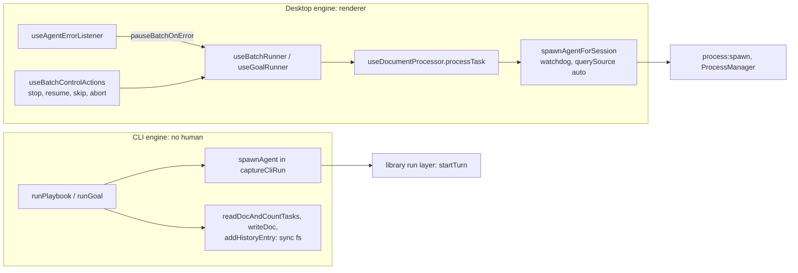
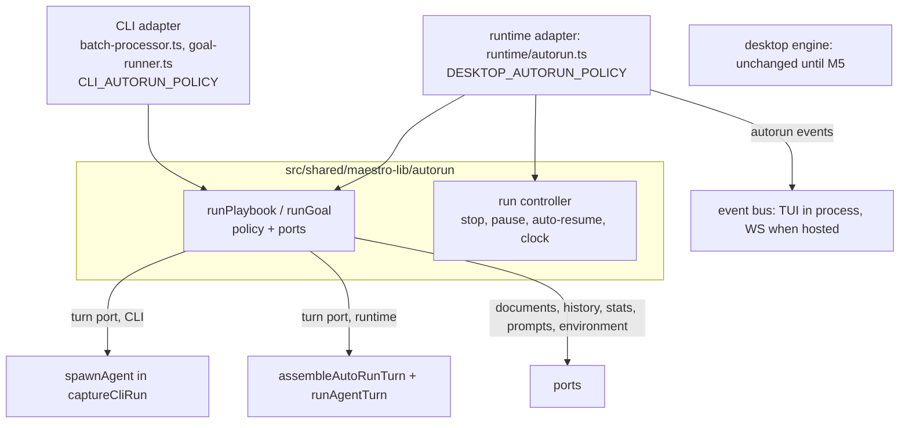
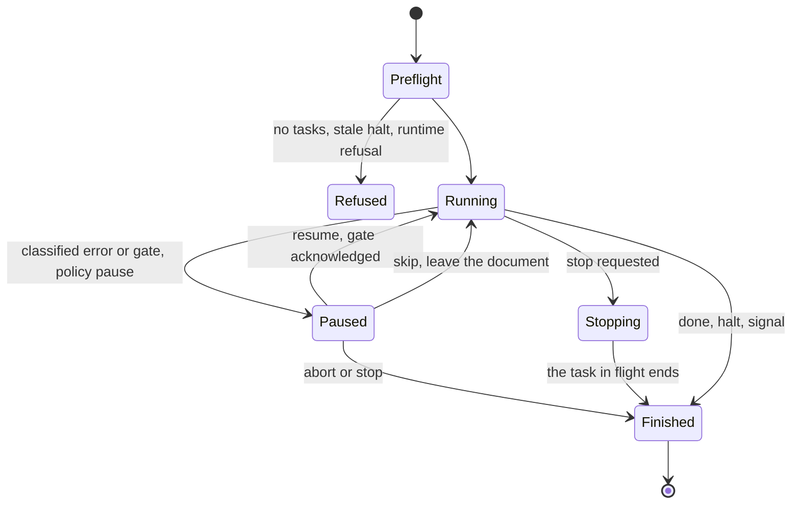

# Maestro TUI: one Auto Run engine

| Field      | Value                                                                                                  |
| ---------- | ------------------------------------------------------------------------------------------------------ |
| Status     | Design. Phase 7, task 1: written before any engine code                                                |
| Date       | 2026-10-04                                                                                             |
| Covers     | Gap L6, req-D3, req-D4 (item 3), AR-1 to AR-9, AR-10 noted                                             |
| Implements | `AutoRunApi` of `MaestroClient` in process (`Plans/maestro-tui-client-api.md` 4.6.1, wire table 5.5.1) |
| Surveyed   | `maestro-tui` at `094ac3105`: the CLI engine, the desktop engine, and the library they will share      |

Decision names: `req-Dn` is in `Plans/maestro-tui-requirements.md`, `RTn` in `Plans/maestro-tui-runtime.md`, `PAn` and `Qn` in `Plans/maestro-tui-prompt-assembly.md`. This doc adds behaviors `B1` to `B24` (section 2), findings `F1` to `F12` (section 3), ports and waits `P1` to `P12` and `W1` to `W11` (section 5), convergence changes `C1` to `C5` (section 6), decisions `AE1` to `AE23` (section 9), risks `AR1` to `AR7` (section 10), and open questions `OQ1` to `OQ5` (section 11).

---

## 1. The two engines today

**CLI engine.** `runPlaybook(session, playbook, folderPath, options)` in `src/cli/services/batch-processor.ts` and `runGoal(session, goalConfig, options)` in `src/cli/services/goal-runner.ts`. Both are async generators of JSONL events (`src/cli/output/jsonl.ts`). Callers: `run-playbook.ts`, `run-doc.ts`, `goal-run.ts`. Turns go through `spawnAgent` (`agent-spawner.ts`), which already starts the process through the library run layer (`startTurn`, `TurnCapture`), wrapped in `captureCliRun` for the agent-run ledger. There is no human: nothing waits, and stop is an `AbortSignal` (Ctrl+C) that interrupts the turn in flight.

**Desktop engine.** `useBatchRunner.startBatchRun` (the document loop) over `useDocumentProcessor.processTask` (one task), and `useGoalRunner.startGoalRun` (the goal loop). State is `batchReducer` plus `batchStateMachine` (IDLE, INITIALIZING, RUNNING, PAUSED_ERROR, STOPPING, COMPLETING), mirrored to other clients as `AutoRunBroadcastState`. Controls are `useBatchControlActions` (stop after the current task, pause, resume, skip document, abort) and `useBatchKillAction` (kill now). The error pause is triggered OUTSIDE the runner: `useAgentErrorListener` calls `pauseBatchOnError` when the batch process raises `agent-error`, then offers the failure to Agent Resilience and to the auto-resume fallback (`autoRunResumeStore`). Turns go through `useAgentExecution.spawnAgentForSession` (`{agentId}-batch-{ts}`, `permissionMode: 'full'`, `querySource: 'auto'`, a watchdog), then `process:spawn` in main.



The two share more than either admits: markers (`src/shared/autorunMarkers.ts`), the stall rule (`src/shared/autorunStall.ts`), model hints and turn settings (`autorunModelHints.ts`, `autorunTurnSettings.ts`), goal rules (`src/shared/goalDriven/`), history reconciliation (`autoRunHistoryReconciliation.ts`), template variables, and the new-session message. Everything below is what they do NOT share.

---

## 2. Behavior matrix

Spec-driven runs (document mode):

| ID  | Behavior                     | CLI engine                                                                                                                                        | Desktop engine                                                                                                                                                                                           | Phase 7        |
| --- | ---------------------------- | ------------------------------------------------------------------------------------------------------------------------------------------------- | -------------------------------------------------------------------------------------------------------------------------------------------------------------------------------------------------------- | -------------- |
| B1  | Start guards                 | Busy check in the command (`checkAgentBusy`: desktop `state`, `cli-activity.json`); registers `cli-activity.json`. Ignores `autoRunDisabled` (F7) | `autoRunDisabled` kill switch, mirrored-run guard, `claimAutoRunStart` cross-window claim                                                                                                                | AE16, AE18     |
| B2  | Preflight                    | Refuses a stale halt marker (`HALT_MARKER_PRESENT`) and no tasks (`NO_TASKS`). Total = unchecked only                                             | Refuses a stale halt marker (toast, same shared wording). No tasks: silent return. Total = checked + unchecked                                                                                           | AE16           |
| B3  | Task counting                | `readDocAndCountTasks`: a plain regex, not fence-aware (F1)                                                                                       | `countMarkdownTasks`, fence-aware. The stall guard counts with it on both engines                                                                                                                        | C1             |
| B4  | Completed tasks per dispatch | `remaining - newRemaining`: negative when the agent adds tasks (F2)                                                                               | `max(0, newChecked - prevChecked)`                                                                                                                                                                       | C2             |
| B5  | Task prompt                  | Selection block, template pass, expanded document written back, new-session message, then `# Current Document` plus the whole document text       | Same, without the inlined document (the default prompt names `{{DOCUMENT_PATH}}`), with steering notes in front                                                                                          | AE22, W3       |
| B6  | Per-run model and effort     | `resolveTurnSettings(hint, runOverride ?? agent)`, `ignoreModelHints`, a `model_resolution` event                                                 | Same chain and flag, warnings to the log                                                                                                                                                                 | same already   |
| B7  | Task synopsis                | A resume turn with `autorun-synopsis` at the cheapest settings; `--no-synopsis` skips it                                                          | First sentence of the response's first paragraph; no extra turn                                                                                                                                          | AE15           |
| B8  | Per-task history row         | AUTO row with `completedTaskCount`, `projectPath` = agent cwd                                                                                     | Same, plus `contextUsage`; `projectPath` = effective cwd (a worktree path)                                                                                                                               | same already   |
| B9  | Stall guard                  | `evaluateStall` per document; `document_stalled` event only. Checks halt BEFORE stall                                                             | Same rule, fed `watchdogFailure`; writes a `Document stalled:` row and a toast. Checks stall BEFORE halt (F4)                                                                                            | C4, AE11       |
| B10 | Halt marker                  | Ends the run; final row `Auto Run halted: <reason>`                                                                                               | Ends the run; the final row reports completion (`completed` or `completed with stalls`), and the reason appears only in a looping run's final loop row and a toast                                       | CLI order kept |
| B11 | HITL gate                    | Checked once per document, at its start (F3); skips the document with `document_gated`                                                            | Checked before every dispatch; pauses (`hitl_gate`, recoverable), one notice per gate line; resume re-reads and writes the acknowledgement (`acknowledgeHitlGate`); skip leaves the document; abort ends | AE8, C3        |
| B12 | Error pause                  | None. A failed task is recorded and the loop goes on                                                                                              | Any classified agent error parks the run (banner, frozen clock, row `Auto Run error: <title> (<doc>)`, toast); resume re-dispatches; skip leaves the document; abort ends                                | AE7            |
| B13 | Auto-resume                  | None                                                                                                                                              | Agent Resilience (classified outages), the limit coordinator (limit errors, hour-scale probe), then the fallback (`resolveAutoResumePolicy`: 5 min, 5 attempts per run, never a limit error)             | AE9, W4        |
| B14 | Watchdog                     | None                                                                                                                                              | Inactivity (`autoRunInactivityTimeoutMin`, default 240) and total duration (`autoRunMaxTaskDurationMin`, default 480); kills the turn, `errorKind: 'watchdog-*'`, the stall trips at once                | AE11           |
| B15 | Stop                         | `signal`: interrupts the turn in flight, records the task `interrupted` and the run `Auto Run stopped: by operator`                               | Stop waits for the task in flight. Kill kills now and writes `Auto Run killed:`                                                                                                                          | AE6, W9        |
| B16 | Loop and reset               | Reset unchecks the ORIGINAL after the document completes. An all-reset playbook exits after one pass                                              | Reset runs a working copy `runs/<name>-<ts>-loop-<n>.md` and never touches the original (the documented contract, `docs/autorun-playbooks.md`). An all-reset playbook loops until max loops or stop      | AE21, OQ1      |
| B17 | Loop rows                    | Same summary line; the non-final row has no details                                                                                               | Same line, details on every row, `Tasks Discovered for Next Loop` on non-final rows                                                                                                                      | AE20, OQ4      |
| B18 | Final row                    | `Auto Run completed: N tasks in K loops`, `Auto Run halted:`, `Auto Run stopped: by operator`; totals reconciled against history                  | `Auto Run <completed / completed with stalls / stalled / stopped>: N tasks in <duration>`, stalled-document list, achievement progress, `achievementAction`; totals reconciled the same way              | AE20, OQ4      |
| B19 | Stats                        | Agent-run ledger only (`captureCliRun`)                                                                                                           | `query_events` (`source: 'auto'`) per turn, `auto_run_sessions` and `auto_run_tasks` (the Usage Dashboard's Auto Run panels), session origins (`'auto'`)                                                 | AE12           |
| B20 | Run clock                    | Wall clock                                                                                                                                        | Wall clock minus machine sleep minus paused spans (`useTimeTracking`, sleep-aware spans)                                                                                                                 | AE10, W5       |
| B21 | Worktree runs                | None                                                                                                                                              | `config.worktree` (`git:worktreeSetup`, setup script, branch checkout, PR via `gh`) or `config.worktreeTarget` (a worktree AGENT made by `useAutoRunHandlers`)                                           | W1, W2         |
| B22 | Steering notes               | None                                                                                                                                              | Thought Stream notes, taken once per dispatch (`takeSteeringNotesForDispatch`), `formatSteeringNotesBlock` after the template pass, cleared at run start and end                                         | W3             |

Goal-driven runs and side effects:

| ID  | Behavior             | CLI engine                                                                                                                                                                                                                                                         | Desktop engine                                                                                                                                                                                                                                                                  | Phase 7       |
| --- | -------------------- | ------------------------------------------------------------------------------------------------------------------------------------------------------------------------------------------------------------------------------------------------------------------ | ------------------------------------------------------------------------------------------------------------------------------------------------------------------------------------------------------------------------------------------------------------------------------- | ------------- |
| B23 | Goal loop            | Shared markers, `evaluateGoalExit`, hard cap, handoff note (gated on `supportsResume`), start, iteration, and final rows. Synopsis = first non-empty line. Goal turns omit `querySource`, the Claude token source, and additional directories (F6). No error pause | Same shared rules. Synopsis = first sentence of the first paragraph. Commits a git checkpoint per iteration. Pauses on a LIMIT error and retries the same iteration; any other classified error leaves a paused banner while the loop goes on (F5). Different exit labels (F11) | AE7, AE23, C5 |
| B24 | Desktop-only effects | none                                                                                                                                                                                                                                                               | Toasts, TTS synopsis, STATUS.json watch, power-save blocker, Symphony progress, achievements and leaderboard (`onComplete`), a 20 s progress poll, queue drain after the run                                                                                                    | W8, AE17      |

---

## 3. Findings

| ID  | Finding                                                                                                                                                                                                                                                                                                                                              | Disposition        |
| --- | ---------------------------------------------------------------------------------------------------------------------------------------------------------------------------------------------------------------------------------------------------------------------------------------------------------------------------------------------------- | ------------------ |
| F1  | CLI task counts are not fence-aware. `readDocAndCountTasks` matches `/^[\s]*-\s*\[\s*\]\s*.+$/gm`, so a `- [ ]` inside a code fence is a task. When the real tasks are done the loop keeps dispatching for the phantom one until the stall guard, which counts fence-aware, gives up three turns later and reports a stall on a finished document    | C1                 |
| F2  | CLI completions go negative. `tasksCompletedThisRun = remainingTasks - newRemainingTasks`: an agent that ticks one task and adds two reports -1, and that lands in `completedTaskCount` and the run totals                                                                                                                                           | C2                 |
| F3  | CLI misses a gate in the middle of a document. It reads `findPendingHitlGate(docHeadContent)` once, before the task loop, and the gate scan stops at the first unchecked task. A gate above the third task is invisible while the first is pending, so the CLI dispatches the gated task                                                             | C3                 |
| F4  | The desktop drops a halt written on a stall-tripping dispatch: it `break`s on the stall before it reads the halt marker, so the run goes on to the next document and the next launch refuses over the leftover marker. The CLI checks halt first                                                                                                     | CLI order kept, M5 |
| F5  | A desktop goal run keeps iterating under a paused banner. The error listener parks the run state on ANY classified error (banner, frozen clock, a resolution promise), but `useGoalRunner` awaits that promise only for a limit error                                                                                                                | AE7 (engine), M5   |
| F6  | CLI goal turns are not configured like task turns. `runGoal` and `requestHandoffBlurb` pass no `querySource: 'auto'`, no Claude token source (`enableMaestroP`, `maestroPMode`, `maestroPPath`), and no `additionalDirectories`. The desktop's goal turns carry all three                                                                            | W10                |
| F7  | The CLI ignores `autoRunDisabled`, whose metadata says it "prevents all Auto Run operations from starting"                                                                                                                                                                                                                                           | W10, OQ5           |
| F8  | Desktop `Auto Run auto-retry:` rows inflate run totals. The prefix is missing from `CONTROL_SUMMARY_PREFIXES`, so each such row counts as one task through the `?? 1` floor in `aggregateAutoRunHistoryTotals` (`Auto Run error:` is listed)                                                                                                         | W10 (one line)     |
| F9  | `src/shared/cli-activity.ts` ignores the data directory: it hard-codes the lowercase `maestro` directory and never reads `MAESTRO_USER_DATA`. A runtime on another data dir (a dev build, a test temp dir) would register runs in the user's real file                                                                                               | AE18               |
| F10 | Node's monotonic clock is not a portable sleep filter. libuv uses `mach_continuous_time` on macOS 10.12 and later, which counts sleep, and `CLOCK_MONOTONIC` on Linux, which does not ([libuv darwin.c](https://git.stg.centos.org/source-git/libuv/blob/c8s/f/src/unix/darwin.c), [nodejs/node#47724](https://github.com/nodejs/node/issues/47724)) | AE10, W5           |
| F11 | The CLI's goal exit labels claim to mirror the desktop's and do not (`Goal run deadlocked` against `Goal run hit a deadlock`, and two more). Both sets are in `CONTROL_SUMMARY_PREFIXES`, so totals are not affected                                                                                                                                 | OQ4                |
| F12 | The desktop drains one queued item every time an Auto Run task's process exits (`spawnAgentForSession`'s exit path), while the run is still going. A write message queued "to prevent file conflicts" can start just as the next task does                                                                                                           | AE17 (not copied)  |

---

## 4. The library engine

### 4.1 Shape



The CLI engine is the base (L6): its generator, its event types, its preflight, and its loop order move as they are. The desktop's behavior arrives as policy branches and a run controller. The desktop keeps its own engine in Phase 7; it moves onto this one at M5.

### 4.2 Files

| File                                                    | Holds                                                                                                   | Comes from                                                                            |
| ------------------------------------------------------- | ------------------------------------------------------------------------------------------------------- | ------------------------------------------------------------------------------------- |
| `autorun/engine-types.ts`                               | Ports, `AutoRunPolicy` and its two presets, `AutoRunEvent`, turn request and result                     | new                                                                                   |
| `autorun/run-playbook.ts`                               | `runPlaybook`                                                                                           | `src/cli/services/batch-processor.ts`                                                 |
| `autorun/run-goal.ts`                                   | `runGoal`                                                                                               | `src/cli/services/goal-runner.ts`                                                     |
| `autorun/preflight.ts`                                  | `preflightPlaybook`: counts, stale halt, no tasks                                                       | `batch-processor.ts` preflight pass                                                   |
| `autorun/run-control.ts`                                | `createRunController`: stop, pause and resolution, auto-resume timer, paused spans                      | `useBatchControlActions`, `autoRunResumeStore`, `useTimeTracking` (no sleep)          |
| `autorun/history-entries.ts`                            | The rows the CLI writes today (task, loop, final, goal), the stall row, the error-pause row             | `batch-processor.ts`, `goal-runner.ts`, the desktop's stall and error rows            |
| `autorun/synopsis.ts`                                   | `extractTaskSynopsis`, `extractGoalSynopsis`                                                            | `useDocumentProcessor.ts`, `useGoalRunner.ts` (the desktop imports them back)         |
| `autorun/local-documents.ts`                            | The documents port over local `fs`, working copies included                                             | `agent-spawner.ts` helpers, the local branch of `autorun:createWorkingCopy`           |
| `turns/assemble.ts` (`assembleAutoRunTurn`)             | An Auto Run turn: no tab, no nudge, no read-only layer, `permissionMode: 'full'`, `querySource: 'auto'` | `spawnAgentForSession`, sharing `assembleTurn`'s internals                            |
| `runtime/autorun.ts`                                    | `AutoRunApi` in process, one run per agent, refusals, holds, the progress projector                     | new (task 5)                                                                          |
| `runtime/autorun-turns.ts`                              | The runtime turn runner: assemble, run, register, watchdog, `query_events` row, output forwarding       | new (task 5)                                                                          |
| `control/idle-watchdog.ts`, `control/agent-liveness.ts` | `createIdleWatchdog`, the liveness event list                                                           | `src/main/utils/` (re-export shims stay there; both files import nothing)             |
| `stats/auto-run-insert.ts`                              | `auto_run_sessions` and `auto_run_tasks` SQL and binders                                                | `src/main/stats/auto-run.ts` (imports them back), the `query-event-insert.ts` pattern |
| `src/shared/agentErrorTitles.ts`                        | `getErrorTitleForType`                                                                                  | `src/renderer/hooks/agent/internal/helpers/errorTitles.ts` (re-exports it)            |

No `src/shared/maestro-lib/host/` folder: it collides with `host.ts`.

### 4.3 Ports

Every port may answer synchronously or with a promise; the engine awaits each answer. The engine imports no `fs`, no process API, and nothing from `src/cli`, `src/main`, or `src/renderer`.

```ts
type MaybePromise<T> = T | Promise<T>;

/** One turn. The engine resolves model and effort for every purpose; the adapter forwards them. */
export interface AutoRunTurnRequest {
	purpose: 'task' | 'synopsis' | 'goal-iteration' | 'goal-handoff';
	prompt: string;
	/** Resume this provider session (synopsis, handoff). Absent: a fresh session. */
	resumeSessionId?: string;
	model?: string;
	effort?: string;
	/** The playbook document, for labels and the ledger. */
	document?: string;
	signal?: AbortSignal;
}

export interface AutoRunTurnResult {
	success: boolean;
	response?: string;
	agentSessionId?: string;
	usageStats?: UsageStats;
	error?: string;
	outcome?: TurnOutcome;
	/** The classified failure. An error pause keys on this and nothing else (AE7). */
	agentError?: AgentError;
	/** Set by a watchdog (AE11). */
	errorKind?: 'watchdog-stalled' | 'watchdog-timeout';
	contextUsage?: number;
}

export interface AutoRunDeps {
	turns: {
		/** Once per run, after preflight: where the CLI builds its system prompt today. */
		prepare?(): Promise<void>;
		run(request: AutoRunTurnRequest): Promise<AutoRunTurnResult>;
	};
	documents: {
		/** `unchecked` and `checked` from `countMarkdownTasks` (C1). */
		read(
			folder: string,
			name: string
		): MaybePromise<{ content: string; unchecked: number; checked: number }>;
		readTasks(folder: string, name: string): MaybePromise<{ content: string; tasks: string[] }>;
		write(folder: string, file: string, content: string): MaybePromise<void>;
		/** Policy `reset: 'working-copy'`: copy to `runs/<base>-<ts>-loop-<n>.md`, answer the copy's name. */
		createWorkingCopy?(folder: string, name: string, loopNumber: number): MaybePromise<string>;
	};
	history: {
		append(entry: HistoryEntry): MaybePromise<void>;
		/** May throw: the engine then reports its own counters, as both engines do today. */
		readAll(agentId: string): MaybePromise<HistoryEntry[]>;
	};
	/** Optional. Called where the desktop calls `startAutoRun`, `recordAutoTask`, `endAutoRun` (AE12). */
	stats?: {
		startRun(run: AutoRunSessionInput): MaybePromise<string | null>;
		recordTask(runId: string, task: AutoRunTaskInput): MaybePromise<void>;
		endRun(runId: string, durationMs: number, tasksCompleted: number): MaybePromise<void>;
	};
	prompts: {
		get(id: PromptId): Promise<string>;
		taskSelectionBlock(
			mode: TaskSelectionMode | undefined,
			segment?: { count: number; total: number }
		): Promise<string>;
	};
	environment: {
		gitBranch(cwd: string): MaybePromise<string | undefined>;
		isGitRepo(cwd: string): MaybePromise<boolean>;
		groupName(groupId: string | undefined): MaybePromise<string | undefined>;
		/** Policy `checkpointCommits` (AE23). Best effort: never throws into the run. */
		commitAll?(
			cwd: string,
			message: string
		): Promise<{ committed: boolean; commitHash?: string; error?: string }>;
	};
	activity: {
		begin(entry: { agentId: string; label: string; startedAt: number }): void;
		end(agentId: string): void;
	};
	clock: { now(): number };
	log: {
		autorun(message: string, context?: string, data?: unknown): void;
		warn(message: string, context?: string, data?: unknown): void;
	};
	/** Absent: never pauses, stop only through `signal` (the CLI). */
	controller?: AutoRunController;
}
```

Task 2 maps the CLI's reader onto `documents.read` as it is (its own regex count, no `checked`); C1 in task 3 switches the count to `countMarkdownTasks` and adds `checked`.

The agent is the record the CLI passes today (`SessionInfo`), typed structurally, so a runtime `AgentRecord` fits. The template context still reads the whole record, as `substituteTemplateVariables` does now.

### 4.4 Policy

Surface rules are one object. A rule is a policy, not a fork, only where the surfaces differ for a reason: one has a person and the other does not, or the CLI has a contract a script depends on (AE4).

```ts
export interface AutoRunPolicy {
	onGate: 'skip-document' | 'pause';
	onAgentError: 'continue' | 'pause';
	/** Fallback auto-resume for error pauses. Never a gate, never a limit error (AE9). */
	autoResume: AutoResumePolicy | null;
	synopsis: 'resume-turn' | 'from-response' | 'none';
	reset: 'in-place' | 'working-copy';
	/** Append `# Current Document` and the document text to every task prompt. */
	inlineDocument: boolean;
	/** Commit the tree after each goal iteration. */
	checkpointCommits: boolean;
}

export const CLI_AUTORUN_POLICY: AutoRunPolicy = {
	onGate: 'skip-document',
	onAgentError: 'continue',
	autoResume: null,
	synopsis: 'resume-turn',
	reset: 'in-place',
	inlineDocument: true,
	checkpointCommits: false,
};

export const DESKTOP_AUTORUN_POLICY: AutoRunPolicy = {
	onGate: 'pause',
	onAgentError: 'pause',
	autoResume: resolveAutoResumePolicy(), // on: 5 min, 5 attempts
	synopsis: 'from-response',
	reset: 'working-copy',
	inlineDocument: false,
	checkpointCommits: true,
};
```

The runtime uses the desktop preset because the TUI attached to a desktop gets the desktop engine, and req-D2 says the TUI cannot tell its hosts apart beyond a status-bar label. `--no-synopsis` sets `synopsis: 'none'` on the CLI preset.

### 4.5 Events

`runPlaybook` and `runGoal` yield `AutoRunEvent`. Its CLI-visible members keep today's JSONL shapes byte for byte: `start`, `debug`, `verbose`, `document_start`, `task_preview`, `task_start`, `model_resolution`, `task_complete`, `history_write`, `document_gated`, `document_stalled`, `halt`, `document_complete`, `loop_complete`, `complete`, `error`, `goal_start`, `goal_iteration_start`, `goal_iteration_complete`, `goal_complete`. New facts get new types, which the CLI adapter does not forward (AE5):

| Type                | Fields                                                                                         | Emitted when                                                |
| ------------------- | ---------------------------------------------------------------------------------------------- | ----------------------------------------------------------- |
| `paused`            | `kind: 'error' \| 'gate'`, `document?`, `documentIndex?`, `agentError?`, `gate?`, `iteration?` | The run parks (once per gate line)                          |
| `resumed`           | `resolution: 'resume' \| 'skip' \| 'abort'`, `auto: boolean`                                   | The pause is answered, by a person or the auto-resume timer |
| `gate_acknowledged` | `document`, `line`, `written: boolean` (the engine wrote the tick)                             | A resumed gate is passed                                    |

Rule for later changes: never add a field to a CLI-visible type. In `--json` mode it is CLI output.

### 4.6 Control



```ts
export interface AutoRunController {
	/** Graceful stop: checked before every dispatch, document, and loop. */
	stopRequested(): boolean;
	/** Park until a person or the auto-resume timer answers. A stop answers `abort`. */
	awaitResolution(pause: AutoRunPause): Promise<'resume' | 'skip' | 'abort'>;
	/** Closed paused time so far, for the run clock (AE10). */
	pausedMs(): number;
}
```

`createRunController({ clock, autoResume, setTimer })` answers the controller plus the runtime's handles: `requestStop()`, `resolve(action)`, `isPaused()`, `pending()`.

**Spec-driven order for one task** (desktop order where the desktop is right, AE7):

1. Stop requested: end the run, `stopped`.
2. Read the document. Gate before the next unchecked task (C3): `skip-document` emits `document_gated` and moves on; `pause` emits `paused` (once per gate line), awaits, and on resume re-reads, writes `acknowledgeHitlGate` when the person did not tick, re-reads, emits `gate_acknowledged`, and never pauses on that gate again. Skip leaves the document. Abort ends the run.
3. Dispatch, re-read, and evaluate the stall right after the re-read, as the CLI does today (`watchdogFailure` from `errorKind`). Record: `task_complete`, the history row, the stats task row.
4. Interrupted by `signal`: end the run, `stopped` (unchanged).
5. Halt marker: end the run. This is the CLI's order, halt before stall, which keeps F4 out of the runtime.
6. Error pause: policy `pause` and `agentError` present and not interrupted. Write the `Auto Run error: <title> (<document>)` row, emit `paused`, start auto-resume (not for a limit error), await. Resume goes on; skip leaves THIS document; abort ends the run. The stall decision from step 3 stands whatever the answer.
7. Stalled: `document_stalled`, the stall row (C4), next document.

**Goal-driven.** Before each iteration: stop requested ends the run `stopped-by-user`. An iteration whose result carries `agentError` under policy `pause` is not recorded and not counted; the run pauses; resume retries the same iteration number; skip and abort end it `stopped-by-user`. This is the desktop's limit rule applied to every classified error, which removes F5 from the engine. Checkpoint commits (policy) run after the iteration row, as on the desktop.

**Auto-resume** (AE9). On an error pause that is not a limit error, when `policy.autoResume` is set and the run has attempts left: a timer of `delayMs` answers `resume` and emits `resumed { auto: true }`. A person's answer cancels the timer. Attempts count per run and a successful resume does not reset them (`autoRunResumeStore`'s rule). Gates never auto-resume.

**Clock** (AE10). `totalElapsedMs = clock.now() - startedAt - controller.pausedMs()`; a loop row subtracts the pauses inside that loop. A task turn never spans a pause, so per-task times are unchanged. Without a controller, `pausedMs` is 0 and the CLI's figures stay exactly as they are.

### 4.7 The CLI adapter (task 2)

`src/cli/services/batch-processor.ts` keeps `runPlaybook(session, playbook, folderPath, options)` and `export { detectHaltMarker }`; `goal-runner.ts` keeps `runGoal`. Each builds the ports from the CLI modules it imports today (`agent-spawner`, `agent-run-capture`, `storage`, `prompt-loader`, `git-utils`, `system-prompt`, `shared/cli-activity`, `main/utils/logger`), so every `vi.mock` path in the existing tests still intercepts. It passes no controller and `options.signal` (from task 3, also `CLI_AUTORUN_POLICY`), and forwards only the CLI event types.

Its turn runner: `prepare()` calls `prepareMaestroSystemPromptCli` once, at the point the CLI does today. `run()` calls `captureCliRun({ source }, () => spawnAgent(...), settlementFromAgentResult)` with the options each purpose gets today, field for field: task turns carry `querySource: 'auto'`, the token source, and additional directories; synopsis turns resume at the cheap settings; goal turns keep F6 as it is. The adapter maps nothing else.

### 4.8 The runtime adapter (task 5)

`runtime/autorun.ts` implements `AutoRunApi` on the in-process client.

- **Launch.** Validate (`validateAutoRunLaunch`, `validateGoalRunLaunch`), resolve each `file` to its name under the agent's Auto Run folder, refuse per AE16, run `preflightPlaybook`, then start the engine and answer. A refusal is `rejected` before anything starts, with the client API's codes. `launchGoal` answers `{}`: the runtime has no tab to name.
- **Controls.** `stop` is graceful (`requestStop`); `resume`, `skip`, `abort` answer the pending pause; `resume` also answers a gate (client API 4.6.1: there is no `answerGate`). Each answers on delivery, as the desktop does.
- **Ports.** Turns: `runtime/autorun-turns.ts`. Documents: `local-documents.ts`. History: the library history writer and `readHistory`. Stats: the library recorder plus AE12. Prompts: the library prompt loader. Environment: the repository's groups, the git branch as `loadTurnContext` reads it, a local `commitAll`. Activity: process holds plus `cli-activity.json` under the data dir (AE18). Clock: `Date.now`. Log: the library logger.
- **Turn runner.** `loadTurnContext` + `assembleAutoRunTurn` + `runAgentTurn` under `sessionId` `${agentId}-batch-${ts}` (the desktop's batch id shape), registered in the process registry as `(agentId, 'autorun')`, with the watchdog (AE11). On exit it writes one `query_events` row with `source: 'auto'` and the desktop's fields. It forwards the turn's text and usage as `autorun` events `{ kind: 'output' | 'usage', processId }`, which `reduceAutoRun` already folds into the output tail and the token and cost totals.
- **Progress.** A projector folds engine events into `AutoRunBroadcastState` (the wire shape `parseAutoRunProgress` reads), recounting the files the run works on after each task as the desktop does, and emits `{ type: 'autorun', event: { kind: 'state' } }`, ending with `state: null`. A goal run is modeled as the desktop does: `goalMode`, 100 tasks, progress as completed tasks. It keeps the latest frame per agent for the host's replay on connect (task 6).
- **Holds.** While a run holds an agent (AE17), Phase 6's queue and assembly see it: `autoRunHoldsTree` is true, a write send that is not forced queues, and the queue drains when the run ends, not between tasks (F12).
- **AR-1.** Listing needs no runtime method: the TUI already reads the folder through `listAutoRunDocuments`, which works headless unchanged.

What task 6 needs from this adapter: the `AutoRunApi` (wire table 5.5.1 maps each method to its desktop message), `activeRuns()` for `host status` and for `host stop`'s refusal, and `latestState(agentId)` for the replay of live runs when a socket connects.

---

## 5. What ports in Phase 7, and what waits

| ID  | Ports now                                                                                                                                     | Requirement        | Task |
| --- | --------------------------------------------------------------------------------------------------------------------------------------------- | ------------------ | ---- |
| P1  | Error pause with resume, skip, abort                                                                                                          | AR-7               | 3, 5 |
| P2  | HITL gate pause, acknowledgement on resume, checked before every dispatch                                                                     | AR-7               | 3    |
| P3  | Run clock without paused time                                                                                                                 | AR-6               | 3    |
| P4  | Fallback auto-resume                                                                                                                          | AR-7               | 3    |
| P5  | Graceful stop (the client contract: "stop after the current task")                                                                            | AR-7               | 3, 5 |
| P6  | Convergence C1 to C5                                                                                                                          | AR-7, rule share   | 3    |
| P7  | The desktop preset's branches: working-copy reset, synopsis from response, no inlined document, goal checkpoint commits, goal pause and retry | AR-4, AR-5, req-D2 | 3    |
| P8  | Watchdog in the runtime turn runner                                                                                                           | AR-7               | 5    |
| P9  | AUTO history through the library writer, with the error-pause row                                                                             | AR-8               | 3, 5 |
| P10 | Stats rows: `query_events` (`auto`), `auto_run_sessions`, `auto_run_tasks`                                                                    | AR-8               | 5    |
| P11 | Run holds: `autoRunHoldsTree` and the queue gate                                                                                              | PA13, Q4           | 5    |
| P12 | Run registration in `cli-activity.json`, under the data dir                                                                                   | B1, F9             | 5    |

| ID  | Waits                                                                                                                 | Why, and when                                                                                                                                             |
| --- | --------------------------------------------------------------------------------------------------------------------- | --------------------------------------------------------------------------------------------------------------------------------------------------------- |
| W1  | Worktree runs (AR-9, P1)                                                                                              | AE13                                                                                                                                                      |
| W2  | PR creation on completion                                                                                             | Needs W1                                                                                                                                                  |
| W3  | Steering notes (AR-10, P2)                                                                                            | No client method and no TUI surface. The engine side is one prompt prefix (`formatSteeringNotesBlock` after the template pass); it lands with the surface |
| W4  | Agent Resilience batch retry and the limit coordinator                                                                | Renderer stores with their own transcript cards and `resilience_events` rows. A headless limit pause waits for a person                                   |
| W5  | Machine-sleep exclusion from the run clock                                                                            | No portable signal (F10). A tick-gap detector could do it later                                                                                           |
| W6  | Auto Run for an SSH-remote agent                                                                                      | The documents port is local only. The runtime refuses rather than read local paths for a remote folder (AE16)                                             |
| W7  | The desktop's history wording: final statuses, loop details, goal labels, achievement progress                        | M5, when one engine serves both (OQ4)                                                                                                                     |
| W8  | Toasts, TTS, STATUS.json, power-save blocker, Symphony progress, achievements and leaderboard, the 20 s progress poll | Desktop surfaces. The runtime emits events; the TUI draws its own                                                                                         |
| W9  | Kill (`Auto Run killed:`)                                                                                             | Not on the client API. Host shutdown uses `signal` and records `stopped`                                                                                  |
| W10 | F6, F7, F8                                                                                                            | CLI and desktop bugs the merge does not need. Follow-ups, each a small change                                                                             |
| W11 | Moving the desktop onto the engine                                                                                    | M5, the last clause of L6, with section 11 resolved                                                                                                       |

---

## 6. Convergence changes

These change behavior on every surface, the CLI included, and each only where the old output was wrong. They land in task 3, after the move (task 2) has proved the CLI's output byte-identical.

| ID  | Change                                                                                                                          | Fixes | CLI output changes when                                                                                     |
| --- | ------------------------------------------------------------------------------------------------------------------------------- | ----- | ----------------------------------------------------------------------------------------------------------- |
| C1  | The documents port counts with `countMarkdownTasks`; the CLI's `readDocAndCountTasks` switches to it and also reports `checked` | F1    | A document holds a `- [ ]` inside a code fence                                                              |
| C2  | Completed tasks per dispatch = `max(0, checkedAfter - checkedBefore)`                                                           | F2    | An agent adds tasks while it works                                                                          |
| C3  | The gate check runs before every dispatch. The CLI's answer stays `document_gated` and the next document                        | F3    | A gate sits above a task other than the first pending one                                                   |
| C4  | A stalled document writes `Document stalled: <doc> (<n> tasks remaining)`, `success: false`, the desktop's wording and details  | none  | Never on stdout; one more History row on a stall                                                            |
| C5  | Goal iteration synopsis uses the desktop's extraction (`extractGoalSynopsis`)                                                   | none  | A goal iteration reports no rationale; the row's fallback text reads the first sentence, not the first line |

C4 and C5 are not bugs; they take the desktop's better rule now because the runtime needs it and one rule is cheaper than two. C4's row is a control row (`Document stalled:` is in `CONTROL_SUMMARY_PREFIXES`), so totals do not move.

---

## 7. Phase 7 task map

| Task | Lands                                                                                                                                        | Proof                                                                                                |
| ---- | -------------------------------------------------------------------------------------------------------------------------------------------- | ---------------------------------------------------------------------------------------------------- |
| 2    | AE1 to AE3, AE5, AE19: the engine files, the ports, the CLI adapters. No policy yet: the moved engine behaves exactly as the CLI             | `batch-processor.test.ts` and `goal-runner.test.ts` pass without edits; engine tests with fake ports |
| 3    | AE4, AE6 to AE10, AE15, AE20 to AE23, C1 to C5: every engine change, the controller, both presets (the CLI preset reproduces task 2 exactly) | A test per transition (section 8); CLI tests updated only where C1 to C5 change output               |
| 4    | Nothing: worktree runs are deferred (AE13). Add the one-line note to this doc and check the box                                              | none                                                                                                 |
| 5    | AE11, AE12, AE16 to AE18: the runtime adapter, the turn runner, the watchdog, stats, holds, activity                                         | Fake-provider tests; the TUI Auto Run view works headless with no change to `src/tui/`               |
| 6    | The host serves `AutoRunApi` over the desktop's messages (5.5.1), pushes `autorun_state`, replays live runs on connect                       | Host tests on a temp dir                                                                             |
| 8    | The M3 test                                                                                                                                  | Section 8, history counts                                                                            |

---

## 8. Testing

- **Task 2.** The moved engine is reached through the unchanged CLI entry points, so `src/__tests__/cli/services/batch-processor.test.ts` and `goal-runner.test.ts` run as they are. Engine tests go in `src/shared/maestro-lib/autorun/__tests__/` with fake ports, and must keep the CLI's call order (preflight reads, then `prepare()`, then the first document).
- **Task 3.** One test per transition: error pause then resume, skip, abort; gate pause then resume (tick written, no second pause), resume after the person ticked (nothing written), skip, abort; stop while paused (answers `abort`); graceful stop with a task in flight; auto-resume fires, a manual answer cancels it, attempts run out, never for a gate or a limit error; the clock leaves out paused spans (fake clock); goal pause retries the same iteration; C1 to C5; each preset against the same document.
- **Task 5.** A fake provider in the Phase 6 style. Assert the history rows, the stats rows (the recorder over a fake connection, as Phase 6 does), the state frames, the refusals, and the holds.
- **History counts.** A three-task single-pass run writes three per-task rows (each carries `completedTaskCount`) and one final row, `Auto Run completed: ...`, which is the run boundary reconciliation needs. So the M3 test's "three AUTO history entries" means three per-task rows: count rows with `completedTaskCount`, and expect four AUTO rows in all. A goal run writes a start row, one row per iteration, and a final row.
- **Data dirs.** Every runtime test runs on a temp data dir and passes it to `cli-activity` (F9). Strip `MAESTRO_USER_DATA` from the test environment, or the run lands in the live data dir.

---

## 9. Decisions

| ID   | Decision                                                                                                                                                                                                                                                                                | Why                                                                                                                                                                                                                                                                                                                                                      |
| ---- | --------------------------------------------------------------------------------------------------------------------------------------------------------------------------------------------------------------------------------------------------------------------------------------- | -------------------------------------------------------------------------------------------------------------------------------------------------------------------------------------------------------------------------------------------------------------------------------------------------------------------------------------------------------- |
| AE1  | One engine in `src/shared/maestro-lib/autorun/`, flat beside the client-side modules, as `turns/` is. The CLI engine is the base: generator, events, preflight, loop order                                                                                                              | L6 names the CLI engine as the base; it is already Electron-free apart from its I/O                                                                                                                                                                                                                                                                      |
| AE2  | All I/O through ports (4.3). No `fs`, no process API, no `src/cli`, `src/main`, `src/renderer` import in the engine. Ports answer sync or async                                                                                                                                         | The library boundary rule; the CLI's sync helpers and the runtime's async writers fit one shape                                                                                                                                                                                                                                                          |
| AE3  | One turn port with a `purpose`. The engine resolves model and effort for every purpose; the CLI adapter wraps `spawnAgent` in `captureCliRun` with today's options per purpose; the runtime adapter wraps `assembleAutoRunTurn` and `runAgentTurn`                                      | The hint, run override, and cheap-synopsis rules stay in one place; the CLI's spawn options stay byte-identical                                                                                                                                                                                                                                          |
| AE4  | Surface rules are one `AutoRunPolicy` with `CLI_AUTORUN_POLICY` and `DESKTOP_AUTORUN_POLICY`. The runtime uses the desktop preset. M5 collapses them                                                                                                                                    | req-D2: the TUI must see the same run on either host. A named preset keeps the gap visible and testable instead of scattering flags                                                                                                                                                                                                                      |
| AE5  | CLI-visible events keep their shapes; new facts get new types; the CLI adapter forwards only CLI types                                                                                                                                                                                  | `--json` prints events verbatim, so any added field is CLI output                                                                                                                                                                                                                                                                                        |
| AE6  | Two stop levels: graceful (`stopRequested`, after the task in flight) and immediate (`signal`). A stop while paused answers `abort`                                                                                                                                                     | The client contract says "stop after the current task"; Ctrl+C and host shutdown must not wait for a long turn                                                                                                                                                                                                                                           |
| AE7  | An error pause keys on the result's `agentError`. Spec order: record, halt, stall, then pause; skip leaves the document that failed. Goal: the errored iteration is not consumed and resume retries it, for every classified error                                                      | No race between the exit and an IPC event. When the failing task also tripped the stall, the desktop awaited the pause in the NEXT document, so Skip skipped a document that never failed. One goal rule removes F5                                                                                                                                      |
| AE8  | Gates are checked before every dispatch. Resume writes the acknowledgement when the person did not tick, and never re-pauses on that gate. No history row for a gate                                                                                                                    | The desktop's rule (B11); the playbook's own requirement that resume records the human step rather than pausing again                                                                                                                                                                                                                                    |
| AE9  | The fallback auto-resume ports (default on, 5 min, 5 attempts per run). Never for a gate or a limit error                                                                                                                                                                               | A headless run has nobody to click Resume. A limit wants an hour-scale probe, and five 5-minute tries would spend the attempts and fail                                                                                                                                                                                                                  |
| AE10 | Run clock = wall time minus paused spans, through the injected clock. Machine sleep is not subtracted headless                                                                                                                                                                          | F10: no portable sleep signal. Servers rarely sleep; the cost lands on a laptop host only                                                                                                                                                                                                                                                                |
| AE11 | The watchdog lives in the runtime turn runner. `createIdleWatchdog` and `agent-liveness` hoist to `src/shared/maestro-lib/control/` with shims; settings `autoRunInactivityTimeoutMin` and `autoRunMaxTaskDurationMin`, 0 off. The engine maps `errorKind` to `watchdogFailure`         | A hung turn in a detached host is never seen. The stall guard must trip where the desktop's does (AR-7). The CLI keeps no watchdog, as today                                                                                                                                                                                                             |
| AE12 | The runtime turn runner writes a `query_events` row per Auto Run turn (`source: 'auto'`). The engine calls the optional `stats` port where the desktop calls `startAutoRun`, `recordAutoTask`, `endAutoRun`. SQL hoists to `stats/auto-run-insert.ts`                                   | AR-8: the Usage Dashboard's Auto Run panels read `auto_run_sessions` and `auto_run_tasks`; its user / auto split reads `query_events.source`                                                                                                                                                                                                             |
| AE13 | Worktree runs wait (W1)                                                                                                                                                                                                                                                                 | No client field asks for one (`AutoRunLaunchInput` has none). The only create path today is the desktop's: the renderer's `buildWorktreeSession` and main's `git:worktreeSetup` (local and SSH, setup script, the watcher's creation marks). Porting it means hoisting a desktop subsystem (requirement risk R1) for a P1 the M3 exit test does not need |
| AE14 | Steering waits (W3)                                                                                                                                                                                                                                                                     | AR-10 is P2 and has no client method                                                                                                                                                                                                                                                                                                                     |
| AE15 | Synopsis: `from-response` for the runtime (the desktop's extraction, hoisted); `resume-turn` for the CLI, `none` with `--no-synopsis`                                                                                                                                                   | Parity with the desktop host and one turn fewer per task; `--no-synopsis` is a CLI contract                                                                                                                                                                                                                                                              |
| AE16 | The runtime refuses before anything starts: Auto Run disabled, agent not found, no Auto Run folder, a document outside it, agent busy (a registered turn, a run, or a `cli-activity.json` entry), an SSH-remote agent, no unchecked tasks, a stale halt marker, an empty goal           | The client API's codes (`AUTO_RUN_DISABLED`, `AGENT_BUSY`, ...). A refusal must come back as `rejected`, not as an event later                                                                                                                                                                                                                           |
| AE17 | While a run holds an agent (no worktree, so every Phase 7 run): `autoRunHoldsTree` is true; a send that is neither forced-parallel nor read-only queues and waits for the run to end; a read-only send runs; a forced-parallel send runs as a write turn. The runtime does not copy F12 | The desktop's rule in `useInputProcessing` (the queue decision and `isAutoRunReadOnly`, which Force Send skips); PA13 and Q4 left it for L6. Holding until the end cannot overlap a write turn with a task                                                                                                                                               |
| AE18 | The runtime registers each run in `cli-activity.json`. `cli-activity.ts` gains a directory parameter; its default stays as it is                                                                                                                                                        | The CLI's busy check and a later desktop already read that file. F9 would point a test or dev runtime at the user's real file                                                                                                                                                                                                                            |
| AE19 | Logging through a `log` port. The CLI adapter injects `src/main/utils/logger` (its `autorun` level); the runtime injects the library logger with an `[AutoRun]` context                                                                                                                 | The moved tests mock the main logger; the library logger has no `autorun` level                                                                                                                                                                                                                                                                          |
| AE20 | History rows keep the CLI's wording in Phase 7, plus the stall row (C4) and the runtime's error-pause row `Auto Run error: <title> (<document>)`, its titles hoisted to `src/shared/agentErrorTitles.ts`                                                                                | `Auto Run error:` is a recognized control row. The rest of the desktop's wording waits for one engine (OQ4)                                                                                                                                                                                                                                              |
| AE21 | Reset-on-completion is a policy: `working-copy` for the runtime (`runs/<name>-<ts>-loop-<n>.md`, local only, the desktop's all-reset loop rule), `in-place` for the CLI                                                                                                                 | The desktop behavior is the documented contract and the TUI must not see a host difference. Flipping the CLI would make an all-reset looping playbook stop ending (OQ1)                                                                                                                                                                                  |
| AE22 | Inlined document: off for the runtime, on for the CLI                                                                                                                                                                                                                                   | Desktop prompts carry the path only; changing what every CLI task prompt holds is a separate call (OQ3)                                                                                                                                                                                                                                                  |
| AE23 | Goal checkpoint commits: on for the runtime, off for the CLI. Local `git add -A`, `status --porcelain`, `commit -m`, then the short hash; best effort                                                                                                                                   | The desktop commits each iteration so every increment is recoverable; a TUI goal run must do the same on either host                                                                                                                                                                                                                                     |

---

## 10. Risks

| ID  | Risk                                                                                                   | Mitigation                                                                                                               |
| --- | ------------------------------------------------------------------------------------------------------ | ------------------------------------------------------------------------------------------------------------------------ |
| AR1 | C1 to C5 change CLI behavior                                                                           | Each fixes wrong output or adds a History row only; each has its own test and a line in the task 3 commit body           |
| AR2 | The two presets drift until M5                                                                         | One object each, tested side by side on the same documents; M5 deletes one                                               |
| AR3 | A headless run sits paused with nobody watching (a gate, a limit error)                                | The state frame carries the pause and the host replays it on attach; auto-resume covers ordinary errors                  |
| AR4 | A detached host that dies loses its run (the desktop has no run durability either)                     | Per-task rows survive. The next run's reconciliation may absorb them: the known limit in `aggregateAutoRunHistoryTotals` |
| AR5 | A laptop host counts sleep as run time                                                                 | W5; the Usage Dashboard duration is the visible cost                                                                     |
| AR6 | Hoisting pure helpers touches desktop code (synopsis extraction, error titles, watchdog, Auto Run SQL) | Re-export shims at the old paths; run the desktop tests of each touched module                                           |
| AR7 | A runtime test writes into the live data dir                                                           | AE18, and strip `MAESTRO_USER_DATA` in tests                                                                             |

---

## 11. Open questions for M5

| ID  | Question                                                                                               | Leaning                                                                           |
| --- | ------------------------------------------------------------------------------------------------------ | --------------------------------------------------------------------------------- |
| OQ1 | Working copies on every surface? CLI scripts with an all-reset looping playbook would stop terminating | Yes, with a CLI notice when a run loops without `--max-loops`                     |
| OQ2 | Drop the CLI's synopsis resume turn and `--no-synopsis`?                                               | Yes: the default prompt already asks for a synopsis first                         |
| OQ3 | Stop inlining the document into CLI prompts?                                                           | Yes: the agent reads the file named in `{{DOCUMENT_PATH}}`                        |
| OQ4 | One wording for final, loop, and goal rows, achievement progress included                              | The union: CLI's halt reason and loop count, desktop's stall statuses and details |
| OQ5 | Should the CLI honor `autoRunDisabled` (F7)?                                                           | Yes; a script that must run anyway can say so with a flag                         |
