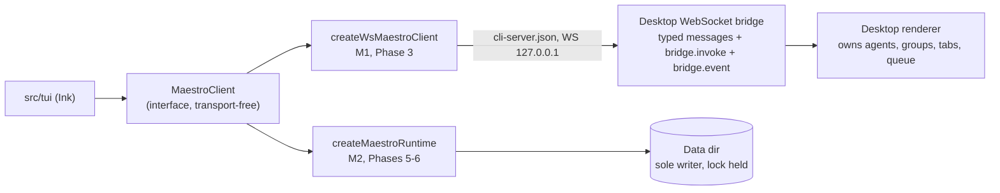
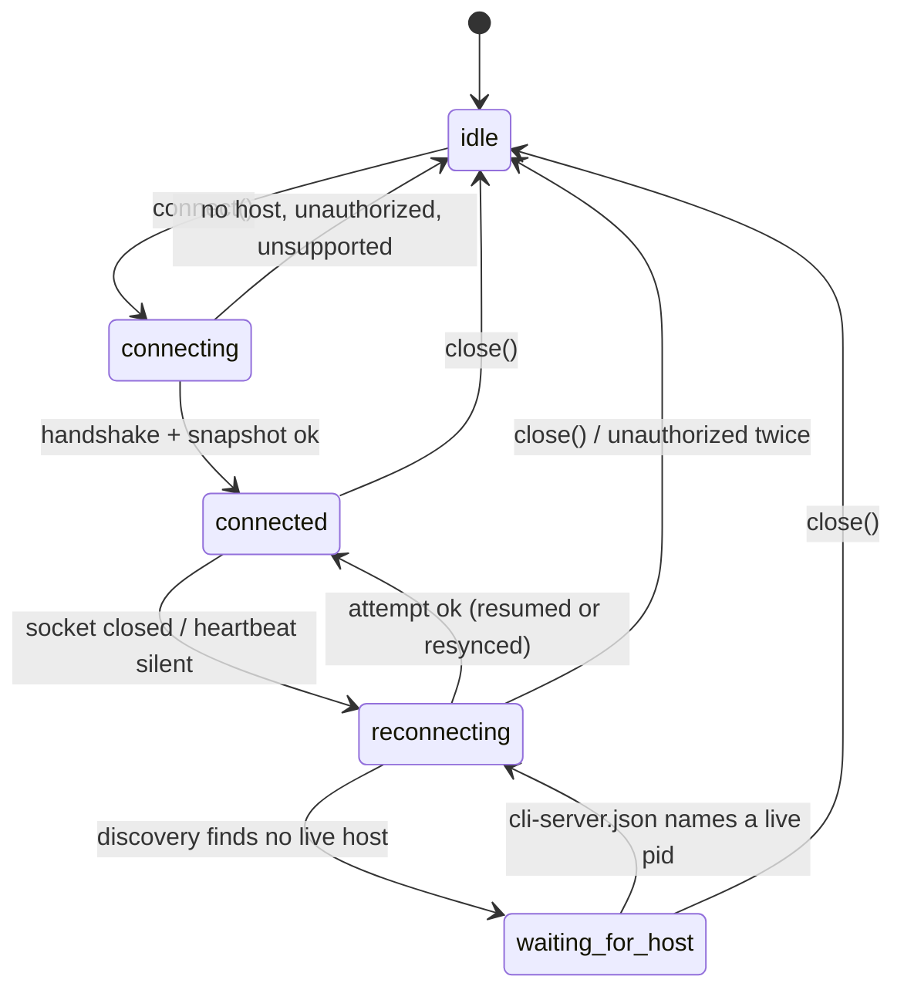
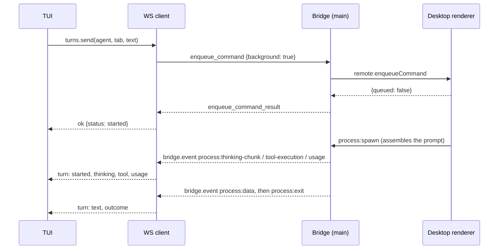

# Maestro TUI: the `MaestroClient` interface

| Field           | Value                                                                                                                                         |
| --------------- | --------------------------------------------------------------------------------------------------------------------------------------------- |
| Status          | Design. Phase 3, task 1: written before any client code                                                                                       |
| Date            | 2026-10-04                                                                                                                                    |
| Decision        | Requirements decision D2: the TUI programs against one `MaestroClient` interface in the library                                               |
| Implementations | `createWsMaestroClient` (M1: the running desktop over its WebSocket bridge, Phase 3); `createMaestroRuntime` (M2: in process, Phases 5 and 6) |
| Covers          | Requirements sections 3 (D1, D2), 4.2 (CO), 4.3 (AG), 4.4 (GR), 4.5 (CH)                                                                      |
| Bridge surveyed | `src/main/web-server/` and `src/main/ipc/handlers/` on `maestro-tui` at `62f46a8b3`                                                           |

Not to be confused with D2 in `Plans/maestro-lib-decisions.md` (the thin run layer). Here D2 always means the requirements decision.

---

## 1. Shape



The TUI holds one `MaestroClient` and nothing else. It never sees a message type, an IPC channel, a request id, a WebSocket, or a process id. Everything in section 4 is the contract; sections 5 to 9 describe how the WebSocket implementation meets it; section 10 lists what the bridge cannot do yet.

---

## 2. Rules

| ID  | Rule                                                                                                                                                                                                                                                                                                                                                                                                                                                                                                                                                       |
| --- | ---------------------------------------------------------------------------------------------------------------------------------------------------------------------------------------------------------------------------------------------------------------------------------------------------------------------------------------------------------------------------------------------------------------------------------------------------------------------------------------------------------------------------------------------------------- |
| R1  | **Transport-free.** The interface names only library types: records from `store/records.ts` and `store/transcript.ts`, `TurnOutcome` from `streaming/turn-outcome.ts`, and `UsageStats`, `AgentError`, `ThinkingMode`, `SshRemoteConfig` from `src/shared/types.ts`. Transport options live on the factory (`createWsMaestroClient(options)`), never on a method.                                                                                                                                                                                          |
| R2  | **Results, not exceptions.** Every method resolves to `ClientResult<T>`. A failure a caller can act on (no host, not found, refused, unsupported) is a value. A thrown error is a bug in the client.                                                                                                                                                                                                                                                                                                                                                       |
| R3  | **Named methods only.** `client.agents.create(...)`. A surface that needs something missing extends the interface and this document in the same change.                                                                                                                                                                                                                                                                                                                                                                                                    |
| R4  | **CO-4: never move the desktop's view.** Every message that accepts `background` gets `background: true`. The client never sends `select_session`, `select_tab`, `switch_mode`, `subscribe`, any `open_*`, or a focus verb, and ignores `active_session_changed`. Selection, folds, and layout stay in `maestro-tui.json`. Two host behaviors remain, and both are lifecycle replacements rather than focus moves: removing the desktop's active agent makes it pick a survivor, and closing its active tab selects a neighbor.                            |
| R5  | **CO-1: mutations go through typed bridge messages.** They route into the renderer's domain code (validation, blockers, persistence, broadcasts). The client never calls a store-level channel through `bridge.invoke` (`sessions:setMany`, `sessions:setAll`, `groups:setAll`, `settings:set`): the renderer holds the authoritative copy, and its next flush would overwrite the write, which is the data loss D1 exists to prevent. `bridge.invoke` is used only for full-fidelity reads and for process control (`process:interrupt`, `process:kill`). |
| R6  | **Records are the library's on-disk shapes, without transcripts.** Unknown keys are kept (DD-5). A record from the client never carries `aiTabs[].logs`; transcripts are read with `tabs.transcript`. Both implementations follow this, so events stay small.                                                                                                                                                                                                                                                                                              |
| R7  | **`ok` means the host accepted the request.** For most methods it has also applied it. The few bridge messages that answer on delivery are marked in section 5 (gap G7); their effect arrives later as an event.                                                                                                                                                                                                                                                                                                                                           |
| R8  | **A mirror, and events with whole records.** The client keeps a mirror of agents and groups and emits events that carry the full current record, so a consumer replaces what it holds instead of merging fragments.                                                                                                                                                                                                                                                                                                                                        |
| R9  | **Secrets stay inside.** The token and `cliSecret` from `cli-server.json` never appear in `HostInfo`, an error message, an event, or a log line. The WebSocket client dials `127.0.0.1` only, never the LAN address.                                                                                                                                                                                                                                                                                                                                       |

---

## 3. Module layout and naming

| File                                       | Holds                                                                                                                                                                                                                                                    | Task |
| ------------------------------------------ | -------------------------------------------------------------------------------------------------------------------------------------------------------------------------------------------------------------------------------------------------------- | ---- |
| `src/shared/maestro-lib/client/types.ts`   | The interface and every type in section 4. Types only: no runtime code, no Node imports.                                                                                                                                                                 | 3    |
| `client/discovery.ts`                      | `src/shared/cli-server-discovery.ts`, moved. Adds `readCliServerInfoFrom(userDataDir)` so discovery reads the data dir the caller resolved (`resolveUserDataDir`, `--data-dir`, `--dev`) instead of deriving its own.                                    | 2    |
| `client/bridge-connection.ts`              | `src/cli/services/maestro-client.ts`'s class, moved and renamed `BridgeConnection`, with `UnsupportedCommandError`, `CommandTimeoutError`, and `withBridgeConnection`.                                                                                   | 2    |
| `client/bridge-frames.ts`                  | Pure frame parsing: process id to agent and tab, frame to `TurnEvent`, `WebSettings` field to store key. Unit-tested without a socket.                                                                                                                   | 3    |
| `client/ws-client.ts`                      | `createWsMaestroClient(options): MaestroClient`.                                                                                                                                                                                                         | 3    |
| Shim: `src/shared/cli-server-discovery.ts` | `export * from './maestro-lib/client/discovery'`.                                                                                                                                                                                                        | 2    |
| Shim: `src/cli/services/maestro-client.ts` | Re-exports `BridgeConnection as MaestroClient`, `withBridgeConnection as withMaestroClient`, and both error classes. Keeps `resolveSessionId` and `resolveTargetSessionId`, which read the CLI's storage and call `process.exit`, so they stay CLI-only. | 2    |

`index.ts` replaces `export * from '../cli-server-discovery'` with `./client/discovery` and adds `./client/types`, `./client/bridge-connection`, and `createWsMaestroClient`.

**Decision C8 (naming).** Task 2 moves a class already called `MaestroClient` into the library, where that name now belongs to this interface, and one entry point cannot export both. The low-level class becomes `BridgeConnection`. The CLI's 48 import sites keep `MaestroClient` through the shim alias, so `maestro-cli` does not change.

**`BridgeConnection` grows in task 3**, behind options that keep the CLI's behavior as the default:

- `onFrame(listener)` for every parsed frame, and `onClose(listener)` with the close code and reason, so broadcasts and host loss reach the client.
- Connection options: extra query parameters (`since`, `epoch` for resume) and the upgrade headers.
- **Strict reply matching.** The CLI class falls back to matching a reply by its `type` when the `requestId` is unknown. With several `bridge.invoke` calls in flight (a reconcile read beside a `tabs.transcript`), a late `bridge.response` for a timed-out call would then resolve the wrong call with the wrong payload. The client matches by `requestId` only, and allows type matching per call for the two replies the host sends without one: `sessions_list` (for `get_sessions`) and `pong`.

---

## 4. The interface

All of this goes in `client/types.ts`. Tabs for indentation, as in the codebase.

### 4.1 Results and errors

```ts
import type { AgentRecord, AITabRecord, GroupRecord } from '../store/records';
import type { LogEntryRecord } from '../store/transcript';
import type { TurnOutcome } from '../streaming/turn-outcome';
import type { AgentError, SshRemoteConfig, ThinkingMode, UsageStats } from '../../types';

/** Every method resolves to one of these. Nothing throws for an expected failure. */
export type ClientResult<T> = { ok: true; value: T } | { ok: false; error: ClientError };

export type ClientErrorCode =
	/** The host cannot do this: no mapping exists yet, or the host build is too old. */
	| 'unsupported'
	/** No host is attached: none is running, or the connection is down. */
	| 'host-unavailable'
	/** The connection dropped while the call was in flight. It may or may not have been applied. */
	| 'host-lost'
	/** The host refused this client (Web Login gate, a secret from an earlier boot). */
	| 'unauthorized'
	/** The host did not answer in time. It may or may not have been applied. */
	| 'timeout'
	/** The agent, tab, group, or queued item does not exist. */
	| 'not-found'
	/** The input failed validation, in the client or on the host. */
	| 'invalid'
	/** The host refused for a reason of state; `message` says which (a live process blocks a cwd move). */
	| 'rejected'
	/** The host reported a failure that fits none of the above. */
	| 'failed';

export interface ClientError {
	code: ClientErrorCode;
	/** Safe to show a person. Never holds a token or a secret. */
	message: string;
	/** The method that failed. */
	method: ClientMethod;
	/** `agents.update` only: the fields applied before the failure (section 5.2). */
	appliedFields?: AgentPatchField[];
}

export type ClientMethod =
	| 'connection.discover'
	| 'connection.connect'
	| 'connection.reconnect'
	| 'agents.list'
	| 'agents.get'
	| 'agents.create'
	| 'agents.update'
	| 'agents.rename'
	| 'agents.remove'
	| 'groups.list'
	| 'groups.create'
	| 'groups.rename'
	| 'groups.remove'
	| 'groups.moveAgent'
	| 'tabs.list'
	| 'tabs.create'
	| 'tabs.rename'
	| 'tabs.close'
	| 'tabs.star'
	| 'tabs.update'
	| 'tabs.transcript'
	| 'turns.send'
	| 'turns.interrupt'
	| 'turns.queue.list'
	| 'turns.queue.remove'
	| 'settings.get'
	| 'settings.sshRemotes'
	| 'providers.list'
	| 'providers.models';

export type Unsubscribe = () => void;
```

### 4.2 Connection

```ts
export type HostKind = 'desktop' | 'headless' | 'in-process';

export interface HostInfo {
	kind: HostKind;
	/** The host's process id. Absent when the host is this process. */
	pid?: number;
	/** The host build's version, when it reports one. */
	version?: string;
	/** When the host started serving, epoch ms. */
	startedAt?: number;
	/** What the status bar prints after `host: `: `desktop pid 4121`, `headless pid 812`, `this TUI`. */
	label: string;
}

export type ConnectionState =
	/** Not attached: never connected, or closed by the caller. */
	| 'idle'
	/** The first attempt is in flight. */
	| 'connecting'
	| 'connected'
	/** The host was lost; retrying with backoff. */
	| 'reconnecting'
	/** No host is running; watching for one to start. */
	| 'waiting-for-host';

export interface ConnectionApi {
	/** Is a host serving this data dir? Reads only; opens no connection. */
	discover(): Promise<ClientResult<HostInfo>>;
	/**
	 * Attach to the host. One attempt. Once it succeeds, the client keeps the
	 * connection itself (heartbeat, reconnect, resync) until `close()`.
	 */
	connect(): Promise<ClientResult<HostInfo>>;
	/** Try now instead of waiting out the backoff. */
	reconnect(): Promise<ClientResult<HostInfo>>;
	/** Detach. Calls in flight end with `host-unavailable`. Safe to call twice. */
	close(): Promise<void>;
	state(): ConnectionState;
	/** The attached host, or undefined while not connected. */
	host(): HostInfo | undefined;
}
```

### 4.3 Agents

```ts
/** Where an agent's turns run when they run over SSH. */
export interface AgentSshSettings {
	enabled: boolean;
	/** An id from `settings.sshRemotes()`, or null for none. */
	remoteId: string | null;
	workingDirOverride?: string;
}

/** AG-2 and AG-3. */
export interface AgentCreateInput {
	name: string;
	/** Provider id, e.g. `claude-code`: one `providers.list()` reports as available. */
	provider: string;
	cwd: string;
	groupId?: string;
	model?: string;
	effort?: string;
	/** A context window the person chose; recorded as user-edited (finding AD1). */
	contextWindow?: number;
	customPath?: string;
	customArgs?: string;
	/** Blank values (`isBlankEnvValue`) are dropped before sending: blank means unset. */
	env?: Record<string, string>;
	ssh?: AgentSshSettings;
	/** Absent means the default, `.maestro/playbooks` under `cwd`. */
	autoRunFolderPath?: string;
	nudgeMessage?: string;
	newSessionMessage?: string;
}

/**
 * AG-4. Absent means unchanged; `null` clears the field so it inherits again.
 * `env` replaces the whole map, because it is one field on the host.
 */
export interface AgentPatch {
	name?: string;
	cwd?: string;
	/** null moves the agent to ungrouped. */
	groupId?: string | null;
	/** Phase 4 (PS-1). `unsupported` until the host swaps providers without dropping tabs (G8). */
	provider?: string;
	model?: string | null;
	effort?: string | null;
	contextWindow?: number | null;
	customPath?: string | null;
	customArgs?: string | null;
	env?: Record<string, string> | null;
	/** Merged onto the stored settings. */
	ssh?: Partial<AgentSshSettings>;
	autoRunFolderPath?: string;
	nudgeMessage?: string | null;
	newSessionMessage?: string | null;
	bookmarked?: boolean;
}

export type AgentPatchField = keyof AgentPatch;

export interface AgentUpdateReceipt {
	/** The fields applied, in the order they were applied. */
	applied: AgentPatchField[];
	/** Provider swap (Phase 4): what could not be parked and was cleared, for a notice. */
	notices?: string[];
}

export interface AgentsApi {
	/** Every agent, in host order, without transcripts (R6). */
	list(): Promise<ClientResult<AgentRecord[]>>;
	/** One agent, read fresh from the host. An edit form opens on this. */
	get(agentId: string): Promise<ClientResult<AgentRecord>>;
	create(input: AgentCreateInput): Promise<ClientResult<{ agentId: string }>>;
	update(agentId: string, patch: AgentPatch): Promise<ClientResult<AgentUpdateReceipt>>;
	/** Same as `update(agentId, { name })`. */
	rename(agentId: string, name: string): Promise<ClientResult<void>>;
	/**
	 * AG-5. Removes the agent record, its tabs, and the transcripts stored in
	 * them. Kept: the agent's History entries, the provider's own session files,
	 * and the working directory.
	 */
	remove(agentId: string): Promise<ClientResult<void>>;
}
```

### 4.4 Groups

```ts
export interface GroupCreateInput {
	name: string;
	emoji?: string;
	/** Nest under this group. One level only; the host enforces it. */
	parentGroupId?: string;
}

export interface GroupsApi {
	list(): Promise<ClientResult<GroupRecord[]>>;
	create(input: GroupCreateInput): Promise<ClientResult<{ groupId: string }>>;
	rename(groupId: string, name: string): Promise<ClientResult<void>>;
	/** GR-1. Members become ungrouped and child groups move up a level. No agent is deleted. */
	remove(groupId: string): Promise<ClientResult<void>>;
	/** GR-2. `null` moves the agent to ungrouped. */
	moveAgent(agentId: string, groupId: string | null): Promise<ClientResult<void>>;
}
```

Collapse and expand are TUI-local (GR-3), so there is no method for them.

### 4.5 Tabs

```ts
/** A tab's composer settings (the desktop's tab chips). Absent: unchanged. `null`: inherit. */
export interface TabPatch {
	readOnly?: boolean;
	thinking?: ThinkingMode;
	model?: string | null;
	effort?: string | null;
	saveToHistory?: boolean;
	enterToSend?: boolean | null;
}

export interface TranscriptOptions {
	/** Only entries with a timestamp after this, epoch ms. */
	sinceMs?: number;
	/** At most this many of the newest entries. 0 returns none. */
	tail?: number;
}

export interface TabsApi {
	/** CH-1. The AI tabs a person sees, in strip order. Hidden consult tabs are left out. */
	list(agentId: string): Promise<ClientResult<AITabRecord[]>>;
	create(agentId: string): Promise<ClientResult<{ tabId: string }>>;
	/** An empty name clears it, so the tab shows its session id label again. */
	rename(agentId: string, tabId: string, name: string): Promise<ClientResult<void>>;
	/** The tab moves to the host's closed-tab history. What survives on disk: G13. */
	close(agentId: string, tabId: string): Promise<ClientResult<void>>;
	star(agentId: string, tabId: string, starred: boolean): Promise<ClientResult<void>>;
	update(agentId: string, tabId: string, patch: TabPatch): Promise<ClientResult<void>>;
	/** CH-5. The tab's transcript as the host persisted it, oldest first. */
	transcript(
		agentId: string,
		tabId: string,
		options?: TranscriptOptions
	): Promise<ClientResult<LogEntryRecord[]>>;
}
```

### 4.6 Turns

```ts
export interface TurnInput {
	/**
	 * What the person typed. The host adds the system prompt, conductor
	 * profile, nudge, and template variables (CH-2, L12).
	 */
	text: string;
	/** P2 (CH-8): images as data URLs. */
	images?: string[];
}

export type TurnSendReceipt =
	/** The agent was idle; the turn is running now. */
	| { status: 'started' }
	/** The agent was busy; the message waits in the host's execution queue (CH-4). */
	| { status: 'queued'; itemId: string; position: number; queueLength: number };

export interface QueuedTurn {
	itemId: string;
	tabId: string;
	queuedAt: number;
	kind: 'message' | 'command';
	/** The message, or the command line of a slash command. */
	text: string;
	/** The host paused the queue on this item. */
	paused: boolean;
}

export interface TurnToolCall {
	/** The provider's call id. A call's running and finished events share it. */
	id?: string;
	name: string;
	status: 'running' | 'completed' | 'error';
	/** Provider-specific input and output. Not validated. */
	detail?: unknown;
	/** Inside a subagent: the parent call's id. */
	parentId?: string;
}

export type TurnEvent =
	/** A message was accepted for this tab, from any surface (CO-2). */
	| { kind: 'user'; at: number; entry: LogEntryRecord }
	/** The tab's agent began working on a turn. */
	| { kind: 'started'; at: number }
	/** The provider assigned or confirmed its session id (CH-5 resume). */
	| { kind: 'session'; at: number; providerSessionId: string }
	/** The live stream the desktop shows as thinking. Show it per the tab's thinking mode (8.3). */
	| { kind: 'thinking'; at: number; text: string }
	/** Answer text, in order. Append it. */
	| { kind: 'text'; at: number; text: string }
	| { kind: 'tool'; at: number; tool: TurnToolCall }
	/**
	 * One usage report, exactly as the host's own UI receives it. Do not sum
	 * these into totals: the tab record's `usageStats` is the host's folded
	 * total (refreshed after `outcome`). A live gauge may show the latest report.
	 */
	| { kind: 'usage'; at: number; usage: UsageStats }
	| { kind: 'error'; at: number; error: AgentError }
	/** The turn ended. Always the last event of a turn. */
	| {
			kind: 'outcome';
			at: number;
			outcome: TurnOutcome;
			exitCode: number | null;
			error?: AgentError;
	  }
	/** Events were missed (the host was lost and could not replay). Re-read the tab and its transcript. */
	| { kind: 'gap'; at: number };

export interface TurnsApi {
	/** CH-2, CH-4. Runs now when the agent is idle; otherwise queues behind its current turn. */
	send(agentId: string, tabId: string, input: TurnInput): Promise<ClientResult<TurnSendReceipt>>;
	/** CH-4. Stop the tab's running turn. `stopped: false` when nothing was running. */
	interrupt(agentId: string, tabId: string): Promise<ClientResult<{ stopped: boolean }>>;
	readonly queue: {
		list(agentId: string): Promise<ClientResult<QueuedTurn[]>>;
		remove(agentId: string, itemId: string): Promise<ClientResult<{ removed: boolean }>>;
	};
	/** The tab's turn events, live: the `turn` events of `events.subscribe`, filtered to one tab. */
	subscribe(agentId: string, tabId: string, listener: (event: TurnEvent) => void): Unsubscribe;
}
```

### 4.6.1 Auto Run

```ts
export interface AutoRunApi {
	/** AR-4. Start a spec-driven run over `input.documents`, in that order. */
	launch(agentId: string, input: AutoRunLaunchInput): Promise<ClientResult<void>>;
	/** AR-5. Start a goal-driven run. `tabId` is the tab the desktop shows it on, when it says. */
	launchGoal(agentId: string, input: GoalRunLaunchInput): Promise<ClientResult<{ tabId?: string }>>;
	/** AR-7. Each answers on delivery (G7): watch the `autorun` events to see it land. */
	stop(agentId: string): Promise<ClientResult<void>>;
	resume(agentId: string): Promise<ClientResult<void>>;
	skip(agentId: string): Promise<ClientResult<void>>;
	abort(agentId: string): Promise<ClientResult<void>>;
}
```

The run is owned by one desktop window, so a launch asks that window to start it and a control asks it to act; the TUI never drives a run itself. `AutoRunProgress`, the launch inputs, and their validation live in `src/shared/maestro-lib/autorun/` (`progress.ts`, `launch.ts`), and `reduceAutoRun` (`run-tracker.ts`) folds the `autorun` events into the figures a screen shows: the run clock with paused time left out, tokens and cost, and an output tail. `answerGate` is not a method: a HITL gate reaches the client as a pause of type `hitl_gate`, and `resume` answers it, because the desktop's own Resume writes the acknowledgement checkbox under the gate (`acknowledgeHitlGate`).

### 4.6.2 Group chats

```ts
export interface GroupChatsApi {
	/** Every chat, without its lines. */
	list(): Promise<ClientResult<GroupChatRecord[]>>;
	/** One chat with its log, read fresh. */
	get(chatId: string): Promise<ClientResult<GroupChatRecord>>;
	/** GC-1. Creates the chat and sends the moderator its opening message. */
	create(input: GroupChatCreateInput): Promise<ClientResult<{ chatId: string }>>;
	/** GC-2. One round at a time: a busy chat answers `rejected` and the message is not queued. */
	send(chatId: string, message: string): Promise<ClientResult<void>>;
	/** GC-3. Stops the moderator, every participant, and any Auto Run the chat started. */
	stop(chatId: string): Promise<ClientResult<void>>;
	/** GC-1. The desktop's Left Bar reads the new name after its next load (G15). */
	rename(chatId: string, name: string): Promise<ClientResult<void>>;
	/** GC-1. Stops the chat's processes, then deletes its log and images (G15). */
	remove(chatId: string): Promise<ClientResult<void>>;
}
```

The chats are the desktop's own (GC-4): the same storage, so one started here continues on the desktop and the other way round. `GroupChatRecord`, the events that move it, `reduceGroupChat`, and the create rules live in `src/shared/maestro-lib/groupchat/chat.ts`.

Decisions worth knowing:

- **The moderator is a provider, not an agent.** `start_group_chat` takes the provider id that moderates (`moderatorAgentId` on the wire is a tool type). The client's `create` takes an AGENT id, because that is what a person picks, and reads it down to that agent's provider; its custom path, args, and env are not used. Absent: the first participant's provider.
- **`create` starts the round.** The bridge has no "create an empty chat" message: `start_group_chat` creates the chat and sends the opening message, which mentions every participant by name (that is what makes the router add them with their SSH remote, args, and env). The opening message defaults to the chat's name.
- **Participants are named by `@name`.** The host refuses a participant whose name is shared with another agent (`2 agents answer to @Alpha; rename one`) and a terminal agent; both arrive as the create failure's message. The TUI form leaves terminal agents out.
- **No queue.** `send_group_chat_message` answers a bare `false` while the chat is busy or gone, so `send` is `rejected` with a message that names both. The desktop's own group chat queue (`groupChat:submitMessage`, owned by main) is a different path; the TUI does not use it in this version, so a busy chat refuses and the draft stays in the box.
- **A reply lands as one line.** A participant's process emits raw provider output that the desktop itself turns into a reply only when the turn ends, so there is no partial text on the bridge. Live progress is the moderator's state, each participant's working flag, and each line as it is logged.

### 4.6.3 Consults

```ts
export interface ConsultsApi {
	/** XM-1 to XM-3. One read-only question to one agent; waits for the answer, which can take minutes. */
	ask(input: ConsultAskInput): Promise<ClientResult<ConsultAnswer>>;
}

export interface ConsultAskInput {
	targetAgentId: string;
	question: string;
	fromAgentId?: string; // attribution, and the consult tab the target keeps per asker
	fromTabId?: string;
	withContext?: boolean; // forward the asking tab's transcript; off by default
	timeoutMs?: number; // default 600000; the host clamps to 10000..3600000
}

export interface ConsultAnswer {
	answer: string;
	agentName?: string;
}
```

A consult is the `maestro-cli ask` path: a hidden tab on the target with a fresh context, no tab chip, no unread mark, and no change to the desktop's view. It is NOT `turns.send` to the target, which would land in whatever conversation the person has open there.

Decisions worth knowing:

- **The answer is not written into the asking tab.** The desktop keeps the exchange on the consulted agent's hidden tab only, so the TUI shows it inline from the call's result and holds it in memory for the run of the TUI. Reopening the TUI does not bring it back.
- **Not `ok` means no answer.** An agent that is gone, a timeout, and a stopped consult all fail with the host's words (`The consult with Beta was stopped.`). A partial answer the host reports with a failure is dropped.
- **The client waits `timeoutMs` plus 15 seconds.** The host's own timeout names the agent that went quiet; a client-side one could only say the desktop did not answer.
- **Read-only is the host's rule, not an option here.** The consulted agent is told it may read the asking agent's folder. There is no writable consult. Handing another agent work it can act on is `tabs.create` plus `turns.send` on a NEW tab, which the TUI offers only as an explicit, confirmed delegation (Ctrl-D), never as a side effect of a mention.
- **The desktop consults any mention in a message it is handed.** `turns.send` text goes through the desktop's own mention planner, so a TUI that consults itself and also sends the same text would consult twice. The TUI sends this agent the message with each resolved mention quoted (`"@Beta"`), which the scanner reads as literal text. A message that leads with a mention is not sent to this agent at all, as on the desktop.

### 4.7 Settings

```ts
export interface SettingsChange {
	/** The keys that changed, or 'unknown' when the host only said that something did. */
	keys: string[] | 'unknown';
}

export interface SettingsApi {
	/** ST-1. The values of `keys` as the host holds them. A key the host does not hold is absent. */
	get(keys: readonly string[]): Promise<ClientResult<Record<string, unknown>>>;
	/**
	 * Fires when any of `keys` may have changed; re-read with `get`. A change
	 * with `keys: 'unknown'` reaches every subscriber.
	 */
	subscribe(keys: readonly string[], listener: (change: SettingsChange) => void): Unsubscribe;
	/** AG-3. The SSH remotes configured on the host. */
	sshRemotes(): Promise<ClientResult<SshRemoteConfig[]>>;
}
```

#### 4.7.1 What the TUI reads, and the Encore gate (ST-1, ST-2)

The TUI's settings view (`S`) is read-only and shows `SettingsSnapshot` (`src/shared/maestro-lib/settings/snapshot.ts`, behind `index.ts`). `loadSettingsSnapshot(paths, client?)` builds it:

| Part                                                                                                           | Source                                                                                |
| -------------------------------------------------------------------------------------------------------------- | ------------------------------------------------------------------------------------- |
| Provider defaults (shell, save to history, thinking mode, global environment), conductor profile, Encore flags | `settings.get(SETTINGS_SNAPSHOT_KEYS)` when attached, else `maestro-settings.json`    |
| SSH remotes                                                                                                    | `settings.sshRemotes()` when attached, else the `sshRemotes` key of the settings file |
| Per-provider agent configs                                                                                     | `maestro-agent-configs.json`, always (the bridge has no read for them)                |
| Prompt customizations                                                                                          | `core-prompts-customizations.json` in the data dir, always (same reason)              |

- **Secrets never reach the screen.** Environment values, in the global environment and in a provider config, go through `isSecretEnvKey` and `maskEnvValue`.
- **A host that refuses falls back to the files** and the view says so in a note. A corrupt file is named in the view and the other files are still used.
- **Encore flags go through `resolveEncoreFeatures` and nothing else**, so a flag the user never saved reads as its default, as on the desktop. `isEncoreEnabled(flags, flag)` answers one flag.
- **The gate is on the binding.** `Binding.encore` names the flag a TUI action sits behind. `gatedKeymap(flags, keymap)` drops every binding whose flag is off, and the App reads that table for key resolution, the palette, the agent menu, and help, so a switched-off feature has a dead key and no listing anywhere. A feature behind a flag sets `encore` on its binding and nothing else. No shipped binding is gated yet (group chats, Auto Run, mentions, and provider swap have no Encore flag on the desktop), so the gate is tested on a table that has some (`AppSettings.test.tsx`, `keymap.test.ts`).
- **The first frame is answered from the files**, so the gate is known before a desktop attaches; the host's values replace it on connect. Because of G11, a flag the user flips on the desktop is not pushed: the TUI picks it up on `r` in the settings view, on a reconnect, or on a `settings.changed` with `'unknown'`.

### 4.8 Providers

Not in the task's list, added because AG-2 and PS-4 need the installed providers with their versions, and the agent form is in this phase (decision C11).

```ts
export interface ProviderInfo {
	/** Provider id, e.g. `claude-code`. */
	id: string;
	/** Display name, e.g. `Claude Code`. */
	name: string;
	/** Installed and runnable where the agent will run. */
	available: boolean;
	/** From the host's capability probe; absent until probed. */
	version?: string;
	/** The binary the host resolved. */
	path?: string;
	/** Why it is unavailable, when the host knows. */
	unavailableReason?: string;
}

export interface ProvidersApi {
	/** AG-2, PS-4. Every provider the host knows, installed or not. Pass an SSH remote to probe that host. */
	list(options?: { sshRemoteId?: string }): Promise<ClientResult<ProviderInfo[]>>;
	/** Model ids the provider reports, for a picker. Empty when it reports none. */
	models(
		providerId: string,
		options?: { sshRemoteId?: string; refresh?: boolean }
	): Promise<ClientResult<string[]>>;
}
```

### 4.9 Events and the client

```ts
export type MaestroEvent =
	| { type: 'host.connected'; host: HostInfo; resumed: boolean }
	| { type: 'host.lost'; reason: string }
	| { type: 'host.reconnecting'; attempt: number; delayMs: number }
	/** The whole state. Follows every `host.connected` with `resumed: false`, before any delta. */
	| { type: 'snapshot'; agents: AgentRecord[]; groups: GroupRecord[] }
	| { type: 'agent.added'; agent: AgentRecord }
	| { type: 'agent.updated'; agent: AgentRecord }
	| { type: 'agent.removed'; agentId: string }
	/** Groups are few and written wholesale, so a change carries the whole list. */
	| { type: 'groups.changed'; groups: GroupRecord[] }
	/** Tab events follow `tabs.list`: hidden consult tabs raise none. */
	| { type: 'tab.added'; agentId: string; tab: AITabRecord }
	| { type: 'tab.updated'; agentId: string; tab: AITabRecord }
	| { type: 'tab.removed'; agentId: string; tabId: string }
	| { type: 'settings.changed'; keys: string[] | 'unknown' }
	| { type: 'turn'; agentId: string; tabId: string; event: TurnEvent }
	/** A run's progress: the host's state, plus the run process's output and usage. Fold with `reduceAutoRun`. */
	| { type: 'autorun'; agentId: string; event: AutoRunRunEvent }
	/** A group chat changed. Fold with `reduceGroupChat`; a `gap` means re-read the chat. */
	| { type: 'groupChat'; chatId: string; event: GroupChatEvent };

export type MaestroEventType = MaestroEvent['type'];

export interface EventFilter {
	/** Only these event types. */
	types?: readonly MaestroEventType[];
	/** Only agent, tab, and turn events about this agent. */
	agentId?: string;
}

export interface EventsApi {
	subscribe(listener: (event: MaestroEvent) => void, filter?: EventFilter): Unsubscribe;
}

export interface MaestroClient {
	readonly connection: ConnectionApi;
	readonly agents: AgentsApi;
	readonly groups: GroupsApi;
	readonly tabs: TabsApi;
	readonly turns: TurnsApi;
	readonly autoRun: AutoRunApi;
	readonly groupChats: GroupChatsApi;
	readonly consults: ConsultsApi;
	readonly settings: SettingsApi;
	readonly providers: ProvidersApi;
	readonly events: EventsApi;
}
```

Delivery rules, for both implementations:

- Listeners run synchronously, in arrival order. A listener that throws is reported through the library `logger` and does not stop delivery to the others.
- `agent.updated` and the `tab.*` events carry the record after the change. When a change touches both an agent and its tabs, the `tab.*` events come first, then one `agent.updated`.
- A `turn` event can arrive for a tab the mirror does not hold yet (a tab created a moment ago). It is delivered anyway, and the client refreshes the agent.
- A tab hidden after it was listed raises `tab.removed`; a hidden tab that is revealed raises `tab.added`.

### 4.10 The WebSocket factory

Transport options, kept off the interface (R1).

```ts
export interface WsMaestroClientOptions {
	/** The data dir the caller resolved. Discovery reads `cli-server.json` here. */
	userDataDir: string;
	/** Per call. Default 10000. */
	requestTimeoutMs?: number;
	/** Default 500, doubling to 15000, with 20% jitter. */
	reconnect?: { initialDelayMs?: number; maxDelayMs?: number };
	/** A `ping` every this many ms. Default 15000. */
	heartbeatIntervalMs?: number;
	/** Silence after which the host counts as lost. Default 10000. */
	heartbeatTimeoutMs?: number;
	/** Section 6.3. Default 5000. 0 turns the poll off. */
	reconcileIntervalMs?: number;
	/** Test seams. */
	WebSocketImpl?: typeof import('ws').WebSocket;
	now?: () => number;
}

export function createWsMaestroClient(options: WsMaestroClientOptions): MaestroClient;
```

---

## 5. Bridge mapping

Legend:

- `msg` -> `reply`: a typed message in `src/main/web-server/handlers/messageHandlers/` and the reply type it sends.
- **invoke** `channel`: `bridge.invoke` with that IPC channel, answered by `bridge.response`.
- **local**: answered from the mirror, the discovery file, or the event stream.
- **missing**: no bridge path. The WebSocket client returns `unsupported` without sending anything.
- **delivered**: the host answers when the message reaches the renderer, not when it is applied (G7).

Every message that accepts `background` is sent with `background: true` (R4). Every reply is matched by `requestId` unless noted.

### 5.1 Connection

| Method                 | Mapping                                                                                                                                                                         | Notes                                                                                                                                                                                                                                                                             |
| ---------------------- | ------------------------------------------------------------------------------------------------------------------------------------------------------------------------------- | --------------------------------------------------------------------------------------------------------------------------------------------------------------------------------------------------------------------------------------------------------------------------------- |
| `connection.discover`  | **local**: `<userDataDir>/cli-server.json` through `parseCliServerInfo`, then `isPidAlive(pid)`                                                                                 | No socket. `host-unavailable` names the reason: no file, unparseable, or `pid N is not running`. `version` and `startedAt` come from the file; `kind` is `desktop` (G12).                                                                                                         |
| `connection.connect`   | WebSocket `ws://127.0.0.1:<port>/<token>/ws` with header `x-maestro-cli-secret` (`CLI_SECRET_HEADER`) set to `cliSecret` -> `connected`; then the snapshot reads of 5.2 and 5.3 | No `sessionId` query parameter: the client stays a dashboard client (C3). `connected` carries `bridgeEpoch` and `bridgeSeq` for resume. The snapshot read is also the version probe: an `echo` or "No ipcMain handler registered" there ends the attempt with `unsupported` (C1). |
| `connection.reconnect` | Same, with `?since=<lastSeq>&epoch=<bridgeEpoch>`                                                                                                                               | `connected.resumed: true`: the missed frames follow and are processed as if live. `false`: full resync (7.3).                                                                                                                                                                     |
| `connection.close`     | Close the socket                                                                                                                                                                |                                                                                                                                                                                                                                                                                   |
| `connection.state`     | **local**                                                                                                                                                                       |                                                                                                                                                                                                                                                                                   |
| `connection.host`      | **local**                                                                                                                                                                       | `label`: `desktop pid <pid>`.                                                                                                                                                                                                                                                     |

### 5.2 Agents

| Method          | Mapping                                                                                                                                                                                                                                                                                                                                                                                                                                                                                                                                                                                                                                                                                                                                               | Notes                                                                                                                                                                                                                                                                                                                                                                                                                                                                                                                                                                                                                                                                                                                                                                                                       |
| --------------- | ----------------------------------------------------------------------------------------------------------------------------------------------------------------------------------------------------------------------------------------------------------------------------------------------------------------------------------------------------------------------------------------------------------------------------------------------------------------------------------------------------------------------------------------------------------------------------------------------------------------------------------------------------------------------------------------------------------------------------------------------------- | ----------------------------------------------------------------------------------------------------------------------------------------------------------------------------------------------------------------------------------------------------------------------------------------------------------------------------------------------------------------------------------------------------------------------------------------------------------------------------------------------------------------------------------------------------------------------------------------------------------------------------------------------------------------------------------------------------------------------------------------------------------------------------------------------------------- |
| `agents.list`   | **local** (mirror), filled by **invoke** `sessions:getBootstrap`                                                                                                                                                                                                                                                                                                                                                                                                                                                                                                                                                                                                                                                                                      | Stored records with transcripts stripped (`projectWebSession`), every other key kept. The typed `get_sessions` projection drops `hidden` and every config field (G9), so it is used only for reconcile diffs.                                                                                                                                                                                                                                                                                                                                                                                                                                                                                                                                                                                               |
| `agents.get`    | **invoke** `sessions:getBootstrap`, then pick the agent                                                                                                                                                                                                                                                                                                                                                                                                                                                                                                                                                                                                                                                                                               | A fresh read that also refreshes the mirror. On demand only, never on a timer: main runs its image-relocation and tool-output scans over every agent on each call.                                                                                                                                                                                                                                                                                                                                                                                                                                                                                                                                                                                                                                          |
| `agents.create` | `create_session` {`name`, `toolType`, `cwd`, `groupId`, `nudgeMessage`, `newSessionMessage`, `customPath`, `customArgs`, `customEnvVars`, `customModel`, `customEffort`, `customContextWindow`, `contextWindowSource: 'user-edited'`, `sessionSshRemoteConfig`, `autoRunFolderPath`, `background: true`} -> `create_session_result` {`success`, `sessionId`}                                                                                                                                                                                                                                                                                                                                                                                          | Validated first, with the checks the handler makes: `name` non-empty, `toolType` a non-`terminal` id from `AGENT_IDS`, `cwd` non-empty. Blank env values dropped (`stripBlankEnvVars`). `contextWindowSource` only when `contextWindow` is set. The new agent arrives as `agent.added` through `sessions:lifecycleSync`.                                                                                                                                                                                                                                                                                                                                                                                                                                                                                    |
| `agents.update` | In this order, each only when its fields are in the patch: `update_session_cwd` {`newCwd`} -> `update_session_cwd_result`; `update_session_ssh` {`sshPatch`} -> `update_session_ssh_result`; `update_session_config` {`configPatch`} -> `update_session_config_result`; `rename_session` {`newName`} -> `rename_session_result`; `move_session_to_group` {`groupId`} -> `move_session_to_group_result`; `set_auto_run_folder` {`folderPath`} -> `set_auto_run_folder_result`. `provider`: `update_session_config` {`toolType`} on its own (the host ignores other keys beside it), after `ssh` and before the other config fields; skipped when the agent is already on that provider; the reply's `notices` become `AgentUpdateReceipt.notices` (G8) | `configPatch` keys: `model` as `customModel`, `effort` as `customEffort`, `contextWindow` as `customContextWindow` plus `contextWindowSource` (null clears both), `customPath`, `customArgs`, `env` as `customEnvVars`, `nudgeMessage`, `newSessionMessage`, `bookmarked`; `null` clears. Not atomic on the bridge: `cwd` goes first because it is the field the host refuses most (`workingDirectoryChangeBlocker`: a live process, an unvalidated SSH path), so a refusal stops the update before anything else is applied. A later failure returns `appliedFields`. A `provider` the host cannot run (`terminal`, an unknown id) is refused whole with `invalid`, before anything is sent. After success, one `sessions:getBootstrap` read refreshes the agent, since config fields are in no push (G2). |
| `agents.rename` | `rename_session` {`sessionId`, `newName`} -> `rename_session_result`                                                                                                                                                                                                                                                                                                                                                                                                                                                                                                                                                                                                                                                                                  | 1 to 100 characters, checked before sending.                                                                                                                                                                                                                                                                                                                                                                                                                                                                                                                                                                                                                                                                                                                                                                |
| `agents.remove` | `delete_session` {`sessionId`} -> `delete_session_result` (**delivered**)                                                                                                                                                                                                                                                                                                                                                                                                                                                                                                                                                                                                                                                                             | First, **invoke** `process:kill` for each tab the mirror shows busy (`<agentId>-ai-<tabId>`), until G6 is fixed on the host. `agent.removed` follows through `sessions:lifecycleSync`.                                                                                                                                                                                                                                                                                                                                                                                                                                                                                                                                                                                                                      |

### 5.3 Groups

| Method             | Mapping                                                                                           | Notes                                                                                                                                                       |
| ------------------ | ------------------------------------------------------------------------------------------------- | ----------------------------------------------------------------------------------------------------------------------------------------------------------- |
| `groups.list`      | **local** (mirror), filled by **invoke** `groups:getAll`                                          | Full records (`kind`, `collapsed`, `icon`, `color` kept). The typed `get_groups` -> `groups_list` returns `GroupData`, which drops them, so it is not used. |
| `groups.create`    | `create_group` {`name`, `emoji`, `parentGroupId`} -> `create_group_result` {`success`, `groupId`} | Appearance validated first with `validateGroupAppearance` (`src/shared/groupAppearance.ts`; moved behind `index.ts` when the client imports it).            |
| `groups.rename`    | `rename_group` {`groupId`, `name`} -> `rename_group_result`                                       |                                                                                                                                                             |
| `groups.remove`    | `delete_group` {`groupId`} -> `delete_group_result` (**delivered**)                               | The renderer clears `groupId` on every member and promotes child groups (`removeGroupAndPromoteChildren`). No agent is deleted.                             |
| `groups.moveAgent` | `move_session_to_group` {`sessionId`, `groupId`} -> `move_session_to_group_result`                | The `groupId` key must be present; `null` means ungrouped.                                                                                                  |

### 5.4 Tabs

| Method            | Mapping                                                                                                                                                                                          | Notes                                                                                                                                                                                                                                                                                                                                                          |
| ----------------- | ------------------------------------------------------------------------------------------------------------------------------------------------------------------------------------------------ | -------------------------------------------------------------------------------------------------------------------------------------------------------------------------------------------------------------------------------------------------------------------------------------------------------------------------------------------------------------- |
| `tabs.list`       | **local** (the mirror record's `aiTabs`)                                                                                                                                                         | Order: the `ai` entries of `unifiedTabOrder` when present, otherwise stored order. Tabs with `hidden: true` (consults) are left out.                                                                                                                                                                                                                           |
| `tabs.create`     | `new_tab` {`sessionId`, `background: true`} -> `new_tab_result` {`success`, `tabId`}                                                                                                             | The new tab does not become the desktop's visible tab.                                                                                                                                                                                                                                                                                                         |
| `tabs.rename`     | `rename_tab` {`sessionId`, `tabId`, `newName`} -> `rename_tab_result` {`success`, `error`}                                                                                                       | No reply at all when the renderer does not confirm in time (`unconfirmed`): the client reports `timeout`, and the rename may still land.                                                                                                                                                                                                                       |
| `tabs.close`      | `close_tab` {`sessionId`, `tabId`} -> `close_tab_result` (**delivered**)                                                                                                                         | The renderer's `closeTab` helper moves the tab to its in-memory closed-tab history; closing the last tab leaves a fresh empty one. What survives on disk: G13.                                                                                                                                                                                                 |
| `tabs.star`       | `star_tab` {`sessionId`, `tabId`, `starred`} -> `star_tab_result` (**delivered**)                                                                                                                |                                                                                                                                                                                                                                                                                                                                                                |
| `tabs.update`     | `update_session_config` {`sessionId`, `configPatch`: {`tabId`, `readOnlyMode`, `showThinking`, `customModel`, `customEffort`, `saveToHistory`, `enterToSend`}} -> `update_session_config_result` | The renderer type-checks these against `TAB_EDITABLE_KEYS`; `null` drops a tab override so it inherits the agent's.                                                                                                                                                                                                                                            |
| `tabs.transcript` | **invoke** `sessions:getDeferredContent` (`agentId`, `tabId`, `false`) -> {`logs`}                                                                                                               | Raw `LogEntryRecord`s. `sinceMs` and `tail` are applied in the client with `get_session_history`'s semantics (`tail: 0` returns none). That typed message exists, but it flattens entries to `{ role, content }` and drops tool state, images, and the turn model, so it is not used. A missing tab answers "Tab ... no longer exists", mapped to `not-found`. |

### 5.5 Turns

| Method               | Mapping                                                                                                                                                                                                                      | Notes                                                                                                                                                                                                                                                                                                                   |
| -------------------- | ---------------------------------------------------------------------------------------------------------------------------------------------------------------------------------------------------------------------------- | ----------------------------------------------------------------------------------------------------------------------------------------------------------------------------------------------------------------------------------------------------------------------------------------------------------------------- |
| `turns.send`         | `enqueue_command` {`sessionId`, `tabId`, `command`, `inputMode: 'ai'`, `images`, `background: true`} -> `enqueue_command_result` {`success`, `tabId`, `queued`, `queuePosition`, `queueLength`, `itemId`, `error`, `reason`} | `queued: false` is `started`; `true` is `queued`. `reason` `session-not-found`, `tab-not-found`, `no-ai-tabs` map to `not-found`. Not `send_command`: it refuses a busy agent, and its `force` is a parallel dispatch the TUI never makes (C6).                                                                         |
| `turns.interrupt`    | **invoke** `process:interrupt` (`<agentId>-ai-<tabId>`) -> boolean                                                                                                                                                           | When it answers false and the tab is the agent's active tab, retry once with the legacy id `<agentId>-ai`. `stopped` is true when either answered true. The client records the request for the outcome rule (8.4). The REST route `POST /<token>/api/session/<id>/interrupt` is agent-wide and HTTP, so it is not used. |
| `turns.queue.list`   | `list_queue` {`sessionId`} -> `list_queue_result` {`queues`}                                                                                                                                                                 | Maps each `QueuedItemSnapshot` {`id`, `timestamp`, `tabId`, `type`, `text`, `command`, `commandArgs`, `paused`}.                                                                                                                                                                                                        |
| `turns.queue.remove` | `remove_queue_item` {`sessionId`, `itemId`} -> `remove_queue_item_result` {`removed`}                                                                                                                                        |                                                                                                                                                                                                                                                                                                                         |
| `turns.subscribe`    | **local** (filters the event stream)                                                                                                                                                                                         | Frames: section 8.                                                                                                                                                                                                                                                                                                      |

### 5.5.1 Auto Run

| Method               | Mapping                                                                                                                                                                              | Notes                                                                                                                                                                                                                                                                                                        |
| -------------------- | ------------------------------------------------------------------------------------------------------------------------------------------------------------------------------------ | ------------------------------------------------------------------------------------------------------------------------------------------------------------------------------------------------------------------------------------------------------------------------------------------------------------ |
| `autoRun.launch`     | `configure_auto_run` {`sessionId`, `launch: true`, `documents: [{ filename, resetOnCompletion? }]`, `loopEnabled?`, `maxLoops?`, `model?`, `effort?`} -> `configure_auto_run_result` | `filename` is the document's ABSOLUTE path, as the CLI sends it: the desktop strips `.md` and takes the name relative to the agent's `autoRunFolderPath`, and a bare subfolder name would fall back to its basename. A host with no folder set answers `No Auto Run folder configured`, which is `rejected`. |
| `autoRun.launchGoal` | `launch_goal_run` {`sessionId`, `goal`, `exitCriteria?`, `maxIterations?` (`null` = no cap), `model?`, `effort?`} -> `launch_goal_run_result` {`tabId`, `code`, `error`}             | `code` is `SESSION_NOT_FOUND`, `EMPTY_GOAL`, `AUTO_RUN_DISABLED`, `AGENT_BUSY`, or `LAUNCH_FAILED`; every refusal is `rejected` (or `not-found` when the text says so).                                                                                                                                      |
| `autoRun.stop`       | `stop_auto_run` {`sessionId`} -> `stop_auto_run_result`                                                                                                                              | Answers on delivery: the desktop reports `success` whether or not a run was going.                                                                                                                                                                                                                           |
| `autoRun.resume`     | `resume_auto_run_error` {`sessionId`} -> `resume_auto_run_error_result`                                                                                                              | Also answers a HITL gate (the run is parked on an error of type `hitl_gate`).                                                                                                                                                                                                                                |
| `autoRun.skip`       | `skip_auto_run_document` {`sessionId`} -> `skip_auto_run_document_result`                                                                                                            |                                                                                                                                                                                                                                                                                                              |
| `autoRun.abort`      | `abort_auto_run_error` {`sessionId`} -> `abort_auto_run_error_result`                                                                                                                |                                                                                                                                                                                                                                                                                                              |

None of these carries `background: true`: the desktop handlers start, stop, and resume a run without selecting an agent or a tab, so there is no view for the flag to protect (CO-4 still holds, and the never-sent test launches both kinds of run to prove it).

### 5.5.2 Group chats

| Method              | Mapping                                                                                                                                                     | Notes                                                                                                                                                                                                            |
| ------------------- | ----------------------------------------------------------------------------------------------------------------------------------------------------------- | ---------------------------------------------------------------------------------------------------------------------------------------------------------------------------------------------------------------- |
| `groupChats.list`   | `get_group_chats` -> `group_chats_list` {`chats`}                                                                                                           | Each chat is a `RemoteGroupChatState` with no messages. `topic` is the name; `moderatorAgentId` is a provider id; `state` is the moderator's turn state.                                                         |
| `groupChats.get`    | `get_group_chat_state` {`chatId`} -> `group_chat_state` {`state`}                                                                                           | `state: null` is `not-found`. `messages` carry `participantName` and an epoch-ms `timestamp`.                                                                                                                    |
| `groupChats.create` | `start_group_chat` {`topic`, `participantIds`, `moderatorAgentId?` (a provider id), `message?`} -> `start_group_chat_result` {`success`, `chatId`, `error`} | Validated first (name, at least one participant, every agent known). A failure after the chat was made (`Chat created, but the opening message failed`) is still a failure; the chat exists and `list` shows it. |
| `groupChats.send`   | `send_group_chat_message` {`chatId`, `message`} -> `send_group_chat_message_result` {`success`}                                                             | `false` is `rejected`: busy or gone.                                                                                                                                                                             |
| `groupChats.stop`   | `stop_group_chat` {`chatId`} -> `stop_group_chat_result` {`success`}                                                                                        | The renderer completes any Auto Run the chat started inside a participant, then `groupChat:stopAll`.                                                                                                             |
| `groupChats.rename` | **invoke** `groupChat:rename` (`id`, `name`)                                                                                                                | No message exists (G15). The desktop's group chat list is not told, so its Left Bar shows the old name until its next load.                                                                                      |
| `groupChats.remove` | **invoke** `groupChat:delete` (`id`)                                                                                                                        | Kills the moderator and participants first, then deletes the log (G15). The desktop's list is not told.                                                                                                          |

None of these carries `background: true`: the desktop handlers neither select a chat nor open one. `broadcastGroupChatMessage` and `broadcastGroupChatStateChange` exist on the web server but have NO callers, so the typed `group_chat_message` and `group_chat_state_change` frames are never sent; the live feed is the `groupChat:*` `bridge.event` channels in 6.1.

### 5.5.3 Consults

| Method         | Mapping                                                                                                                                                                                                        | Notes                                                                                                                                                                                                                                                                 |
| -------------- | -------------------------------------------------------------------------------------------------------------------------------------------------------------------------------------------------------------- | --------------------------------------------------------------------------------------------------------------------------------------------------------------------------------------------------------------------------------------------------------------------- |
| `consults.ask` | `cross_agent_ask` {`sessionId` (the target), `question`, `fromSessionId?`, `fromTabId?`, `withContext`, `timeoutMs`} -> `cross_agent_ask_result` {`success`, `answer`, `error`, `canceled`, `targetAgentName`} | The reply takes as long as the answer, so the socket waits `timeoutMs` plus 15 seconds instead of the 10 second request timeout. `canceled` is `rejected`; any other failure goes through `classifyFailure`. No `background`: nothing here selects an agent or a tab. |

The `cross-agent-<requestId>` process the desktop spawns for a consult is dropped from the turn stream (6.1), so a consult never raises a turn event on any tab.

### 5.6 Settings

| Method                | Mapping                                                                                                          | Notes                                                                                                                                                                                                                                                                                                           |
| --------------------- | ---------------------------------------------------------------------------------------------------------------- | --------------------------------------------------------------------------------------------------------------------------------------------------------------------------------------------------------------------------------------------------------------------------------------------------------------- |
| `settings.get`        | **invoke** `settings:get` (`key`), one per key, in parallel                                                      | The typed `get_settings` -> `settings` returns `WebSettings`, a curated subset with renamed fields, so it is not used. `settings:getAll` returns hundreds of keys and is not needed.                                                                                                                            |
| `settings.subscribe`  | **local**, fed by `settings_changed`, `theme`, `custom_commands`, and **bridge.event** `settings:externalChange` | `settings_changed` keys map back to store keys (`theme` is `activeThemeId`, `notificationsEnabled` is `osNotificationsEnabled`, the rest share names). `theme` is `activeThemeId`; `custom_commands` is `customAICommands`; `settings:externalChange` is `'unknown'`. Other desktop edits are not pushed (G11). |
| `settings.sshRemotes` | **invoke** `ssh-remote:getConfigs` -> {`success`, `configs`}                                                     |                                                                                                                                                                                                                                                                                                                 |

### 5.7 Providers

| Method             | Mapping                                                                                    | Notes                                                                                                                                             |
| ------------------ | ------------------------------------------------------------------------------------------ | ------------------------------------------------------------------------------------------------------------------------------------------------- |
| `providers.list`   | **invoke** `agents:detect` (`sshRemoteId`) joined with **invoke** `agents:getAllSnapshots` | `available`, `path`, and `error` come from detection; `version` from the capability snapshot for that provider and remote. `terminal` is dropped. |
| `providers.models` | **invoke** `agents:getModels` (`providerId`, `refresh`, `sshRemoteId`)                     | Normalized to model ids.                                                                                                                          |

### 5.8 Never sent

| Message                                                                                                      | Why                                                                                                                            |
| ------------------------------------------------------------------------------------------------------------ | ------------------------------------------------------------------------------------------------------------------------------ |
| `select_session`, `select_tab`, `switch_mode`                                                                | Move the desktop's view (CO-4).                                                                                                |
| `subscribe`                                                                                                  | One subscription per socket narrows `session_output` and `user_input` to one agent; turn frames come from `bridge.event` (C3). |
| `open_file_tab`, `open_browser_tab`, `open_terminal_tab`, `open_modal`, `open_document_graph`, `reorder_tab` | Outside TUI scope (section 9 non-goals) or view-moving.                                                                        |
| `toggle_bookmark`                                                                                            | A toggle is not idempotent; `bookmarked` is set through `update_session_config`.                                               |
| `send_command`                                                                                               | Refuses a busy agent; `enqueue_command` is the composer's behavior (C6).                                                       |
| `bridge.invoke` of `sessions:setMany`, `sessions:setAll`, `groups:setAll`, `settings:set`                    | Store writes behind the renderer's back (R5).                                                                                  |

---

## 6. Live state: the mirror and its events

### 6.1 Where each event comes from

| Bridge frame                                                                                                                                                                                                                                                                               | Client event                                                                             | Notes                                                                                                                                                         |
| ------------------------------------------------------------------------------------------------------------------------------------------------------------------------------------------------------------------------------------------------------------------------------------------ | ---------------------------------------------------------------------------------------- | ------------------------------------------------------------------------------------------------------------------------------------------------------------- |
| `connected`, then the snapshot reads                                                                                                                                                                                                                                                       | `host.connected`, then `snapshot` (unless resumed)                                       |                                                                                                                                                               |
| socket close, heartbeat silence                                                                                                                                                                                                                                                            | `host.lost`, then `host.reconnecting` per attempt                                        |                                                                                                                                                               |
| **bridge.event** `sessions:lifecycleSync` [{`added`, `removedIds`}]                                                                                                                                                                                                                        | `agent.added` per record (already projected without transcripts); `agent.removed` per id | Not gated on Live Mode. A web sender hears its own delta back; applying it twice is a no-op.                                                                  |
| `session_added`, `session_removed`                                                                                                                                                                                                                                                         | Same events, deduplicated against `sessions:lifecycleSync`                               | `session_added` carries a thin summary, so it triggers one `sessions:getBootstrap` read instead of a merge.                                                   |
| `session_state_change` {`sessionId`, `state`, `name`, `toolType`, `inputMode`, `cwd`, `cliActivity`}                                                                                                                                                                                       | merge, then `agent.updated`                                                              | Sent by main from `sessions:setMany` (any time a client is connected) and by the renderer on an interval while Live Mode is on (G3).                          |
| `tabs_changed` {`sessionId`, `aiTabs`, `activeTabId`}                                                                                                                                                                                                                                      | merge, then `tab.*` and `agent.updated`                                                  | Live Mode only (G3). Tab summaries carry no `hidden`, so an unknown tab id triggers a `sessions:getBootstrap` read instead of a merge.                        |
| `settings_changed`, `theme`, `custom_commands`, **bridge.event** `settings:externalChange`                                                                                                                                                                                                 | `settings.changed`                                                                       | Key mapping in 5.6.                                                                                                                                           |
| **bridge.event** `process:*`, `agent:error`                                                                                                                                                                                                                                                | `turn`                                                                                   | Section 8.                                                                                                                                                    |
| reconcile tick                                                                                                                                                                                                                                                                             | `agent.updated`, `tab.*`, `groups.changed` for what changed                              | Section 6.3.                                                                                                                                                  |
| `autorun_state` {`sessionId`, `state`}                                                                                                                                                                                                                                                     | `autorun` `{ kind: 'state' }`                                                            | `state: null` when the host clears it. The host replays the state of every live run to a client that connects.                                                |
| **bridge.event** `groupChat:message` (`chatId`, {`timestamp`, `from`, `content`})                                                                                                                                                                                                          | `groupChat` `{ kind: 'message' }`                                                        | `from` is `user`, `moderator`, `system`, or a participant's name. A line seen twice (a re-read and a push) is one line: its id is its sender, time, and text. |
| **bridge.event** `groupChat:stateChange` (`chatId`, `idle` or `moderator-thinking` or `agent-working`)                                                                                                                                                                                     | `groupChat` `{ kind: 'state' }`                                                          | `idle` also clears every participant's working flag.                                                                                                          |
| **bridge.event** `groupChat:participantState` (`chatId`, `name`, `working` or `idle`)                                                                                                                                                                                                      | `groupChat` `{ kind: 'participant' }`                                                    |                                                                                                                                                               |
| **bridge.event** `groupChat:participantsChanged` (`chatId`, participants)                                                                                                                                                                                                                  | `groupChat` `{ kind: 'participants' }`                                                   | The snapshot spells the provider `toolType`; this channel spells it `agentId`.                                                                                |
| a resync (a `snapshot` after a reconnect)                                                                                                                                                                                                                                                  | `groupChat` `{ kind: 'gap' }` for every chat this client has read or heard about         | The host replays nothing for a chat, so a screen re-reads its chat.                                                                                           |
| **bridge.event** `process:data`, `process:usage`, `process:tool-execution` on a `<agentId>-batch-<ts>` process                                                                                                                                                                             | `autorun` `{ kind: 'output' }` or `{ kind: 'usage' }`                                    | Section 8.1. A started tool call becomes one output line; `process:data` is the task's answer. Usage is the latest report per process.                        |
| `active_session_changed`, `session_output`, `user_input`, `tool_event`, `terminal_data`, `group_chat_*` (never sent: no caller, see 5.5.2), `cue_*`, `notification_event`, `context_operation_*`, `bionify_reading_mode`, `session_live`, `session_offline`, `sessions_list` (unsolicited) | none                                                                                     | Ignored in this version. `active_session_changed` must stay ignored (CO-4). Group chat and Cue frames are Phase 4.                                            |

### 6.2 Snapshot

On connect and on every resync: **invoke** `sessions:getBootstrap` and **invoke** `groups:getAll`, in parallel. The mirror is replaced and one `snapshot` event goes out. What the host returns is its stored state, which trails the desktop's screen by its persistence debounce (about 2 s).

### 6.3 Reconcile poll (decision C9)

The bridge does not push everything (G1, G2, G3), so while connected the client polls every `reconcileIntervalMs` (default 5 s), skipping a tick while the previous one is still in flight:

1. `get_sessions` -> `sessions_list`. Cheap: main serves the sessions store from memory and projects it without transcripts. The reply has no `requestId`, so this one call matches by type.
2. **invoke** `groups:getAll` (a small file).
3. Compare with the mirror on the fields the projection carries: the set of agent ids; each agent's `name`, `state`, `cwd`, `groupId`, `bookmarked`, `activeTabId`; each tab's `id`, `name`, `starred`, `state`, `hasUnread`, `agentSessionId`. A changed known field is merged and raises the matching events.
4. An agent id or tab id the mirror lacks triggers one `sessions:getBootstrap` read, because the projection lacks `hidden` and every config field (G9) and cannot be merged as a record.
5. A changed group list raises `groups.changed`.

What stays stale, and for how long: config fields edited in the desktop (model, effort, nudge, env, custom path and args, SSH) reach the mirror only on the next full read (connect, resync, `agents.get`, or the client's own update). The agent form reads through `agents.get`, so it always opens on the host's values.

### 6.4 After the client's own mutations

| Method                                                                 | How the mirror learns                                                                          |
| ---------------------------------------------------------------------- | ---------------------------------------------------------------------------------------------- |
| `agents.create`                                                        | `sessions:lifecycleSync` `added` (full record)                                                 |
| `agents.update`                                                        | One `sessions:getBootstrap` read after success                                                 |
| `agents.rename`, `groups.moveAgent`                                    | `session_state_change` (name) or the next reconcile (group); the result is also merged at once |
| `agents.remove`                                                        | `sessions:lifecycleSync` `removedIds`                                                          |
| `groups.*`                                                             | One **invoke** `groups:getAll` after success                                                   |
| `tabs.create`, `tabs.rename`, `tabs.close`, `tabs.star`, `tabs.update` | The result is merged at once (tab id from `new_tab_result`); the next reconcile confirms       |

---

## 7. Connection lifecycle

### 7.1 States



`connect()` is one attempt. A failed first attempt returns its error and leaves the client `idle`: the TUI falls back to the read-only file readers, and may call `discover()` later to offer attaching. Only after a successful connect does the client own reconnection.

### 7.2 Handshake

1. Read `<userDataDir>/cli-server.json`; require a live `pid` (`isPidAlive`).
2. Open `ws://127.0.0.1:<port>/<token>/ws` with `x-maestro-cli-secret: <cliSecret>`. A close with code 4401 (`WEB_LOGIN_WS_CLOSE_CODE`) is `unauthorized`.
3. Wait for `connected`. Record `bridgeEpoch`; track `lastSeq` as the highest `seq` seen on any later frame (every broadcast frame carries one).
4. Snapshot reads (6.2). They double as the version probe (C1).
5. Emit `host.connected`, then `snapshot`. Start the heartbeat and the reconcile poll.

### 7.3 Heartbeat, reconnect, resume (CO-6)

- **Heartbeat.** A `ping` every `heartbeatIntervalMs`; any frame resets the silence timer. After `heartbeatTimeoutMs` of silence, the client closes the socket itself and treats it as a drop.
- **On a drop.** Calls in flight end with `host-lost`. `host.lost` fires once. Turn subscriptions stay registered; the host keeps running the turn (it owns the process, NF-7).
- **Backoff.** 500 ms, doubling to 15 s, with 20% jitter. Every attempt re-reads `cli-server.json`, because a restarted desktop has a new port, token, and secret. No live host: state `waiting-for-host`, polling discovery at the maximum interval.
- **Resume.** Each attempt carries `?since=<lastSeq>&epoch=<bridgeEpoch>`. When `connected.resumed` is true, the replayed frames follow and are applied in order: nothing was missed, and no `snapshot` is sent.
- **Resync.** When `resumed` is false (a different epoch means the desktop restarted; otherwise the gap outran the replay buffer of 2000 frames or 8 MB), the client re-reads the snapshot and emits `snapshot`. Every tab the client considered mid-turn gets a `turn` event of kind `gap`, since its stream can no longer be trusted.
- **Unauthorized.** Re-read discovery once (the secret rotates every boot). Refused again with the same secret: stop retrying, go `idle`, and emit `host.lost` with the reason.

### 7.4 Version floor (decision C1)

The minimum host is a desktop that serves `bridge.invoke`, the IPC channels this design reads (`sessions:getBootstrap`, `sessions:getDeferredContent`), the pushes it listens for (`sessions:lifecycleSync`, `process:user-input`), and the `enqueue_command` message. `main` at `54ffa3247` has none of them; the rc lineage this branch builds on has all of them. An older desktop answers the snapshot read with an `echo` or "No ipcMain handler registered", and `connect` returns `unsupported` with "The running Maestro is too old for the TUI; update the desktop app". The TUI then stays read-only. There is no degraded mode built on the older typed messages: one code path, tested once.

---

## 8. Turn streams over the bridge

### 8.1 Process ids

Every `process:*` and `agent:error` frame starts with the desktop's process id. Parse it in this order:

1. Drop ids matching `/-batch-\d+$/` or `/-synopsis-\d+$/` from the TURN stream (Auto Run and synopsis runs). A `-batch-` id is not lost: `parseBatchFrame` turns its `process:data`, `process:usage`, and started `process:tool-execution` frames into `autorun` events for the agent in front of the suffix. Also drop ids starting with `group-chat-` or `cross-agent-` (group chat and consults: Phase 4), and ids containing `-terminal` or `-shell-` (terminals and command mode).
2. `/^(.+)-ai-(.+?)(?:-fp-(\d+))?$/` gives the agent id and the tab id. A `-fp-N` suffix is a forced parallel run inside the tab. Those frames are dropped in this version: the TUI never force-sends, and a desktop force-send shows in the transcript once persisted.
3. `/^(.+)-ai$/` is the legacy id of the agent's active tab, resolved from the mirror on arrival.

`process:user-input` instead carries an object: {`sessionId` (the agent id), `tabId`, `inputMode`, `entry`}. Frames with `inputMode: 'terminal'` are dropped.

### 8.2 Frames to turn events

| Frame (**bridge.event**)                                                                            | `TurnEvent`                                                                                                                                                                            |
| --------------------------------------------------------------------------------------------------- | -------------------------------------------------------------------------------------------------------------------------------------------------------------------------------------- |
| `process:user-input` [{`sessionId`, `tabId`, `inputMode`, `entry`}]                                 | `user` {`entry`}                                                                                                                                                                       |
| `process:session-id` [pid, `providerSessionId`]                                                     | `session`                                                                                                                                                                              |
| `process:thinking-chunk` [pid, text]                                                                | `thinking`                                                                                                                                                                             |
| `process:data` [pid, text]                                                                          | `text`                                                                                                                                                                                 |
| `process:tool-execution` [pid, {`toolName`, `state`, `timestamp`, `toolCallId`, `parentToolUseId`}] | `tool` {`id`: `toolCallId`, `name`: `toolName`, `status`: `state.status` with `failed` as `error` and a missing status as `running`, `detail`: `state`, `parentId`: `parentToolUseId`} |
| `process:usage` [pid, `UsageStats`]                                                                 | `usage`                                                                                                                                                                                |
| `agent:error` [pid, `AgentError`]                                                                   | `error`                                                                                                                                                                                |
| `process:exit` [pid, code, signal]                                                                  | `outcome` (8.4)                                                                                                                                                                        |

`started` is synthesized before the first `thinking`, `text`, `tool`, `usage`, or `session` event of a tab the client does not consider running, and when `turns.send` returns `started`. It fires once per turn.

Order: main coalesces `process:data` (16 ms) and `process:thinking-chunk` (50 ms), and flushes both before it sends `process:exit`. So `text` and `thinking` always precede the turn's `outcome`.



### 8.3 Thinking and text

The split follows the desktop, so a thinking mode means the same thing on both surfaces:

- Claude Code and Factory Droid: every partial (the live answer preview and any reasoning) is `thinking`; the answer arrives as `text` when the turn's result is ready.
- Codex, Grok, OpenCode: only reasoning partials are `thinking`.
- Copilot: no `thinking`; text arrives at the end.
- Plain-text providers: `text` streams as it comes.

A consumer applying the tab's thinking mode: `off` hides `thinking`; `on` shows it until the turn's first `text` or its `outcome`, then drops it; `sticky` keeps it. With `off`, a Claude answer appears whole when the turn ends, as it does in the desktop. The in-process runtime (Phase 6) emits the same split from `ParsedEvent.isPartial` and `isReasoning` with the same per-provider rule `StdoutHandler` applies; that rule moves into the library rather than being written a second time.

### 8.4 Outcome (gap G5)

The desktop resolves a turn's outcome but does not push it. The WebSocket client builds `TurnFacts` from what the bridge carries and calls the library's `resolveTurnOutcome`, so the precedence matches every other surface:

| `TurnFacts` field          | Source                                                                                                                                                 |
| -------------------------- | ------------------------------------------------------------------------------------------------------------------------------------------------------ |
| `exitCode`, `signal`       | `process:exit`                                                                                                                                         |
| `interrupted`              | True when this client called `turns.interrupt` for the tab during the turn, or when the exit carries a signal and no `agent:error` arrived (see below) |
| `explicitError`            | The last `agent:error` of the turn                                                                                                                     |
| `stdoutText`, `stderrText` | `''`: not on the bridge                                                                                                                                |
| `capturedAnswerText`       | The turn's `text`, concatenated                                                                                                                        |
| `resultMessageSeen`        | `exitCode === 0`                                                                                                                                       |
| provider                   | The output parser for the agent's provider (its `detectErrorFromExit`)                                                                                 |

The second half of `interrupted` is a guess: a Stop pressed in the desktop or in another client looks the same here as an outside kill, and while a desktop is running the Stop is the likely one. G5's host fix removes the guess. The `outcome` event carries the resolved outcome, the exit code, and the result's error (or the last `agent:error`).

### 8.5 After the turn

The desktop appends the finished turn to the tab's transcript in memory and persists it on a debounce (about 2 s), so `tabs.transcript` may not include the turn right after `outcome`. A consumer keeps its streamed rendering until a transcript read holds an entry at or after the turn's `started` time. The WebSocket client re-reads the agent 2.5 s after `outcome` so `tab.updated` carries the new `usageStats` and `agentSessionId`. The execution queue has no push (G10): a consumer showing the queued count calls `turns.queue.list` after `user` and `outcome` events.

---

## 9. Error mapping

| What the bridge does                                                                                            | `ClientError.code`                                                                     |
| --------------------------------------------------------------------------------------------------------------- | -------------------------------------------------------------------------------------- |
| Client-side validation fails (5.2, 5.3)                                                                         | `invalid`                                                                              |
| Not connected                                                                                                   | `host-unavailable`                                                                     |
| Upgrade closed with 4401                                                                                        | `unauthorized`                                                                         |
| `echo` (the host does not know the message type)                                                                | `unsupported`                                                                          |
| `bridge.response` `ok: false` with "No ipcMain handler registered" or "is not available over the web interface" | `unsupported`                                                                          |
| `bridge.response` `ok: false`, anything else                                                                    | `failed`, with the host's message                                                      |
| `*_result` `success: false`: enqueue `reason` values, "Agent not found", "Tab not found", "no longer exists"    | `not-found`                                                                            |
| `update_session_cwd_result` or `update_session_ssh_result` `success: false`                                     | `rejected`, with the blocker's reason as the message                                   |
| `*_result` `success: false`, anything else                                                                      | `failed`, with the host's `error`, or "The desktop refused `<method>`"                 |
| A generic `error` frame                                                                                         | Cannot be tied to a call (G4); the call ends in `timeout` unless its own reply arrives |
| No reply within `requestTimeoutMs`                                                                              | `timeout`                                                                              |
| Socket closed with the call in flight                                                                           | `host-lost`                                                                            |
| A `provider` patch, or any other **missing** mapping                                                            | `unsupported`, before anything is sent                                                 |

---

## 10. Gaps the bridge leaves

| ID  | Gap                                                                                                                                                                                                                                                                                                      | Effect                                                                                                                                                                                                                                                                                                                            | WS client mitigation                                                                                                                                                                                                                                                                                                             | Host fix                                                                                                                 |
| --- | -------------------------------------------------------------------------------------------------------------------------------------------------------------------------------------------------------------------------------------------------------------------------------------------------------- | --------------------------------------------------------------------------------------------------------------------------------------------------------------------------------------------------------------------------------------------------------------------------------------------------------------------------------- | -------------------------------------------------------------------------------------------------------------------------------------------------------------------------------------------------------------------------------------------------------------------------------------------------------------------------------- | ------------------------------------------------------------------------------------------------------------------------ |
| G1  | `groups_changed` is never broadcast: `WebServer.broadcastGroupsChanged` has no caller, and `groups:setAll` pushes nothing                                                                                                                                                                                | Desktop group edits are not pushed                                                                                                                                                                                                                                                                                                | Reconcile poll diffs `groups:getAll` (6.3)                                                                                                                                                                                                                                                                                       | Broadcast from `groups:setAll`                                                                                           |
| G2  | Agent changes are pushed only for add, remove, `state`, `name`, `cwd`, `inputMode`                                                                                                                                                                                                                       | Group moves, bookmarks, and config edits are not pushed                                                                                                                                                                                                                                                                           | Reconcile poll for projected fields; config fields on `agents.get` and after own updates                                                                                                                                                                                                                                         | Emit an `updated` delta from `sessions:setMany` and `setAll` beside `sessions:lifecycleSync`                             |
| G3  | `tabs_changed` and the renderer's `session_state_change` are sent only while the desktop's Live Mode is on (an interval in `useRemoteIntegration`)                                                                                                                                                       | Tab adds, renames, stars, and busy state are not pushed with Live Mode off                                                                                                                                                                                                                                                        | Turn frames mark tabs busy and idle; the reconcile poll covers the tab inventory                                                                                                                                                                                                                                                 | Send the tab inventory from main's persistence path, not a renderer interval gated on Live Mode                          |
| G4  | Most handlers' generic `error` frames (`sendError`) carry no `requestId`                                                                                                                                                                                                                                 | A host-side validation failure reads as a timeout                                                                                                                                                                                                                                                                                 | Validate before sending, with the handlers' own checks                                                                                                                                                                                                                                                                           | Bind `message.requestId` into `sendError` in `WebSocketMessageHandler`                                                   |
| G5  | No resolved turn outcome on the bridge; `process:exit` carries only the code and the signal                                                                                                                                                                                                              | A stop this client did not request is guessed as interrupted                                                                                                                                                                                                                                                                      | Rule in 8.4                                                                                                                                                                                                                                                                                                                      | Push the resolved outcome, or the process's `interrupted` flag, with `process:exit`                                      |
| G6  | `delete_session` kills only the legacy `<id>-ai` and `<id>-terminal` processes, and `ProcessManager.kill` matches exact ids, so a busy tab's `<id>-ai-<tabId>` process outlives its agent. The desktop's own delete path does the same                                                                   | An orphaned agent process after a remove (NF-7)                                                                                                                                                                                                                                                                                   | `agents.remove` kills busy tabs first (5.2)                                                                                                                                                                                                                                                                                      | Kill every `<id>-ai-*` process on delete, in both paths                                                                  |
| G7  | `delete_session`, `delete_group`, `close_tab`, and `star_tab` answer on delivery; `rename_tab` sends nothing when the renderer does not confirm                                                                                                                                                          | `ok` means accepted for those                                                                                                                                                                                                                                                                                                     | Consumers rely on the event that follows; `rename_tab` silence is `timeout`                                                                                                                                                                                                                                                      | Answer from the renderer's response channel, as `rename_session` does                                                    |
| G8  | The host now swaps without dropping tabs: `update_session_config` with a `toolType` key runs `switchAgentProvider` and answers with `notices` (what it could not park). The client sends it since the TUI provider swap (PS-1, PS-4)                                                                     | `agents.update({ provider })`                                                                                                                                                                                                                                                                                                     | Swaps through the host; nothing is dropped                                                                                                                                                                                                                                                                                       | Host fixed in Phase 4; client wired with the TUI provider swap (PS-1, PS-4)                                              |
| G9  | `get_sessions` and `list_desktop_sessions` drop `hidden` and every config field                                                                                                                                                                                                                          | The projection is not a record                                                                                                                                                                                                                                                                                                    | Records come from `sessions:getBootstrap`; the projection only feeds reconcile diffs                                                                                                                                                                                                                                             | Add `hidden` to the projection                                                                                           |
| G10 | No push when the execution queue changes                                                                                                                                                                                                                                                                 | A queued count can lag                                                                                                                                                                                                                                                                                                            | Re-read `list_queue` after `user` and `outcome` events (8.5)                                                                                                                                                                                                                                                                     | Push the queue on change                                                                                                 |
| G11 | In-app settings writes notify other windows with `webContents.send('settings:externalChange')` rather than `safeSend`, so only `WEB_SETTINGS_BROADCAST_KEYS` reach the bridge (`settings_changed`)                                                                                                       | Desktop edits to Encore flags, SSH remotes, provider configs, and prompts are not pushed                                                                                                                                                                                                                                          | `settings.changed` with `'unknown'` on resync and on `settings:externalChange` (external file edits)                                                                                                                                                                                                                             | Route `notifyPeerWindows` through `safeSend`, with the key                                                               |
| G12 | `cli-server.json` does not say what kind of host wrote it                                                                                                                                                                                                                                                | `HostInfo.kind`                                                                                                                                                                                                                                                                                                                   | `desktop` when absent                                                                                                                                                                                                                                                                                                            | Phase 7 adds a `hostKind` field when `maestro-cli host` writes the file                                                  |
| G13 | Closed-tab history is runtime-only: `useDebouncedPersistence` strips `closedTabHistory`, and no bridge message reads or reopens a closed tab                                                                                                                                                             | After a close, the tab's stored transcript leaves `maestro-sessions.json` on the next flush. It survives in the desktop's memory (reopen until it quits), in the provider's own session files (resumable by `agentSessionId`), and in History entries. CH-1's "never destroys a transcript" holds only for the desktop's lifetime | None in M1. Decided with the tab-management task (2026-10-04): the TUI deletes nothing. `x` calls `tabs.close`, the tab leaves the strip, and the status line says the transcript stays in the host's closed-tab history, the provider's session files, and History (the `H` overlay still lists the summaries). No reopen in M1 | Persist a bounded closed-tab history and add `tabs.closed` and `tabs.reopen`                                             |
| G14 | `get_auto_run_state` always answers `null`: its handler reads `autoRunState` off the session detail, which carries no such field. The live state sits in `LiveSessionManager` and reaches a client only as `autorun_state` frames, which the host replays for every RUNNING agent when a socket connects | A read cannot tell whether a run is going                                                                                                                                                                                                                                                                                         | The client offers no `autoRun.state`. A run is known from the `autorun` events alone. A non-resumed reconnect treats every run it held as ended, and the replay restarts the ones still going; a finished run that is replayed never exists, so a run that ended while the TUI was away is not shown as going                    | Put `LiveSessionManager.getAutoRunState` into the session detail, or answer `get_auto_run_state` from it                 |
| G15 | `groupChats.rename` and `groupChats.remove` ride the `groupChat:rename` and `groupChat:delete` IPC handlers because no message exists. The desktop renderer holds its own group chat list (`groupChatStore`) and nothing tells it about either                                                           | A rename or delete from the TUI shows on the desktop's Left Bar only after its next load                                                                                                                                                                                                                                          | None: the TUI shows its own result at once, and the chat's log, processes, and name on disk are right                                                                                                                                                                                                                            | Add `rename_group_chat` and `delete_group_chat` messages that run the renderer's own service, as `start_group_chat` does |

The host fixes are small, but they change the desktop, so none is part of the client tasks in this phase. The WebSocket client works without them; each fix removes a mitigation.

---

## 11. Deferred methods

Not in this version of the interface. The Phase 4 tasks add each one with its mapping, extending this document in the same change (R3).

| Namespace   | Method                 | Bridge mapping                                                                                 | Requirement  |
| ----------- | ---------------------- | ---------------------------------------------------------------------------------------------- | ------------ |
| `agents`    | `update({ provider })` | **missing** until Phase 4 (G8)                                                                 | PS-1 to PS-5 |
| `agents`    | `createWorktree`       | `create_worktree_session` {`parentSessionId`, `branchName`, `baseBranch`, `background: true`}  | AG-6         |
| `providers` | `config`               | **invoke** `agents:getConfig`                                                                  | ST-1         |
| `settings`  | `set`                  | `set_setting` for its 14 allowlisted keys; otherwise **missing** (R5 rules out `settings:set`) | ST-3         |
| `tabs`      | `closed`, `reopen`     | **missing** (G13)                                                                              | CH-1         |

---

## 12. Testing

| Layer              | Where                                                           | How                                                                                                                                                                                                                                                                                                                                                                                                                                                                        |
| ------------------ | --------------------------------------------------------------- | -------------------------------------------------------------------------------------------------------------------------------------------------------------------------------------------------------------------------------------------------------------------------------------------------------------------------------------------------------------------------------------------------------------------------------------------------------------------------- |
| Frame parsing      | `src/shared/maestro-lib/client/__tests__/bridge-frames.test.ts` | Pure: process ids (UUID agents, legacy `-ai`, `-fp-N`, batch, synopsis, group chat, consult, terminal), each frame of 8.2, the outcome rule of 8.4, `WebSettings` key mapping.                                                                                                                                                                                                                                                                                             |
| WebSocket client   | `client/__tests__/ws-client.test.ts`                            | A `ws` `WebSocketServer` on `127.0.0.1:0` and a temp data dir whose `cli-server.json` points at it. The server replays recorded frames from `client/__tests__/fixtures/*.jsonl` and records what the client sends. Asserts each method's message and fields (5.1 to 5.7), every `background: true`, the never-sent list (5.8), the event mapping (6.1), heartbeat and backoff with fake timers, resume with `since` and `epoch`, resync with `gap`, and the version floor. |
| Fixtures           | `client/__tests__/fixtures/`                                    | Recorded once from a running desktop with a `BridgeConnection` that logs every frame: `connected`, the snapshot replies, a whole turn's `bridge.event` sequence for Claude Code and Codex, `sessions:lifecycleSync` for a create and a remove, `session_state_change`, `tabs_changed`. Strip the token, the secret, and personal text before committing.                                                                                                                   |
| TUI                | `src/tui/__tests__/helpers/fakeClient.ts`                       | Implements `MaestroClient` (type import from the library entry, since the boundary rule covers tests under `src/tui/`): canned results, a call log, and `emit(event)`. Feature tests push events and assert the exact calls (tasks 4 to 9).                                                                                                                                                                                                                                |
| Contract (Phase 5) | `client/__tests__/contract.ts`                                  | One behavioral suite run against `createWsMaestroClient` (fake server) and `createMaestroRuntime` (temp dir), so both implementations keep the same semantics.                                                                                                                                                                                                                                                                                                             |

---

## 13. Decisions

| ID  | Decision                                                                                                                                                     | Why                                                                                                                                                                              |
| --- | ------------------------------------------------------------------------------------------------------------------------------------------------------------ | -------------------------------------------------------------------------------------------------------------------------------------------------------------------------------- |
| C1  | Minimum host: a desktop that serves `bridge.invoke` and the channels in 7.4. Older hosts are refused at connect with `unsupported`; the TUI stays read-only. | The requirements already lean on `bridge.invoke` for M1. A degraded mode over older messages would be a second code path for a shrinking set of hosts.                           |
| C2  | Mutations only through typed messages; `bridge.invoke` only for full-fidelity reads and process control.                                                     | R5: the renderer owns state, and a store write behind it is overwritten on its next flush.                                                                                       |
| C3  | The client stays a dashboard client: it never sends `subscribe`, and turn streams come from `bridge.event` `process:*` frames.                               | A subscription narrows `session_output` and `user_input` to one agent, and `tool_event` reaches subscribers only. `bridge.event` reaches every client with every agent's frames. |
| C4  | Every method returns `ClientResult<T>`, with a closed set of error codes.                                                                                    | The TUI renders failures; it should never need a try block to learn that no desktop is running.                                                                                  |
| C5  | A mirror, events with whole records, and no transcripts in records.                                                                                          | Consumers replace instead of merge; events stay small; the in-process runtime can satisfy the same contract.                                                                     |
| C6  | `turns.send` uses `enqueue_command`.                                                                                                                         | It is the composer's behavior (run now when idle, queue when busy, CH-4). `send_command` refuses a busy agent.                                                                   |
| C7  | `background: true` on every message that accepts it.                                                                                                         | CO-4.                                                                                                                                                                            |
| C8  | The CLI's class becomes `BridgeConnection` in the library; the CLI keeps the name `MaestroClient` through its shim.                                          | The interface owns `MaestroClient`; `maestro-cli` must not change.                                                                                                               |
| C9  | A 5 s reconcile poll over the cheap `get_sessions` projection and `groups:getAll`.                                                                           | G1 to G3 leave CO-2 unmet by pushes alone. Main serves sessions from memory, so the poll is cheap; the expensive full read happens only on demand.                               |
| C10 | The outcome over the bridge is resolved by the library's `resolveTurnOutcome` from bridge facts, with the interrupt guess of 8.4.                            | One precedence for every surface; the guess is documented and removed by G5.                                                                                                     |
| C11 | A `providers` namespace beyond the listed ones.                                                                                                              | AG-2 and PS-4 need installed providers with versions, and the agent form is in this phase.                                                                                       |
| C12 | `tabs.update` and `tabs.transcript` beyond the listed tab methods.                                                                                           | The tab's thinking mode and read-only toggle are tab fields (CH-3, CH-7), and the Conversation pane needs a transcript read that keeps tool state.                               |
| C13 | `agents.update` applies `cwd` first and reports `appliedFields` on a partial failure.                                                                        | The bridge has no transaction; ordering puts the most likely refusal before any change.                                                                                          |

---

## 14. Implementation notes (Phase 3, task 3)

`createWsMaestroClient` landed in `src/shared/maestro-lib/client/ws-client.ts`. Where the code added something or read the host differently than sections 1 to 13 assumed:

| ID  | Note                                                                                                                                                                                                                                                                                                                                                                                                           |
| --- | -------------------------------------------------------------------------------------------------------------------------------------------------------------------------------------------------------------------------------------------------------------------------------------------------------------------------------------------------------------------------------------------------------------- |
| N1  | **`client/mirror.ts`** holds the mirror and the events each change raises (pure, no socket, no clock). The tab-strip order rule is `visibleAiTabsOf(agent)` in `store/read-stores.ts`, so the TUI and the client cannot disagree about which tabs a person sees. Task 4 wires the TUI's tab strip to it instead of `aiTabsOf`, which keeps hidden consult tabs.                                                |
| N2  | **`BridgeConnection` options** (all optional, CLI default unchanged): `userDataDir`, `query` (`since`, `epoch`), `strictReplies`, `onFrame`, `onClose`, `WebSocketImpl`. A call can opt back into type matching with `{ matchByType: true }` as `sendCommand`'s fourth argument. Replies the caller never matched go to `onFrame`. A failed call now throws `ConnectionClosedError` (same messages as before). |
| N3  | **`settings_changed` carries the whole `WebSettings` snapshot, not the key that moved.** The client diffs each snapshot against the previous one (`changedWebSettingKeys`) and maps fields to store keys. The first frame has nothing to compare with and reports `'unknown'`.                                                                                                                                 |
| N4  | **`enqueue_command_result` reaches the client with `error` text and no `reason`** (the web handler does not forward it), so not-found is classified from the text (`Session not found`, `Tab not found: ...`, `Session has no AI tabs`) as well as from `reason` when a host sends one.                                                                                                                        |
| N5  | **Web Login closes the upgrade with 4401 before it sends `connected`.** The handshake therefore waits for `connected` or a close, whichever comes first. Two refusals in a row stop the retry loop (`idle`, `host.lost`).                                                                                                                                                                                      |
| N6  | **`providers.list` version** is read from the detection entry's own `snapshot.version`, then from `agents:getAllSnapshots`. A live desktop reports no version for any provider today (the probe records `status` and `path` only), so the agent form must treat `version` as optional and show it when present.                                                                                                |
| N7  | **Reconcile protects fresh agents.** An agent absent from a `get_sessions` projection is removed only if the mirror has not added or read it since the request went out; a create can land between the request and the reply.                                                                                                                                                                                  |
| N8  | **Heartbeat** arms the silence timer when a `ping` goes out, and any frame disarms it. An idle desktop can be quiet for longer than `heartbeatTimeoutMs`; only an unanswered ping means the host is gone.                                                                                                                                                                                                      |
| N9  | **Test frames are authored from the handlers' source, not recorded.** `client/__tests__/fakeBridge.ts` is a real `ws` server that answers the way the desktop's handlers do. A recording would carry the user's agents. A live smoke run against the running desktop (rc, `0.18.7-RC`) listed 105 agents, 14 groups, one agent's 49 tabs, and the provider list, and stayed `connected` through the poll.      |

## 15. Implementation notes (Phase 3, composer and live turns)

The TUI side of `turns.send`, `turns.interrupt`, `turns.queue.list`, and `turns.subscribe` landed in `src/tui/composer/`. No client method changed.

| ID  | Note                                                                                                                                                                                                                                                                                                                                                                                                                                                                                                                                                   |
| --- | ------------------------------------------------------------------------------------------------------------------------------------------------------------------------------------------------------------------------------------------------------------------------------------------------------------------------------------------------------------------------------------------------------------------------------------------------------------------------------------------------------------------------------------------------------ |
| K1  | **The live turn stands in for the stored transcript, one turn at a time** (`mergeLiveTurn`). While a turn streams, the transcript contributes only what came before the turn's first event (plus a stored user message the stream never saw) and the live copy draws the rest, so a half-persisted turn is never drawn twice. The transcript takes over once the turn has an `outcome` and the transcript holds an entry from it that is not the user's message (8.5); a turn the transcript never shows (an empty answer, a crash) leaves after 10 s. |
| K2  | **The transcript is re-read only on `user`, `started`, `outcome`, and `gap`, not on every chunk.** The live turn draws chunks, and the stored copy does not move until the turn's edges; a read per chunk was a bridge call per chunk.                                                                                                                                                                                                                                                                                                                 |
| K3  | **Parts keep arrival order** (`thinking`, `text`, `tool`), so a tool call sits between the text around it. A call's running and finished events are one part. The tab's `showThinking` picks what shows: `off` hides, `on` shows until the first `text` or the `outcome`, `sticky` keeps (8.3).                                                                                                                                                                                                                                                        |
| K4  | **`Ctrl-C` is the TUI's key, not Ink's** (`exitOnCtrlC: false`). The first press interrupts the shown tab's running turn; with nothing running it says so; a second press within 1 s quits either way. The palette and agent-menu entry for `interrupt` only interrupts and never arms the quit window.                                                                                                                                                                                                                                                |
| K5  | **Shift-Enter cannot be told from Enter in Ink 5.2**, so the newline keys are `Ctrl-J` (a bare line feed) and `Alt-Enter` (ESC then CR, which most terminals send for Alt-Enter or can be told to send for Shift-Enter).                                                                                                                                                                                                                                                                                                                               |
| K6  | **The composer owns the keyboard** (`composer` key context) while the Conversation pane has focus and a desktop is attached. Letters type; `Esc` returns to the Agents pane, `Tab`, `Ctrl-K`, and `Ctrl-B` still work. Without a desktop there is no composer and the letters stay keys. Drafts are kept per tab.                                                                                                                                                                                                                                      |
| K7  | **A send clears the draft at once** (so a second Enter cannot send it twice) and puts it back when the host refuses and the box is still empty. The queued count is the agent's queue filtered to the shown tab, re-read on `user` and `outcome` (G10).                                                                                                                                                                                                                                                                                                |

## 16. Implementation notes (Phase 3, status line)

CH-6 is read-only: it uses no client method, only the tab record the mirror (or the store file) already holds.

| ID  | Note                                                                                                                                                                                                                                                                                                                                                                                                          |
| --- | ------------------------------------------------------------------------------------------------------------------------------------------------------------------------------------------------------------------------------------------------------------------------------------------------------------------------------------------------------------------------------------------------------------- |
| S1  | **Source is the tab's `usageStats`, the host's folded copy**, so it trails a finished turn by the persistence debounce and ignores the in-flight `usage` event. Cost sums across turns on the host; a live gauge would have to guess how a provider's `usage` event accumulates, so it waits for a need.                                                                                                      |
| S2  | **Context follows the desktop gauge.** Tokens by the provider's own rule (`calculateContextTokens`, via `estimateContextUsage`), window from `usageStats.contextWindow` else `getContextWindowForAgent`. A tool chain whose counts overflow the window answers null; the agent's stored `contextUsage` then shows as `ctx ~61% of 200.0K`, and with none stored `ctx ? of 200.0K`. Yellow at 70%, red at 90%. |
| S3  | **Narrow terminals drop effort, then provider, then model.** Context and cost never drop; if they alone are too wide the line truncates. Model and effort read the tab override, then the agent value, then say `default model` / `default effort`.                                                                                                                                                           |
| S4  | **File naming:** the pure module is `status/statusSegments.ts` and the view `status/StatusLine.tsx`. `statusLine.ts` beside `StatusLine.tsx` resolves to the wrong file on a case-insensitive filesystem.                                                                                                                                                                                                     |
