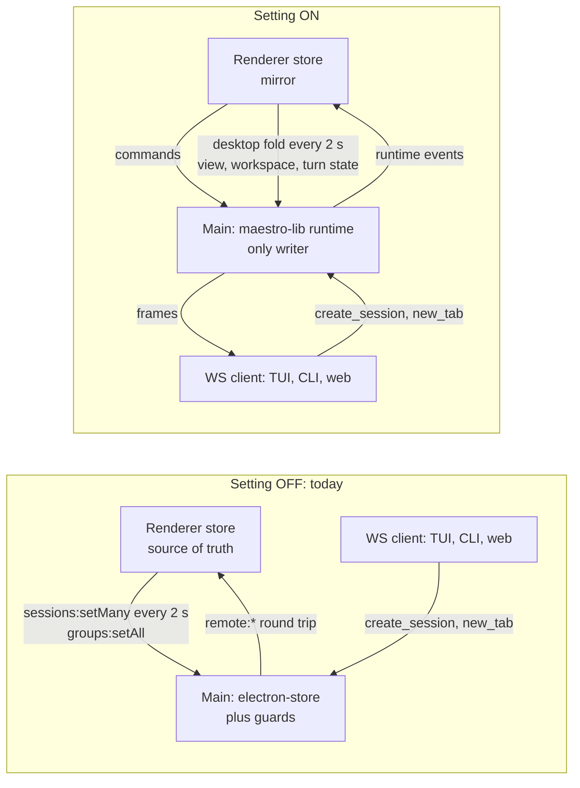

# Maestro TUI: the desktop on the library runtime

| Field     | Value                                                                                                                                                                                                         |
| --------- | ------------------------------------------------------------------------------------------------------------------------------------------------------------------------------------------------------------- |
| Status    | Design. Phase 9, task 1: written before any desktop code. Task 2 (main hosts the runtime) landed in part: see 7.1. Task 3 (the renderer as a subscriber, for agents and groups) landed: see 7.2               |
| Date      | 2026-10-05                                                                                                                                                                                                    |
| Covers    | Requirements gap L1b, requirement CO-5, question Q1, risk R1, milestone M5                                                                                                                                    |
| Builds on | `Plans/maestro-tui-runtime.md` (RT1 to RT16), `Plans/maestro-tui-client-api.md`                                                                                                                               |
| Surveyed  | `maestro-tui` at `245712bbd`: every call of the session store mutators and the persistence IPC under `src/renderer` (538 sites in 131 files), and every main-process writer of the sessions and groups stores |

Decision names: the gap, requirement, question, and risk ids are in `Plans/maestro-tui-requirements.md`; `RTn` in `Plans/maestro-tui-runtime.md`. This document adds decisions `DM1` to `DM19` (section 9), library changes `DG1` to `DG15` (section 6), and risks `DR1` to `DR11` (section 10).

---

## 1. Summary

**Today** each renderer (every desktop window and every web-desktop browser tab) holds the whole agent tree in its Zustand store, changes it in place, and flushes the changed agents to main every 2 s (`sessions:setMany`) and the groups wholesale (`groups:setAll`). Main is a store with guards: resurrection tombstones, wipe backups, image relocation, tool-output compaction, and a lifecycle push to the other clients. An agent, group, or tab change from a remote client (TUI, `maestro-cli`, web) goes main, renderer, store, `setMany`, main. The renderer is the source of truth.

**With the setting ON** main starts the library runtime (`createMaestroRuntime`, mode `desktop`), and the runtime becomes the only writer of `maestro-sessions.json` and `maestro-groups.json`:

- Renderers send domain changes as **runtime commands** over IPC and apply **runtime events** to their store, which becomes a mirror.
- State the runtime does not model (view state, desktop workspace state, live turn state) stays in the renderer. It reaches disk through one batched IPC call, the **desktop fold**, under rules that cannot overwrite a command (4.5).
- Remote agent, group, and tab messages call the runtime in main. The renderer round trip and its duplicate CRUD code are not used.

**Not in Phase 9:** turns, the execution queue, Auto Run, group chats, and consults keep their desktop paths (ProcessManager and the renderer engines). Their state is runtime-class data that the renderer folds, as it flushes it today. Moving them onto the runtime's own services follows the flip of M5.

**The setting defaults OFF.** OFF runs today's code: no runtime object, no new IPC traffic, no new listeners.



---

## 2. Classification

### 2.1 Three classes

| Class                    | What it is                                                                                                                                                                                                                                                                                     | Owner under ON                            | Path to disk under ON                                                     | Sites |
| ------------------------ | ---------------------------------------------------------------------------------------------------------------------------------------------------------------------------------------------------------------------------------------------------------------------------------------------- | ----------------------------------------- | ------------------------------------------------------------------------- | ----- |
| **C** Repository command | A change to what an agent, group, or AI tab is: create, delete, rename, move, configure, swap provider; create, close, reopen, reorder, star, or configure a tab                                                                                                                               | The runtime                               | A command over IPC. The runtime validates, writes, then emits (RT5, RT16) | 131   |
| **R** Runtime field      | Process and stream state the desktop's turn path produces: busy state, thinking clock, transcript entries, usage, provider session id, execution queue, agent errors                                                                                                                           | The renderer that runs the turn (Phase 9) | The desktop fold, batched (4.4)                                           | 111   |
| **V** View-only field    | What the person sees and where: active agent and tab, input mode, scroll, selection, drafts, collapse, focus. Also desktop workspace state the library does not model (file, terminal, and browser tabs, tile groups, snoozes, Auto Run editor state) and derived caches (file tree, git refs) | The renderer                              | Local. Persisted ones through the desktop fold; caches never              | 258   |

Appendix A also marks store primitives (**S**, 7: `updateSessionWith` and the like, whose callers decide), persistence calls (**P**, 12: `sessions:setMany`, `sessions:setAll`, `groups:setAll`, which become the fold), loads (**L**, 4: replaced by the mirror's snapshot), and leaves out 15 look-alike calls that do not touch the session store (3.6).

A site can carry more than one class. A close removes a tab (C) and picks the next tab to show (V); each part follows its own row.

### 2.2 Who writes each stored field

The library holds the closed list of domain keys (DG5). Every key not on it is desktop-owned and round-trips through the runtime untouched (DD-5). A field the desktop adds later is therefore desktop-owned by default and needs no library change.

| Group                | Keys                                                                                                                                                                                                                                                                                                                                                                                                                                                                                                                                                   | Written by   | Mirror takes incoming values                                     |
| -------------------- | ------------------------------------------------------------------------------------------------------------------------------------------------------------------------------------------------------------------------------------------------------------------------------------------------------------------------------------------------------------------------------------------------------------------------------------------------------------------------------------------------------------------------------------------------------ | ------------ | ---------------------------------------------------------------- |
| Agent domain         | `id`, `name`, `toolType`, `groupId`, `cwd`, `fullPath`, `projectRoot`, `createdAt`, `bookmarked`, `autoRunFolderPath`, `nudgeMessage`, `newSessionMessage`, `sessionSshRemoteConfig`, `additionalDirectories`, `retryOnAvailabilityErrors`, `retryOnTokenExhaustion`, `codexAutoResetOnExhaustion`, `parentSessionId`, `worktreeBranch`, `worktreeParentPath`, `worktreeConfig`, `isPianola`, `symphonyMetadata`, the provider overrides (`PROVIDER_OVERRIDE_KEYS`) and `providerOverrides`                                                            | Commands     | Yes                                                              |
| AI tab set and order | The ids in `aiTabs`, the AI refs in `unifiedTabOrder`                                                                                                                                                                                                                                                                                                                                                                                                                                                                                                  | Commands     | Yes, through `reconcileTabOrder` (2.3)                           |
| AI tab domain        | `name`, `starred`, `createdAt`, `hidden`, `consultOrigin`, `readOnlyMode`, `permissionMode`, `saveToHistory`, `showThinking`, `enterToSend`, `customModel`, `customEffort`, `providerSessions`                                                                                                                                                                                                                                                                                                                                                         | Commands     | Yes                                                              |
| Group domain         | `id`, `name`, `emoji`, `kind`, `parentGroupId`                                                                                                                                                                                                                                                                                                                                                                                                                                                                                                         | Commands     | Yes                                                              |
| Turn state (R)       | Agent: `state`, `busySource`, `thinkingStartTime`, `currentCycleTokens`, `currentCycleBytes`, `statusMessage`, `executionQueue`, `activeTimeMs`, `agentError`, `agentErrorTabId`, `agentErrorPaused`, `contextUsage`, `usageStats`, `claudeInteractive`, `aiCommandHistory`, `shellCommandHistory`, `shellLogs`, `workLog`, `shellCwd`, `cliActivity`. Tab: `logs`, `state`, `thinkingStartTime`, `agentSessionId`, `awaitingSessionId`, `usageStats`, `agentError`, `turnProvider`, `turnModel`, `turnEffort`, `isGeneratingName`, `lastSynopsisTime` | The renderer | No, except the reactions of 4.3                                  |
| View (V)             | `activeSessionId` (a document key), `activeTabId`, `activeFileTabId`, `activeTerminalTabId`, `activeBrowserTabId`, `activeGroupId`, `inputMode`, the tab's `scrollTop`, `isAtBottom`, `hasUnread`, `inputValue`, `commandMode`, `stagedImages`, `pendingMergedContext`, `autoSendOnActivate`, `fileExplorerExpanded`, `fileExplorerScrollPos`, `worktreesExpanded`, `terminalScrollTop`, `terminalDraftInput`, the Auto Run editor positions and mode, `autoRunSelectedFile`, `documentGraphLayout`, group `collapsed`                                 | The renderer | No                                                               |
| Workspace (V)        | `filePreviewTabs`, `browserTabs`, `terminalTabs`, `tabGroups`, `snoozedTabs`, the non-AI refs in `unifiedTabOrder`, `nextCoworkingId`, `autoRunContent`, `autoRunContentVersion`, `batchRunnerPrompt`, `batchRunnerPromptModifiedAt`, `autoRunDriveMode`, `autoRunGoalConfig`, `agentCommands`, `fileTreeAutoRefreshInterval`, `wizardState`                                                                                                                                                                                                           | The renderer | No                                                               |
| Caches (V)           | The `fileTree*` fields, `isGitRepo`, `gitBranches`, `gitTags`, `gitRefsCacheTime`, `closedTabHistory` (in memory), `filePreviewHistory`                                                                                                                                                                                                                                                                                                                                                                                                                | The renderer | No. Never persisted (`prepareSessionForPersistence` strips them) |

### 2.3 Fields both sides write

Seven cases have more than one writer. Each gets one rule, written once in the library and called from both sides.

- **`unifiedTabOrder` (DM7).** AI tab commands insert and remove AI refs; the desktop inserts and removes file, terminal, and browser refs and reorders the strip. The runtime owns the set of AI refs and the order of every ref it holds; the renderer owns the non-AI refs. `reconcileTabOrder(authority, local)` keeps the authority's order, drops AI refs the authority lacks, and puts each local non-AI ref the authority lacks after its local predecessor. The fold applier calls it with the stored order as the authority, the mirror with the event's order. `tabs.reorder` (DG7) moves a ref of any kind, so a reorder is a command in both directions.
- **`activeTabId` and `activeSessionId` (DM8).** Renderer-owned view keys, but a close or a delete can remove what they name. The runtime changes them only to keep them valid (a close moves to the left neighbor, a delete to the first survivor, runtime 6.2). The renderer re-selects with its own rule (the unread filter, non-AI tabs, the window's scope) and folds its choice.
- **Provider-scoped tab fields: `agentSessionId`, `usageStats`, `awaitingSessionId`, `providerSessions` (DM9).** A provider swap is a command that parks and restores them; the turn path writes them from stream events. The rule is the **provider epoch**. A fold names the provider its snapshot was computed under (`provider`), and the applier writes these fields through `updateProviderSlot(tab, record, fold.provider, fields)`: a fold computed before a swap lands in the parked slot, never on the new provider. It writes `providerSessions` entries only for providers other than the record's current one. When an event changes `toolType`, the mirror first runs `switchAgentProvider` on its own copy, so its turn state and its execution queue (whose `turnSettings` the swap clears) follow the swap, and then takes the domain keys.
- **`cwd` and its companions (DM10).** `agents.update { cwd }` moves `cwd`, `fullPath`, `projectRoot`, `shellCwd`, and the Auto Run folder together; the terminal changes `shellCwd` alone. When an event changes `cwd`, the mirror runs the renderer's `withWorkingDirectory`, which also relocates `shellCwd` and clears the file-tree caches, instead of copying `cwd` alone.
- **`autoRunFolderPath`.** The command also sets `autoRunSelectedFile` and clears `autoRunContent` (bumping `autoRunContentVersion`) so the desktop reloads the document. When an event changes `autoRunFolderPath`, the mirror takes those three keys from it.
- **Group `collapsed`.** Stored in the groups file, and the runtime never moves it (CO-4). Renderer-owned: it travels in the groups part of the fold, and `groups.changed` never overwrites it.
- **A tab closed with a turn running (DM18).** The repository refuses (`tabs.close` answers `rejected`); the desktop closes the tab and keeps the turn in `orphanedThinkingTabs`. `tabs.close` gains `busy: 'orphan'` (DG3): archive now, leave the process, and land the finished turn's fold in the archive entry (runtime section 11).

---

## 3. Inventory

### 3.1 Counts

Appendix A is the full list, one entry per function. It comes from a scan of every call of `setSessions`, `updateSessionWith`, `updateAiTab`, `updateFileTab`, `updateBrowserTab`, `addSession`, `removeSession`, `updateSession`, `setGroups`, `addGroup`, `removeGroup`, `updateGroup`, `setGroupParent`, `toggleGroupCollapsed`, `toggleBookmark`, `addLogToTab`, `setActiveSessionId` and its two variants, `useSessionStore.setState`, and the `sessions.setAll`, `sessions.setMany`, `groups.setAll`, and `sessions.setActiveSessionId` IPC calls. Sites where a helper hides the fields were classified by hand.

|       | C   | R   | V   | S   | P   | L   | Look-alikes |
| ----- | --- | --- | --- | --- | --- | --- | ----------- |
| Sites | 131 | 111 | 258 | 7   | 12  | 4   | 15          |
| Files | 37  | 42  | 82  | 4   | 3   | 2   | 8           |

538 sites; 123 files and 343 functions with a session store mutation. `sessions:setAll` has one caller (`useDebouncedPersistence`); `groups:setAll` has two (`useSessionLifecycle`, `useAppRemoteEventListeners`).

### 3.2 The named hooks

**`useSessionCrud`** (`src/renderer/hooks/session/useSessionCrud.ts`)

| Handler                                                         | Today                                                                                                                | Class | Under ON                                                                                                                                                                                                    | Stays with the caller                                                |
| --------------------------------------------------------------- | -------------------------------------------------------------------------------------------------------------------- | ----- | ----------------------------------------------------------------------------------------------------------------------------------------------------------------------------------------------------------- | -------------------------------------------------------------------- |
| `createNewSession`                                              | `validateNewSession`, builds a whole `Session`, appends it, activates it, claims it for the window, records the stat | C, V  | `agents.create` (DG6 adds the inputs the form has and the library lacks). On the answer: activate, `registerNewSession(id)`, focus. The record arrives by `agent.added` and is hydrated by `restoreSession` | The git probe (a cache). The stat moves to main (4.9)                |
| `deleteSession`                                                 | Opens the confirm modal                                                                                              | none  | Unchanged                                                                                                                                                                                                   |                                                                      |
| `deleteWorktreeGroup`                                           | Kills the legacy `-ai`, `-terminal`, and terminal-tab processes, deletes playbooks, removes the agents and the group | C, V  | `agents.remove` per member (stops every process, deletes playbooks and the archive, fixes G6), then `groups.remove`. A failure part-way leaves a smaller group; nothing is lost                             | Removed-worktree-path tracking, the active-agent fallback, the toast |
| `finishRenamingSession`                                         | Sets the name, syncs the provider session name                                                                       | C     | `agents.rename`, optimistic. A duplicate name is now refused (RT13); the toast shows the runtime's message                                                                                                  | The provider name sync moves to main (4.9)                           |
| `toggleBookmark`                                                | Flips `bookmarked`                                                                                                   | C     | `agents.update { bookmarked }`, optimistic                                                                                                                                                                  |                                                                      |
| `handleGroupCreated`                                            | Moves the pending agent and its worktree children                                                                    | C     | `groups.moveAgent` (the rule moves the children)                                                                                                                                                            |                                                                      |
| `handleDragStart`, `handleDragOver`, `handleCreateGroupAndMove` | View                                                                                                                 | V     | Unchanged                                                                                                                                                                                                   |                                                                      |

**`useSessionLifecycle`** (`src/renderer/hooks/session/useSessionLifecycle.ts`)

| Handler                      | Today                                                                                                                                                                                            | Class              | Under ON                                                                                                                                                                                 | Stays with the caller                                                |
| ---------------------------- | ------------------------------------------------------------------------------------------------------------------------------------------------------------------------------------------------ | ------------------ | ---------------------------------------------------------------------------------------------------------------------------------------------------------------------------------------- | -------------------------------------------------------------------- |
| `handleSaveEditAgent`        | `switchAgentProvider`, the config fields, and `withWorkingDirectory` behind `workingDirectoryChangeBlocker`                                                                                      | C                  | `agents.update`, one transaction (RT12): provider, cwd, config. DG6 widens `AGENT_EDITABLE_KEYS`. The receipt's `notices` feed the same switch toast                                     | The blocker pre-check (the same rule)                                |
| `handleRenameTab`            | Tile group, terminal, file, and browser branches; the AI branch sets `name`, clears `isGeneratingName`, syncs the provider name, and relabels History                                            | V (non-AI), C (AI) | AI tab: `tabs.rename`, optimistic. The other branches: unchanged, folded                                                                                                                 | The provider name and the History relabel move to main (4.9)         |
| `handleAutoNameTab`          | Starts `requestTabAutoName`                                                                                                                                                                      | none               | Unchanged. The name lands through `tabAutoNaming.applyName` as `tabs.rename`                                                                                                             |                                                                      |
| `performDeleteSession`       | Records the stat, kills `-ai`, `-terminal`, and the terminal tabs, deletes playbooks, tracks the worktree path, trashes the directory on request, removes, flushes, activates the first survivor | C, V               | `agents.remove` (stops every process of the agent through DG2, deletes playbooks and the archive). Then locally: the active-agent fallback, the worktree-path tracking, the opt-in trash | The trash and the toast. The stat moves to main (4.9)                |
| `toggleTabStar`              | Flips `starred`, calls `persistTabStarred`                                                                                                                                                       | C                  | `tabs.star`, optimistic                                                                                                                                                                  | The origin star and the starred transcript mirror move to main (4.9) |
| `toggleTabUnread`            | `hasUnread`                                                                                                                                                                                      | V                  | Local, folded                                                                                                                                                                            |                                                                      |
| The groups effect (line 585) | `groups.setAll` on every change                                                                                                                                                                  | P                  | The groups part of the fold                                                                                                                                                              |                                                                      |

**`useGroupManagement`** (`src/renderer/hooks/session/useGroupManagement.ts`)

| Handler                                                               | Today                         | Class | Under ON                                |
| --------------------------------------------------------------------- | ----------------------------- | ----- | --------------------------------------- |
| `toggleGroup`                                                         | `collapsed`                   | V     | Local, folded                           |
| `startRenamingGroup`, `createNewGroup`, `handleCloseCreateGroupModal` | View and modal state          | none  | Unchanged                               |
| `finishRenamingGroup`                                                 | Upper-cased name              | C     | `groups.rename`                         |
| `setGroupParent`                                                      | `parentGroupId`               | C     | `groups.update { parentGroupId }` (DG8) |
| `handleDropOnGroup`, `handleDropOnUngrouped`                          | The dragged agent's `groupId` | C     | `groups.moveAgent`, optimistic          |

**The remote path.** `useRemoteIntegration` receives `remote:*` from main. It handles the tab and view events itself and re-dispatches the CRUD ones as `maestro:remote*` events to `useAppRemoteEventListeners`, which holds the drifted duplicate of the hooks (runtime 6.3).

| Remote event                                                       | Today                                              | Under ON (main calls the runtime; task 5 stops the renderer listener)                                                                                         |
| ------------------------------------------------------------------ | -------------------------------------------------- | ------------------------------------------------------------------------------------------------------------------------------------------------------------- |
| `createSession`                                                    | Builds a `Session`, appends, `setMany`             | `agents.create` in main; the mirror receives `agent.added`                                                                                                    |
| `deleteSession`                                                    | Kills, filters, removes through `setMany`          | `agents.remove` in main                                                                                                                                       |
| `renameSession`                                                    | `name`, `setMany`                                  | `agents.rename` in main                                                                                                                                       |
| `updateSessionCwd`                                                 | `withWorkingDirectory`                             | `agents.update { cwd }` in main                                                                                                                               |
| `updateSessionSsh`                                                 | `sessionSshRemoteConfig`                           | `agents.update { ssh }` in main                                                                                                                               |
| `updateSessionConfig`                                              | `switchAgentProvider`, config keys, the tab branch | `agents.update` and `tabs.update` in main                                                                                                                     |
| `setAutoRunFolder`, the folder part of `configureAutoRun`          | `autoRunFolderPath`                                | `agents.update { autoRunFolderPath }` in main. An SSH agent still needs the desktop (the library answers `unsupported`), so that case keeps the renderer path |
| `createGroup`, `renameGroup`, `deleteGroup`, `moveSessionToGroup`  | `setGroups`, `setSessions`                         | `groups.*` in main                                                                                                                                            |
| `updateGroup`                                                      | Emoji, parent                                      | `groups.update` in main (DG8)                                                                                                                                 |
| `createWorktreeSession`                                            | A worktree child agent                             | `agents.create` in main once DG6 carries the worktree fields; the renderer path until then                                                                    |
| `newTab`, `newAITabWithPrompt`                                     | `createTab`, then a prompt                         | `tabs.create` in main. The prompt half stays a renderer turn                                                                                                  |
| `closeTab`, `renameTab`, `starTab`, `reorderTab`, `toggleBookmark` | Tab and bookmark edits                             | `tabs.close`, `tabs.rename`, `tabs.star`, `tabs.reorder` (DG7), `agents.update { bookmarked }` in main                                                        |
| `selectSession`, `selectTab`, `switchMode`                         | Move the desktop's view                            | Unchanged: these verbs exist to move the view                                                                                                                 |

**`useDebouncedPersistence`** (`src/renderer/hooks/utils/useDebouncedPersistence.ts`). The 2 s debounce, the reference diff (`diffSessions`), `prepareSessionForPersistence`, the read gate (`sessionsReadOk`), and the retry-on-failure contract stay. Under ON the flush sends the desktop fold (4.5) instead of `setMany` or `setAll`. `prepareSessionForPersistence` and `diffSessions` move out of the hook into a module so the fold builder shares them.

**`useSessionRestoration`** (`src/renderer/hooks/session/useSessionRestoration.ts`). Under ON `loadSessionsAndGroups` reads `libraryRuntime.snapshot()` instead of `sessions:getAll`, `sessions:getBootstrap`, and `groups:getAll`, runs the same `restoreSession` on each record, and records each agent's revision. `restoreSession` moves out of the hook into a module function so the mirror hydrates `agent.added` records with it. `loadActiveDeferredContent` keeps its IPC, now answered from the runtime's documents.

**`useSessionLifecycleSync`** is off under ON. `agent.added` and `agent.removed` replace the lifecycle push, and the runtime's one list replaces the tombstones.

### 3.3 Other command sites, by area

| Area                                      | Sites (Appendix A has the lines)                                                                                                                                                                                                                                                                                                                                                                                                                                                                                                                            | Under ON                                                                                                                                                                                              |
| ----------------------------------------- | ----------------------------------------------------------------------------------------------------------------------------------------------------------------------------------------------------------------------------------------------------------------------------------------------------------------------------------------------------------------------------------------------------------------------------------------------------------------------------------------------------------------------------------------------------------- | ----------------------------------------------------------------------------------------------------------------------------------------------------------------------------------------------------- |
| Left Bar and its modals                   | `SessionList` (delete, move to group, bookmark, group delete with promotion, group-parent drops), `CreateGroupModal`, `RenameGroupModal` (name and emoji), `RenameSessionModal`, `QuickActionsModal` (rename, move to group, bookmark), the palette's `sessionCommands` and `contextCommands` (star)                                                                                                                                                                                                                                                        | `agents.*`, `groups.*`; `groups.update` for emoji and parent (DG8)                                                                                                                                    |
| Tab store and tab handlers                | `tabStore` (`createTab`, `closeTab`, `reopenClosedTab`, `starTab`, `updateTabName`, `toggleReadOnly`, `toggleSaveToHistory`, `cycleThinkingMode`, `setTabModel`, `setTabEffort`, `reorderTabs`, `reorderUnifiedTabs`, `snoozeTab`, `unsnoozeTab`), `useAITabHandlers`, `useUnifiedTabHandlers`, `ToolbarControls` (permission and thinking modes), `usePromptComposerHandlers`, `useQuickActionsHandlers`, `useMainKeyboardHandler` (reopen, toggles, move to edge), `tileNewTabAction`, `WizardInputPanel` (close), `agentStore.startNewSessionAfterError` | `tabs.*`, optimistic. The tab store actions are the seam: each already calls one helper and then `updateActiveSession`. Reopen is `tabs.reopen` (DG9); snooze is `tabs.park` and `tabs.unpark` (DG11) |
| A new tab with content                    | `useForkConversation`, `useAgentSessionManagement.handleResumeSession`, `useSummarizeAndContinue`, `useMergeTransferHandlers.finishTransfer`                                                                                                                                                                                                                                                                                                                                                                                                                | `tabs.create` with a client id and a seed transcript (DG10); the turn state rides the fold                                                                                                            |
| Agents created outside the New Agent flow | `useWizardHandlers.handleWizardLaunchSession`, `useSymphonyContribution`, `useMergeSession.executeMerge`, `useSendToAgent.executeTransfer`, `usePianolaAgent`, `useWorktreeHandlers` (saved-config children, the three scans, the two deletes, `onWorktreeRemoved`), `worktreeSpawn.spawnWorktreeAgentAndDispatch` (the Auto Run worktree dispatch)                                                                                                                                                                                                         | `agents.create` and `agents.remove`, with the desktop fields of DG6                                                                                                                                   |
| Consult tabs                              | `useCrossAgentDispatch.ensureConsultTab`                                                                                                                                                                                                                                                                                                                                                                                                                                                                                                                    | `openConsultTab` through the desktop IPC (DG12). `applyChunk` stays runtime-class and folds                                                                                                           |
| Names from a model                        | `tabAutoNaming.applyName`, the wizard's placeholder name                                                                                                                                                                                                                                                                                                                                                                                                                                                                                                    | `tabs.rename`                                                                                                                                                                                         |
| Auto Run folder                           | `useAutoRunHandlers.handleAutoRunFolderSelected`, `useWizardHandlers.completeWizardImpl`                                                                                                                                                                                                                                                                                                                                                                                                                                                                    | `agents.update { autoRunFolderPath }`                                                                                                                                                                 |
| Working directory                         | `useAppHandlers.updateSessionWorkingDirectory`                                                                                                                                                                                                                                                                                                                                                                                                                                                                                                              | `agents.update { cwd }`                                                                                                                                                                               |

### 3.4 Runtime and view sites

These keep their code. Only their path to disk changes (the fold).

| Area                    | Class | Examples                                                                                                                                                                                                    |
| ----------------------- | ----- | ----------------------------------------------------------------------------------------------------------------------------------------------------------------------------------------------------------- |
| Stream listeners        | R     | `hooks/agent/internal/*` (data, thinking, tool, usage, session id, exit, error, user input, SSH remote, Claude mode, slash commands), `useBatchedSessionUpdates`                                            |
| Sending and the queue   | R     | `useInputProcessing`, `agentStore.processQueuedItem`, `useQueueProcessing`, `useQueueHandlers`, `queuedPrompt`, `editQueuedMessage`, `useAutoResumeCoordinator`, `retryStore`                               |
| Stopping and recovering | R     | `useInterruptHandler`, `useSessionRecovery`, `useTranscriptBackfill`, `agentDelegation`, `shellCommand`, `debugCommands`                                                                                    |
| Focus and navigation    | V     | `useSessionSwitchCallbacks`, `useSessionNavigation`, `useStarredItems`, `agentNavigation`, `toastClickActions`, `unreadFilters`, `useKeyboardNavigation`, `useCycleSession`, the `MainPanel` click handlers |
| Non-AI tabs and tiling  | V     | `useFilePreviewTabHandlers`, `useBrowserTabHandlers`, `TerminalView`, `TiledLayout`, `PaneDropZones`, `usePaneDrag`, `useTilingShortcuts`, the coworking browsers                                           |
| Caches                  | V     | `useFileTreeManagement`, `useGitStatusPolling`, `FileExplorerPanel`                                                                                                                                         |

### 3.5 Main-process writers of the same files

The ON path routes these too; otherwise main keeps a second writer of `maestro-sessions.json`.

| Writer                                                                                   | Where                                                                                                | Under ON                                                                                                                                     |
| ---------------------------------------------------------------------------------------- | ---------------------------------------------------------------------------------------------------- | -------------------------------------------------------------------------------------------------------------------------------------------- |
| `sessions:setMany`, `sessions:setAll`                                                    | `src/main/ipc/handlers/persistence.ts`                                                               | The fold route (4.5). A renderer or a web-desktop bundle that is not migrated still persists through it                                      |
| `groups:setAll`                                                                          | Same file                                                                                            | The groups part of the fold                                                                                                                  |
| `sessions:setActiveSessionId`                                                            | Same file                                                                                            | The document's `activeSessionId` through the fold route, coalesced as today. The `session.activated` plugin event stays                      |
| The compaction write in `sessions:getAll`                                                | Same file                                                                                            | Runs once at startup, before the runtime loads (4.1)                                                                                         |
| Plugin host session verbs (`create`, `update`, `delete`, `focus`)                        | `src/main/index.ts`                                                                                  | `agents.create`, `agents.rename`, `agents.remove` (the store facade cannot tell a removal from an omission), and the unchanged focus request |
| `updateSessionInteractive`, `persistClaudeInteractiveMode`                               | `src/main/index.ts`, `src/main/ipc/handlers/process/persist-claude-interactive-mode.ts`              | The store facade. `claudeInteractive` is turn state, so the fold rules apply                                                                 |
| Store migrations                                                                         | `src/main/stores/migrations/*`                                                                       | Unchanged. They run before the runtime loads                                                                                                 |
| Readers: the bridge (`get_sessions`, groups), Cue, group chat, Director's Notes, Pianola | `src/main/web-server/callbacks/*` and the other users of `getSessionsStore()` and `getGroupsStore()` | The store facade reads the runtime's documents                                                                                               |

### 3.6 Not the session store

Left out of the counts: a local `useState` named `setSessions` in `useSessionPagination`, `AutoRunStats`, `LongestAutoRunsTable`, and `useCue`; `updateSession` of the provider session list in `useAgentSessionsRename`; and `removeSession` of the Cue registry (`services/cue.ts`, `useCueAutoDiscovery`), the coworking registry (`useCoworkingRegistrySync`), and the context timeline (inside `sessionStore.setSessions`).

---

## 4. The new flow

### 4.1 Main

Startup under ON. Each step finishes before the next starts.

1. The desktop guard takes `maestro-runtime.lock` in mode `desktop` at module load, as today (RT2, RT3). `claimDataDirForDesktop` also hands back the lock object (DG1).
2. `initializeStores()` and the store migrations run, as today.
3. Main reads `libraryRuntime` from the settings store. OFF: nothing below runs.
4. `await flushPendingSessionWrites()`, so no deferred write of the electron-store sessions instance lands after the runtime loads.
5. `createMaestroRuntime({ dataDir: userData, productionDataDir, mode: 'desktop', lock, allowSyncedDataDir: true, quarantineCorruptStores: true, deps })`. `lock` adopts the guard's lock: no second acquire, one heartbeat, one release (DG1). `deps.processes` is a ProcessManager-backed probe and stop (DG2); `deps.readTabDefaults` reads main's settings store; `deps.probeBinary` uses the agent detector; `deps.checkCwd` is `unusableCwdReason`.
6. A refusal (a corrupt store, a failed lock, no lock because another desktop holds it) is logged, and this run takes the OFF path, with a toast once a window is up (DM4).
7. Main installs the store facade (below), registers the `libraryRuntime:*` IPC handlers, switches the persistence handlers to the fold route, and binds the bridge (4.6). Then the windows load.

Quit: the renderers' last fold lands (the existing `beforeunload` flush), then `runtime.connection.close()` drains the write queue, then the guard releases the lock. The runtime's own process registry is empty for desktop turns (DG2 leaves them in ProcessManager), so closing it stops nothing the desktop owns.

**The store facade.** `src/main/library-runtime/store-facade.ts` implements the part of the electron-store API that main uses on the sessions and groups stores (`get('sessions')`, `get('activeSessionId')`, `get('groups')`, `set(...)`, `path`) over the runtime's documents. `set` becomes a fold with `setAll` meaning: an agent it leaves out is kept, not removed. Every reader and the few remaining writers then go through the runtime, with one swap point. The electron-store instances are not written again in that run, and their read cache is dropped.

The binding lives in `src/main/library-runtime/`, because `src/main/runtime/` already holds the shell-path helper.

### 4.2 IPC surface

A new preload namespace, `window.maestro.libraryRuntime` (`src/main/preload/libraryRuntime.ts`), served by `src/main/ipc/handlers/libraryRuntime.ts`. Web-desktop reaches the same channels through the bridge's `invoke`.

| Call                                                                                                                                                                                                                                                                                                              | Answers                                                                                                                     | Notes                                                                                                                                  |
| ----------------------------------------------------------------------------------------------------------------------------------------------------------------------------------------------------------------------------------------------------------------------------------------------------------------- | --------------------------------------------------------------------------------------------------------------------------- | -------------------------------------------------------------------------------------------------------------------------------------- |
| `status()`                                                                                                                                                                                                                                                                                                        | `{ hosting: boolean; reason?: string }`                                                                                     | Fixed for the run. `hosting: false` says why: the setting is OFF, or the runtime refused                                               |
| `snapshot()`                                                                                                                                                                                                                                                                                                      | `{ sessions, groups, activeSessionId, revs, groupsRev }`                                                                    | The stored records with transcripts (DG15). A web-desktop client gets the bootstrap projection with deferred content, as today         |
| `agents.create`, `agents.update`, `agents.rename`, `agents.remove`; `groups.create`, `groups.rename`, `groups.update`, `groups.remove`, `groups.moveAgent`; `tabs.create`, `tabs.rename`, `tabs.close`, `tabs.star`, `tabs.update`, `tabs.reorder`, `tabs.reopen`, `tabs.park`, `tabs.unpark`; `consults.openTab` | `{ result: ClientResult; agent?: AgentRecord; rev?: number; groups?: GroupRecord[]; groupsRev?: number }`                   | Each carries the caller's `commandId`. The answer holds the authoritative record, so a failure snaps back without waiting for an event |
| `fold(batch)`                                                                                                                                                                                                                                                                                                     | `{ ok: boolean; revs; groupsRev; drift: DriftReport[] }`                                                                    | 4.5                                                                                                                                    |
| `onEvent(listener)`                                                                                                                                                                                                                                                                                               | Channel `libraryRuntime:event`: `{ event: MaestroEvent; rev?: number; groupsRev?: number; origin?: { commandId: string } }` | Sent to every window and broadcast to web-desktop clients (DG13)                                                                       |

The runtime emits an event before it answers the command that caused it. A client that creates a tab and then sends a turn to it therefore never reaches the renderer before the tab does.

### 4.3 The renderer mirror

**One seam per operation (DM14).** `src/renderer/services/agentOps.ts` holds one function per domain operation (`createAgent`, `renameAgent`, `removeAgent`, `updateAgent`, `createGroup`, `createAiTab`, `closeAiTab`, `reorderTabs`, `parkTab`, and the rest). Each has both modes: OFF is today's code, moved as is; ON is a command. Hooks call `agentOps`, never `window.maestro.libraryRuntime` directly, so the flag check lives in one module instead of 131 call sites. The functions are module-level because queue drains and IPC listeners run outside React.

**Mode.** `isLibraryRuntimeHosting()` reads `status()` once at startup. It answers false when the preload namespace is missing, so the OFF path and the existing tests see no change.

**Applying events.** The mirror keeps, per agent, the revision it last applied and a count of its own commands in flight.

1. An event at or below the mirror's revision for that agent is stale: skip it.
2. While this client has commands in flight for the agent, hold the newest event instead of applying it. When the last answer lands, apply the newer of the held event and the answer's record, by revision. Two quick renames therefore never flicker back to the first name.
3. Applying takes the domain keys from the record: the AI tab set by id, each tab's domain keys, and the order through `reconcileTabOrder`. It keeps every local turn, view, and workspace key. A new agent or tab is hydrated with `restoreSession`; a new tab with stored history fetches its transcript once.
4. Reactions to a domain change: `toolType` changed, run `switchAgentProvider` locally first (DM9); `cwd` changed, run `withWorkingDirectory` (DM10); `autoRunFolderPath` changed, take the three Auto Run keys (2.3); the active tab was removed, re-select with the renderer's own rule; the active agent was removed, re-select with the window's rule; a removed tab was busy, keep it in `orphanedThinkingTabs`, as a local close does.
5. `agent.removed` drops the agent and remembers its id, so a late event cannot bring it back. `groups.changed` replaces the groups and keeps the local `collapsed`. `host.lost` raises the fenced state (4.8).

The mirror reads `agent.updated` and ignores the `tab.*` events. Every tab change is followed by an `agent.updated` that carries the whole agent, the rule `framesForEvent` already follows.

**Optimism (DM11).** Keyboard-driven commands apply locally first with the renderer's existing helper, then send the command: tab create, close, reopen, rename, star, update, reorder, park; agent rename, bookmark, move to group. A local create uses a client-chosen id (DG10), so the local record and the runtime's are the same record. The event or the answer then snaps the domain keys to the runtime's result. The parity tests (section 8) keep the two equal, so the snap changes nothing on screen. This keeps the keyboard synchronous: a keystroke after Cmd+T reaches the new tab, not the old one. Modal flows (agent create, edit, delete; group create, delete) wait for the answer, as they already wait on validation and git probes.

**Failure.** A failed command snaps the agent to the authoritative record in the answer and shows the runtime's message in a toast.

### 4.4 High-frequency runtime fields: no round trip

- **The live path does not change.** ProcessManager sends `process:data`, `process:thinking-chunk`, `process:tool-execution`, `process:usage`, `process:session-id`, and `process:exit` to the renderer, one hop, and the renderer's listeners fold them into its store. Nothing in that path calls the runtime or waits for it.
- **Persistence is batched.** Turn state reaches disk through the desktop fold on the existing 2 s debounce, plus the explicit flushes (turn end through `flushNow`, quit). That is one IPC call per window per 2 s, carrying only the dirty agents, only their desktop-owned keys, and only the tabs that changed.
- **No echo.** Applying a fold emits nothing to the renderers: the sender already holds what it folded, and the other windows fold their own turn state. WS clients get one coarse `agent.updated` per agent whose projected record changed (a tab's `state`, `hasUnread`, the provider session id), at most once per fold.
- **Write cost.** Before any fold route ships, the runtime's sessions writer gains the per-agent serialization cache and the async, coalesced, atomic write that `src/main/stores/deferred-writes.ts` gives `setMany` today (DG4). Without it every fold serializes the whole 5 to 13 MB file on main's UI thread, which is issue #1501: keystrokes are not delivered while it runs. Commands stay write-through (RT5); folds coalesce.
- **After Phase 9.** When turns move onto the runtime's turn service, the stream comes from the runtime's bus to the renderer, still one hop, and the fold stops carrying turn state.

### 4.5 The desktop fold

The fold is `sessions:setMany` with rules. It is also the compatibility route: under ON, a `sessions:setMany` or `sessions:setAll` call from code that is not migrated yet (or from a browser tab still running an older bundle) arrives as a fold.

```ts
interface DesktopFold {
	agents: Array<{
		id: string;
		/** The revision of the runtime state this client last applied. Absent: main uses the revision it last acknowledged to this sender. */
		baseRev?: number;
		/** The provider this snapshot was computed under (provider epoch, DM9). */
		provider: string;
		/** Desktop-owned agent keys: view and workspace, plus turn state when this client owns the agent's stream (4.7). */
		fields: Record<string, unknown>;
		/** Desktop-owned keys per AI tab. */
		tabs: Record<string, Record<string, unknown>>;
		/** `unifiedTabOrder` as this client holds it. */
		order?: TabRefRecord[];
		/** Domain keys that differ from the last authoritative record: a site not migrated yet. */
		domain?: Record<string, unknown>;
		/** AI tabs this client holds that the runtime never had: created without a command. */
		adoptTabs?: Record<string, unknown>[];
		/** AI tabs this client closed without a command. */
		closeTabs?: string[];
	}>;
	/** Agents created without a command. */
	adoptAgents?: Record<string, unknown>[];
	/** Agents removed without a command (today's `removeIds`). */
	removeAgents?: string[];
	activeSessionId?: string;
	groups?: { baseRev?: number; collapsed: Record<string, boolean>; domain?: GroupRecord[] };
}
```

The applier (`agents/desktop-fold.ts` in the library, run in the repository's queue, DG5):

1. **The boundary first, in main:** `relocateSessionImages`, `compactSessionToolOutputs`, the 100-entry log cap, and `mergeDeferredSessionContent` for a client that holds deferred transcripts. These are the transforms `setMany` applies today, at the same boundary.
2. **Desktop-owned keys always land** on an agent or tab the runtime has. A domain key found in `fields` or `tabs` is dropped: the split is the library's closed list.
3. **Provider-scoped tab fields** go through `updateProviderSlot`, keyed by `provider` (2.3).
4. **`domain`, `closeTabs`, and `order` land only at the current revision** (DM12), that is when `baseRev` equals the runtime's revision for that agent. If a command came since, it wins: the fold's domain part is dropped and reported as drift. A closed tab is archived before it is removed, in the order of RT6. This lets tasks 3 to 5 migrate one site at a time: a site not migrated yet still persists, and a stale window can never overwrite a remote command.
5. **Adoption** (DM13): a tab or agent the runtime never had is added, unless its id is tombstoned (a closed-tab archive entry, or a removed agent, bounded at 1,000 like main's tombstones today). It is reported as drift. A missed creation site therefore never loses a transcript, and a stale client still cannot resurrect what was closed.
6. **`removeAgents` always lands** and tombstones the id. It is an explicit user action, as `removeIds` is today.
7. **Order:** `reconcileTabOrder(stored, fold.order)` (2.3).
8. **Groups:** `collapsed` always lands; `domain` only at the current `groupsRev`; an unknown group is adopted unless tombstoned.
9. **One coalesced write, then the answer**, with the new revisions and the drift report.

The applier never removes an agent or a tab because a fold leaves it out (`setAll` meaning). Drift is logged once per site and kind, and the renderer tests assert that a migrated flow produces none. When the inventory is fully migrated, a later change can refuse `domain`, `adoptTabs`, and `adoptAgents` instead of accepting them.

### 4.6 The bridge

Under ON these messages go to the library's `createRequestHandler(runtime)`, the handler the headless host already runs, so the desktop and the headless host answer a client alike: `create_session`, `rename_session`, `delete_session`, `update_session_cwd`, `update_session_ssh`, `update_session_config`, `set_auto_run_folder`, `move_session_to_group`, `create_group`, `rename_group`, `delete_group`, `new_tab`, `rename_tab`, `close_tab`, `star_tab`.

- `reorder_tab`, `toggle_bookmark`, `update_group`, and `create_worktree_session` join them when DG7, DG8, and DG6 land. Until then they keep the renderer path.
- The view verbs (`select_session`, `select_tab`, `switch_mode`), turns (`send_command`, `enqueue_command`, the queue), Auto Run, group chats, and consults do not change.
- Agent, group, and tab broadcasts to WS clients come from `framesForEvent` over the runtime's events. They replace the `setMany`-driven `broadcastSessionAdded`, `broadcastSessionStateChange`, and `broadcastSessionRemoved` for those changes.
- The bridge's `connected` and status answers carry `runtimeHosting`, so `maestro-cli status` can say which mode the desktop runs (DG14).

### 4.7 Windows and browser clients

- Every desktop window and every web-desktop browser tab is a renderer with its own mirror. All receive the same events.
- A window's active agent and its window-scoped agent claims stay local view state.
- **Turn state is folded only by a client that folds the agent's stream.** Main broadcasts every `process:*` event to every window, and each window drops the events of agents it does not own (`useOwnedSessionGate` over `WindowContext.ownsSession`; a web-desktop client owns every agent). A window that does not own an agent holds a stale copy of its turn state, so its fold carries only that agent's view and workspace keys. Without this rule, scrolling in one window could overwrite the transcript another window is writing.
- When two windows fold different view keys, the last fold wins on disk, as today.
- `sessions:lifecycleSync` and main's tombstone list are not used under ON. The runtime holds the one list, and a stale client can only fold desktop-owned keys onto agents that exist.

### 4.8 Failures

| Failure                                                                                 | Behavior                                                                                                                                                                                                                                                   |
| --------------------------------------------------------------------------------------- | ---------------------------------------------------------------------------------------------------------------------------------------------------------------------------------------------------------------------------------------------------------- |
| The runtime refuses at start                                                            | This run takes the OFF path. A toast shows the refusal's message; it is logged                                                                                                                                                                             |
| The runtime is fenced mid-run (the lock was taken over, or another host appeared; RT11) | Commands and folds answer `host-lost`. A sticky toast: "Another Maestro took over this data directory. Changes are not saved. Quit Maestro." The renderer keeps its state in memory and destroys nothing; the next start resolves through the guard (CO-5) |
| A command fails (invalid, rejected, not found)                                          | Snap to the answer's record; a toast with the runtime's message                                                                                                                                                                                            |
| A fold fails (disk full)                                                                | As `setMany` returning false today: the batch stays pending and retries on the next change and on quit                                                                                                                                                     |

### 4.9 Side effects that move to main

Today the renderer performs these after its own edit, and the remote duplicate skips some of them. Under ON a bus listener in `src/main/library-runtime/desktop-effects.ts` performs them for every committed change from any surface, and the renderer stops making the calls (OFF does not change):

| Committed change       | Side effect                                                                                                                                 |
| ---------------------- | ------------------------------------------------------------------------------------------------------------------------------------------- |
| Tab renamed            | The provider session name (`claude.updateSessionName` or `agentSessions.setSessionName`), the History relabel (`history.updateSessionName`) |
| Tab starred            | The origin star (`claude.updateSessionStarred` or `agentSessions.setSessionStarred`), the starred transcript mirror                         |
| Agent renamed          | The provider session name for the agent's session                                                                                           |
| Agent created, removed | `stats.recordSessionCreated`, `stats.recordSessionClosed`                                                                                   |

---

## 5. The setting

| Item           | Plan                                                                                                                                                                                                                                                                                                                   |
| -------------- | ---------------------------------------------------------------------------------------------------------------------------------------------------------------------------------------------------------------------------------------------------------------------------------------------------------------------- |
| Key            | `libraryRuntime`                                                                                                                                                                                                                                                                                                       |
| Type, default  | boolean, `false`                                                                                                                                                                                                                                                                                                       |
| Metadata       | `src/shared/settingsMetadataCore.ts`, category `advanced`. Description: "Experimental. The main process owns agents, groups, and tabs through the maestro-lib runtime, and every window applies its changes instead of keeping its own copy. Takes effect after a restart."                                            |
| Renderer store | The `settingsStore` field, setter, and load patch; the `useSettings` type                                                                                                                                                                                                                                              |
| Main default   | `src/main/stores/defaults.ts`                                                                                                                                                                                                                                                                                          |
| Control        | Settings, General tab: a new section "Library Runtime (experimental)" after Maestro CLI, with a toggle inside `data-setting-id="general-library-runtime"`. Under it: "Takes effect after a restart", and "Restart Maestro to apply" while the stored value differs from `libraryRuntime.status().hosting`              |
| Search         | The `GENERAL_SETTINGS` entry in `src/renderer/components/Settings/searchableSettingsGeneral.ts`, in the same change as the control (the two-way parity test fails on either alone). Keywords: runtime, library, maestro-lib, experimental, agent state, TUI, headless                                                  |
| CLI            | `maestro-cli settings set libraryRuntime true` and `settings get libraryRuntime`, through the existing metadata-driven verbs. The parity doc's "Settings, theme, Encore features" row covers it and names no setting, so there is no new row. The running mode is the new `runtimeHosting` on the status answer (DG14) |
| Read when      | Once, by main, at startup (4.1). The renderer never reads the setting to choose its mode; it asks `status()`                                                                                                                                                                                                           |
| OFF means      | Today's code, unchanged                                                                                                                                                                                                                                                                                                |

---

## 6. Library changes the desktop needs

| Id   | Change                                                                                                                                                                                                                                                                                                                                                                                                                                                                                | Task |
| ---- | ------------------------------------------------------------------------------------------------------------------------------------------------------------------------------------------------------------------------------------------------------------------------------------------------------------------------------------------------------------------------------------------------------------------------------------------------------------------------------------- | ---- |
| DG1  | `MaestroRuntimeOptions.lock`: adopt a `DataDirLock` the caller holds. `claimDataDirForDesktop` returns it in the `claimed` outcome                                                                                                                                                                                                                                                                                                                                                    | 2    |
| DG2  | `deps.processes`: a `RepositoryProcesses` the caller supplies, composed with the runtime's registry. The desktop's answers `isBusy` from ProcessManager (`isAgentBusy`, `isAiTabProcessActive` in `src/main/utils/agent-busy.ts`) and, on remove, stops every process of the agent: every AI tab, the legacy ids, the terminal PTYs (G6)                                                                                                                                              | 2    |
| DG3  | `tabs.close(agentId, tabId, { busy: 'refuse' \| 'orphan' })`. `orphan` archives now and leaves the process; the fold of its finished turn lands in the archive entry                                                                                                                                                                                                                                                                                                                  | 4    |
| DG4  | The sessions writer's cost: the per-agent serialization cache and the async, coalesced, atomic write move from `src/main/stores/deferred-writes.ts` into `store/` (main re-exports them, the same hoist as `atomicWriteFile`). Commands stay write-through; folds coalesce                                                                                                                                                                                                            | 2    |
| DG5  | `agents/ownership.ts` (the closed domain key lists, the provider-scoped tab keys) and `agents/desktop-fold.ts` (the applier, `reconcileTabOrder`), behind `runtime.desktop.fold()` for mode `desktop` only. Per-agent revisions and a `groupsRev`; tombstones for removed agents                                                                                                                                                                                                      | 2    |
| DG6  | Desktop create and edit fields: `AgentCreateInput` and `AGENT_EDITABLE_KEYS` gain `customProviderPath`, `customEnvVarsDisabled`, `additionalDirectories`, `retryOnAvailabilityErrors`, `retryOnTokenExhaustion`, `codexAutoResetOnExhaustion`, and the SSH `syncHistory` and `shareHistoryToProjectDir`. Create also accepts `parentSessionId`, `worktreeBranch`, `worktreeParentPath`, `worktreeConfig`, `isPianola`, `symphonyMetadata`. `TAB_EDITABLE_KEYS` gains `permissionMode` | 3, 4 |
| DG7  | `tabs.reorder(agentId, ref, toIndex)` over `unifiedTabOrder`, any ref kind                                                                                                                                                                                                                                                                                                                                                                                                            | 4    |
| DG8  | `groups.update(groupId, { name?, emoji?, parentGroupId? })`, checked with `canSetGroupParent`                                                                                                                                                                                                                                                                                                                                                                                         | 3    |
| DG9  | `tabs.reopen(agentId, tabId?)` from the closed-tab archive. The mirror loads each agent's archive into `closedTabHistory` at start, so Cmd+Shift+T sees tabs closed anywhere (R-RT4)                                                                                                                                                                                                                                                                                                  | 4    |
| DG10 | Client-chosen ids for `agents.create`, `tabs.create`, and `groups.create` (refused when taken or unsafe), and a seed transcript on `tabs.create`, appended in the same command                                                                                                                                                                                                                                                                                                        | 3, 4 |
| DG11 | `tabs.park` and `tabs.unpark`: move an AI tab between `aiTabs` and the desktop's `snoozedTabs` entry without archiving it (the snooze keeps its own transcript mirror)                                                                                                                                                                                                                                                                                                                | 4    |
| DG12 | `openConsultTab` and `recordConsultAnswer` through the desktop IPC, so a consult tab is a runtime tab                                                                                                                                                                                                                                                                                                                                                                                 | 4    |
| DG13 | The desktop binding stamps each event with `rev`, `groupsRev`, and the originating `commandId`                                                                                                                                                                                                                                                                                                                                                                                        | 2    |
| DG14 | `runtimeHosting` on the bridge's status and `connected` answers                                                                                                                                                                                                                                                                                                                                                                                                                       | 2    |
| DG15 | `runtime.desktop.snapshot()`: the stored records with transcripts for the mirror, and the deferred projection for web-desktop                                                                                                                                                                                                                                                                                                                                                         | 2    |

**After task 2 (7.1):** DG1, DG2, and DG14 are done. DG4, DG5, DG13, and DG15 moved to the front of task 3, with the fold route they serve.

**After task 3 (7.2):** DG4, DG5, DG6 (create), DG8, DG10 (agents, groups), DG13, and DG15 are done. DG3, DG6 (edit), DG7, DG9, DG10 (tabs), DG11, and DG12 are task 4's.

---

## 7. The remaining tasks

| Task                   | Does                                                                                                                                                                                                                                                                                                                                                                                                                                                                | Done when                                                                                                                                                          |
| ---------------------- | ------------------------------------------------------------------------------------------------------------------------------------------------------------------------------------------------------------------------------------------------------------------------------------------------------------------------------------------------------------------------------------------------------------------------------------------------------------------- | ------------------------------------------------------------------------------------------------------------------------------------------------------------------ |
| 2. Main                | The setting (section 5). DG1, DG2, DG4, DG5, DG13, DG14, DG15. The startup order and fallback (4.1); the store facade; the `libraryRuntime` IPC and preload; `sessions:setMany`, `setAll`, `groups:setAll`, and `setActiveSessionId` through the fold route; the 15 bridge messages through `createRequestHandler`; the `framesForEvent` broadcasts; the side-effect listener (4.9)                                                                                 | Main-side tests with the runtime mocked: ON, OFF, refused; one lock, one heartbeat, one release; IPC and bridge routing in both states; the facade; the quit order |
| 3. Agents and groups   | `agentOps` for agents and groups; the mirror (load from `snapshot()`, events, holds, reactions); the fold builder (from `useDebouncedPersistence`, with revisions and drift); `useSessionLifecycleSync` off under ON; `restoreSession`, `prepareSessionForPersistence`, and `diffSessions` lifted into modules. DG6 (create), DG8, DG10 (agents, groups). The sites: `useSessionCrud`, `useGroupManagement`, the Left Bar and its modals, the agent creators of 3.3 | The hook tests of those sites run in both states                                                                                                                   |
| 4. Tabs and agent edit | `agentOps` for tabs; the tab store actions, the tab handlers, the keyboard and palette sites; tab seeds; consult tabs; snooze; `handleSaveEditAgent` through `agents.update`, with the swap reaction. DG3, DG6 (edit), DG7, DG9, DG10 (tabs), DG11, DG12                                                                                                                                                                                                            | The hook tests of those sites run in both states                                                                                                                   |
| 5. Remote duplicates   | Under ON the `maestro:remote*` CRUD listeners are not registered, because main reaches the runtime (task 2). The four messages that waited on DG6 to DG8 move to the runtime. OFF does not change                                                                                                                                                                                                                                                                   | The `useAppRemoteEventListeners*` and `useRemoteIntegration*` tests run in both states                                                                             |
| 6. Verify              | Lint, ESLint, build, the touched tests, and the existing tests of every changed hook                                                                                                                                                                                                                                                                                                                                                                                |                                                                                                                                                                    |

### 7.1 What task 2 delivered, and what it moved

Task 2 was written as one unit (rows above). It landed as the part that does not need the fold, and the rest moved, because the fold route, its applier, its write cost, and the facade only make sense together and only task 3 exercises them.

| Delivered in task 2                                                                                                                                                                                                                                                                                                         | Where                                                                                                                                                                      |
| --------------------------------------------------------------------------------------------------------------------------------------------------------------------------------------------------------------------------------------------------------------------------------------------------------------------------- | -------------------------------------------------------------------------------------------------------------------------------------------------------------------------- |
| The setting `libraryRuntime` (section 5): metadata, main type and default, renderer store field, setter and load patch, `useSettings` type, the General tab section with `data-setting-id="general-library-runtime"`, the `GENERAL_SETTINGS` entry, and `maestro-cli settings set libraryRuntime true` through the metadata | `src/shared/settingsMetadataCore.ts`, `src/main/stores/{types,defaults}.ts`, `src/renderer/stores/settingsStore.ts`, `.../GeneralTab/components/LibraryRuntimeSection.tsx` |
| DG1: `MaestroRuntimeOptions.lock` adopts a held `DataDirLock` (no second acquire; a refusal leaves it with its holder; shutdown releases it). `claimDataDirForDesktop` returns the lock plus `pauseHeartbeat` and `resumeHeartbeat`, so there is one lock, one heartbeat, one release                                       | `src/shared/maestro-lib/runtime/index.ts`, `src/main/app-lifecycle/data-dir-guard.ts`                                                                                      |
| DG2: `deps.processes` composed with the registry (busy if either says so, a delete stops both). The desktop's source reads ProcessManager and the CLI activity registry and stops every process whose id starts with `<agentId>-`                                                                                           | `src/main/library-runtime/processes.ts`                                                                                                                                    |
| DG14: `runtimeHosting` on `app_info` and `connected`; `maestro-cli status` prints `Agent state: library runtime (main)`                                                                                                                                                                                                     | `WebSocketMessageHandler.ts`, `wsRoute.ts`, `src/cli/commands/status.ts`                                                                                                   |
| The host (4.1 steps 3 to 7 without the facade): `startLibraryRuntimeHost()` reads the setting once, flushes the deferred sessions write, adopts the guard lock in mode `desktop`, and falls back to OFF on any refusal with a toast after the first window loads (DM4)                                                      | `src/main/library-runtime/host.ts`, `src/main/index.ts`                                                                                                                    |
| IPC and preload: `libraryRuntime:status` (always registered, so the renderer always gets an answer) and `libraryRuntime:event` (the runtime's events to every window); `window.maestro.libraryRuntime.{status,onEvent}`; the renderer's `isLibraryRuntimeHosting()`                                                         | `src/main/ipc/handlers/libraryRuntime.ts`, `src/main/preload/libraryRuntime.ts`, `src/renderer/services/libraryRuntime.ts`                                                 |
| The bridge (4.6): the 15 messages go to `createRequestHandler(runtime)` through a router on `WebSocketMessageHandler`, tagged with the caller's `requestId`; `framesForEvent` pushes the runtime's agent, group, and tab changes to the web server through `broadcastToAll`                                                 | `src/main/library-runtime/bridge.ts`, `web-server-factory.ts` (`getRuntimeBridge`)                                                                                         |
| Quit: the runtime drains, then the lock is released (`closeLibraryRuntime` on the quit handler). With none hosted the lock is released at once, as before                                                                                                                                                                   | `src/main/app-lifecycle/quit-handler.ts`                                                                                                                                   |

| Moved to the front of task 3                                                                                                                                                                                                                                                | Why                                                                                                                                                                                                                                                                                                    |
| --------------------------------------------------------------------------------------------------------------------------------------------------------------------------------------------------------------------------------------------------------------------------- | ------------------------------------------------------------------------------------------------------------------------------------------------------------------------------------------------------------------------------------------------------------------------------------------------------ |
| DG4 (the write cost), DG5 (`ownership.ts`, `desktop-fold.ts`, revisions, tombstones), DG13 (event stamps), DG15 (`snapshot()`), the store facade, the `sessions:setMany` / `setAll` / `groups:setAll` / `setActiveSessionId` fold route, and the side-effect listener (4.9) | They are one unit: a fold route without the applier has nothing to land on, the applier needs the revisions the stamps carry, and the facade is what keeps electron-store from writing the file the runtime now owns. Task 3 is the first task that sends a fold, so it is the first that can test one |
| The `agents.*`, `groups.*`, `tabs.*` command calls of 4.2                                                                                                                                                                                                                   | They carry `commandId`, `rev`, and the answer's record, which need the same revisions. `status` and `onEvent` are enough for task 2's consumers                                                                                                                                                        |

### 7.2 What task 3 delivered, and what it left

| Delivered in task 3                                                                                                                                                                                                                                                                                                                                                                                                                                  | Where                                                                                                                                                                                  |
| ---------------------------------------------------------------------------------------------------------------------------------------------------------------------------------------------------------------------------------------------------------------------------------------------------------------------------------------------------------------------------------------------------------------------------------------------------- | -------------------------------------------------------------------------------------------------------------------------------------------------------------------------------------- |
| The ownership lists and the one tab-order merge (DG5); the fold applier with per-agent revisions, tombstones for removed agents and groups, the provider epoch, adoption, and closed-tab archive-before-remove; `snapshot()`, `documents()`, `revisionOf()`, `updateGroup()`, `flush()` as `runtime.desktop` (mode `desktop` only); coalesced fold writes (DG4: the per-agent serialization memo hoisted into `store/`, commands stay write-through) | `src/shared/maestro-lib/agents/{ownership,tab-order,desktop-fold,desktop-fold-types}.ts`, `repository.ts`, `runtime/index.ts`, `store/memoized-serialize.ts`                           |
| Client-chosen ids for agents, their first tab, and groups (DG10); `groups.update` with name, emoji, icon, color, and parent (DG8); the desktop create fields (DG6, create half: provider binary, directory grants, retry flags, worktree and Pianola and Symphony fields, the Claude token source)                                                                                                                                                   | `client/types.ts`, `agents/rules.ts`, `agents/repository.ts`                                                                                                                           |
| The fold builder shared by the renderer's flush and main's facade: desktop keys whole, domain keys diffed against the last applied record, adoption, close, order, and turn state only for an agent whose stream this window folds (4.7)                                                                                                                                                                                                             | `src/shared/maestro-lib/agents/fold-builder.ts`                                                                                                                                        |
| Main: stamped events (`rev`, `groupsRev`, `origin`, `fromFold`; DG13), the command, snapshot (healed like `sessions:getAll`, thin for web-desktop; DG15), and fold channels, the fold boundary (4.5 rule 1), the store facade over the sessions and groups stores, the side-effect listener for agent create, remove, and rename (4.9), and the legacy `sessions:setMany`, `setAll`, and `groups:setAll` as folds that drop domain edits             | `src/main/library-runtime/{desktop-binding,fold-boundary,store-facade,desktop-effects,desktop-wiring}.ts`, `ipc/handlers/{libraryRuntime,persistence}.ts`, `preload/libraryRuntime.ts` |
| Renderer: the mirror (snapshot load with the stream started first, stale skip, hold while in flight, reactions, fence), `agentOps` for agent create, rename, remove, bookmark, move, and group create, rename, restyle, move, remove; the hosted flush as a fold; `useSessionLifecycleSync` inert                                                                                                                                                    | `src/renderer/services/{runtimeMirror,agentOps}.ts`, `src/renderer/utils/runtimeAgentRecord.ts`, and the hooks and components of the sites below                                       |
| The sites: `useSessionCrud` (create, delete worktree group, rename, bookmark, group-created move), `useGroupManagement` (rename, parent, both drops), `useSessionLifecycle` (delete, groups persistence), `useSessionRestoration` (hosted load), `useDebouncedPersistence`, `CreateGroupModal`, `RenameGroupModal`, `SessionList` (move to group, delete group)                                                                                      | each hook and component, with a hosted test block in each test file                                                                                                                    |

**Decisions task 3 took.** (a) Every change in this task waits for the runtime's answer instead of applying locally first: agent and group changes are modal-style or inline edits, not keystrokes, so DM11's optimistic path is task 4's (tabs). The answer carries the stamped events it caused, so the window applies the authoritative record at once and the broadcast copy at the same revision is skipped. (b) Group `icon` and `color` are group DOMAIN keys beside the emoji (the desktop stores both; the CLI's one-or-the-other rule stays the CLI's). (c) `GroupPatch` is on `runtime.desktop`, not on the client API, so no `MaestroClient` method was added and the WebSocket client and handler did not change. (d) A snapshot that cannot be read leaves the window a mirror seeded with no revisions: its fold's domain part is dropped as stale until an event brings a revision in, which can cost an edit and cannot overwrite one. (e) A removed agent's `agent.removed` is applied by the mirror, which also re-points the active agent; the delete flow no longer filters the store itself when hosted.

**Left for task 4.** The tab operations (create, rename, close, star, reorder, reopen, park) and `handleSaveEditAgent` still persist through the fold's `domain`, `tabDomain`, `adoptTabs`, and `closeTabs` parts, which is why they keep working with the setting on; each becomes a command with its optimistic path. The tab rename and star side effects (4.9) move with them. **Left for task 5.** The `maestro:remote*` listeners in `useAppRemoteEventListeners` are not reached for the 15 bridge messages while hosted, and are not unregistered yet.

**What the ON state is now.** A window mirrors the runtime for agents, groups, and tabs, and the setting stays OFF by default. The remaining risk is the unmigrated sites, which persist through the fold and are tested only through the fold's own cases and the integration test (`runtimeMirror.integration.test.ts`: a real runtime and the real binding under the renderer's mirror).

**What the ON state was until task 3 landed.** Remote clients (TUI, `maestro-cli`, web) reach the runtime directly and it writes the files. A window does not subscribe yet, so it shows a remote change after a restart, and its own flush (`sessions:setMany`) still goes through the stores and can overwrite an agent the runtime changed. Main logs that at startup. The setting description says "Work in progress: leave it off", and the General section repeats it. The branch is unpushed and the default is OFF.

**Between task 2 and task 3** the ON state is incomplete. Main owns the files and serves remote clients, but a window shows a remote change only after a restart, and a window's own domain edit to an agent that a remote client changed since is dropped as drift until then. The setting stays OFF and the branch stays unpushed until task 3 lands, so nobody runs that state.

---

## 8. Testing

| Layer                 | Tests                                                                                                                                                                                                                                                                                                                                                                                                                                               |
| --------------------- | --------------------------------------------------------------------------------------------------------------------------------------------------------------------------------------------------------------------------------------------------------------------------------------------------------------------------------------------------------------------------------------------------------------------------------------------------- |
| Library rules         | The fold applier, one case per rule of 4.5: desktop-owned keys land; a domain key in `fields` is dropped; `domain`, `closeTabs`, and `order` land at the current revision and drop at a stale one; adoption, and the refusal of a tombstoned id; the provider epoch in both orders (a fold before and after a swap); `reconcileTabOrder` as authority and as local; a fold close archives first; deferred transcripts survive a fold from a browser |
| Library commands      | The new ones: `tabs.reorder`, `tabs.reopen`, `tabs.park`, `tabs.unpark`, `groups.update`, client ids, `tabs.close` with `busy: 'orphan'`, the widened editable keys, `lock` adoption, `deps.processes`                                                                                                                                                                                                                                              |
| Ownership             | `src/renderer/utils/runtimeFieldOwnership.ts` maps every key of `Session` and `AITab` to an owner as `Record<keyof Session, FieldOwner>`, so a new field fails to compile until it is classified (the pattern of `OVERRIDE_KEY_SET`). It lives in source, not in a test, because tests are not type-checked. A test checks it against the library's domain list                                                                                     |
| Parity                | For each optimistic operation, the renderer helper's domain result equals the runtime rule's on the same input, table-driven, so the snap is invisible                                                                                                                                                                                                                                                                                              |
| Main (runtime mocked) | Start ON, OFF, and refused; lock adoption; the facade; the IPC routing; the bridge routing in both states; the side-effect listener; the quit order                                                                                                                                                                                                                                                                                                 |
| Renderer              | `agentOps` in both states; the mirror (stale skip, hold while in flight, snap on failure, each reaction); the fold builder (the split, drift, turn state only for owned agents); the named hooks' tests in both states (`describe.each([false, true])` over a mocked `window.maestro.libraryRuntime`)                                                                                                                                               |
| Unchanged             | Every existing test runs on the OFF path and passes unchanged: `isLibraryRuntimeHosting()` is false without the preload namespace                                                                                                                                                                                                                                                                                                                   |

---

## 9. Decisions

| Id   | Decision                                                                                                                                                | Why                                                                                                                                                            |
| ---- | ------------------------------------------------------------------------------------------------------------------------------------------------------- | -------------------------------------------------------------------------------------------------------------------------------------------------------------- |
| DM1  | Main hosts the runtime in mode `desktop` and adopts the guard's lock                                                                                    | One lock, one heartbeat, one release. A second acquire by the same pid would let either holder's release fence the other                                       |
| DM2  | The setting is read once, at startup; the mode is fixed for the run; the renderer asks main                                                             | Switching owners mid-run needs a handoff between two writers. The renderer cannot know whether the runtime actually started                                    |
| DM3  | `allowSyncedDataDir: true` for the desktop                                                                                                              | The desktop writes a synced data dir today. Refusing would make the setting unusable for sync users and remove no risk the OFF path does not already take (R3) |
| DM4  | A refused runtime falls back to the OFF path for that run                                                                                               | An experimental path must never block startup                                                                                                                  |
| DM5  | Ownership splits on a closed list of domain keys in the library; every other key is desktop-owned and round-trips                                       | One list that both sides import. A new desktop field needs no library change (DD-5)                                                                            |
| DM6  | Live turn state never goes through the runtime in Phase 9; it persists through the fold                                                                 | Turns stay on ProcessManager in this phase. Routing chunks through IPC twice would add latency for nothing                                                     |
| DM7  | Tab order: the runtime owns the AI refs and the order of the refs it holds; the renderer owns the non-AI refs; one reconcile function                   | AI tabs are a repository concept and file, terminal, and browser tabs are not, but a reorder must still be a command (task 4)                                  |
| DM8  | The active agent and the active tab are renderer-owned; the runtime only keeps them valid                                                               | CO-4. The renderer's selection rules (the unread filter, the window's scope) are not the library's                                                             |
| DM9  | Provider epoch: provider-scoped tab fields in a fold land through `updateProviderSlot`, keyed by the fold's provider; the mirror replays a swap locally | Otherwise a fold computed before a swap writes the old provider's resume id onto the new provider                                                              |
| DM10 | A `cwd` change from an event runs the renderer's `withWorkingDirectory`                                                                                 | `cwd` moves with four other fields and the file-tree caches (CLAUDE.md, moving an agent to another directory)                                                  |
| DM11 | Keyboard-driven commands apply optimistically with client-chosen ids; modal flows wait for the answer                                                   | Keyboard input must stay synchronous and never land in the wrong tab                                                                                           |
| DM12 | A fold's domain part lands only at the current revision                                                                                                 | Sites can migrate one at a time without losing edits, and a stale window never overwrites a command                                                            |
| DM13 | A tab or agent the runtime never had is adopted from a fold unless its id is tombstoned                                                                 | A missed creation site must not lose a transcript, and a closed or removed id must not come back                                                               |
| DM14 | One `agentOps` function per operation holds both modes                                                                                                  | One flag check per operation, not one per call site. The OFF branch is today's code, moved as is                                                               |
| DM15 | Under ON the bridge's agent, group, and tab messages go through the library's `createRequestHandler`                                                    | The desktop and the headless host answer a client alike, and no third copy of the CRUD rules appears                                                           |
| DM16 | The rename, star, create, and delete side effects move to a main bus listener under ON                                                                  | Remote commands no longer pass through the renderer, and the remote path already missed some of these effects                                                  |
| DM17 | Q1 stays "refuse" (CO-5): a desktop started on a live headless runtime names its pid and quits                                                          | The playbook's ground rule. A take-over is its own change                                                                                                      |
| DM18 | Closing a busy tab on the desktop orphans the turn (DG3) instead of being refused                                                                       | The desktop's behavior today. Refusing would change what Cmd+W does                                                                                            |
| DM19 | The key is `libraryRuntime`, category `advanced`, in Settings, General                                                                                  | The thing being switched is the maestro-lib runtime, the name the TUI documents use                                                                            |

---

## 10. Risks

| Id   | Risk                                                                                                       | Mitigation                                                                                                                                       |
| ---- | ---------------------------------------------------------------------------------------------------------- | ------------------------------------------------------------------------------------------------------------------------------------------------ |
| DR1  | R1: a regression in the shipped desktop                                                                    | OFF is the default and runs today's code; both setting states are tested; ON is usable only from task 3 and stays off until a person turns it on |
| DR2  | Runtime writes on main's UI thread freeze input (#1501)                                                    | DG4 before any fold route ships; folds coalesce                                                                                                  |
| DR3  | A missed creation or close site loses or resurrects data                                                   | Adoption with tombstones (DM13); drift is logged per site; tests assert no drift on migrated flows                                               |
| DR4  | The optimistic result and the runtime's differ, and the screen snaps                                       | Parity tests per optimistic operation; the snap is idempotent                                                                                    |
| DR5  | A provider swap racing a fold corrupts resume ids                                                          | The provider epoch rule and the mirror's swap replay (DM9), with tests in both orders                                                            |
| DR6  | The interim between task 2 and task 3 has two partial writers                                              | It is not a usable state: the setting stays off and the branch unpushed until task 3 (section 7)                                                 |
| DR7  | A browser client's deferred transcripts are overwritten                                                    | `mergeDeferredSessionContent` at the fold boundary, as `setMany` does today                                                                      |
| DR8  | Two windows fold different view keys                                                                       | The last fold wins on disk, as today; view keys never travel back to a window                                                                    |
| DR9  | A browser tab open across an upgrade runs an older bundle and sends a plain `setMany`                      | The compatibility route: main uses the revision it last acknowledged to that sender                                                              |
| DR10 | Two parsed copies of a 13 MB sessions file sit in main                                                     | The facade drops electron-store's cache once the runtime loads. Optionally the runtime loads from the document electron-store already parsed     |
| DR11 | An unfinished wizard tab survives a restart under ON (today `prepareSessionForPersistence` filters it out) | The fold still drops `wizardState`, so the tab returns empty. A follow-up can close it when the wizard is abandoned                              |

---

## Appendix A. Every mutation site

One entry per function, grouped by file, paths under `src/renderer/`; the numbers are line numbers. Class: **C** command, **R** runtime field, **V** view-only, **S** store primitive (its callers decide), **P** persistence call (becomes the fold), **L** load (becomes the snapshot). Look-alikes are left out (3.6). "Optimistic" marks the commands that apply locally first (DM11); "in main (task 5)" marks remote work that main takes over; DG ids are in section 6.

- `App.tsx`
  - `goToUnreadTab` 2246, 2258, 2261 (setSessions, setActiveSessionId): **V**. local, fold where persisted; local (active agent), fold
  - `handleAutoRefreshChange` 2097 (updateSessionWith): **V**. local, fold (workspace)
  - `handleEditQueuedItem` 1780 (updateSessionWith): **R**. local, fold
  - `handleRemoveQueuedItem` 1763 (updateSessionWith): **R**. local, fold
  - `handleReorderQueuedItem` 1792 (updateSessionWith): **R**. local, fold
  - `handleResetBrowserTabName` 1174 (setSessions): **V**. local, fold (workspace)
  - `handleToggleQueuedItemPause` 1770 (updateSessionWith): **R**. local, fold
  - `useEffect@1978` 1989 (updateAiTab): **V**. local, fold where persisted
- `components/AppStandaloneModals.tsx`
  - `mergedThemes` 412, 646 (setActiveSessionId, setSessions): **V**. local (active agent), fold; local, fold where persisted
- `components/CreateGroupModal.tsx`
  - `handleCreate` 53 (setGroups): **C**. groups.create
- `components/CueModal/CueModal.tsx`
  - `handleSwitchToSession` 107 (setActiveSessionId): **V**. local (active agent), fold
- `components/FileExplorerPanel/FileExplorerPanel.tsx`
  - `expandFolder` 314 (setSessions): **V**. local, fold where persisted
  - `handleRootDrop` 779 (setSessions): **V**. local cache, never persisted
- `components/FileExplorerPanel/hooks/useFileOperations.ts`
  - `handleDelete` 252 (setSessions): **V**. local, fold where persisted
  - `handleRename` 114 (setSessions): **V**. local, fold where persisted
- `components/FileExplorerPanel/hooks/useFileTreeFilter.ts`
  - `handleFilterEscape` 65 (setSessions): **V**. local, fold where persisted
- `components/InlineWizard/WizardInputPanel.tsx`
  - `handleConfirmExit` 229 (setSessions): **C**. tabs.close (optimistic)
- `components/InputArea/components/ToolbarControls.tsx`
  - `handlePermissionModeChange` 226 (updateSessionWith): **C**. tabs.update readOnly (optimistic)
  - `handleThinkingModeChange` 239 (updateSessionWith): **C**. tabs.update thinking (optimistic)
- `components/MainPanel/MainPanel.tsx`
  - `handleGroupBreakApart` 482 (updateSessionWith): **V**. local, fold (tab groups)
  - `handleGroupSelect` 444 (setSessions): **V**. local, fold (tab groups)
  - `handleInputFocus` 955 (setActiveSessionId): **V**. local (active agent), fold
  - `handleLogSessionClick` 420, 421 (setActiveSessionId, setSessions): **V**. local (active agent), fold; local focus
  - `handleSessionClick` 967, 968 (setActiveSessionId, updateSessionWith): **V**. local (active agent), fold; local focus
- `components/MainPanel/MainPanelContent.tsx`
  - `(module)` 617 (updateSessionWith): **V**. local, fold (tab groups)
  - `handleDrop` 535 (updateSessionWith): **V**. local, fold (tab groups)
- `components/MainPanel/PaneDropZones.tsx`
  - `toLocal` 292, 298, 313, 329 (updateSessionWith): **V**. local, fold (tab groups)
- `components/MainPanel/TiledLayout.tsx`
  - `PaneActionsMenu` 694 (updateSessionWith): **V**. local, fold (tab groups)
  - `PaneFrame` 1058, 1074 (updateSessionWith): **V**. local, fold (tab groups)
  - `commitDrag` 1302 (updateSessionWith): **V**. local, fold (tab groups)
  - `onConfirm` 713 (updateSessionWith): **V**. local, fold (tab groups)
- `components/QuickActionsModal/QuickActionsModal.tsx`
  - `handleMoveToGroup` 481 (setSessions): **C**. groups.moveAgent
  - `handleRenameSession` 468 (setSessions): **C**. agents.rename
  - `onConfirm` 612 (setSessions): **C**. agents.update {bookmarked}
- `components/QuickActionsModal/commands/agentJumpAction.ts`
  - `makeAgentJumpAction` 47 (setActiveSessionId): **V**. local (active agent), fold
- `components/QuickActionsModal/commands/agentPanelCommands.ts`
  - `action` 106, 120, 139, 160, 185, 204 (setGroups, setSessions): **V**. local, groups fold; local, fold where persisted
- `components/QuickActionsModal/commands/contextCommands.ts`
  - `action` 166, 186 (setSessions): **C V**. tabs.update/rename/star {starred}; local, fold where persisted
- `components/QuickActionsModal/commands/debugCommands.ts`
  - `action` 78, 185 (setSessions): **R**. local, fold
- `components/QuickActionsModal/commands/sessionCommands.ts`
  - `action` 122 (setSessions): **C**. agents.update {bookmarked}
- `components/QuickActionsModal/commands/tabGroupCommands.ts`
  - `onConfirm` 56 (updateSessionWith): **V**. local, fold (tab groups)
- `components/RenameGroupModal.tsx`
  - `handleRename` 47 (setGroups): **C**. groups.rename / groups.update (DG8)
- `components/RenameSessionModal.tsx`
  - `handleRename` 46 (setSessions): **C**. agents.update {name}
- `components/RightPanel.tsx`
  - `useEffect@471` 650 (setSessions): **V**. local, fold where persisted
- `components/SessionList/CollapsedSessionPill.tsx`
  - `CollapsedSessionPillRows` 141, 147 (setActiveSessionId): **V**. local (active agent), fold
- `components/SessionList/SessionList.tsx`
  - `(module)` 2060, 2394, 2457, 2458, 2488, 2499, 2502 (setGroups, toggleBookmark, setGroupParent, setSessions): **C**. groups.remove; agents.update bookmarked (optimistic); groups.update parent (DG8); groups.moveAgent
  - `handleDeleteSession` 866, 871 (setSessions, setActiveSessionId): **C V**. agents.remove (via performDeleteSession); local (active agent), fold
  - `handleGroupDrop` 797 (setGroupParent): **C**. groups.update parent (DG8)
  - `handleMoveToGroup` 842 (setSessions): **C**. agents.update {groupId}
  - `handleUngroupedDrop` 809 (setGroupParent): **C**. groups.update parent (DG8)
  - `selectHandlers` 1057 (setActiveSessionId): **V**. local (active agent), fold
  - `toggleBookmark` 819 (setSessions): **C**. agents.update {bookmarked}
  - `toggleBookmarkHandlers` 1090 (toggleBookmark): **C**. agents.update bookmarked (optimistic)
- `components/SessionList/SkinnySidebar.tsx`
  - `handleContextMenu` 86, 91 (setActiveSessionId): **V**. local (active agent), fold
- `components/TabBar/TabBar.tsx`
  - `promotePaneFromDrag` 415 (updateSessionWith): **V**. local, fold (tab groups)
- `components/TerminalView.tsx`
  - `createTabPidChangeHandler` 622 (setSessions): **V**. local, fold (non-AI tab)
  - `createTabStateChangeHandler` 606 (setSessions): **R**. local, fold
- `components/coworking/CoworkingBackgroundBrowsers.tsx`
  - `handleBackgroundTabUpdate` 38 (updateSessionWith): **V**. local, fold (workspace)
- `hooks/agent/internal/useAgentClaudeModeResolvedListener.ts`
  - `useEffect@86` 135 (setSessions): **R**. local, fold (claudeInteractive)
- `hooks/agent/internal/useAgentCommandExitListener.ts`
  - `getSessions` 30 (setSessions): **R**. local, fold
- `hooks/agent/internal/useAgentDataListener.ts`
  - `getActiveSessionId` 105, 119 (updateAiTab, updateSessionWith): **R**. local, fold
- `hooks/agent/internal/useAgentErrorListener.ts`
  - `getSessions` 246, 386 (updateSessionWith): **R**. local, fold
- `hooks/agent/internal/useAgentExitListener.ts`
  - `(module)` 759 (updateSessionWith): **V**. local cache, never persisted
  - `isRetryPending` 380 (updateSessionWith): **R**. local, fold
  - `updateLastSynopsisTime` 90 (updateAiTab): **R**. local, fold
- `hooks/agent/internal/useAgentSessionIdListener.ts`
  - `useEffect@32` 53 (updateSessionWith): **R**. local, fold (provider epoch rule)
- `hooks/agent/internal/useAgentSlashCommandsListener.ts`
  - `getSessions` 33 (setSessions): **R**. local, fold
- `hooks/agent/internal/useAgentSshRemoteListener.ts`
  - `getSessions` 48, 87 (setSessions): **R V**. local, fold; local cache, never persisted
- `hooks/agent/internal/useAgentThinkingListener.ts`
  - `useEffect@50` 88 (setSessions): **R**. local, fold
- `hooks/agent/internal/useAgentToolExecutionListener.ts`
  - `getSessions` 59 (setSessions): **R**. local, fold
- `hooks/agent/internal/useAgentUserInputListener.ts`
  - `useEffect@28` 34 (updateSessionWith): **R**. local, fold
- `hooks/agent/useAgentExecution.ts`
  - `onExit` 403 (setSessions): **R**. local, fold
- `hooks/agent/useAgentSessionManagement.ts`
  - `handleResumeSession` 326, 428 (setSessions): **C V**. local focus; tabs.create + appendTranscript (DG10)
- `hooks/agent/useAutoResumeCoordinator.ts`
  - `enqueueCapturedPrompt` 249 (updateSessionWith): **R**. local, fold
  - `updater` 196 (updateSessionWith): **R**. local, fold
- `hooks/agent/useCrossAgentDispatch.ts`
  - `applyChunk` 615, 641 (updateSessionWith, updateAiTab): **R**. local, fold
  - `ensureConsultTab` 236 (updateSessionWith): **C**. openConsultTab in main (DG12)
- `hooks/agent/useForkConversation.ts`
  - `useForkConversation` 122, 236 (setSessions): **C R**. tabs.create + appendTranscript (DG10); local, fold
- `hooks/agent/useInterruptHandler.ts`
  - `(module)` 528 (updateSessionWith): **R**. local, fold
  - `handleInterrupt` 213, 380 (updateSessionWith): **R**. local, fold
- `hooks/agent/useMergeSession.ts`
  - `executeMerge` 672, 749 (setSessions): **C R**. agents.create + tabs seed (DG10); local, fold
- `hooks/agent/useMergeTransferHandlers.ts`
  - `finishTransfer` 465, 481, 518, 539, 608 (setSessions, setActiveSessionId): **C R V**. tabs.create in the target (DG10); local (active agent), fold; local, fold
  - `handleMergeWith` 642 (setSessions): **V**. local focus
  - `handleOpenSendToAgentModal` 655 (setSessions): **V**. local focus
  - `onMergeComplete` 183, 186 (setActiveSessionId, setSessions): **V**. local (active agent), fold; local focus
  - `onSessionCreated` 127, 227 (setActiveSessionId): **V**. local (active agent), fold
- `hooks/agent/useQueueHandlers.ts`
  - `handleEditQueueItem` 143 (setSessions): **R**. local, fold
  - `handleForceSendQueueItem` 176 (setSessions): **R**. local, fold
  - `handleRemoveQueueItem` 64 (setSessions): **R**. local, fold
  - `handleReorderQueueItems` 91 (setSessions): **R**. local, fold
  - `handleSwitchQueueSession` 76, 78 (setActiveSessionId, setSessions): **V**. local (active agent), fold; local focus
  - `handleTogglePauseQueueItem` 114 (setSessions): **R**. local, fold
- `hooks/agent/useQueueProcessing.ts`
  - `dispatchQueuedItem` 201 (setSessions): **R**. local, fold
- `hooks/agent/useSendToAgent.ts`
  - `executeTransfer` 664 (setSessions): **C**. agents.create + tabs seed (DG10)
- `hooks/agent/useSessionRecovery.ts`
  - `async` 132 (updateSessionWith): **V**. local, fold where persisted
- `hooks/agent/useSummarizeAndContinue.ts`
  - `handleSummarizeAndContinue` 374 (setSessions): **C**. tabs.create + appendTranscript (DG10)
- `hooks/agent/useTranscriptBackfill.ts`
  - `isStale` 168 (updateSessionWith): **R**. local, fold
- `hooks/batch/useAutoRunDocumentLoader.ts`
  - `applySelectedContent` 134 (setSessions): **V**. local, fold (workspace)
  - `load` 214, 241 (setSessions): **V**. local, fold (workspace)
- `hooks/batch/useAutoRunHandlers.ts`
  - `async` 540 (setSessions): **V**. local, fold (workspace)
  - `handleAutoRunContentChange` 335 (setSessions): **V**. local, fold (workspace)
  - `handleAutoRunFolderSelected` 150, 166 (setSessions): **C**. agents.update {autoRunFolderPath}
  - `handleAutoRunModeChange` 347 (setSessions): **V**. local, fold where persisted
  - `handleAutoRunSelectDocument` 399 (setSessions): **V**. local, fold (workspace)
  - `handleAutoRunStateChange` 364 (setSessions): **V**. local, fold where persisted
- `hooks/batch/useBatchHandlers.ts`
  - `handleSaveBatchPrompt` 911 (updateSessionWith): **V**. local, fold (workspace)
  - `onProcessQueueAfterCompletion` 627 (setSessions): **R**. local, fold
  - `onUpdateSession` 231 (setSessions): **S**. generic updater (callers decide)
- `hooks/batch/useGoalDrivenConfig.ts`
  - `useGoalDrivenConfig` 57 (updateSessionWith): **V**. local, fold (workspace)
- `hooks/coworking/useCoworkingBrowserResponder.ts`
  - `closeTabForSession` 217 (setSessions): **V**. local, fold (non-AI tab)
  - `createTabForSession` 167 (setSessions): **V**. local, fold (workspace)
- `hooks/git/useFileExplorerEffects.ts`
  - `useEffect@261` 282 (setSessions): **V**. local, fold where persisted
- `hooks/git/useFileTreeManagement.ts`
  - `cancelFileTreeLoad` 331 (setSessions): **V**. local cache, never persisted
  - `onPhase` 900, 929, 955, 982, 999 (setSessions): **V**. local cache, never persisted
  - `onProgress` 824, 866 (setSessions): **V**. local cache, never persisted
  - `refreshFileTree` 494, 535, 580 (setSessions): **V**. local cache, never persisted
  - `refreshGitFileState` 639, 702 (setSessions): **V**. local cache, never persisted
  - `stillAtRoot` 805 (setSessions): **V**. local cache, never persisted
  - `useEffect@1093` 1122 (setSessions): **V**. local cache, never persisted
  - `useEffect@756` 780 (setSessions): **V**. local cache, never persisted
- `hooks/git/useGitAgentActions.ts`
  - `configureWorktrees` 223 (setActiveSessionId): **V**. local (active agent), fold
- `hooks/git/useGitStatusPolling.ts`
  - `demoteIfNoLongerGitRepo` 243 (updateSessionWith): **R**. local, fold
  - `detectGitRepoTransitions` 197 (updateSessionWith): **V**. local cache, never persisted
- `hooks/groupChat/useGroupChatHandlers.ts`
  - `handleOpenModeratorSession` 551, 556 (setActiveSessionId, setSessions): **V**. local (active agent), fold; local focus
- `hooks/input/useInputHandlers.ts`
  - `append` 959 (updateAiTab): **V**. local, fold where persisted
  - `setStagedImages` 375 (updateSessionWith): **V**. local, fold where persisted
  - `useEffect@484` 532 (updateAiTab): **V**. local, fold where persisted
  - `useEffect@538` 545 (updateSessionWith): **V**. local, fold where persisted
- `hooks/input/useInputMode.ts`
  - `toggleInputMode` 45 (setSessions): **V**. local, fold where persisted
- `hooks/input/useInputProcessing.ts`
  - `(module)` 755, 796, 1290, 1515, 1557, 1588, 1617 (updateSessionWith): **R V**. local, fold; local cache, never persisted
  - `canWriteBypassQueue` 1009, 1189 (updateSessionWith): **R**. local, fold
  - `resolveTargetTab` 548, 594 (updateSessionWith): **R**. local, fold
- `hooks/input/useInputSync.ts`
  - `syncTerminalInputToSession` 200 (setSessions): **V**. local, fold where persisted
  - `writeDraftToTab` 133 (setSessions): **V**. local, fold where persisted
- `hooks/keyboard/useKeyboardNavigation.ts`
  - `expandSectionFor` 339 (setGroups): **V**. local, groups fold
  - `handleEnterToActivate` 648 (setActiveSessionId): **V**. local (active agent), fold
  - `handleSidebarNavigation` 457, 477, 495 (setGroups): **V**. local, groups fold
  - `willBeVisible` 520 (setActiveSessionId): **V**. local (active agent), fold
- `hooks/keyboard/useMainKeyboardHandler.ts`
  - `(module)` 1163, 1197 (setSessions, setActiveSessionId): **V**. local focus; local (active agent), fold
  - `onConfirm` 1439, 1472, 1487, 1502, 1544, 1558, 1575, 1586, 1605, 1622 (setSessions): **C V**. tabs.reopen (DG9); tabs.update readOnly (optimistic); tabs.update/rename/star {saveToHistory}; tabs.update thinking (optimistic); local focus; tabs.reorder (optimistic, DG7)
  - `onKeyboardMasteryLevelUp` 836 (toggleBookmark): **C**. agents.update bookmarked (optimistic)
- `hooks/keyboard/useTilingShortcuts.ts`
  - `closeFocusedPane` 172 (updateSessionWith): **V**. local, fold (tab groups)
  - `cyclePane` 101 (updateSessionWith): **V**. local, fold (tab groups)
  - `focusPane` 82 (updateSessionWith): **V**. local, fold (tab groups)
  - `rebalance` 222 (updateSessionWith): **V**. local, fold (tab groups)
  - `splitFocusedPane` 127 (updateSessionWith): **V**. local, fold (tab groups)
- `hooks/mainPanel/useFilePreviewHandlers.ts`
  - `async` 142 (updateFileTab): **V**. local, fold (non-AI tab)
- `hooks/modal/useModalHandlers.ts`
  - `handleDeleteLightboxImage` 634 (setSessions): **V**. local, fold where persisted
  - `handleDirectorNotesResumeSession` 1041 (setActiveSessionId): **V**. local (active agent), fold
  - `handleJumpToFailingAgent` 967, 968 (setActiveSessionId, updateSessionWith): **V**. local (active agent), fold; local focus
  - `handleUpdateLightboxImage` 669 (setSessions): **V**. local, fold where persisted
- `hooks/modal/usePromptComposerHandlers.ts`
  - `handlePromptToggleTabReadOnlyMode` 160 (updateAiTab): **C**. tabs.update readOnly (optimistic)
  - `handlePromptToggleTabSaveToHistory` 146 (updateAiTab): **C**. tabs.update/rename/star {saveToHistory}
  - `handlePromptToggleTabShowThinking` 172 (updateAiTab): **C**. tabs.update thinking (optimistic)
- `hooks/modal/useQuickActionsHandlers.ts`
  - `handleQuickActionsDebugReleaseQueuedItem` 211 (setSessions): **R**. local, fold
  - `handleQuickActionsToggleReadOnlyMode` 138 (updateAiTab): **C**. tabs.update readOnly (optimistic)
  - `handleQuickActionsToggleTabEnterToSend` 149 (updateAiTab): **C**. tabs.update/rename/star {enterToSend}
  - `handleQuickActionsToggleTabShowThinking` 158 (updateAiTab): **C**. tabs.update thinking (optimistic)
  - `moveActiveTabToEdge` 300 (setSessions): **C**. tabs.reorder (optimistic, DG7)
- `hooks/remote/useAppRemoteEventListeners.ts`
  - `(module)` 1575, 1599, 1639, 1653, 1684, 1725, 1732, 1792, 1796 (setSessions, sessions.setMany): **C P**. agents.create in main (task 5); the fold (4.5); agents.remove in main (task 5); agents.update cwd in main (task 5); agents.update {sessionSshRemoteConfig}; agents.update provider in main (task 5)
  - `ack` 323, 368, 421 (setSessions): **V**. local, fold (workspace); local, fold where persisted
  - `applyGroupUpdate` 96, 98 (setGroupParent): **C**. groups.update parent (DG8)
  - `applyTabPatch` 1879, 1884, 1951, 1956, 1975, 2003, 2058, 2071 (setSessions, sessions.setMany, setGroups): **C P**. tabs.update in main (task 5); the fold (4.5); agents.update config in main (task 5); agents.update {name}; groups.create in main (task 5); groups.rename / groups.update (DG8)
  - `flushGroupsToDisk` 76 (groups.setAll): **P**. the fold (4.5)
  - `onSpawnFailure` 692 (setSessions): **C**. agents.update {autoRunFolderPath}
  - `respond` 1289, 2112, 2121, 2125, 2136 (setSessions, setGroups): **C V**. local, fold (workspace); groups.update in main (task 5, DG8); agents.update {groupId}; groups.remove in main (task 5)
  - `switchActiveSession` 198 (setActiveSessionId): **V**. local (active agent), fold
- `hooks/remote/useCliActivityMonitoring.ts`
  - `checkCliActivity` 51 (setSessions): **R**. local, fold
- `hooks/remote/useRemoteHandlers.ts`
  - `(module)` 588, 739 (setSessions): **R**. local, fold
  - `reportDelivery` 223, 275, 397, 491 (setSessions, updateAiTab, addLogToTab): **R**. local, fold
- `hooks/remote/useRemoteIntegration.ts`
  - `rejectDelivery` 391, 410 (updateSessionWith, setActiveSessionId): **V**. local, fold where persisted; local (active agent), fold
  - `relative` 1293 (setActiveSessionId): **V**. local (active agent), fold
  - `reply` 883, 1008, 1021, 1085, 1113, 1189 (updateAiTab, updateSessionWith, setActiveSessionId): **C R V**. tabs.rename in main (task 5); tabs.reorder in main (task 5, DG7); agents.update bookmarked in main (task 5); local (active agent), fold; local, fold
  - `runRename` 981 (updateAiTab): **C**. tabs.star in main (task 5)
  - `useEffect@446` 465 (updateSessionWith): **V**. local, fold where persisted
  - `useEffect@480` 499 (updateSessionWith): **R**. local, fold
  - `useEffect@519` 529, 533, 555, 562, 632, 648, 711, 725, 814 (setActiveSessionId, updateSessionWith): **C V**. local (active agent), fold; local focus; tabs.create in main (task 5); tabs.close in main (task 5)
- `hooks/session/useBatchedSessionUpdates.ts`
  - `flush` 196 (setSessions): **R**. local, fold
- `hooks/session/useCycleSession.ts`
  - `activateVisualItem` 438 (setActiveSessionIdInternal): **V**. local (active agent), fold
- `hooks/session/useGroupManagement.ts`
  - `finishRenamingGroup` 119 (setGroups): **C**. groups.rename / groups.update (DG8)
  - `handleDropOnGroup` 153 (setSessions): **C**. agents.update {groupId}
  - `handleDropOnUngrouped` 172 (setSessions): **C**. agents.update {groupId}
  - `setGroupParent` 142 (setGroups): **C**. groups.update parent (DG8)
  - `toggleGroup` 92 (setGroups): **V**. local, groups fold
- `hooks/session/usePianolaAgent.ts`
  - `useEffect@36` 63 (setSessions): **C**. agents.create (DG6: isPianola)
- `hooks/session/usePluginFocusRequestListener.ts`
  - `useEffect@19` 30, 31 (updateSessionWith, setActiveSessionId): **V**. local focus; local (active agent), fold
- `hooks/session/useSessionCrud.ts`
  - `createNewSession` 324, 325 (setSessions, setActiveSessionId): **C V**. agents.create; local (active agent), fold
  - `deleteWorktreeGroup` 415, 416, 422, 424 (setSessions, setGroups, setActiveSessionId): **C V**. agents.remove per member, then groups.remove; groups.remove; local (active agent), fold
  - `finishRenamingSession` 459 (setSessions): **C**. agents.update {name}
  - `handleGroupCreated` 534 (setSessions): **C**. agents.update {groupId}
  - `toggleBookmark` 496 (setSessions): **C**. agents.update {bookmarked}
- `hooks/session/useSessionFilterMode.ts`
  - `useEffect@121` 145, 158 (setGroups): **V**. local, groups fold
  - `useEffect@60` 80, 89, 104 (setGroups): **V**. local, groups fold
- `hooks/session/useSessionLifecycle.ts`
  - `handleRenameTab` 303, 314, 331, 342 (updateSessionWith): **C V**. local, fold (terminal tab); local, fold (workspace); tabs.update/rename/star {name}
  - `handleSaveEditAgent` 213 (updateSessionWith): **C**. agents.update (the whole edit: provider, cwd, config)
  - `performDeleteSession` 517, 521, 523 (setSessions, setActiveSessionId): **C V**. agents.remove; local (active agent), fold
  - `toggleTabStar` 547 (updateSessionWith): **C**. tabs.update/rename/star {starred}
  - `toggleTabUnread` 565 (updateAiTab): **V**. local, fold where persisted
  - `useEffect@583` 585 (groups.setAll): **P**. the fold (4.5)
- `hooks/session/useSessionLifecycleSync.ts`
  - `applyDelta` 101, 115 (setSessions, setActiveSessionId): **L V**. replaced by the mirror; local (active agent), fold
- `hooks/session/useSessionNavigation.ts`
  - `navigateToEntry` 81, 88 (setActiveSessionId, setSessions): **V**. local (active agent), fold; local focus
- `hooks/session/useSessionRestoration.ts`
  - `fetchGitInfoInBackground` 373, 393 (setSessions): **R**. local, fold
  - `loadActiveDeferredContent` 274 (updateSessionWith): **R**. local, fold
  - `loadSessionsAndGroups` 832, 841, 845, 876, 905 (setSessions, hydrateActiveSessionId, setActiveSessionId, setGroups): **L V**. mirror load (snapshot); local (active agent), fold
  - `reattachLiveAiTurns` 229 (setSessions): **R**. local, fold
  - `validateAgentInBackground` 169 (setSessions): **R**. local, fold
- `hooks/session/useSessionSwitchCallbacks.ts`
  - `handleCrossTabSearchJump` 298 (updateSessionWith): **V**. local focus
  - `handleDeepLink` 201 (setGroups): **V**. local, groups fold
  - `handleJumpToStarredSession` 259 (setActiveSessionId): **V**. local (active agent), fold
  - `handleProcessMonitorNavigateToSession` 122, 125, 145 (setActiveSessionId, setSessions): **V**. local (active agent), fold; local, fold where persisted; local focus
  - `handleToastSessionClick` 164, 173 (setActiveSessionId, updateSessionWith): **V**. local (active agent), fold; local focus
  - `handleUtilityFileTabSelect` 320 (updateSessionWith): **V**. local, fold where persisted
  - `handleUtilityTabSelect` 284 (updateSessionWith): **V**. local focus
- `hooks/session/useStarredItems.ts`
  - `activateStarredItem` 238, 246 (setActiveSessionId, updateSessionWith): **V**. local (active agent), fold; local focus
- `hooks/session/useWindowScopedActiveSession.ts`
  - `useEffect@40` 56 (hydrateActiveSessionId): **V**. local (active agent), fold
- `hooks/symphony/useSymphonyContribution.ts`
  - `handleStartContribution` 207, 208 (setSessions, setActiveSessionId): **C V**. agents.create (DG6); local (active agent), fold
- `hooks/tabs/internal/useAITabHandlers.ts`
  - `createNewAITab` 65, 88 (updateSessionWith): **C**. tabs.create (optimistic)
  - `handleRequestTabRename` 269 (updateAiTab): **R**. local, fold
  - `handleTabMarkUnread` 324 (updateAiTab): **V**. local, fold where persisted
  - `handleTabReorder` 280 (updateSessionWith): **C**. tabs.reorder (optimistic, DG7)
  - `handleTabSelect` 105 (updateSessionWith): **V**. local focus
  - `handleTabStar` 319 (updateAiTab): **C**. tabs.update/rename/star {starred}
  - `handleToggleTabEnterToSend` 366 (updateAiTab): **C**. tabs.update/rename/star {enterToSend}
  - `handleToggleTabReadOnlyMode` 332 (updateAiTab): **C**. tabs.update readOnly (optimistic)
  - `handleToggleTabSaveToHistory` 343 (updateAiTab): **C**. tabs.update/rename/star {saveToHistory}
  - `handleToggleTabShowThinking` 354 (updateAiTab): **C**. tabs.update thinking (optimistic)
  - `handleUpdateTabByClaudeSessionId` 292 (updateSessionWith): **C**. tabs.rename / tabs.star
  - `performCloseAllTabs` 225 (updateSessionWith): **C**. tabs.close per tab (optimistic)
  - `performTabClose` 162 (updateSessionWith): **C**. tabs.close (optimistic)
- `hooks/tabs/internal/useBrowserTabHandlers.ts`
  - `forceCloseBrowserTab` 100 (updateSessionWith): **V**. local, fold (non-AI tab)
  - `handleNewBrowserTab` 22 (updateSessionWith): **V**. local, fold (workspace)
  - `handleOpenBrowserTabAt` 57 (updateSessionWith): **V**. local, fold (workspace)
  - `handleSelectBrowserTab` 83 (updateSessionWith): **V**. local, fold (workspace)
  - `handleUpdateBrowserTab` 115 (updateBrowserTab): **V**. local, fold (non-AI tab)
- `hooks/tabs/internal/useFilePreviewTabHandlers.ts`
  - `forceCloseFileTab` 242 (updateSessionWith): **V**. local, fold (non-AI tab)
  - `handleClearFilePreviewHistory` 433 (updateSession): **V**. local, fold where persisted
  - `handleFileTabEditContentChange` 293 (updateFileTab): **V**. local, fold (non-AI tab)
  - `handleFileTabEditModeChange` 278 (updateFileTab): **V**. local, fold (non-AI tab)
  - `handleFileTabNavigateToIndex` 461 (updateFileTab): **V**. local, fold (non-AI tab)
  - `handleFileTabScrollPositionChange` 309 (updateFileTab): **V**. local, fold (non-AI tab)
  - `handleFileTabSearchQueryChange` 325 (updateFileTab): **V**. local, fold (non-AI tab)
  - `handleNewFileTab` 399 (updateSessionWith): **V**. local, fold (workspace)
  - `handleOpenFileTab` 97 (updateSessionWith): **V**. local, fold (non-AI tab)
  - `handleReloadFileTab` 343 (updateFileTab): **V**. local, fold (non-AI tab)
  - `handleSelectFileTab` 361, 382 (updateSessionWith, updateFileTab): **V**. local, fold (workspace); local, fold (non-AI tab)
- `hooks/tabs/internal/useScrollLogHandlers.ts`
  - `handleDeleteLog` 32, 94, 112 (setSessions): **R V**. local, fold (non-AI tab); local, fold
  - `handleScrollPositionChange` 142 (updateSession): **V**. local, fold where persisted
- `hooks/tabs/internal/useUnifiedTabHandlers.ts`
  - `getRefs` 72 (setSessions): **C**. tabs.close per AI tab, fold for the rest
  - `handleCloseCurrentTab` 176, 213 (setSessions): **V**. local, fold (non-AI tab)
  - `handleUnifiedTabReorder` 41 (setSessions): **C**. tabs.reorder (optimistic, DG7)
- `hooks/tabs/usePaneDrag.ts`
  - `onEnd` 127, 132, 138 (updateSessionWith): **V**. local, fold (tab groups)
- `hooks/tabs/useSnoozeScheduler.ts`
  - `applyWakes` 72 (setSessions): **V**. local, fold (workspace)
- `hooks/ui/useAppHandlers.ts`
  - `closeLoadingTabIfStillLoading` 31 (setSessions): **V**. local, fold (non-AI tab)
  - `updateSessionWorkingDirectory` 513 (setSessions): **C**. agents.update {cwd, fullPath, projectRoot, sessionSshRemoteConfig}
- `hooks/utils/useDebouncedPersistence.ts`
  - `persistInternal` 452, 453, 471 (sessions.setMany, sessions.setAll): **P**. the fold (4.5)
- `hooks/wizard/useWizardHandlers.ts`
  - `completeWizardImpl` 1046 (updateSessionWith): **C**. agents.update {autoRunFolderPath}
  - `discoverAgentCommands` 302 (updateSessionWith): **R**. local, fold
  - `fetchCustomCommands` 265 (updateSessionWith): **R**. local, fold
  - `formatTokenCount` 810, 819 (addLogToTab): **R**. local, fold
  - `handleExitWizard` 1115 (setSessions): **R**. local, fold (wizard transcript)
  - `handleHistoryCommand` 595, 605, 637, 677, 698, 709 (addLogToTab, updateAiTab): **R**. local, fold
  - `handleLaunchWizardTab` 925, 963 (updateSessionWith, addLogToTab): **R V**. local, fold where persisted; local, fold
  - `handleSkillsCommand` 750 (addLogToTab): **R**. local, fold
  - `handleToggleWizardShowThinking` 1162 (updateAiTab): **V**. local, fold (workspace)
  - `handleWizardLaunchSession` 1339, 1340 (setSessions, setActiveSessionId): **C V**. agents.create (DG6); local (active agent), fold
  - `onThinkingChunk` 518 (updateSessionWith): **V**. local, fold (workspace)
  - `onToolExecution` 544 (updateSessionWith): **V**. local, fold (workspace)
  - `sendWizardMessageWithThinking` 484 (updateAiTab): **V**. local, fold (workspace)
  - `summaryFor` 358 (setSessions): **R**. local, fold (wizard transcript)
  - `useEffect@383` 414, 422 (updateAiTab): **C R**. local, fold (wizard transcript); agents.update {autoRunFolderPath}
  - `withPlaceholderName` 870, 896 (updateAiTab, addLogToTab): **C R**. tabs.update/rename/star {name}; local, fold
- `hooks/worktree/useWorktreeHandlers.ts`
  - `handleConfirmAndDeleteWorktreeOnDisk` 677 (setSessions): **C**. agents.remove
  - `handleConfirmDeleteWorktree` 664 (setSessions): **C**. agents.remove
  - `handleCreateWorktree` 600, 625, 640 (setActiveSessionId, setSessions): **C V**. local (active agent), fold; agents.update {worktreeConfig}
  - `handleCreateWorktreeFromConfig` 474, 500, 506 (setActiveSessionId, setSessions): **V**. local (active agent), fold; local, fold where persisted
  - `handleDisableWorktreeConfig` 374 (setSessions): **C**. agents.update {worktreeConfig, worktreeParentPath}
  - `handleSaveWorktreeConfig` 273, 347, 349 (updateSession, setSessions): **C V**. agents.update {worktreeConfig}; agents.create per worktree child (DG6); local, fold where persisted
  - `handleToggleWorktreeExpanded` 252 (updateSessionWith): **V**. local, fold where persisted
  - `scanWorktreeConfigs` 919, 941, 962 (setSessions): **C V**. agents.remove per stale worktree child; agents.create per discovered worktree (DG6); local, fold where persisted
  - `scanWorktreeParents` 1267 (setSessions): **C**. agents.create per discovered worktree (DG6)
  - `useEffect@980` 1107, 1122, 1138 (setSessions, updateSession): **C V**. agents.create per discovered worktree (DG6); local, fold where persisted; agents.remove (worktree removed on disk)
- `services/agentDelegation.ts`
  - `recordAgentDelegation` 111 (updateAiTab): **R**. local, fold
  - `settleAgentDelegation` 117 (updateAiTab): **R**. local, fold
- `services/agentNavigation.ts`
  - `jumpToAgent` 86, 95 (setActiveSessionId, setSessions): **V**. local (active agent), fold; local focus
  - `revealAgentInSidebar` 45 (setGroups): **V**. local, groups fold
- `services/editQueuedMessage.ts`
  - `requestEditLastQueuedMessage` 71 (updateSessionWith): **V**. local focus
- `services/fileDeletion.ts`
  - `closePreviewTabsForPath` 45 (setSessions): **V**. local, fold (non-AI tab)
- `services/queuedPrompt.ts`
  - `enqueuePromptForTab` 102 (updateSessionWith): **R**. local, fold
- `services/shellCommand.ts`
  - `appendEntry` 71 (updateAiTab): **R**. local, fold
  - `dispatchShellCommand` 297 (updateSessionWith): **R**. local, fold
  - `patch` 81 (updateAiTab): **R**. local, fold
- `services/tabAutoNaming.ts`
  - `applyName` 163 (updateAiTab): **C**. tabs.update/rename/star {name}
  - `setGeneratingName` 117 (updateAiTab): **R**. local, fold
- `services/tileNewTabAction.ts`
  - `tileNewTabInSession` 36 (updateSessionWith): **C**. tabs.create (optimistic), tiling by fold
- `services/toastClickActions.ts`
  - `dispatchToastClickAction` 102, 121 (updateSessionWith): **V**. local focus
  - `switchToSession` 46 (setActiveSessionId): **V**. local (active agent), fold
- `services/unreadFilters.ts`
  - `toggleTabUnreadFilter` 40 (setSessions): **V**. local focus
- `stores/agentStore.ts`
  - `authenticateAfterError` 355 (setActiveSessionId): **V**. local (active agent), fold
  - `clearAgentError` 272 (updateSession): **R**. local, fold
  - `processQueuedItem` 381, 424, 572, 591, 619, 627, 683 (setSessions, addLogToTab, updateSession): **R**. local, fold
  - `startNewSessionAfterError` 317 (updateSession): **C**. tabs.create (fresh tab after error)
  - `updateSession` 192 (setSessions): **S**. store primitive
- `stores/retryStore.ts`
  - `cancelRetry` 1066, 1080 (updateSessionWith): **R**. local, fold
  - `clearTabAgentError` 1220 (updateSessionWith): **R**. local, fold
  - `dispatchReplay` 951, 973 (updateSessionWith): **R**. local, fold
  - `holdFailedItemInQueue` 681 (updateSessionWith): **R**. local, fold
  - `releaseHeldItemFromQueue` 701 (updateSessionWith): **R**. local, fold
  - `reportUndeliverableRetry` 777 (updateSessionWith): **R**. local, fold
- `stores/sessionStore.ts`
  - `removeSession` 235 (removeSession): **S**. store primitive
  - `takePendingMergedContext` 561 (updateAiTab): **V**. local, fold where persisted
  - `updateSessionWith` 467 (setSessions): **S**. store primitive
  - `updater` 484, 509, 534 (setSessions): **S V**. store primitive; local, fold (workspace)
- `stores/sidebarNavStore.ts`
  - `activateStarredItem` 84, 90 (setActiveSessionId, updateSessionWith): **V**. local (active agent), fold; local, fold where persisted
- `stores/tabStore.ts`
  - `clearFileTabPendingScrollToLine` 858 (updateFileTab): **V**. local, fold (non-AI tab)
  - `cycleThinkingMode` 725 (updateAiTab): **C**. tabs.update/rename/star {showThinking}
  - `dismissSnoozedTab` 695 (updateSessionWith): **V**. local, fold (snooze list)
  - `markUnread` 627 (updateAiTab): **V**. local, fold where persisted
  - `renameGroup` 634 (updateSessionWith): **V**. local, fold (tab groups)
  - `rescheduleSnoozedTab` 699 (updateSessionWith): **V**. local, fold (snooze list)
  - `setAiTabAtBottom` 743 (updateAiTab): **V**. local, fold where persisted
  - `setAiTabScrollTop` 737 (updateAiTab): **V**. local, fold where persisted
  - `setFileTabEditMode` 852 (updateFileTab): **V**. local, fold (non-AI tab)
  - `setFileTabHtmlRenderMode` 856 (updateFileTab): **V**. local, fold (non-AI tab)
  - `setFileTabPreviewTier` 854 (updateFileTab): **V**. local, fold (non-AI tab)
  - `setGroupEmoji` 640 (updateSessionWith): **V**. local, fold (tab groups)
  - `setTabEffort` 733 (updateAiTab): **C**. tabs.update effort (optimistic)
  - `setTabModel` 729 (updateAiTab): **C**. tabs.update model (optimistic)
  - `setTerminalTabStartupCommand` 830 (setSessions): **V**. local, fold (non-AI tab)
  - `snoozeTab` 660 (updateSessionWith): **C**. tabs.park into snooze (DG11)
  - `starTab` 624 (updateAiTab): **C**. tabs.update/rename/star {starred}
  - `toggleFileTabEditMode` 849 (updateFileTab): **V**. local, fold (non-AI tab)
  - `toggleReadOnly` 709 (updateAiTab): **C**. tabs.update readOnly (optimistic)
  - `toggleSaveToHistory` 717 (updateAiTab): **C**. tabs.update/rename/star {saveToHistory}
  - `unsnoozeTab` 674, 689 (updateSessionWith): **C**. tabs.unpark from snooze (DG11)
  - `updateActiveSession` 452 (setSessions): **S**. store primitive
  - `updateAiTab` 461 (setSessions): **S**. store primitive
  - `updateFileTab` 478 (setSessions): **V**. local, fold (workspace)
  - `updateFileTabEditContent` 840 (updateFileTab): **V**. local, fold (non-AI tab)
  - `updateFileTabScrollPosition` 841 (updateFileTab): **V**. local, fold (non-AI tab)
  - `updateFileTabSearchQuery` 842 (updateFileTab): **V**. local, fold (non-AI tab)
  - `updateTabName` 629 (updateAiTab): **C**. tabs.update/rename/star {name}
- `utils/activeSessionPersistence.ts`
  - `persistActiveSessionId` 54 (setActiveSessionId): **V**. local (active agent), fold
- `utils/openUrl.ts`
  - `openInMaestroBrowser` 87 (setSessions): **V**. local, fold (workspace)
- `utils/worktreeSpawn.ts`
  - `spawnWorktreeAgentAndDispatch` 255 (setSessions): **C**. agents.create (worktree child, DG6)
