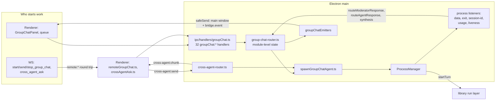
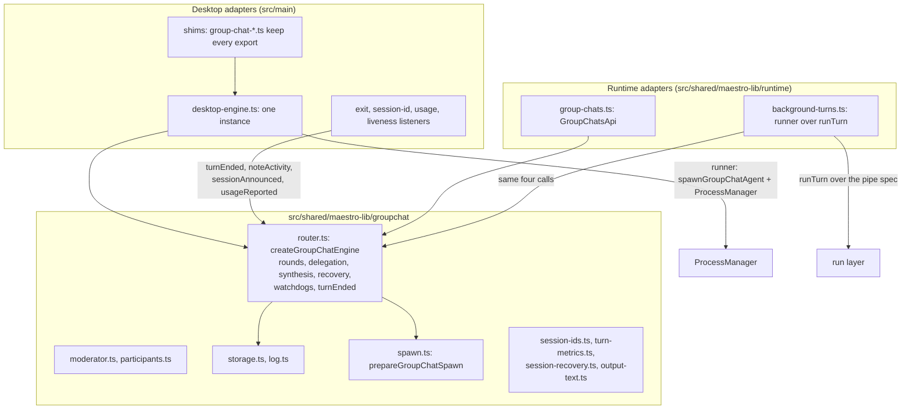
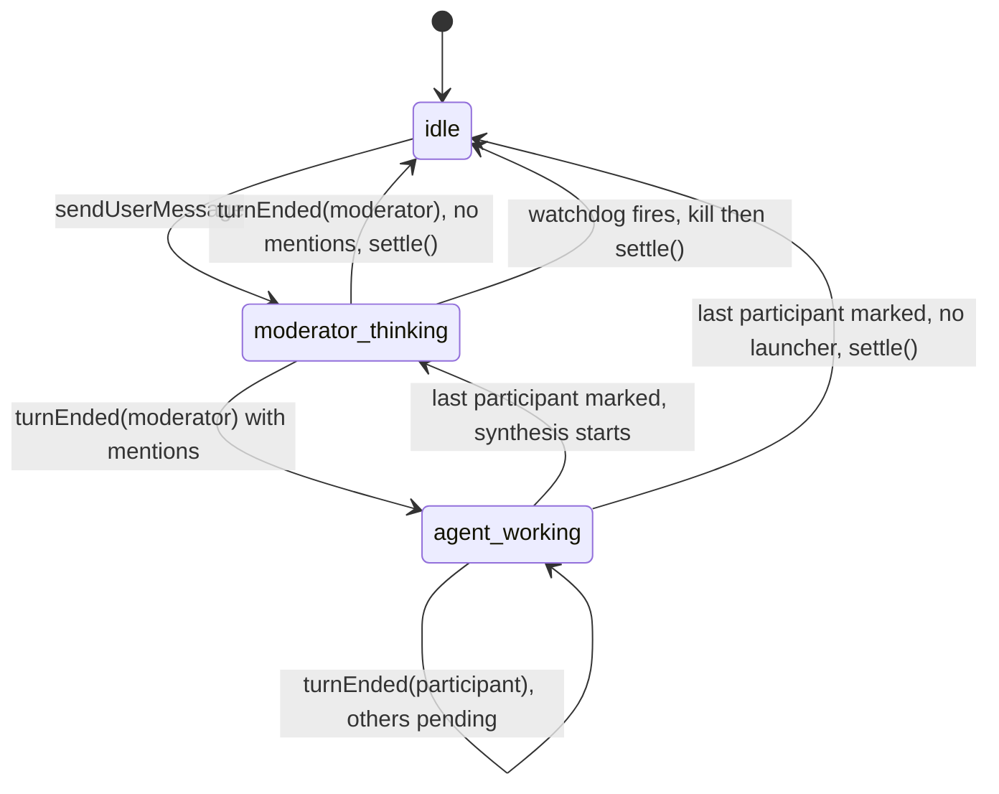
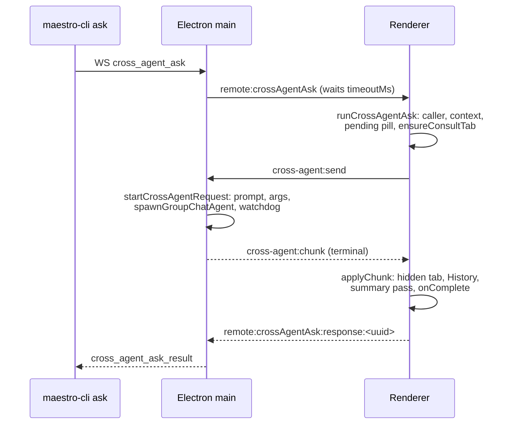

# Maestro TUI: headless group chat and consults

| Field      | Value                                                                                                                       |
| ---------- | --------------------------------------------------------------------------------------------------------------------------- |
| Status     | Design. Phase 8, task 1: written before any engine code                                                                     |
| Date       | 2026-10-05                                                                                                                  |
| Covers     | Gaps L7 and L8, GC-1 to GC-5, XM-1 to XM-4, milestone M4                                                                    |
| Implements | `GroupChatsApi` and `ConsultsApi` of `MaestroClient` in process and over `maestro-cli host` (`maestro-tui-client-api.md` 5) |
| Surveyed   | `maestro-tui` at `5a466aad5`: `src/main/group-chat/`, `src/main/cross-agent/`, the process listeners, the WS bridge         |

Names from other documents: `req-Dn` and `Ln` are in `Plans/maestro-tui-requirements.md`, `RTn` in `Plans/maestro-tui-runtime.md`, `lib-Dn` in `Plans/maestro-lib-decisions.md`. This document adds couplings `C1` to `C16` (section 2), behaviors to keep `B1` to `B22` (section 3), findings `F1` to `F16` (section 4), decisions `GD1` to `GD25` (section 11), waits `W1` to `W9` (section 9), risks `GR1` to `GR7` (section 12), and open questions `GQ1` to `GQ5` (section 13).

The rule from `maestro-lib-decisions.md` holds here: a library move is a refactor, so it reproduces what the desktop does. Where this phase changes behavior on purpose, section 11 says so and states the risk. The two things the ground rules single out are kept: group chat decides a turn by "did any text come back" (B1), and a consult by "exit 0 plus text" (B17).

---

## 1. One engine, desktop only

Group chat runs in Electron main and nowhere else. A TUI attached to a desktop drives it over the bridge; a headless runtime answers every group chat and consult call with a refusal (`runtime/client.ts:221-233`, `runtime/server-requests.ts:506-518`).



Three facts shape everything below:

1. **The process is already the library's.** `spawnGroupChatAgent` ends in `processManager.spawn` (`spawnGroupChatAgent.ts:245-263`), and `ProcessManager` starts every pipe-backed agent through `startTurn` (`ChildProcessSpawner.ts:417`). What the desktop keeps is the launch assembly and the completion rule (`maestro-lib-decisions.md`, "Remaining callers").
2. **Turn progression is a side effect of the exit listener.** Nothing in the router waits for a turn. The moderator's and every participant's next step runs when `exit-listener.ts` sees the process go (moderator branch 139-277, participant branch 285-550).
3. **A remote caller goes through the renderer.** `start_group_chat`, `send_group_chat_message`, `stop_group_chat`, the two reads, and `cross_agent_ask` all ask the renderer and wait for its answer (`web-server/callbacks/groupChatCallbacks.ts`, `commandCallbacks.ts:164-195`). A headless host has no renderer, so each of these needs a library implementation, not a port of the hop.

---

## 2. Electron couplings

Each row is what the group chat or consult code reaches outside itself for, and what replaces it. "Port" is an interface the library engine takes; "desktop adapter" keeps today's wiring; "runtime adapter" is the headless one.

| ID  | Coupling                 | Where today                                                                                                                                                                                                                                                                           | Port                                                          | Desktop adapter                                                                                      | Runtime adapter                                                                                        |
| --- | ------------------------ | ------------------------------------------------------------------------------------------------------------------------------------------------------------------------------------------------------------------------------------------------------------------------------------- | ------------------------------------------------------------- | ---------------------------------------------------------------------------------------------------- | ------------------------------------------------------------------------------------------------------ |
| C1  | Storage root             | `group-chat-storage.ts`: `app.getPath('userData')` and an `electron-store` named `maestro-bootstrap` for `customSyncPath` (imports 14-15, store 38-41, root 125-134), re-read on every call                                                                                           | `groupChatsDir(): string`                                     | `join(customSyncPath \|\| app.getPath('userData'), 'group-chats')`, re-read per call, as now         | `paths.groupChatsDir` from `resolveMaestroPaths` (RT: never `app.getPath`)                             |
| C2  | UI updates               | `groupChatEmitters` (`ipc/handlers/groupChat.ts:127-143`), filled at registration (1189-1330), sent by `createSafeSend(getMainWindow)` to the main window and `broadcastBridgeEvent` to every WS client. The router imports it from the IPC module, which imports the router: a cycle | `GroupChatEventSink` (ten methods, section 5.3)               | `groupChatEmitters`, moved to `src/main/group-chat/emitters.ts` (GD9)                                | Bus `groupChat` events; the server turns them back into `groupChat:*` frames                           |
| C3  | Turn end                 | `exit-listener.ts`: moderator branch 139-277, participant branch 285-550                                                                                                                                                                                                              | `turnEnded(end)` on the engine (GD4)                          | The exit listener extracts the text as now, then calls `turnEnded`                                   | The runner calls `turnEnded` from `CompletedTurn`                                                      |
| C4  | Turn output              | `data-listener.ts`: `data` into `output-buffer.ts` (147-199); `raw-stdout` to `emitParticipantLiveOutput` (135-145)                                                                                                                                                                   | `liveOutput(processId, chunk)`                                | Buffer stays desktop-side (it is the desktop's text extraction); live output goes through the engine | The runner forwards parsed text                                                                        |
| C5  | Liveness                 | `group-chat-liveness-listener.ts:24-34` calls `noteGroupChatActivity` on `AGENT_LIVENESS_EVENTS` plus `raw-stdout`                                                                                                                                                                    | `noteActivity(processId)`                                     | The liveness listener calls it                                                                       | The runner calls it on every parsed event                                                              |
| C6  | Provider session id      | `session-id-listener.ts:32-78`: participant `agentSessionId`, moderator `moderatorAgentSessionId`, plus their emits                                                                                                                                                                   | `sessionAnnounced(processId, id)`                             | The session-id listener calls it                                                                     | The runner calls it once, before `turnEnded`                                                           |
| C7  | Usage                    | `usage-listener.ts:52-133`: `recordGroupChatTurnUsage`, participant cost and context, `emitModeratorUsage`                                                                                                                                                                            | `usageReported(processId, usage)`                             | The usage listener calls it; the computation moves into the engine                                   | The runner reports the turn's usage once, before `turnEnded`                                           |
| C8  | Agent lookup             | Six module setters (`setGetSessionsCallback`, `setGetCustomEnvVarsCallback`, `setGetAgentConfigCallback`, `setGetModeratorSettingsCallback`, `setSshStore`, `setGetCustomShellPathCallback`), wired in `src/main/ipc/bootstrap/index.ts:444-468` (F1)                                 | `GroupChatAgentDirectory` (section 5.3)                       | The setters stay and fill the adapter, so bootstrap does not change                                  | Repository agents, live busy state, agent configs, settings                                            |
| C9  | Process and provider     | `IProcessManager` (`group-chat-moderator.ts:22-54`: `spawn`, `write`, `kill`) and `AgentDetector.getAgent`, passed per call as optional `(processManager, agentDetector)`                                                                                                             | `GroupChatLauncher` = runner + `resolveAgent`, per call (GD3) | `spawnGroupChatAgent` + `ProcessManager`; `AgentDetector`                                            | `runTurn` over the extracted pipe spec (GD7); the library's provider definitions plus the binary probe |
| C10 | Prompts                  | `getPrompt` from `prompt-manager` (Electron `app` paths): moderator system and synthesis, participant request, continuation, recovery                                                                                                                                                 | `prompts.get(id)`                                             | `getPrompt`                                                                                          | `createPromptLoaderFor` (the loader chat turns use)                                                    |
| C11 | Power                    | `powerManager` reason `groupchat:<id>`, added per round, released by `settleGroupChatToIdle` and four other sites                                                                                                                                                                     | `power.block` / `power.unblock`                               | `powerManager`                                                                                       | No-op: a headless host has no sleep blocker                                                            |
| C12 | Turn timing              | `beginSleepAwareSpan` (`utils/sleep-tracker.ts`, fed by Electron `powerMonitor` in `main/index.ts`) through `group-chat-turn-metrics.ts`                                                                                                                                              | `spans.begin()` / `spans.elapsedMs()`                         | `sleep-tracker`                                                                                      | `createSleepTracker` from `src/shared/sleepTracking.ts`, never fed: wall clock                         |
| C13 | Claude spawn mode        | `resolveClaudeSpawnMode` (main wrapper; pulls `electron-store` through `claude-usage-startup`) and `ensureRemoteMaestroPProbed`                                                                                                                                                       | `claudeSpawnDeps` on the launcher                             | The main wrapper and probe                                                                           | `createStandaloneClaudeSpawnCoreDeps`, as `runAgentTurn` uses                                          |
| C14 | `!autorun` from a chat   | The router emits `autoRunTriggered`; the renderer's batch runner runs it and calls `groupChat:reportAutoRunComplete` (`groupChat.ts:762-828`), which repeats the exit listener's mark-then-synthesize                                                                                 | `GroupChatAutoRunPort` (GD12)                                 | Emit to the renderer, as now; the IPC handler calls `autoRunCompleted`                               | The runtime Auto Run service                                                                           |
| C15 | Remote control of a chat | WS `start/send/stop_group_chat`, `get_group_chats`, `get_group_chat_state` go main, renderer, main (`groupChatCallbacks.ts`, `renderer/services/remoteGroupChat.ts:67-148`)                                                                                                           | Library service methods                                       | Unchanged until M5                                                                                   | `runtime/group-chats.ts` implements them (GD13)                                                        |
| C16 | Consult bookkeeping      | `maestro-cli ask`: WS, main, renderer (`runCrossAgentAsk`), main (`cross-agent:send`), renderer (`cross-agent:chunk`), main, WS (section 7.1)                                                                                                                                         | Consult tab store, history, runner (sections 7.2, 7.4)        | The renderer keeps the hidden tab until M5 (GD16); the process half moves                            | The repository writes the hidden tab; no renderer                                                      |

Logging and crash reports already have a seam (`src/shared/maestro-lib/host.ts`: `logger`, `captureException`), so `utils/logger` and `utils/sentry` imports become `../host` imports with no port.

---

## 3. Behaviors to keep

Every row is current desktop behavior. The library engine reproduces each one on both surfaces unless section 11 lists a deliberate change.

| ID  | Behavior                                                                                                                                                                                           | Where today                                                     |
| --- | -------------------------------------------------------------------------------------------------------------------------------------------------------------------------------------------------- | --------------------------------------------------------------- |
| B1  | **A participant that returned text has responded, whatever its exit code.** A non-zero exit, a crash, or a kill after text: the text is logged and shown as the reply                              | `exit-listener.ts:476-496`                                      |
| B2  | A participant with no text (empty parse, or no output at all) is marked done silently: no log line, no history entry. Synthesis proceeds without it                                                | `exit-listener.ts:491-496, 539-546`                             |
| B3  | A moderator turn with no visible text posts "Moderator produced no visible output" (or "exited without producing output") and goes idle                                                            | `exit-listener.ts:219-273`                                      |
| B4  | Synthesis runs when the LAST pending participant is marked; its output routes through the moderator path like any moderator turn and is recorded as `synthesis`                                    | `markParticipantResponded`, `spawnModeratorSynthesis`           |
| B5  | Session recovery: a participant whose output says its session is gone is respawned once with a fresh session (`-recovery-` id) and is not marked until the respawn ends                            | `exit-listener.ts:383-458`, `session-recovery.ts`               |
| B6  | A user message that addresses participants requires the moderator to hand off to every one of them; one correction turn, then a system error                                                       | `pendingExplicitParticipantHandoffs`, router 1668-1740          |
| B7  | `@mentions` from the user or the moderator auto-add matching agents, conservatively (exact, legacy, or safe-normalized; a tie refuses), never one the user just removed                            | `resolveSessionToAutoAdd`, `wasParticipantRecentlyRemoved`      |
| B8  | With `requireIdleParticipants` (default on), a delegation to a busy agent waits, polling every 5 s for up to 15 min, and the room says so once per turn                                            | `queueDelegationUntilAgentIsFree`                               |
| B9  | Silence budgets: 10 min idle, 30 min hard cap, for the moderator and each participant. A budget that fires kills the process by its FULL id before it reports                                      | router 249-529                                                  |
| B10 | The moderator always runs read-only in the home directory; participants inherit the message's read-only flag and run in their agent's cwd (home when unknown)                                      | `routeUserMessage`, `deliverToParticipant`                      |
| B11 | Gemini's moderator gets `--no-sandbox` only when its read-only mode is CLI-enforced                                                                                                                | router 1150, 2449                                               |
| B12 | A resumed participant (stored `agentSessionId` and a provider with resume args) gets the slim continuation prompt                                                                                  | router 1957-1961                                                |
| B13 | `!autorun` directives are stripped from the logged text; an `!autorun` target is never also spawned as an ordinary mention                                                                         | `extractAutoRunDirectives`, router 1855-1861                    |
| B14 | History entries: `user` per message, then `delegation`, `synthesis`, or `response` per moderator turn, `response` per participant reply, `error` on a failed start or a refused handoff            | `recordGroupChatHistory` call sites                             |
| B15 | Process ids: `group-chat-<id>-moderator-<ts>`, `group-chat-<id>-participant-<name>-<ts>`, `...-<name>-recovery-<ts>`, `cross-agent-<requestId>`                                                    | router 1011, 1972, 2612; `cross-agent-router.ts:416`            |
| B16 | maestro-p gets `--max-wait` equal to the silence budget; SSH is wrapped or the spawn throws (never a local fallback)                                                                               | `spawnGroupChatAgent.ts`                                        |
| B17 | **A consult succeeds on exit 0 plus text.** A non-zero exit is an error naming the code; exit 0 with no text is "produced no visible output"                                                       | `cross-agent-router.ts:466-499`                                 |
| B18 | A consult's provider session id is handed back only on success; the next consult from the same pairing resumes it                                                                                  | `cross-agent-router.ts:466`, `useCrossAgentDispatch.ts:737-741` |
| B19 | A consult is read-only unless `crossAgentMentionsWritable` is on (default off); `ask` follows the same setting (F12)                                                                               | `ipc/handlers/cross-agent.ts:140`                               |
| B20 | Stop on a source agent cancels the consults it fanned out; a cancelled consult settles as `canceled`, not `error`                                                                                  | `cancelCrossAgentRequestsForSource`                             |
| B21 | Storage layout `<root>/group-chats/<id>/` with `metadata.json` (atomic, serialized per chat), `chat.log` (`TS\|FROM\|CONTENT[\|readOnly][\|images:...]`), `images/`, `history.jsonl`, `queue.json` | `group-chat-storage.ts`, `group-chat-log.ts`                    |
| B22 | A chat takes one round at a time from a remote caller: `send` while busy is refused, not queued                                                                                                    | `remoteGroupChat.ts:122-136`                                    |

---

## 4. Findings

Found while mapping. "Kept" means the move reproduces it and the item is a separate fix. "Fixed" points to the decision that changes it.

| ID  | Finding                                                                                                                                                                                                                                                  | Disposition                       |
| --- | -------------------------------------------------------------------------------------------------------------------------------------------------------------------------------------------------------------------------------------------------------- | --------------------------------- |
| F1  | The setters are no longer wired in `src/main/index.ts`: they moved to `src/main/ipc/bootstrap/index.ts:444-468`. The router's comments still say `index.ts`                                                                                              | Comments corrected in the move    |
| F2  | `src/shared/maestro-lib/groupchat/` already exists (the client model, `chat.ts`). A sibling `groupChat/` is a different directory to git on Linux and the same one on macOS and Windows                                                                  | GD1                               |
| F3  | Stop does not stop a running moderator. `killModerator` kills the session id PREFIX (`group-chat-moderator.ts:133, 193-201`); `ProcessManager.kill` matches exact keys. The moderator finishes and its output can still dispatch participants after Stop | Fixed, GD23 (a)                   |
| F4  | The exit listener's three idle emits (`exit-listener.ts:231, 253, 271`) do not release the `groupchat:<id>` power block, so the machine stays awake until a later settle of the same chat                                                                | Fixed, GD23 (b)                   |
| F5  | A failed moderator or synthesis spawn leaves its watchdog armed (router 1208-1218, 2502-2518): ten minutes later the room gets a spurious "went silent" line and an idle emit                                                                            | Fixed, GD23 (c)                   |
| F6  | A spawn that returns `{ success: false }` without throwing (unusable cwd) is ignored: the participant stays pending until its 10 minute budget fires                                                                                                     | Fixed, GD23 (d)                   |
| F7  | The participant branch loads the chat outside its `try` (`exit-listener.ts:384`): an I/O error there leaves the participant unmarked until the watchdog                                                                                                  | Fixed, GD23 (e)                   |
| F8  | An async spawn failure puts `[error] <message>` into the desktop buffer, which is then routed as the participant's reply or the moderator's answer                                                                                                       | Kept (desktop extractor)          |
| F9  | State is keyed by chat and participant name, not by process: a late exit from a killed process can mark or settle the next turn's state                                                                                                                  | Kept                              |
| F10 | Recovery matches `/\bsession not found\b/i` over the reply text itself, so a reply that mentions the phrase is discarded and respawned                                                                                                                   | Kept                              |
| F11 | `customSyncPath` is not validated for group chats (the desktop stores validate it with `syncPathRejection`); `metadata.json` stores absolute `logPath` and `imagesDir`, which every reader uses, so a moved data dir points at the old files             | Kept                              |
| F12 | `ask` honors `crossAgentMentionsWritable` like a typed mention, which `maestro-tui-client-api.md` 4 words as "there is no writable consult". The client offers no option; the host's setting still applies                                               | Kept, B19                         |
| F13 | No consult timeout cancels anything: the CLI's, the WS server's, and the renderer bridge's timeouts all leave the process running for up to 10 min idle, 30 min total, and it still writes the hidden tab and History                                    | Kept on desktop; headless GD19    |
| F14 | `withContext` reads the caller's ACTIVE tab, not `fromTabId`                                                                                                                                                                                             | Kept on desktop; headless GD17    |
| F15 | The WS `send_group_chat_message` path calls `sendToModerator` directly and skips main's queue; `remoteGroupChat.ts:118-121` still describes the old renderer queue                                                                                       | Kept (B22)                        |
| F16 | `resetParticipantContext` builds a summary with `groomContext` and then discards it (`groupChat.ts:997-1047`)                                                                                                                                            | Kept (desktop handler, not moved) |

---

## 5. The library engine

### 5.1 Shape



The engine owns rounds and their state. It imports no `fs` outside `storage.ts` and `log.ts`, nothing from `src/main`, `src/renderer`, or `src/cli`, and no Electron (lint rule `shared-boundary/no-shared-to-main-imports`).

### 5.2 Files

| File (under `src/shared/maestro-lib/`)    | Holds                                                                                                                  | Comes from                                                                                                    | Task |
| ----------------------------------------- | ---------------------------------------------------------------------------------------------------------------------- | ------------------------------------------------------------------------------------------------------------- | ---- |
| `groupchat/chat.ts`                       | The client model (exists, unchanged)                                                                                   | Phase 4                                                                                                       | none |
| `groupchat/types.ts`                      | `GroupChat`, `GroupChatParticipant` (the storage shapes, as today), `GroupChatSessionInfo`, ports, `GroupChatTurnEnd`  | `group-chat-storage.ts` types, router 102-147                                                                 | 2, 3 |
| `groupchat/storage.ts`                    | `createGroupChatStore(options)`: every storage function, its keyed write queue, history                                | `src/main/group-chat/group-chat-storage.ts`                                                                   | 2    |
| `groupchat/log.ts`                        | `appendToLog`, `readLog`, `saveImage`, escaping                                                                        | `group-chat-log.ts` (already Electron-free)                                                                   | 2    |
| `groupchat/session-ids.ts`                | The id shapes of B15 and their parsers                                                                                 | `src/main/constants.ts` 28-51, `group-chat/session-parser.ts`                                                 | 3    |
| `groupchat/output-text.ts`                | `extractTextFromStreamJson`                                                                                            | `group-chat/output-parser.ts` (a wrapper over the library parsers)                                            | 3    |
| `groupchat/spawn.ts`                      | `prepareGroupChatSpawn` (SSH wrap, Claude mode, Windows config, turn clock) and `getWindowsSpawnConfig`                | `spawnGroupChatAgent.ts` minus `processManager.spawn`; `group-chat-config.ts` with the shell path as an input | 3    |
| `groupchat/turn-metrics.ts`               | Per-turn clock and usage, over the `spans` port                                                                        | `group-chat-turn-metrics.ts`                                                                                  | 3    |
| `groupchat/session-recovery.ts`           | `detectSessionNotFoundError`, the recovery decision                                                                    | `group-chat/session-recovery.ts`                                                                              | 3    |
| `groupchat/moderator.ts`                  | Moderator registry (prefix per chat), the moderator prompt and turn builders                                           | `group-chat-moderator.ts`, the moderator halves of `routeUserMessage` and `spawnModeratorSynthesis`           | 3    |
| `groupchat/participants.ts`               | Add, remove, active participant processes, the recently-removed guard                                                  | `group-chat-agent.ts`                                                                                         | 3    |
| `groupchat/router.ts`                     | `createGroupChatEngine`: routing, delegation queue, watchdogs, synthesis, recovery, and the progression calls of 5.5   | `group-chat-router.ts`, the group chat branches of the five listeners                                         | 3    |
| `groupchat/autorun-summary.ts`            | `groupChatAutoRunSummary` (the "Auto Run complete: N/M tasks" line)                                                    | `renderer/hooks/batch/useBatchHandlers.ts:577-579`                                                            | 3    |
| `agents/consult-prompt.ts`                | `buildCrossAgentPrompt`, `serializeTranscript`, the cwd grant, `crossAgentTerminationNote`, `buildConsultHistoryEntry` | `cross-agent-router.ts:217-295`, `useCrossAgentDispatch.ts:140-168, 367-430`                                  | 4    |
| `agents/consult.ts`                       | `createConsultService(deps)`: one consult turn, its registry, cancellation by source, the completion rule              | `cross-agent-router.ts:296-653`                                                                               | 4    |
| `agents/rules.ts`, `agents/repository.ts` | The hidden consult tab: find or create by `consultOrigin`, record an exchange, never raise a tab event or `hasUnread`  | `useCrossAgentDispatch.ts:230-304, 719-743` (`ensureConsultTab`, `applyChunk`)                                | 4    |
| `run/pipe-spawn.ts`                       | `planPipeSpawn`: a spawn config (no images) to `{ command, args, cwd, env, stdin, shell }`                             | `ChildProcessSpawner.ts:96-390`, the non-image path                                                           | 5    |
| `runtime/background-turns.ts`             | The runtime runner for group chat and consult turns                                                                    | new                                                                                                           | 5    |
| `runtime/group-chats.ts`                  | `GroupChatsApi` in process                                                                                             | new, plus the pure checks of `remoteGroupChat.ts`                                                             | 5    |
| `runtime/consults.ts`                     | `ConsultsApi` in process: context, order, timeouts, over the consult service and the consult tab commands              | new, over `agents/consult.ts`                                                                                 | 5    |

`src/main` keeps a file at every current path. Each becomes a shim: a re-export, or a function bound to the desktop engine instance (`src/main/group-chat/desktop-engine.ts`), with the same name and signature. `output-buffer.ts` stays desktop-side unchanged: it is the desktop's half of text extraction (lib-D3).

### 5.3 Ports

Every port may answer synchronously or with a promise; the engine awaits each answer.

```ts
// groupchat/types.ts (sketch)

/** One spawn as the router describes it: today's SpawnGroupChatAgentConfig without the process manager. */
export interface GroupChatSpawn {
	processId: string; // B15
	providerId: string;
	agent: AgentConfig;
	command?: string;
	args: string[];
	cwd: string;
	prompt?: string;
	customEnvVars?: Record<string, string>;
	agentConfigValues?: Record<string, unknown>;
	sshRemoteConfig?: AgentSshRemoteConfig | null;
	tokenMode?: ClaudeTokenMode;
	maestroPPath?: string;
	readOnlyMode?: boolean;
	maxWaitSeconds?: number;
	debugLabel?: string;
}

export interface GroupChatTurnRunner {
	/** Start one turn. `success: false` is a refusal: nothing runs and no end will be reported. */
	start(spawn: GroupChatSpawn): Promise<{ success: boolean; pid?: number; error?: string }>;
	/** Stop a turn by its full process id (B9). Unknown ids are ignored. */
	stop(processId: string): void;
}

/** Replaces the router's optional (processManager, agentDetector) pair. Absent: no turn starts (GD3). */
export interface GroupChatLauncher {
	runner: GroupChatTurnRunner;
	resolveAgent(providerId: string): Promise<AgentConfig | null>;
}

/** The six setters as one port (C8). */
export interface GroupChatAgentDirectory {
	list(): GroupChatSessionInfo[];
	providerConfig(providerId: string): Record<string, unknown>;
	providerEnvVars(providerId: string): Record<string, string> | undefined;
	conductorProfile(): string;
	customShellPath(): string | undefined;
	sshStore(): SshRemoteSettingsStore | null;
}

/** The ten emitters (C2), names without the `emit` prefix. */
export interface GroupChatEventSink {
	message(chatId: string, message: GroupChatMessage): void;
	stateChange(chatId: string, state: GroupChatState): void;
	participantsChanged(chatId: string, participants: GroupChatParticipant[]): void;
	moderatorUsage(chatId: string, usage: ModeratorUsage): void;
	historyEntry(chatId: string, entry: GroupChatHistoryEntry): void;
	participantState(chatId: string, name: string, state: 'idle' | 'working'): void;
	moderatorSessionIdChanged(chatId: string, sessionId: string): void;
	autoRunTriggered(chatId: string, name: string, filename?: string): void;
	autoRunBatchComplete(chatId: string, name: string): void;
	participantLiveOutput(chatId: string, name: string, chunk: string): void;
}

export interface GroupChatAutoRunPort {
	/** Start the participant's agent's Auto Run (every document, or `filename`). False: it did not start. */
	start(
		chatId: string,
		participant: GroupChatSessionInfo,
		name: string,
		filename?: string
	): MaybePromise<boolean>;
	/** Stop every run this chat started (GC-3). */
	stop(chatId: string): Promise<void>;
}

export interface GroupChatEngineOptions {
	store: GroupChatStore; // storage.ts
	events: GroupChatEventSink;
	agents: GroupChatAgentDirectory;
	prompts: { get(id: GroupChatPromptId): string };
	power: { block(reason: string): void; unblock(reason: string): void };
	spans: { begin(): SleepAwareSpan; elapsedMs(span: SleepAwareSpan): number };
	autoRun?: GroupChatAutoRunPort;
	/** Desktop only: Copilot writes per-turn usage to disk, not stdout (C7, W6). */
	usageAfterExit?(chatId: string, participantName: string): Promise<void>;
	/** Who reports a turn's end (GD4). */
	progression: 'external' | 'runner';
	clock?: { now(): number };
}
```

`GroupChatStore` options: `groupChatsDir(): string` (C1), `newId?(): string` (default `generateUUID`; the desktop passes `uuidv4` so its tests' `uuid` mock still applies), `now?(): number`, and `beforeWrite?(): void`, which throws to refuse a write (the runtime passes its fence, GD21).

### 5.4 The engine API

The engine exposes today's router, moderator, and participant functions under their current names, so each shim is one line. Where a function took `(processManager?, agentDetector?)` it takes `launcher?: GroupChatLauncher`; the desktop shim builds the launcher from the two arguments it was given, and keeps the one partial case (`processManager` without `agentDetector` throws `AgentDetector not available`, as `routeUserMessage` does now).

| Group        | Methods                                                                                                                                                                                                                            |
| ------------ | ---------------------------------------------------------------------------------------------------------------------------------------------------------------------------------------------------------------------------------- |
| Chat         | `createChat`, `deleteChat`, `archiveChat`, `renameChat`, `updateChat` (moderator change kills and re-registers), `stopAll` (GC-3)                                                                                                  |
| Moderator    | `spawnModerator` (registers the prefix; no process, as today), `killModerator`, `isModeratorActive`, `getModeratorSessionId`, `sendUserMessage` (re-registers when inactive, then routes)                                          |
| Routing      | `routeUserMessage`, `routeModeratorResponse`, `routeAgentResponse`, `spawnModeratorSynthesis`, `respawnParticipantWithRecovery`                                                                                                    |
| Participants | `addParticipant`, `removeParticipant`, `markParticipantResponded`, `clearPendingParticipants`, `getGroupChatReadOnlyState`                                                                                                         |
| Progression  | `turnEnded(end, launcher?)`, `noteActivity(processId)`, `sessionAnnounced(processId, id)`, `usageReported(processId, usage, contextWindow?)`, `liveOutput(processId, chunk)`, `autoRunCompleted(chatId, name, summary, launcher?)` |
| Queries      | `chatState(chatId)` (the last `stateChange` per chat, what `emitStateChange` records in `lastModeratorState` today), `activeRounds()`                                                                                              |

### 5.5 Progression

A round, as both surfaces run it:



`turnEnded(end)` is the one entry for a finished turn:

```ts
export interface GroupChatTurnEnd {
	processId: string; // B15; the engine parses role, chat, and participant from it
	/** What came back, read by the surface's own extractor. '' when nothing did. */
	text: string;
	/** What session-not-found detection reads (B5). Desktop: the buffer. Runtime: the answer plus the stdout and stderr tails. */
	rawOutput?: string;
	/** For logs only. B1: the progression never reads it. */
	exitCode?: number | null;
}
```

Moderator id: clear the watchdog, then route `text` through `routeModeratorResponse` when it is non-blank, else B3; an error posts "Failed to process moderator response" and settles (GD23 b). Participant id: participant state idle, clear its active process, `usageAfterExit` (desktop), then B5 when `rawOutput` asks for recovery, else B1 and B2: route the text when there is any, mark, and start synthesis when that was the last one. The body is the exit listener's two branches moved verbatim, plus GD23.

What each surface feeds in:

| Input              | Desktop (`progression: 'external'`)                                                  | Runtime (`progression: 'runner'`)                       |
| ------------------ | ------------------------------------------------------------------------------------ | ------------------------------------------------------- |
| `turnEnded`        | `exit-listener.ts`: buffer, `extractTextFromStreamJson(buffer, provider)`, then call | `background-turns.ts`: `CompletedTurn.answerText ?? ''` |
| `noteActivity`     | `group-chat-liveness-listener.ts`                                                    | Each parsed event                                       |
| `sessionAnnounced` | `session-id-listener.ts`                                                             | The capture's session id, once, before `turnEnded`      |
| `usageReported`    | `usage-listener.ts`, per usage event, as now                                         | The capture's usage, once, before `turnEnded`           |
| `liveOutput`       | `data-listener.ts` on `raw-stdout`                                                   | Parsed text events                                      |
| `autoRunCompleted` | `groupChat:reportAutoRunComplete`                                                    | The runtime Auto Run port, when the run ends            |

The listeners keep their prefix checks and their domain containment (an unrecognized `group-chat-*` id is dropped, `exit-listener.ts:552-571`), and lose their bodies to the engine. The usage computation (participant cost, context, the moderator's -1 sentinel for accumulated values) moves from `usage-listener.ts` into `usageReported`, so both surfaces compute it once.

### 5.6 Text: why the surfaces read it differently

Desktop text is `StdoutHandler`'s `data` (the result text, or the streamed text at exit, `StdoutHandler.ts:820-851`, `ExitHandler.ts:215-240`), buffered and re-read by `extractTextFromStreamJson`. Reproducing that headless would mean porting `StdoutHandler` into the library, which lib-D3 rules out. The runtime reads `CompletedTurn.answerText` (`TurnCapture`: the result text, else the streamed partial text, `turn-capture.ts:122-124`), the answer every other library caller records. Both are "result, else streamed text", and both are independent of the exit code, so B1 holds on both. The known differences (Codex, whose `StdoutHandler` path is separate; an answer whose first line starts with `{`) are risk GR1, covered by a parity test over the recorded provider fixtures.

### 5.7 Desktop wiring after the move

| Today                                              | After                                                                                                                                       |
| -------------------------------------------------- | ------------------------------------------------------------------------------------------------------------------------------------------- |
| Module state in five files                         | One engine in `desktop-engine.ts`, built at module load with the desktop adapters                                                           |
| `groupChatEmitters` in `ipc/handlers/groupChat.ts` | Same object, defined in `src/main/group-chat/emitters.ts`; the IPC module re-exports it and still fills it. The router-to-IPC cycle is gone |
| Six setters in `ipc/bootstrap/index.ts`            | Unchanged calls; each fills a field of the desktop directory adapter                                                                        |
| `spawnGroupChatAgent(config)`                      | `prepareGroupChatSpawn(config)` then `processManager.spawn(...)`; same config, same order                                                   |
| Exit, session-id, usage, liveness listeners        | Same recognition; the bodies call the engine (5.5)                                                                                          |
| `registerGroupChatHandlers`                        | Unchanged; the handlers import the same names                                                                                               |
| `group-chat-queue.ts`                              | Stays in main (GD14); `getGroupChatDir` comes from the storage shim                                                                         |

---

## 6. The runtime: group chat headless

`runtime/group-chats.ts` builds one engine per runtime with `progression: 'runner'` and these adapters:

- **Store.** `createGroupChatStore({ groupChatsDir: () => paths.groupChatsDir, beforeWrite: fence })`. The runtime refuses a synced data dir by default (RT, risk R3 there), so the root is the data dir.
- **Directory.** `list()` maps `repository.listAgents()` through `toGroupChatSessionInfo` (the pure half of `ipc/bootstrap/session-mention-mapper.ts`, moved so both adapters use it). `isBusy` is the runtime's own live answer: a chat turn in flight on any of the agent's tabs, or `autoRun.holds(agentId)`. That is the desktop's `isAgentBusy` rule (tab processes plus CLI activity); group chat and consult processes do not count (GD20). Provider config and env come from `agentConfigsFile`, the conductor profile and `customShellPath` from `settingsFile`, SSH from `createSshRemoteStore(paths)`, each read per call so a desktop edit applies to the next turn.
- **Launcher.** `resolveAgent(providerId)` builds the same `AgentConfig` shape `AgentDetector.getAgent` answers from `getAgentDefinition`, the custom path in the provider config, and the binary probe `loadTurnContext` already runs (lifted into one function both call). The runner is 6.1.
- **Prompts.** `createPromptLoaderFor({ userDataDir })`, the loader chat turns use. A prompt that does not load throws, as `getPrompt` does for an unknown or uninitialized id (`prompt-manager.ts:228-236`), so the turn fails through the engine's existing spawn-failure path instead of running without its system prompt.
- **Power and spans.** No-op; an unfed `createSleepTracker`.
- **Auto Run.** GD12.
- **Events.** 6.2.

### 6.1 The runner

`runtime/background-turns.ts` serves group chat and consult turns:

1. `prepareGroupChatSpawn(spawn)` with `createStandaloneClaudeSpawnCoreDeps`: the same SSH wrap, Claude decision, and Windows config the desktop applies.
2. `planPipeSpawn(config)` (GD7): the exact `{ command, args, cwd, env, stdin, shell }` `ChildProcessSpawner` would start for that config.
3. `runTurn(spec, { agentId: providerId, sessionId: processId })`: the buffered form of `startTurn` with `TurnCapture` and `resolveTurnOutcome`.
4. Register the turn in the process registry under owner `group-chat:<chatId>` or `consult:<requestId>` (GD20), so shutdown and the fence stop it.
5. Each parsed event: `noteActivity`, and `liveOutput` for text. At the end: `sessionAnnounced`, `usageReported`, then `turnEnded`, in that order, so the next spawn (synthesis, a follow-up delegation) reads the stored session id.

A test seam replaces step 3 (`RuntimeDeps.backgroundTurns.runTurn`), the way `deps.turns.runAgentTurn` is replaced in `runtime/__tests__/turns.test.ts`.

### 6.2 Events and frames

The runtime sink maps four emitters onto the client's existing `groupChat` bus event (`client/types.ts:584`):

| Emitter               | Bus event (`GroupChatEvent`)                             | Frame the server sends                                   |
| --------------------- | -------------------------------------------------------- | -------------------------------------------------------- |
| `message`             | `{ kind: 'message', line: parseGroupChatLine(message) }` | `bridge.event` `groupChat:message` `[chatId, message]`   |
| `stateChange`         | `{ kind: 'state', state }`                               | `groupChat:stateChange` `[chatId, state]`                |
| `participantState`    | `{ kind: 'participant', name, working }`                 | `groupChat:participantState` `[chatId, name, state]`     |
| `participantsChanged` | `{ kind: 'participants', participants }`                 | `groupChat:participantsChanged` `[chatId, participants]` |

`server-frames.ts` is the inverse of `parseGroupChatFrame`, so a TUI attached to `maestro-cli host` reads the same events as one attached to a desktop. The other six emitters have no client event and are dropped headless (W4). An event leaves after its write (RT rule): the engine already appends to the log before it emits a message.

### 6.3 Client and server

| Call                | In process (`runtime/client.ts`)                                                                                                                                  | Server (`server-requests.ts`)                                                      |
| ------------------- | ----------------------------------------------------------------------------------------------------------------------------------------------------------------- | ---------------------------------------------------------------------------------- |
| `groupChats.list`   | `store.listGroupChats()`, state from `chatState`                                                                                                                  | `get_group_chats` to `group_chats_list` via `toRemoteGroupChatState`               |
| `groupChats.get`    | Load plus `readLog`                                                                                                                                               | `get_group_chat_state` to `group_chat_state`                                       |
| `groupChats.create` | `planGroupChatStart` (the checks of `startRemoteGroupChat`, moved to `src/shared/groupChatRemote.ts`), `createChat`, `withParticipantMentions`, `sendUserMessage` | `start_group_chat` to `start_group_chat_result`                                    |
| `groupChats.send`   | Refused while `chatState` is not idle (B22), else `sendUserMessage`                                                                                               | `send_group_chat_message` to `send_group_chat_message_result`                      |
| `groupChats.stop`   | `stopAll` plus `autoRun.stop(chatId)`                                                                                                                             | `stop_group_chat` to `stop_group_chat_result`                                      |
| `groupChats.rename` | `renameChat`                                                                                                                                                      | `bridge.invoke` `groupChat:rename`                                                 |
| `groupChats.remove` | `deleteChat`                                                                                                                                                      | `bridge.invoke` `groupChat:delete`                                                 |
| `consults.ask`      | `runtime/consults.ts` (7.4)                                                                                                                                       | `cross_agent_ask` to `cross_agent_ask_result`, waiting as long as the answer takes |

`host status` and the refusal to stop with work in flight count active rounds and consults beside chat turns and Auto Runs (GD24). Shutdown stops rounds and consults before `registry.stopAll()` and drains the group chat store's write queue before releasing the lock.

### 6.4 GC-5: `@participant` in the chat

The engine already gives an addressed participant its due: a user message that `@mentions` participants requires a handoff to each (B6), and one that mentions another agent adds it (B7). What is missing is the composer. The TUI's group chat composer gains the `@` picker its tab composer has (`src/tui/composer/mentions.ts`, over `getAtMentionTrigger` and `spliceMentionLiteral`), fed with the chat's participants and then the agents the moderator could add (non-terminal, not yet in the chat), inserted in mention form (`normalizeMentionName`, `getMentionNameForContext` from `src/shared/group-chat-types.ts`). This is a `src/tui/` change; the "no change to `src/tui/`" clause of task 5 is about the headless wiring of the Phase 4 views, which needs none.

---

## 7. Consults (L8)

### 7.1 The round trip today



Four IPC crossings. Main already builds the prompt, decides read-only, runs the process, and applies the completion rule (B17). The renderer contributes what a store owner must: the hidden consult tab and its resume id, History on the target, the caller's delegation pill, and the request bookkeeping that makes `onComplete` fire exactly once.

### 7.2 What moves

`cross-agent-router.ts` is already dependency-injected (`processManager`, `agentDetector`, `sshStore`, `getTargetSession`, `getAgentConfig`, `getCustomEnvVars`, `writable`, `onChunk`), so it moves nearly as is to `agents/consult.ts` as `createConsultService(deps)`, with the module-level `activeConsults` registry becoming instance state. Two seams change:

- **The launch** reuses `groupchat/spawn.ts`, as it reuses `spawnGroupChatAgent` today.
- **The process** is a runner with a per-turn observer, because a consult waits for its own end rather than riding a global listener: `start(spawn, { onActivity, onSessionId, onEnd })`. The desktop runner is the `ProcessManager` subscription code moved out of the router (`data` into a buffer, the liveness events, `session-id`, `exit`); the runtime runner is 6.1.

The pure parts go to `agents/consult-prompt.ts` and are imported back by the renderer: `buildCrossAgentPrompt`, `serializeTranscript`, the cwd grant, `crossAgentTerminationNote`, `buildConsultHistoryEntry`, and the ask constants (`CROSS_AGENT_ASK_TAB_ID`, the `cli-ask` source) into `src/shared/crossAgentTypes.ts`.

### 7.3 Where each host answers `ask`

| Host                                          | Path after Phase 8                                                                                                                                                 |
| --------------------------------------------- | ------------------------------------------------------------------------------------------------------------------------------------------------------------------ |
| Headless (TUI in process, `maestro-cli host`) | `cross_agent_ask` or `consults.ask` to `runtime/consults.ts` to the consult service to the runner. No renderer exists, and none is asked                           |
| Desktop                                       | `cross-agent:send` runs through the consult service (the desktop's typed mentions and its `ask` both use it). The `remote:crossAgentAsk` hop stays until M5 (GD16) |

The desktop hop stays because the renderer owns the hidden consult tab until L1b (M5). Main writing that tab would race the renderer's debounced flush, which rewrites `maestro-sessions.json` from the renderer's copy: the exact two-writer problem L1b exists to end. The process half is shared now; the bookkeeping half moves when main owns agent state.

### 7.4 The headless consult

`runtime/consults.ts` implements `ConsultsApi.ask`:

1. **Check.** Non-empty question, target exists, not self. Unknown target is `not-found`.
2. **Context.** Without `withContext`, none (a self-contained question). With it, the transcript of `fromTabId` when given, else the caller's active tab (GD17, F14), windowed by `inferContextStrategy` and `selectContextWindow` (`src/shared/crossAgentContext.ts`).
3. **Consult tab.** Find or create the target's hidden tab keyed by `consultOrigin { sourceSessionId: fromAgentId ?? 'cli-ask', sourceTabId: 'cli-ask' }`, named `↩ <source>`, `hidden: true`, `saveToHistory: false`: the desktop's `ask` keying, so a TUI cannot tell a headless host from a desktop (req-D2). A repository command writes it; hidden tabs raise no tab events and are not listed (RT). The question is appended as the user entry.
4. **Order.** Consults sharing a consult tab run one at a time (`createKeyedWriteQueue`, keyed by target and tab); consults to different agents run at once (GD18, XM-4).
5. **Run.** The consult service: read-only unless `crossAgentMentionsWritable` (B19), the 10 and 30 minute budgets, B17.
6. **Record.** The answer, or the error with its termination note, on the consult tab; `agentSessionId` updated only on success (B18); `buildConsultHistoryEntry` on the target through `createHistoryWriter`. The tab's `hasUnread` is never set.
7. **Answer.** `{ answer, agentName }`, or a failure naming why. The caller's `timeoutMs` (clamped 10 s to 1 h) cancels the consult when it expires (GD19, F13). Stop on the source agent's tab cancels every consult it started (`turns.stop` calls `consults.cancelForSource`), as on the desktop (B20).

### 7.5 XM-1 to XM-4

| Req  | Where it lives                                                                                                                                                                   |
| ---- | -------------------------------------------------------------------------------------------------------------------------------------------------------------------------------- |
| XM-1 | `mentions/roster.ts` (done): groups expand to member mentions in the picker; `resolveMentionedTargetSessionIds` never targets a group                                            |
| XM-2 | 7.4 steps 3 and 6: hidden tab, no tab event, no unread, no change to anything the target shows                                                                                   |
| XM-3 | B19 for consults; the explicit delegation (Ctrl-D, `runDelegation`) is the writable path and states what it grants                                                               |
| XM-4 | The TUI composer already asks each planned target (`startConsults` over `plan.targets`); the runtime runs them concurrently (step 4) and each answer settles its own inline item |

---

## 8. What does not change for a desktop user

- Every group chat behaves as before (B1 to B16, B21), except the five fixes of GD23.
- Every `groupChat:*`, `cross-agent:*`, and WS message keeps its name, arguments, and reply.
- The storage layout, the chat log format, the queue, and History are byte-compatible: the same code writes them.
- A typed `@mention` and `maestro-cli ask` against a desktop behave as before (B17 to B20).

---

## 9. What waits

| ID  | Wait                                                                                                   | Why not now                                                                                      |
| --- | ------------------------------------------------------------------------------------------------------ | ------------------------------------------------------------------------------------------------ |
| W1  | The desktop's `ask` without the renderer                                                               | GD16: the renderer owns the hidden tab until M5                                                  |
| W2  | Desktop progression through the runner observer, deleting the exit listener's group chat branches      | The desktop's text extraction is `StdoutHandler` (lib-D3); M5 decides                            |
| W3  | `group-chat-queue.ts` into the library                                                                 | GD14: no library client queues                                                                   |
| W4  | `moderatorUsage`, `historyEntry`, `participantLiveOutput`, `autoRun*`, `queueState` as client events   | No TUI view renders them                                                                         |
| W5  | The consult History summary pass (`enrichConsultDetail`) headless                                      | It is a second model turn; the base entry is complete without it                                 |
| W6  | Copilot's on-disk usage headless (`usageAfterExit`)                                                    | Reads `events.jsonl` through `remote-fs`, a main module; a Copilot participant shows 0% headless |
| W7  | The caller's delegation pill for an agent-initiated `ask` on a headless host                           | A transcript card, not a function; the TUI shows consults inline                                 |
| W8  | One `GroupChat` type (storage's local types and `src/shared/group-chat-types.ts` differ on two fields) | A type migration across preload and renderer is not a move                                       |
| W9  | `rename_group_chat` and `delete_group_chat` messages (G15)                                             | The invoke channels work on both hosts                                                           |

---

## 10. Phase 8 task map

| Task | Delivers                                                                                                                                                                                                                                                                                                                                                     | Tests                                                                                                                                                                                                                                                                                                   |
| ---- | ------------------------------------------------------------------------------------------------------------------------------------------------------------------------------------------------------------------------------------------------------------------------------------------------------------------------------------------------------------ | ------------------------------------------------------------------------------------------------------------------------------------------------------------------------------------------------------------------------------------------------------------------------------------------------------- |
| 2    | `groupchat/storage.ts`, `groupchat/log.ts`, `groupchat/types.ts` (storage shapes); `GROUP_CHATS_DIR_NAME` in `paths/resolve.ts`; shims `group-chat-storage.ts` (Electron root, `uuidv4`) and `group-chat-log.ts`                                                                                                                                             | Move the cases of `src/__tests__/main/group-chat/group-chat-storage.test.ts` and `group-chat-log.test.ts` to `src/shared/maestro-lib/groupchat/__tests__/` on temp dirs; the main storage test keeps the root rule, including the `customSyncPath` branch no test covers                                |
| 3    | Section 5 except consults and the pipe spec: engine, moderator, participants, ids, spawn prep, metrics, recovery, text, autorun summary; `desktop-engine.ts`, `emitters.ts`, shims; listener bodies call the engine; GD23                                                                                                                                    | Move the router, moderator, agent, session-recovery, turn-metrics, spawn, config, session-parser, and output-parser cases to the library with fake ports; the listener tests assert the engine calls; new: a participant exiting non-zero after text counts as responded (B1); one test per GD23 fix    |
| 4    | `agents/consult.ts`, `agents/consult-prompt.ts`, the shared moves of 7.2; repository commands for the hidden consult tab (find or create, record an exchange, 7.4 steps 3 and 6); `cross-agent-router.ts` as a shim with the desktop runner. `maestro-cli ask` needs no client change: a headless host serves it from task 5, a desktop keeps its hop (GD16) | Move `src/__tests__/main/cross-agent-router.test.ts` to the library; read-only enforcement (read-only args and env unless writable), group expansion (a group is never a target), and on a real repository in a temp dir, that a consult adds no visible tab, no tab event, and no unread on the target |
| 5    | `run/pipe-spawn.ts` (ChildProcessSpawner calls it), `runtime/background-turns.ts`, `runtime/group-chats.ts`, `runtime/consults.ts`, client, server requests and frames, GC-5 picker, GD24                                                                                                                                                                    | Fake provider through the runner seam: a round routes, both participants reply, synthesis lands, Stop ends it; consults answer inline and in parallel to two targets; the pipe spec matches the spawner; the server maps each message and frame                                                         |
| 6    | `src/__tests__/tui/m4-group-chat.test.ts`                                                                                                                                                                                                                                                                                                                    | The M4 exit test, including that the desktop's storage reader (the shim) parses what the runtime wrote                                                                                                                                                                                                  |
| 7    | Lint, ESLint, both builds, the touched test files                                                                                                                                                                                                                                                                                                            | none new                                                                                                                                                                                                                                                                                                |

The fake provider is the recorded-turn replay of `src/__tests__/fixtures/fake-agent.mjs`, fed a synthesized recording per process id: mention text for a moderator turn, a reply for each participant, a summary for synthesis. Group chat processes are told apart by their B15 ids, so one seam serves the whole round.

---

## 11. Decisions

| ID   | Decision                                                                                                                                                                                                                                                                                                                                                                                                                                                                                                                                                                                                                                                                                                                                                               |
| ---- | ---------------------------------------------------------------------------------------------------------------------------------------------------------------------------------------------------------------------------------------------------------------------------------------------------------------------------------------------------------------------------------------------------------------------------------------------------------------------------------------------------------------------------------------------------------------------------------------------------------------------------------------------------------------------------------------------------------------------------------------------------------------------- |
| GD1  | New group chat modules live in the existing `src/shared/maestro-lib/groupchat/`. A sibling `groupChat/` would be the same directory on macOS and Windows and a second one on Linux (F2). The playbook's `groupChat/<file>` paths mean `groupchat/<file>`. The consult goes to `agents/`: it is an agent-to-agent operation that happens to share the group chat launch                                                                                                                                                                                                                                                                                                                                                                                                 |
| GD2  | The engine is a factory (`createGroupChatEngine`), like every other library service. The router's, moderator's, and participant module's module-level maps become instance state. The desktop holds one instance; shims keep every export name and signature                                                                                                                                                                                                                                                                                                                                                                                                                                                                                                           |
| GD3  | Optional per-call launcher in place of `(processManager?, agentDetector?)`. Absent means no turn starts, the branch the router already has. It keeps the desktop's call sites and test seams unchanged, and the engine stores the launcher with each turn it starts so a watchdog kill reaches the right runner                                                                                                                                                                                                                                                                                                                                                                                                                                                        |
| GD4  | One progression entry, `turnEnded`, plus four observation calls (5.5). The desktop's exit listener calls it after its own extraction; the runtime runner calls it from `CompletedTurn`. `progression: 'external' \| 'runner'` is explicit so one surface cannot report a turn twice                                                                                                                                                                                                                                                                                                                                                                                                                                                                                    |
| GD5  | Text per surface (5.6): the desktop keeps its buffer and `extractTextFromStreamJson`; the runtime uses `answerText`. B1 and B2 are unchanged on both                                                                                                                                                                                                                                                                                                                                                                                                                                                                                                                                                                                                                   |
| GD6  | Group chat keeps its own launch assembly: `buildAgentArgs` and `applyAgentConfigOverrides`, its cwd rules, its env (no global Settings vars, no provider defaults beyond what the overrides resolve), Gemini's sandbox rule, maestro-p's `--max-wait`. The four inline copies in the router become two builders over `prepareGroupChatSpawn`: the moderator turn (a user message, synthesis) in `moderator.ts` and the participant turn (a delegation, recovery) in `participants.ts`. Each is a straight extraction of the shared lines; what differs (prompt, read-only, cwd, budget) stays an explicit argument                                                                                                                                                     |
| GD7  | The headless process spec is extracted from `ChildProcessSpawner` into `run/pipe-spawn.ts`, and the spawner calls it for the non-image path (with `escapeArgsForShell` and `buildStreamJsonMessage` hoisted into the library, main re-exporting). One implementation, guarded by the spawner's 46 tests. Not `runAgentTurn`: its launch plan applies provider defaults and the global environment, which group chat turns do not get today                                                                                                                                                                                                                                                                                                                             |
| GD8  | The store takes a root resolver. The runtime passes `paths.groupChatsDir`; the desktop passes its current resolver, re-read per call. Layout, the per-chat keyed write queue, and the absolute paths in `metadata.json` are unchanged (F11 kept)                                                                                                                                                                                                                                                                                                                                                                                                                                                                                                                       |
| GD9  | One event sink port. The desktop adapter is `groupChatEmitters`, moved into `src/main/group-chat/emitters.ts` and re-exported by the IPC module, which breaks the router-to-IPC import cycle while every test that overwrites a field keeps working. The runtime maps four emitters to bus events (6.2)                                                                                                                                                                                                                                                                                                                                                                                                                                                                |
| GD10 | The six setters become one directory port. The desktop keeps the setter calls (bootstrap unchanged); `toGroupChatSessionInfo` is shared by both adapters                                                                                                                                                                                                                                                                                                                                                                                                                                                                                                                                                                                                               |
| GD11 | Prompts, power, spans, and Claude spawn deps are ports with a desktop and a runtime adapter (C10 to C13). Logging and crash reports use the existing host seam                                                                                                                                                                                                                                                                                                                                                                                                                                                                                                                                                                                                         |
| GD12 | `!autorun` is a port. The desktop emits to the renderer as now. The runtime launches the participant agent's Auto Run through the Phase 7 service, reports its end with `groupChatAutoRunSummary` (moved from `useBatchHandlers`, which imports it back), and stops chat-started runs on chat stop. A run that cannot start answers false, which the engine already reports                                                                                                                                                                                                                                                                                                                                                                                            |
| GD13 | The runtime implements the remote control calls in the library. The pure checks of `startRemoteGroupChat` (known agent, not a terminal, an unambiguous mention name) move to `planGroupChatStart` in `src/shared/groupChatRemote.ts`, and the renderer calls it back. `send` refuses while busy (B22)                                                                                                                                                                                                                                                                                                                                                                                                                                                                  |
| GD14 | The queue stays in main. It needs only `getGroupChatDir` (through the shim) and the shared queue model; the runtime does not queue (B22). It moves when a library client queues (W3)                                                                                                                                                                                                                                                                                                                                                                                                                                                                                                                                                                                   |
| GD15 | The consult service is `agents/consult.ts` with per-instance registry and cancellation; it reuses the group chat launch, as today, and keeps B17 and B18. The desktop's `cross-agent:send` runs through it; `startCrossAgentRequest` and `cancelCrossAgentRequestsForSource` remain as shims                                                                                                                                                                                                                                                                                                                                                                                                                                                                           |
| GD16 | `maestro-cli ask` against a headless host runs end to end in the library. Against a desktop the renderer hop stays until M5, because the renderer owns the hidden tab and its persistence (7.3). This is the recommended reading of L8, "consults without the renderer": a host that has none answers them                                                                                                                                                                                                                                                                                                                                                                                                                                                             |
| GD17 | The headless consult keys its tab like the desktop's `ask`, follows `crossAgentMentionsWritable`, and writes the base History entry. `withContext` reads `fromTabId` when given (new surface, so the correct rule rather than F14)                                                                                                                                                                                                                                                                                                                                                                                                                                                                                                                                     |
| GD18 | Headless consults sharing a consult tab are serialized; consults to different agents run in parallel. Two processes resuming one provider session is a known corruption source. The desktop keeps its behavior until M5                                                                                                                                                                                                                                                                                                                                                                                                                                                                                                                                                |
| GD19 | A headless consult is cancelled when the caller's `timeoutMs` expires, and by Stop on the source agent's tab. New behavior on a new surface; the desktop keeps F13                                                                                                                                                                                                                                                                                                                                                                                                                                                                                                                                                                                                     |
| GD20 | Group chat and consult processes register under owner keys that are not agent ids (`group-chat:<chatId>`, `consult:<requestId>`): shutdown and the fence stop them, and no agent reads busy because of them, matching the desktop's `isAgentBusy`                                                                                                                                                                                                                                                                                                                                                                                                                                                                                                                      |
| GD21 | The runtime's store refuses writes once the runtime is fenced (`beforeWrite: fence`), as repository writes do                                                                                                                                                                                                                                                                                                                                                                                                                                                                                                                                                                                                                                                          |
| GD22 | GC-5 is a TUI composer picker over the engine's existing explicit-handoff rule (6.4)                                                                                                                                                                                                                                                                                                                                                                                                                                                                                                                                                                                                                                                                                   |
| GD23 | Deliberate fixes, each to a path that does not work today, so none can regress a working one (the `maestro-lib-decisions.md` test): (a) stop, delete, archive, and a moderator change kill the running moderator turn by its full process id (F3); (b) every idle transition goes through `settle()`, which also releases the power block (F4); (c) a failed moderator or synthesis start disarms its watchdog (F5); (d) a start that answers `success: false` closes the participant out as a failed start, with its `error` history entry (F6); (e) the participant's chat load moves inside the error handling, so an I/O error marks it done (F7). Risk: a Stop now ends a moderator turn that used to run to completion; the log already holds the user's message |
| GD24 | `host status` and the refusal to stop a host with work in flight count group chat rounds and consults                                                                                                                                                                                                                                                                                                                                                                                                                                                                                                                                                                                                                                                                  |
| GD25 | Everything else in section 4 is kept and listed for a separate fix                                                                                                                                                                                                                                                                                                                                                                                                                                                                                                                                                                                                                                                                                                     |

---

## 12. Risks

| ID  | Risk                                                                                                             | Mitigation                                                                                                             |
| --- | ---------------------------------------------------------------------------------------------------------------- | ---------------------------------------------------------------------------------------------------------------------- |
| GR1 | Headless reply text differs from the desktop's for some provider (5.6)                                           | A parity test runs each recorded fixture through both extractors and lists every difference; a known one is documented |
| GR2 | Session-not-found detection reads different input headless (answer plus stream tails, not the `data` buffer)     | Tests over the recorded session-not-found fixtures on both inputs                                                      |
| GR3 | GD7 changes the code every desktop chat turn spawns through                                                      | A move with no logic edits; the spawner's suite must pass unchanged; the extracted function gets its own tests         |
| GR4 | Module state to instance state changes timing (an `await` added or lost reorders a log write and an emit)        | Bodies move verbatim; the moved router tests assert order where they do today                                          |
| GR5 | A round in flight when the host changes (desktop quits, TUI starts headless) loses its pending set and watchdogs | Same as a desktop restart today; the queue restores paused; documented                                                 |
| GR6 | Two hosts writing one chat                                                                                       | The data-dir lock: a headless runtime refuses a dir a desktop or host serves, and refuses a synced dir by default      |
| GR7 | Headless `!autorun` depends on the Phase 7 engine's parity with the renderer's batch runner                      | GD12 falls back to the engine's existing "could not be started" when the run is refused                                |

---

## 13. Open questions for M5

| ID  | Question                                                                                                                               |
| --- | -------------------------------------------------------------------------------------------------------------------------------------- |
| GQ1 | When the desktop hosts on the runtime, does group chat progression move to the runner observer and the exit listener branches go (W2)? |
| GQ2 | Should the desktop's consult tabs serialize like the headless ones (GD18), and should its timeouts cancel (F13)?                       |
| GQ3 | Is a writable consult wanted at all, or should `crossAgentMentionsWritable` stop applying to `ask` (F12)?                              |
| GQ4 | One `GroupChat` type across storage, preload, and renderer (W8)                                                                        |
| GQ5 | Should a headless host drain a chat's persisted queue, which today only the desktop UI resumes?                                        |

---

## 14. What task 3 landed, and where it differs from section 5

Task 3 moved the engine, the moderator and participant registries, the turn clock, session recovery, and the id parsers. Where the code settled differently from the sketch, this is the record. Nothing here changes a decision of section 11 except as stated.

| ID  | Section 5 said                                                             | Task 3 did                                                                                                                                                                                                                          | Why                                                                                                                                                                                                                                  |
| --- | -------------------------------------------------------------------------- | ----------------------------------------------------------------------------------------------------------------------------------------------------------------------------------------------------------------------------------- | ------------------------------------------------------------------------------------------------------------------------------------------------------------------------------------------------------------------------------------ |
| T1  | `GroupChatTurnEnd.text: string`, read by the surface before the call (GD4) | `text` OR `readText(providerId)`. The desktop passes `readText`; a runtime passes `text`                                                                                                                                            | Which parser reads the buffer depends on the agent, and the agent is only known after the chat loads. That load, its one retry, and the no-agent-type fallback are the exit listener bodies moved verbatim, so the engine keeps them |
| T2  | `progression: "external" or "runner"` option                               | Dropped                                                                                                                                                                                                                             | The engine does nothing different under either value: the surface always calls `turnEnded`. A flag nothing reads is a lie waiting to be believed                                                                                     |
| T3  | `GroupChatLauncher.resolveAgent` per call; a partial case implied          | Both halves are required: a call with a process manager and no detector gets NO launcher. `routeUserMessage` keeps its one visible partial behavior (log the message, then throw `AgentDetector not available`) in the desktop shim | One honest rule instead of two gates. The only call that behaved differently was the moderator auto-add with a process manager alone, which no production path reaches                                                               |
| T4  | `metrics` inside the engine, built from a `spans` option                   | The engine takes a `metrics` instance (`createGroupChatTurnMetrics({ spans })`). The desktop builds it in `group-chat-turn-metrics.ts`, where `spawnGroupChatAgent` already reaches it                                              | The spawn path starts the turn clock and the engine finishes it, so both need ONE instance; building it outside the engine avoids a spawn-to-engine import cycle                                                                     |
| T5  | `session-recovery.ts` with a store input                                   | `createSessionRecovery({ store })` returns `buildRecoveryContext` and `initiateSessionRecovery`; detection stays two pure functions                                                                                                 | The two stateful steps need a store, the two detectors never did                                                                                                                                                                     |
| T6  | `turnEnded` "resolves when the work the end triggered has finished"        | True now: the synthesis start is awaited (the desktop used to fire and forget it)                                                                                                                                                   | A runner that owns resources must know when the engine is done with a turn. The desktop only gains a few ms before it clears its buffer                                                                                              |
| T7  | `stopSessionCleanup` in the moderator registry                             | Removed from the registry; the desktop shim keeps the export as a no-op                                                                                                                                                             | The cleanup interval and the activity timestamps were written and never read: nothing ever started the interval                                                                                                                      |

### 14.1 Moved to task 5 on purpose

These need the headless runner to have a second consumer, so they land with it rather than as library code nothing calls:

- `groupchat/spawn.ts` (`prepareGroupChatSpawn`): the desktop's runner is still `spawnGroupChatAgent` over a `ProcessManager`, behind `GroupChatTurnRunner`. The extraction (SSH wrap, Claude mode, Windows shell, turn clock) is what the runtime runner reuses.
- `groupchat/output-text.ts`: only the desktop reads a text buffer. The runtime reads `CompletedTurn.answerText`.
- `sessionAnnounced`, `usageReported`, `liveOutput`, `usageAfterExit`, `autoRunCompleted` and `groupChatAutoRunSummary`: the desktop's session-id, usage and data listeners and the Copilot disk refresh stay as they are; the runner needs the first three, GD12 needs the last.
- The chat-level operations (`createChat`, `deleteChat`, `archiveChat`, `renameChat`, `updateChat`, `stopAll`, `sendUserMessage`, `chatState`): the desktop's IPC handlers own them today, and `groupChats.*` in the runtime (task 5) is their first library caller.

### 14.2 GD23 as implemented

| Fix | Where                                                                                                                                                                                                                                                                                                                                     |
| --- | ----------------------------------------------------------------------------------------------------------------------------------------------------------------------------------------------------------------------------------------------------------------------------------------------------------------------------------------- |
| (a) | The engine records each running moderator turn by its full id and the runner that started it. `killModerator` stops that id, disarms its budget, and marks the turn stopped so its eventual `turnEnded` is dropped (a stopped turn must not dispatch participants). Stop, delete, archive and a moderator change all call `killModerator` |
| (b) | Every moderator idle (no output, no visible text, a failed read, a failed synthesis start, a failed start) goes through `settleGroupChatToIdle`                                                                                                                                                                                           |
| (c) | A failed moderator or synthesis start disarms its watchdog and forgets the running turn                                                                                                                                                                                                                                                   |
| (d) | A participant start that answers `success: false` is a failed start: `error` history entry, card back to idle, never pending. The card reset applies to a thrown start too                                                                                                                                                                |
| (e) | The participant branch loads its chat inside the error handling; a failed load falls through to the no-agent-type fallback, which routes the reply and marks the participant                                                                                                                                                              |

Each has a test in `src/shared/maestro-lib/groupchat/__tests__/router.test.ts`; (a) also has one through the desktop shim in `group-chat-router.test.ts`.
