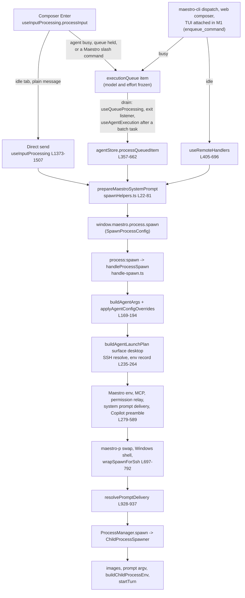

# Maestro TUI: prompt assembly (gap L12)

| Field          | Value                                                                                                                               |
| -------------- | ----------------------------------------------------------------------------------------------------------------------------------- |
| Status         | Design. Phase 6, task 1: written before any turn code                                                                               |
| Date           | 2026-10-04                                                                                                                          |
| Covers         | Gap L12. Requirement CH-2, and where assembly touches them CH-4, CH-5, CH-7, CH-8, AG-7                                             |
| Implemented by | Phase 6 task 2 (`assembleTurn`, the moves, the parity test), task 3 (`runAgentTurn`), task 4 (queue), task 6 (runtime turn methods) |
| Surveyed       | `maestro-tui` at `2aabbdf3c`                                                                                                        |

Decision names: `lib-Dn` is in `Plans/maestro-lib-decisions.md`, `RTn` in `Plans/maestro-tui-runtime.md`. This document adds inputs `I1` to `I32` (section 3), findings `F1` to `F13` (section 7), and decisions `PA1` to `PA17` (section 8.6).

**In short.** A desktop chat turn is shaped by 32 inputs spread over three processes: the renderer builds the user prompt and the system prompt, the main process builds the arguments and the environment, and the process manager places images and the prompt. Four renderer entry points build a turn, and they disagree: only the composer's direct send applies the nudge, the new-session message, and the read-only instruction (F1). The proposal is one pure function, `assembleTurn(agent, tab, message, context)`, that applies the composer's rules to every message and returns the final prompt and a launch request for `buildAgentLaunchPlan`. Everything with a side effect (temp files, the Claude token source, SSH wrapping, process start) stays in `runAgentTurn` (task 3), and every read (prompt files, settings, git, history path, binary probe) moves into `loadTurnContext`.

---

## 1. The desktop send path



`useAgentExecution.spawnAgentForSession` is the fifth spawn site in this family: Auto Run tasks and prompt-only slash commands. It calls the same `prepareMaestroSystemPrompt`, spawns under `{agentId}-batch-{timestamp}` with `permissionMode: 'full'`, never resumes, and passes `querySource: 'auto'` for Auto Run. It is also a queue drain point: when its batch turn exits it dequeues the next item and calls `processQueuedItem` (L402-500). Auto Run prompts get the new-session message from their callers (`useDocumentProcessor` L487, `useGoalRunner` L536) and never the nudge, as `docs/autorun-playbooks.md` documents.

Other spawn sites (fork, merge and transfer, Cue AI chat, feedback chat, synopsis) build their own prompts and are out of scope.

---

## 2. Four entry points, four answers

Every row is verified in the code at the cited lines.

| Step                       | Composer, direct send (`useInputProcessing` L1294-1507) | Queued message (`processQueuedItem` L470-522) | Queued command (`processQueuedItem` L523-625) | Remote dispatch (`useRemoteHandlers` L405-696) |
| -------------------------- | ------------------------------------------------------- | --------------------------------------------- | --------------------------------------------- | ---------------------------------------------- |
| Nudge                      | appended                                                | no                                            | no                                            | no                                             |
| New-session message        | prefixed when the tab has no provider session           | no                                            | no                                            | no                                             |
| Read-only instruction      | appended                                                | no                                            | no                                            | no                                             |
| Image-only default prompt  | when the text, nudge included, is blank (F5)            | when the text is blank                        | no images sent                                | when the text is blank                         |
| Pending merged context     | prefixed and cleared                                    | prefixed and cleared                          | no                                            | no                                             |
| Template variables in text | no                                                      | no                                            | yes, after `$ARGUMENTS`                       | yes, exact whole-text match only (F3)          |
| Model                      | tab ?? agent, read live at spawn                        | frozen at queue time                          | frozen at queue time                          | agent only (F2)                                |
| Effort                     | tab ?? agent, read live at spawn                        | frozen at queue time                          | frozen at queue time                          | not sent (F2)                                  |
| Read-only                  | tab, or the Auto Run gate                               | item, or tab                                  | item, or tab                                  | tab                                            |
| Unmatched `/x`             | sent to the provider as text                            | n/a                                           | error entry when the command is gone          | error entry, "Unknown command"                 |
| System prompt              | `prepareMaestroSystemPrompt`                            | same                                          | same                                          | same                                           |
| Transcript entry           | typed text, `readOnly`, `forceParallel`                 | typed text (`markTabRunningQueuedItem`)       | expanded prompt with `aiCommand`              | sent text, `aiCommand`, images                 |

The CLI (`maestro-cli send`) is a sixth answer: its own system prompt builder (`src/cli/services/system-prompt.ts`, F11), no nudge, no new-session message, no Copilot preamble.

---

## 3. Inventory: every input that shapes the prompt, arguments, and environment

`Shapes`: SP system prompt, UP user prompt, A arguments, E environment, C command, D delivery, T transcript entry. `Pure`: whether the step that consumes the input is a pure function of its inputs.

| ID  | Input                      | Stored in                                                                                                  | Computed in (desktop)                                                                                                                                                                                                                                                                                                                  | Pure                                                                        | Shapes        | `planSessionTurn`                                 |
| --- | -------------------------- | ---------------------------------------------------------------------------------------------------------- | -------------------------------------------------------------------------------------------------------------------------------------------------------------------------------------------------------------------------------------------------------------------------------------------------------------------------------------- | --------------------------------------------------------------------------- | ------------- | ------------------------------------------------- |
| I1  | Typed text                 | composer draft                                                                                             | `useInputProcessing` L301-387 (`stripShellCommandEscape` in AI mode)                                                                                                                                                                                                                                                                   | yes                                                                         | UP, T         | yes (`prompt`)                                    |
| I2  | Maestro system prompt      | `src/prompts/maestro-system-prompt.md`, or `<userData>/core-prompts-customizations.json` when `isModified` | main `prompt-manager.getPrompt` (L227, cache filled once at startup) through IPC `prompts:get`; the CLI has `getCliPrompt`                                                                                                                                                                                                             | no: file reads, Electron paths                                              | SP            | no                                                |
| I3  | `{{REF:}}`, `{{INCLUDE:}}` | the prompt text                                                                                            | `resolveRefs` (L417) then `resolveIncludes` (L433, depth 3, cycle check). Refs are resolved on the top-level text only, so an included block keeps its refs. Bundled dir: `process.resourcesPath/prompts/core` packaged, `src/prompts` in dev. The CLI resolves REF and not INCLUDE (F12)                                              | yes, given the bundled dir                                                  | SP            | no                                                |
| I4  | Template variables         | agent record, tab, settings                                                                                | `substituteTemplateVariables` (`src/shared/templateVariables.ts` L516). The system prompt uses `AGENT_NAME`, `TOOL_TYPE`, `CONDUCTOR_PROFILE`, `AGENT_ID`, `MAESTRO_CLI_PATH`, `TAB_ID`, `AGENT_PATH`, `AGENT_SESSION_ID`, `AGENT_HISTORY_PATH`, `GIT_BRANCH`, `CWD`, `WORKTREE_BASE_PATH`, `AUTORUN_FOLDER`, `ADDITIONAL_DIRECTORIES` | yes, apart from `new Date()` and `getMaestroCLIPath()` reading `globalThis` | SP, UP (cmds) | no                                                |
| I5  | Conductor profile          | `maestro-settings.json` `conductorProfile`                                                                 | `useSettingsStore.getState()` in `spawnHelpers.ts` L57                                                                                                                                                                                                                                                                                 | read is I/O, use is pure                                                    | SP, UP (cmds) | no                                                |
| I6  | Git branch                 | the repository                                                                                             | `gitService.getStatus(cwd)` -> `git rev-parse --abbrev-ref HEAD` (`git:branch`), only when `isGitRepo`, without the SSH remote id (F7)                                                                                                                                                                                                 | no: runs git                                                                | SP            | no                                                |
| I7  | History file path          | `<userData>/history/<id>.jsonl`                                                                            | `history:getFilePath` -> `HistoryManager.getHistoryFilePath` (migrates a legacy `.json` first, `null` when there is no file); skipped for SSH                                                                                                                                                                                          | no                                                                          | SP            | no                                                |
| I8  | maestro-cli path           | the app bundle                                                                                             | main `resolveBundledCliPathSync` -> preload `window.maestro.maestroCliPath` -> `getMaestroCLIPath()` formats `node "<path>"`; without it, a per-platform default                                                                                                                                                                       | no                                                                          | SP (27 uses)  | no                                                |
| I9  | Pianola                    | agent `isPianola`; prompt `pianola-system`                                                                 | appended with `\n\n---\n\n` (`spawnHelpers.ts` L73-78); env `MAESTRO_CLI_JS`, `MAESTRO_AGENT_ID` (`handle-spawn.ts` L279-288)                                                                                                                                                                                                          | load is I/O, join is pure                                                   | SP, E         | no                                                |
| I10 | Nudge message              | agent `nudgeMessage`                                                                                       | `useInputProcessing` L1294-1301, composer direct send only                                                                                                                                                                                                                                                                             | yes                                                                         | UP            | no                                                |
| I11 | New-session message        | agent `newSessionMessage`                                                                                  | `prependNewSessionMessage` (`src/shared/newSessionMessage.ts`) at L1436-1442 when the tab has no `agentSessionId`; composer direct send only                                                                                                                                                                                           | yes                                                                         | UP            | no                                                |
| I12 | Read-only mode             | tab `readOnlyMode`, `permissionMode`; queue item `readOnlyMode`; Auto Run gate                             | renderer L1406-1417: Auto Run running without a worktree and no Force Send, or the tab                                                                                                                                                                                                                                                 | yes                                                                         | A, E, UP, T   | yes (refuses a provider that cannot enforce it)   |
| I13 | Permission mode            | tab `permissionMode` ?? `readOnlyMode`                                                                     | `resolveTabPermissionMode` (`src/shared/agentMetadata.ts` L123); read-only forces `readonly`                                                                                                                                                                                                                                           | yes                                                                         | A             | partly (`readonly` or `full`)                     |
| I14 | Thinking mode              | tab `showThinking`                                                                                         | not in the spawn at all: the renderer filters `thinking-chunk` events for display                                                                                                                                                                                                                                                      | n/a                                                                         | display only  | n/a                                               |
| I15 | Images                     | staged images                                                                                              | prompt: `image-only-default` (loaded once by `loadInputProcessingPrompts`) when the text is blank. Placement: `ChildProcessSpawner` L122-187 (Claude: stream-json stdin plus `--input-format stream-json`; Codex, OpenCode: temp files plus `imageArgs`; Copilot: `imagePromptBuilder`; resume prompt-embed)                           | prompt pure; placement writes temp files                                    | UP, A, D      | no                                                |
| I16 | Resume session             | tab `agentSessionId`                                                                                       | `buildAgentArgs` `resumeArgs`; gates I11 and the embedded system prompt; `MAESTRO_SESSION_RESUMED` sniffed from argv (`ChildProcessSpawner` L229-231, F9); a Claude API resume sanitizes the transcript first                                                                                                                          | args pure; sanitize rewrites a file                                         | A, UP, E      | yes                                               |
| I17 | Model                      | tab `customModel` ?? agent `customModel`; queue `turnSettings.model`                                       | `applyAgentConfigOverrides` `model` option: a non-empty session value, else provider config, else default                                                                                                                                                                                                                              | yes                                                                         | A             | yes, but through `modelArgs`, at another position |
| I18 | Effort                     | tab `customEffort` ?? agent `customEffort`; queue `turnSettings.effort`                                    | `applyAgentConfigOverrides` `effort` or `reasoningEffort` option: a non-empty session value, else provider config, else default                                                                                                                                                                                                        | yes                                                                         | A             | no                                                |
| I19 | Provider config            | `maestro-agent-configs.json` `configs[toolType]`                                                           | `agentConfigsStore` (`handle-spawn.ts` L185)                                                                                                                                                                                                                                                                                           | read is I/O                                                                 | A, E          | no                                                |
| I20 | Binary                     | agent `customPath`; provider `customPath`; PATH                                                            | renderer `agent.path \|\| agent.command` from `agents:get` (the detector applies the provider custom path); main validates the agent custom path locally and falls back to the detected path (L100-120); remote: custom path, else `binaryName`                                                                                        | no: probes                                                                  | C             | yes (`command`, else a probe)                     |
| I21 | Custom args                | agent `customArgs` ?? provider `customArgs`                                                                | `applyAgentConfigOverrides`: quote-aware split, appended after the config options                                                                                                                                                                                                                                                      | yes                                                                         | A             | no                                                |
| I22 | Environment layers         | `process.env`, Settings `shellEnvVars`, provider `defaultEnvVars`, agent ?? provider `customEnvVars`       | `buildAgentLaunchPlan` record plus `buildChildProcessEnv` (the desktop row of lib-D1)                                                                                                                                                                                                                                                  | yes, apart from reading `process.env`                                       | E             | partly: surface `cli`, no global vars             |
| I23 | Maestro-stated env         | none                                                                                                       | caller identity (`handle-spawn.ts` L295-299, tab id absent for chat, F8), Pianola, MCP, `MAESTRO_QUERY_USER`, `MAESTRO_QUERY_SOURCE=user`, `MAESTRO_USER_DATA` inherited from main (`src/main/index.ts` L286)                                                                                                                          | yes                                                                         | E             | query source only                                 |
| I24 | Additional directories     | agent `additionalDirectories`                                                                              | `buildAdditionalDirArgs` (native flags, after the dedupe) and `{{ADDITIONAL_DIRECTORIES}}`                                                                                                                                                                                                                                             | yes                                                                         | A, SP         | no                                                |
| I25 | SSH remote                 | agent `sessionSshRemoteConfig`, Settings `sshRemotes`                                                      | plan target (`resolveSshLaunchTarget`), `wrapSpawnForSsh`: system prompt flag always inline, prompt in the stdin script, global env merged beneath the record, no history path                                                                                                                                                         | resolve is pure given the store                                             | C, A, D, SP   | no: local only                                    |
| I26 | Pending merged context     | tab `pendingMergedContext` (merge, Send to Agent, session recovery)                                        | `takePendingMergedContext` (`sessionStore.ts` L556): prefix with `\n\n---\n\n`, then clear the field                                                                                                                                                                                                                                   | prefix pure; clearing is a write                                            | UP            | no                                                |
| I27 | Maestro commands           | settings `customAICommands`, spec-kit, OpenSpec, BMAD (main managers), agent `agentCommands` with prompts  | composer matches the first word (L450-471) and always queues; `processQueuedItem` L553-573 expands `$ARGUMENTS`, then template variables without the history path                                                                                                                                                                      | yes, given the command list                                                 | UP, T         | no                                                |
| I28 | Copilot preamble           | prompt `copilot-preamble`                                                                                  | `handle-spawn.ts` L572-589: copilot-cli only, every turn, prepended after the system prompt embed                                                                                                                                                                                                                                      | load is I/O, prepend is pure                                                | UP            | no                                                |
| I29 | System prompt delivery     | capabilities, host OS, SSH, resume                                                                         | `handle-spawn.ts` L468-553: the same rules as the library's `resolveSystemPromptDelivery`, which the CLI already uses                                                                                                                                                                                                                  | yes; Windows writes a temp file                                             | A, UP         | no                                                |
| I30 | Claude token source        | agent `enableMaestroP`, `maestroPMode`, `maestroPPath`, `claudeInteractive`; usage snapshot                | `resolveClaudeSpawnContext`, then `applyLocalInteractiveSpawnDecision` or the SSH wrapper; standard mode in API mode adds the permission relay (L408-449)                                                                                                                                                                              | no                                                                          | C, A, E       | no                                                |
| I31 | Context window             | agent `customContextWindow`, provider config                                                               | `getContextWindowValue` (L683)                                                                                                                                                                                                                                                                                                         | yes                                                                         | usage reports | no                                                |
| I32 | Host OS                    | the machine                                                                                                | Windows: system prompt in a temp file, prompt over stdin for a provider that declares it, shell wrapping                                                                                                                                                                                                                               | no                                                                          | A, D          | partly (surface `cli` keeps the prompt in argv)   |

---

## 4. Exact layering

### 4.1 User prompt

```text
message (composer rules):
  p = text
  if nudgeMessage:                 p = p + "\n\n---\n\n" + nudgeMessage
  if images and p.trim() == "":    p = imageOnlyDefault                      (F5: tested after the nudge)
  if no tab.agentSessionId:        p = prependNewSessionMessage(p, newSessionMessage)
                                       -> newSessionMessage + "\n\n---\n\n" + p, skipped when blank
  if readOnly:                     p = p + READ_ONLY_PLAN_INSTRUCTION
  if tab.pendingMergedContext:     p = pendingMergedContext + "\n\n---\n\n" + p   (then the field is cleared)

command:
  p = command.prompt
  if args:   p = p with every "$ARGUMENTS" replaced by args, or p + "\n\n" + args when there is none
  else:      p = p with every "$ARGUMENTS" removed
  p = substituteTemplateVariables(p, { session: agent, gitBranch, groupId, activeTabId: tab.id, conductorProfile })

then, main process, both kinds:
  system prompt delivery "embed":      p = systemPrompt + "\n\n---\n\n# User Request\n\n" + p
  system prompt delivery "as-prompt":  p = systemPrompt
  copilot-cli, non-blank preamble:     p = preamble.trim() + "\n\n" + p
```

`READ_ONLY_PLAN_INSTRUCTION` is the literal at `useInputProcessing` L1446-1447, starting with `\n\n---\n\n`: `IMPORTANT: You are in read-only/plan mode. Do NOT write a plan file. Instead, return your plan directly to the user in beautiful markdown formatting.` The embed separator is a wire format (`EMBEDDED_SYSTEM_PROMPT_SEPARATOR`); transcripts on disk depend on it.

### 4.2 System prompt

```text
s = substituteTemplateVariables(template, {
      session: agent, gitBranch, groupId: agent.groupId, activeTabId: tab.id,
      historyFilePath, conductorProfile })
if agent.isPianola and the pianola-system prompt loaded:  s = s + "\n\n---\n\n" + pianola
undefined when the template did not load: the turn goes out without a system prompt
```

### 4.3 Arguments, in order

1. Base: the provider definition's `args`, minus the YOLO flags when read-only (`filterYoloArgs`, renderer, `src/renderer/utils/agentArgs.ts`).
2. `buildAgentArgs(provider, { baseArgs, prompt, cwd, readOnlyMode, permissionMode, agentSessionId, additionalDirectories })`. Chat passes no `modelId` and no `yoloMode`. It adds the batch prefix and batch args (batch args skipped when read-only), JSON output args, working-dir args (prepended), full-access or read-only args, resume args, then dedupes flags and appends the additional-dir args.
3. `applyAgentConfigOverrides(provider, args, { agentConfigValues, sessionCustomModel, sessionCustomEffort, sessionCustomArgs, sessionCustomEnvVars })`: every config option's `argBuilder` in definition order, then the custom args. The desktop passes no `readOnlyMode` here (F10).
4. MCP global args, prepended (plugins on, local, verified provider).
5. Permission relay args, appended (Claude Code, API mode, standard permission mode).
6. System prompt: `--append-system-prompt <text>` appended for a provider with the flag; `--append-system-prompt-file <tmp>` instead on a local Windows host; nothing for the other deliveries.
7. maestro-p swap (Claude interactive), Windows shell wrapping, SSH wrapping.
8. Prompt placement (`ChildProcessSpawner`, or the plan): image flags, `buildPromptArgv` (provider flag, `--` then the prompt, or a bare positional), stdin prompt args.

The parity argument list is the output of step 6. For a local, non-Windows, API-mode turn it is exactly the `args` that `ProcessManager.spawn` receives.

### 4.4 Environment

The desktop row of lib-D1: `process.env` with the Electron, IDE, Claude-session and caller-identity vars stripped, PATH rebuilt from the cached login-shell PATH, BROWSER disarmed, then Settings `shellEnvVars` < provider `defaultEnvVars` < (agent `customEnvVars` ?? provider `customEnvVars`) < `readOnlyEnvOverrides` < Maestro-stated vars < `MAESTRO_QUERY_SOURCE`. A blank value unsets a variable.

---

## 5. What `planSessionTurn` already does

`planSessionTurn` (`src/shared/maestro-lib/run/session.ts`) is the whole library path from "run this provider on this prompt" to a process spec, and it is **local only**: it never passes an SSH config, and it refuses a plan without a local environment ("A session turn runs on this machine only").

| Handles                                                                                                       | Does not handle                                                                                            |
| ------------------------------------------------------------------------------------------------------------- | ---------------------------------------------------------------------------------------------------------- |
| Provider lookup; gates for batch mode, resume support, an output parser (lib-D14), read-only enforceability   | The Maestro system prompt and its delivery, conductor profile, template variables, Pianola                 |
| Binary: a given `command` (`checkCustomPath`) or a PATH probe (`checkBinaryExists`)                           | Nudge, new-session message, read-only instruction, merged context, Maestro commands, Copilot preamble      |
| `buildAgentArgs` with `forceBatchMode`, `readonly` or `full`, resume, model through `modelArgs`               | Effort, provider config options, custom args, standard permission mode, additional directories             |
| Launch plan with surface `cli`, the caller's env vars as the agent layer, the resume marker, the query source | Provider-level env vars, Settings env vars, Maestro-stated env, images, the Claude token source, SSH (I25) |

It stays as it is: it serves the headless program (`maestro-lib-run`), where nobody is watching and the shell's environment should win. `assembleTurn` serves a turn on a stored agent and tab.

---

## 6. Where each input lives once the TUI hosts

| Input                                                      | Library home                                                                                                                      |
| ---------------------------------------------------------- | --------------------------------------------------------------------------------------------------------------------------------- |
| I1, I10 to I13, I17, I18, I26, I27                         | `assembleTurn` (pure), from `TurnAgent`, `TurnTab`, `TurnMessage`                                                                 |
| I2, I3, I9, I15 (prompt), I28                              | `loadTurnContext` reads them through the library prompt loader (section 8.4); `assembleTurn` uses the text                        |
| I4                                                         | `buildMaestroSystemPrompt` (pure) over `substituteTemplateVariables`, with two new optional `TemplateContext` fields (PA6, `now`) |
| I5, I19, I22 (global layer), I27 (list)                    | `loadTurnContext` reads `maestro-settings.json` and `maestro-agent-configs.json` through `store/read-stores.ts`                   |
| I6, I7, I8, I20                                            | `loadTurnContext` (I/O)                                                                                                           |
| I14                                                        | the TUI's transcript view (CH-3); never part of a turn                                                                            |
| I15 (placement), I16 (sanitize), I25, I29 (file), I30, I32 | `runAgentTurn` (task 3)                                                                                                           |
| I21, I23, I24, I31                                         | `assembleTurn` (pure)                                                                                                             |

---

## 7. Findings

Each is a desktop or CLI behavior the TUI must decide to copy or not. None is fixed in Phase 6 except where a decision in section 8.6 says the TUI departs from it.

| ID  | Finding                                                                                                                                                                                                                                                                                                                                                                                                                                |
| --- | -------------------------------------------------------------------------------------------------------------------------------------------------------------------------------------------------------------------------------------------------------------------------------------------------------------------------------------------------------------------------------------------------------------------------------------- |
| F1  | The nudge, the new-session message, and the read-only instruction reach the agent only on a composer direct send. Any message typed while the agent is busy (queued), every `maestro-cli dispatch`, every web or mobile send, and every TUI send in M1 (`enqueue_command`) skip all three. Commands never get them on any path. The docs promise the nudge on "every user message" (`docs/cli-reference.md`, `docs/general-usage.md`). |
| F2  | Remote dispatch sends the agent's model only (the tab override is ignored) and never sends effort.                                                                                                                                                                                                                                                                                                                                     |
| F3  | Remote dispatch matches a slash command against the whole text, so `/cmd args` is an "Unknown command" error; the composer matches the first word and passes an unmatched `/x` to the provider.                                                                                                                                                                                                                                        |
| F4  | The composer's command branch calls `substituteTemplateVariables` and discards the result (`useInputProcessing` L490-496). The real substitution happens in `processQueuedItem`. Dead call.                                                                                                                                                                                                                                            |
| F5  | The image-only default prompt is tested after the nudge is appended, so with a nudge set an image-only message goes out as `\n\n---\n\n<nudge>` and never gets the default prompt.                                                                                                                                                                                                                                                     |
| F6  | `{{AGENT_SESSION_ID}}` reads the deprecated agent-level `agentSessionId`, not the tab's, so it is empty in practice.                                                                                                                                                                                                                                                                                                                   |
| F7  | The git branch of an SSH agent is read locally, against the remote path.                                                                                                                                                                                                                                                                                                                                                               |
| F8  | Desktop chat spawns send no `tabId`, so `MAESTRO_CALLER_TAB_ID` is never set for a chat turn, though the delegation contract says every spawn stamps both ids.                                                                                                                                                                                                                                                                         |
| F9  | `MAESTRO_SESSION_RESUMED` is sniffed from argv (`--resume`, `--resume=`, `--session`), so a resumed Codex (`resume <id>`), Antigravity (`--conversation`), or Factory Droid (`-s`) turn is not marked.                                                                                                                                                                                                                                 |
| F10 | `handleProcessSpawn` does not pass `readOnlyMode` to `applyAgentConfigOverrides`, so a provider config option or custom arg that repeats a read-only flag lands after it and wins (OpenCode `--agent build` after `--agent plan`). The CLI, group chat, tab naming, and grooming pass it; consults and Cue do not.                                                                                                                     |
| F11 | The CLI builds the system prompt with its own copy (`prepareMaestroSystemPromptCli`): `{{AGENT_HISTORY_PATH}}` names `<id>.json`, which the desktop renames to `.json.migrated` on migration; `fullPath`, the agent-level session id, and Pianola are missing. The CLI spawner adds no Copilot preamble.                                                                                                                               |
| F12 | Prompt directives are resolved twice: main (`prompt-manager.ts`, REF and INCLUDE) and the CLI (`prompt-loader.ts`, REF only).                                                                                                                                                                                                                                                                                                          |
| F13 | Command prompts are substituted without the history path, so `{{AGENT_HISTORY_PATH}}` is empty inside a command on every path.                                                                                                                                                                                                                                                                                                         |

---

## 8. Proposal

### 8.1 Shape

```ts
// src/shared/maestro-lib/turns/assemble.ts

/** The agent fields assembly reads. A renderer `Session` and a validated `AgentRecord` both fit. */
export interface TurnAgent {
	id: string;
	name: string;
	toolType: string;
	cwd: string;
	projectRoot?: string;
	fullPath?: string;
	groupId?: string;
	autoRunFolderPath?: string;
	additionalDirectories?: AdditionalDirectory[];
	worktreeConfig?: { basePath?: string };
	isGitRepo?: boolean;
	contextUsage?: number;
	/** Deprecated agent-level id. Read for `{{AGENT_SESSION_ID}}` only, as the desktop does (F6). */
	agentSessionId?: string;
	isPianola?: boolean;
	nudgeMessage?: string;
	newSessionMessage?: string;
	customPath?: string;
	customArgs?: string;
	customEnvVars?: Record<string, string>;
	customModel?: string;
	customEffort?: string;
	customContextWindow?: number;
	sessionSshRemoteConfig?: AgentSshRemoteConfig | null;
}

export interface TurnTab {
	id: string;
	agentSessionId?: string | null;
	customModel?: string;
	customEffort?: string;
	readOnlyMode?: boolean;
	permissionMode?: 'full' | 'standard' | 'readonly';
	pendingMergedContext?: string;
}

export interface TurnMessage {
	/** What the person sent, after the composer's own escapes. */
	text: string;
	images?: readonly string[];
	/** Set when the text named a Maestro command (`resolveSlashCommand`). */
	command?: { command: string; description?: string; prompt: string; args: string };
	/** Frozen when the message was queued (`captureQueuedTurnSettings`). Absent: read the live tab. */
	turnSettings?: { model?: string; effort?: string };
	/** The queue item was read-only when it was queued. */
	readOnly?: boolean;
}

export interface TurnContext {
	/** The provider with its capabilities (`AgentConfig`: definition, capabilities, path). */
	provider: AgentConfig;
	/** The binary to run on this machine: the agent's valid custom path, the provider's, or the probed one. */
	command: string;
	/** `maestro-agent-configs.json` `configs[toolType]`. */
	providerConfig: Readonly<Record<string, unknown>>;
	/** Settings -> Environment (`shellEnvVars`). */
	globalEnvVars?: Readonly<Record<string, string>>;
	conductorProfile?: string;
	prompts: {
		/** Absent when it could not be loaded: the turn goes without one, as on desktop. */
		maestroSystem?: string;
		pianolaSystem?: string;
		imageOnlyDefault: string;
		copilotPreamble?: string;
	};
	/** Read only when `agent.isGitRepo`, local agents only (PA5). */
	gitBranch?: string;
	/** The agent's history file when it exists. Ignored for SSH. */
	historyFilePath?: string;
	/** The `maestro-cli.js` agents should call (PA6). */
	maestroCliPath?: string;
	/** The data dir the host serves, stamped as `MAESTRO_USER_DATA` (PA8). */
	userDataDir?: string;
	/** An Auto Run on this agent holds its working tree. Always false until L6 (PA13). */
	autoRunHoldsTree?: boolean;
	/** The person forced this send past the queue. */
	forceParallel?: boolean;
	isWindowsHost: boolean;
	/** Clock for date variables in command prompts. */
	now: Date;
}

export interface TurnUserEntry {
	/** The transcript's user entry (CH-5): what was sent, never the hidden layers. */
	text: string;
	images?: string[];
	readOnly?: true;
	aiCommand?: { command: string; description?: string };
}

export interface AssembledTurn {
	entry: TurnUserEntry;
	/** The prompt the provider receives: every hidden layer, the embedded system prompt, the Copilot preamble. */
	prompt: string;
	/** Maestro's system prompt after substitution. */
	systemPrompt?: string;
	systemPromptDelivery: SystemPromptDelivery;
	/** What the turn is attributed to (turn setting pills), frozen at send. */
	settings: { provider: string; model?: string; effort?: string };
	readOnly: boolean;
	permissionMode: 'full' | 'standard' | 'readonly';
	resumeSessionId?: string;
	/** `tab.pendingMergedContext` went into `prompt`: clear it when the turn starts (PA17). */
	consumedMergedContext: boolean;
	/** For usage reports (I31). */
	contextWindow: number;
	/**
	 * Everything `buildAgentLaunchPlan` needs except `sshStore`, which `runAgentTurn`
	 * supplies from the stored settings. For `file` delivery the caller writes the
	 * system prompt and appends `--append-system-prompt-file <path>` to `args`.
	 */
	launch: Omit<AgentLaunchInput, 'sshStore'>;
}

export type AssembleTurnResult =
	| { ok: true; turn: AssembledTurn }
	| { ok: false; reason: 'empty' | 'no-batch-mode'; message: string };

export function assembleTurn(
	agent: TurnAgent,
	tab: TurnTab,
	message: TurnMessage,
	context: TurnContext
): AssembleTurnResult;
```

`assembleTurn` is pure: no I/O, no clock beyond `context.now`, no `process.env`. The structural input types follow `mentions/roster.ts`: the renderer's `Session` and `AITab` satisfy them directly, and the runtime projects `AgentRecord` and `AITabRecord` (whose extra fields are unknown-typed) through a small validator, `toTurnAgent(record)` and `toTurnTab(record)`, so a malformed stored field reads as absent rather than as a wrong type.

### 8.2 Rules

1. **Refuse** `no-batch-mode` when `provider.capabilities.supportsBatchMode` is false (`terminal`, `gemini-cli`), and `empty` when there is no text, no image, and no command.
2. **Read-only** = `message.readOnly` or `tab.readOnlyMode` or `tab.permissionMode === 'readonly'` or (`autoRunHoldsTree` and not `forceParallel`). **Permission mode** = `readonly` when read-only, else `resolveTabPermissionMode(tab)`.
3. **Settings**: `message.turnSettings` when present, field for field, even when a field inside it is undefined (an absent model there means the agent default was chosen when it was queued); else `tab.customModel ?? agent.customModel` and the same for effort. Provider: `agent.toolType` (a queued turn runs on the live provider).
4. **Resume** = `tab.agentSessionId` when non-empty.
5. **User prompt** per section 4.1, with the composer rules for every message (PA1). The transcript entry is the typed text (or, for a command, the expanded prompt with `aiCommand`), its images, and `readOnly` when read-only.
6. **System prompt** per section 4.2, through `buildMaestroSystemPrompt` with `gitBranch` and `historyFilePath` dropped for an SSH agent.
7. **Arguments** per section 4.3 steps 1 to 3 (`buildTurnArgs`), then step 6 through `applySystemPromptDelivery` with `resolveSystemPromptDelivery({ supportsAppendSystemPrompt, isWindowsHost, sshRemote, isResume, hasUserPrompt })`: `flag` appends the inline flag, `embed` and `as-prompt` rewrite the prompt, `file` is left to the caller, `skip-on-resume` and `none` do nothing. Then the Copilot preamble.
8. **Command**: `context.command` locally; `remoteCommand` = `agent.customPath || provider.binaryName`. `extraPathDirs` = `[dirname(command)]` when local and absolute.
9. **Maestro env**: `buildCallerIdentityEnv(agent.id, tab.id)`, plus `MAESTRO_CLI_JS` and `MAESTRO_AGENT_ID` for Pianola, plus `MAESTRO_USER_DATA` when `userDataDir` is set.
10. **Launch request**: `surface: 'desktop'` (PA2), `agent: provider`, `command`, `remoteCommand`, `args`, `cwd: agent.cwd`, `prompt`, `hasImages`, `globalShellEnvVars`, `agentCustomEnvVars: providerConfig.customEnvVars`, `sessionCustomEnvVars: agent.customEnvVars`, `readOnlyMode`, `maestroEnvVars`, `isResuming: !!resumeSessionId` (PA9), `querySource: 'user'`, `extraPathDirs`, `sshRemoteConfig: agent.sessionSshRemoteConfig`, `isWindowsHost`.
11. **Context window** = `getContextWindowValue(provider, providerConfig, agent.customContextWindow)`.

### 8.3 What stays outside `assembleTurn`

| Concern                                                                                           | Owner                                                   | Why                                          |
| ------------------------------------------------------------------------------------------------- | ------------------------------------------------------- | -------------------------------------------- |
| User entry, busy state, codified turn settings, clearing `pendingMergedContext`                   | runtime (task 6), one repository mutation at turn start | writes                                       |
| Queue or run now (busy tabs, read-only parallelism, Force Send, retry holds)                      | queue (task 4)                                          | dispatch policy, not assembly                |
| System prompt temp file on Windows; removal 30 s after start                                      | `runAgentTurn`                                          | file write                                   |
| `sshStore` from stored settings, `buildAgentLaunchPlan`, SSH wrap, AG-7 refusal                   | `runAgentTurn`                                          | settings read; lib-D1c                       |
| Claude token source, maestro-p swap, API-resume transcript sanitize, standard-mode refusal (PA11) | `runAgentTurn`                                          | usage snapshot, probes, file rewrite         |
| Image placement; refused until CH-8 (PA12)                                                        | `runAgentTurn`                                          | temp files                                   |
| `@mention` consults                                                                               | M4                                                      | separate turns on other agents               |
| `pendingAICommandForSynopsis`                                                                     | not carried                                             | synopsis is not a runtime feature in Phase 6 |

### 8.4 Loading the context

```ts
// src/shared/maestro-lib/turns/context.ts
export interface TurnContextSources {
	paths: MaestroPaths;
	/** Found with `findBundledPromptsDir()` when omitted. */
	bundledPromptsDir?: string;
	/** The TUI passes the `maestro-cli.js` beside its own bundle (PA6). */
	maestroCliPath?: string;
	isWindowsHost?: boolean;
	now?: () => Date;
	/** Test seams. */
	probeBinary?(binaryName: string, customPath?: string): Promise<BinaryDetectionResult>;
	readGitBranch?(cwd: string): Promise<string | undefined>;
}

/** A Maestro command. The renderer's `CustomAICommand` satisfies it. */
export interface TurnCommand {
	command: string;
	description?: string;
	prompt: string;
}

export type TurnContextResult =
	| { ok: true; context: TurnContext; commands: TurnCommand[] }
	| { ok: false; reason: 'unknown-provider' | 'not-installed'; message: string };

export function loadTurnContext(
	agent: TurnAgent,
	sources: TurnContextSources
): Promise<TurnContextResult>;
```

It reads, per turn: `conductorProfile`, `shellEnvVars`, and `customAICommands` from the settings file; `configs[toolType]` from the agent configs file; the four prompts through the loader below (Pianola and the Copilot preamble only when they apply); the git branch (local agents with `isGitRepo`); `historyFilePath(paths.historyDir, agent.id)` when that file exists and the agent is local; the binary (agent custom path through `checkCustomPath`, falling back with a warning as the desktop does, then the provider-level custom path, then `checkBinaryExists`). It awaits `getShellPath()` once, so `buildSpawnPath` sees the login-shell PATH the desktop warms at startup.

The prompt loader (`src/shared/maestro-lib/prompts/load.ts`): `createPromptLoader({ bundledPromptsDir, customizationsFile })` with `get(id)`. It applies a customization when `isModified`, else reads the bundled file, then resolves REF on the top-level text and INCLUDE after it, with the desktop's rules (section 3, I3). Customizations are re-read per turn, so an edit made in the desktop applies to the next TUI turn; bundled files are cached. `findBundledPromptsDir()` probes the CLI's candidate chain (`_getBundledPromptCandidatesForTests`): `src/prompts` in a checkout, `prompts/core` beside the bundle when installed.

`resolveSlashCommand(text, commands)` (pure, `turns/prompt.ts`): first word against `customAICommands`, then `agentCommands` with a prompt, as the composer matches (L450-471). No match: plain text.

### 8.5 Moves for task 2 (desktop unchanged)

| Piece                                                            | From                                        | To                                                               | Left behind                                                                                 |
| ---------------------------------------------------------------- | ------------------------------------------- | ---------------------------------------------------------------- | ------------------------------------------------------------------------------------------- |
| `filterYoloArgs`, the known YOLO flags                           | `src/renderer/utils/agentArgs.ts`           | `src/shared/maestro-lib/launch/agent-args.ts`                    | re-export                                                                                   |
| `READ_ONLY_PLAN_INSTRUCTION`, the message layering (section 4.1) | `useInputProcessing` L1294-1301, L1430-1458 | `turns/prompt.ts` `buildMessagePrompt()`                         | `useInputProcessing` calls it                                                               |
| `$ARGUMENTS` expansion                                           | `agentStore` L553-564                       | `turns/prompt.ts` `expandCommandArguments()`                     | `processQueuedItem` calls it                                                                |
| System prompt substitution and the Pianola join                  | `spawnHelpers.ts` L59-80                    | `turns/prompt.ts` `buildMaestroSystemPrompt()`                   | `prepareMaestroSystemPrompt` keeps the IPC reads                                            |
| Argument core and system prompt delivery (minus the file write)  | `handle-spawn.ts` L169-194, L468-553        | `turns/args.ts` `buildTurnArgs()`, `applySystemPromptDelivery()` | `handleProcessSpawn` calls them; MCP and relay args stay where they are, so the order holds |
| Copilot preamble join                                            | `handle-spawn.ts` L572-589                  | `turns/args.ts` `applyCopilotPreamble()`                         | the prompt load stays in main                                                               |
| REF and INCLUDE resolution                                       | `prompt-manager.ts` L404-469                | `prompts/load.ts` `resolvePromptDirectives()`                    | `getPrompt` calls it                                                                        |
| Bundled prompt candidates                                        | `src/cli/services/prompt-loader.ts` L18-45  | `prompts/load.ts` `bundledPromptCandidates()`                    | re-export                                                                                   |
| `maestroCliPath`, `now` on `TemplateContext`                     | none                                        | `src/shared/templateVariables.ts` (optional fields)              | absent means today's behavior                                                               |

Every move keeps the desktop's output byte for byte, quirks included (PA4). The existing renderer and main tests for these paths stay green unchanged, and new unit tests cover each library function.

### 8.6 Decisions

| ID   | Decision                                                                                                                                                                                                                                                                     | Why                                                                                                                                                                                                                                                                                                                            |
| ---- | ---------------------------------------------------------------------------------------------------------------------------------------------------------------------------------------------------------------------------------------------------------------------------- | ------------------------------------------------------------------------------------------------------------------------------------------------------------------------------------------------------------------------------------------------------------------------------------------------------------------------------ |
| PA1  | Every TUI message gets the composer rules (nudge, new-session message evaluated at dispatch, read-only instruction, merged context), queued or not. Commands follow the desktop command path.                                                                                | CH-2 names the nudge. The docs promise it on every user message; F1 is a desktop gap, not a rule. Evaluating the new-session message at dispatch gives it to the first turn of a provider session only.                                                                                                                        |
| PA2  | Launch with `surface: 'desktop'`.                                                                                                                                                                                                                                            | A resumed tab must reach the account and config dir the desktop uses: Settings env applies and provider defaults beat the shell (lib-D1). The desktop surface strips `CLAUDE_CODE_SESSION_ID` and caller identity, which a TUI started from an agent shell would otherwise leak into a nested, transcript-less Claude session. |
| PA3  | `assembleTurn` is pure; reads go through `loadTurnContext`; the clock is injected.                                                                                                                                                                                           | Deterministic parity tests; the desktop keeps gathering through IPC.                                                                                                                                                                                                                                                           |
| PA4  | Reproduce the desktop's system prompt and arguments exactly, quirks included (F5, F6, F10).                                                                                                                                                                                  | lib-D: the library reproduces `rc`. Fixes go in one change for both surfaces, with their own sign-off.                                                                                                                                                                                                                         |
| PA5  | Read the git branch for local agents only.                                                                                                                                                                                                                                   | F7: the desktop's local read of a remote path yields nothing useful. Same result whenever the remote path does not exist locally.                                                                                                                                                                                              |
| PA6  | `{{MAESTRO_CLI_PATH}}` from an explicit `TemplateContext.maestroCliPath`. The TUI passes the `maestro-cli.js` beside its bundle (`dist/cli` in dev, `Resources/` installed).                                                                                                 | `globalThis.maestro` does not exist in the TUI; the per-platform default is wrong in dev. Absent keeps the desktop's preload path.                                                                                                                                                                                             |
| PA7  | One library prompt loader: customizations from `<userData>/core-prompts-customizations.json`, REF against the bundled dir, INCLUDE with the desktop rules. Main's directive code moves into it.                                                                              | F12. `{{REF:}}` paths are part of the system prompt text, so the bundled dir must match the desktop's.                                                                                                                                                                                                                         |
| PA8  | Stamp `MAESTRO_CALLER_TAB_ID` and `MAESTRO_USER_DATA` (the hosted data dir).                                                                                                                                                                                                 | F8: the delegation contract stamps both ids. The desktop publishes its data dir into `process.env` for every agent; the TUI states its own.                                                                                                                                                                                    |
| PA9  | `MAESTRO_SESSION_RESUMED` from `!!resumeSessionId`.                                                                                                                                                                                                                          | F9; the documented meaning is "resuming an existing session". Env only, outside the parity comparison.                                                                                                                                                                                                                         |
| PA10 | Read-only on a provider without CLI enforcement runs with the prompt instruction, as on the desktop.                                                                                                                                                                         | A person is watching; lib-D14's refusal is for unattended runs.                                                                                                                                                                                                                                                                |
| PA11 | Standard permission mode on a Claude Code API turn is refused by `runAgentTurn` with the desktop's SSH wording; never downgraded to full.                                                                                                                                    | The permission relay lives in the desktop; without it Claude aborts on the first tool call.                                                                                                                                                                                                                                    |
| PA12 | Images are assembled (image-only prompt, `hasImages`); `runAgentTurn` refuses them until CH-8 lands.                                                                                                                                                                         | Placement writes temp files per provider; a silent drop would send a prompt about a picture the agent never sees.                                                                                                                                                                                                              |
| PA13 | Not applied in the TUI: the MCP plugin bridge, `MAESTRO_QUERY_USER`, and the Auto Run gate (`autoRunHoldsTree` stays false until L6).                                                                                                                                        | Plugins and web login are v1 non-goals; the runtime has no Auto Run engine in Phase 6.                                                                                                                                                                                                                                         |
| PA14 | Slash commands: `customAICommands` and agent `agentCommands`, matched on the first word. spec-kit, OpenSpec, and BMAD wait for their prompt loading in the library (AR-3). An unmatched `/x` is sent as text (CH-7). `/history`, `/wizard`, `/skills` are desktop built-ins. | The composer's behavior; the spec-kit families need `spec-command-manager` off Electron (L4).                                                                                                                                                                                                                                  |
| PA15 | The Claude token source is decided in `runAgentTurn` with the CLI's core deps. An unconfigured SSH Claude agent runs in API mode in Phase 6.                                                                                                                                 | No remote maestro-p probe yet; the desktop picks the remote TUI when the remote has maestro-p. A billing-visible difference, stated here.                                                                                                                                                                                      |
| PA16 | A missing binary refuses in `loadTurnContext`, before anything is written.                                                                                                                                                                                                   | The desktop fails at spawn with ENOENT; refusing first leaves no half-started turn.                                                                                                                                                                                                                                            |
| PA17 | A pending merged context is consumed: folded into the prompt, cleared in the mutation that starts the turn.                                                                                                                                                                  | The field is persisted, so a merge done on the desktop must reach the next TUI turn once.                                                                                                                                                                                                                                      |

### 8.7 The parity test (task 2)

Vitest runs `src/__tests__/renderer` under jsdom and `src/__tests__/main` under node, so the proof is two files that chain.

1. **Renderer stage** (`src/__tests__/renderer/turns/assemble-parity.test.ts`). Render `useInputProcessing` as `useInputProcessing.test.ts` does, with `window.maestro.prompts.get` served by the real `prompt-manager` (Electron `app` mocked to the repo's `src/prompts` and a temp userData), history, git, and the settings store mocked. Send the fixture message; capture the `SpawnProcessConfig` given to `window.maestro.process.spawn`. Assert `config.appendSystemPrompt === turn.systemPrompt` and that the user prompt and the fields `runAgentTurn` maps into the spawn (model, effort, permission mode, read-only, resume id, custom path, args, env, additional directories) equal what `assembleTurn` returns for the same agent, tab, and context.
2. **Main stage** (`src/__tests__/main/turns/assemble-parity.test.ts`). Call `handleProcessSpawn` with the spawn config from stage 1's mapping, real `buildAgentArgs` and `applyAgentConfigOverrides`, a fake detector returning the real definition and capabilities, fake stores (the session record resolves to API mode), plugins off, `isWindows()` false, and a `ProcessManager` that records `spawn(config)`. Assert the recorded `args` equal `turn.launch.args` and the recorded `prompt` equals `turn.prompt`.

Fixtures: Claude Code on a fresh tab (tab model override, provider effort, custom args with a quoted value, one additional directory, nudge and new-session message set: the inline flag path); Codex resumed and read-only (`-C` prepend, `resume <id>`, YOLO filtering, `skip-on-resume`); Copilot on a first turn (embed and preamble). One more case pins `isWindows()` true and asserts `file` delivery with no inline flag.

### 8.8 Follow-ups, outside this playbook

- Route the desktop's queued, remote, and composer paths through `assembleTurn`. That closes F1 to F3 and gives the TUI parity in M1, where its sends go through `enqueue_command`. It changes behavior (the nudge reaches queued and remote sends), so it needs sign-off.
- Move `maestro-cli send` onto `buildMaestroSystemPrompt` and the library loader (F11, F13).
- Fix F5, F6, F9, F10 in one change for both surfaces.

---

## 9. Implementation notes (Phase 6, task 2)

What landed, and where it departs from section 8. Tasks 3 to 6 build on this.

| Area                 | Landed                                                                                                                                                                                                                                                                                                                                                                                                                                                                   |
| -------------------- | ------------------------------------------------------------------------------------------------------------------------------------------------------------------------------------------------------------------------------------------------------------------------------------------------------------------------------------------------------------------------------------------------------------------------------------------------------------------------ |
| Modules              | `turns/prompt.ts`, `turns/args.ts`, `turns/assemble.ts`, `turns/context.ts`, `turns/records.ts`, `prompts/load.ts`, all exported from the library index                                                                                                                                                                                                                                                                                                                  |
| Callers on the moves | `useInputProcessing` (`appendNudgeMessage`, `buildMessagePrompt`), `agentStore` (`expandCommandArguments`), `sessionStore` (`prependMergedContext`), `prepareMaestroSystemPrompt` (`buildMaestroSystemPrompt`), `handleProcessSpawn` (`buildTurnArgs`, `applySystemPromptDelivery`, `applyCopilotPreamble`), `prompt-manager` and the CLI prompt loader (`resolvePromptDirectives`, `bundledPromptCandidates`), `filterYoloArgs` (shim at `renderer/utils/agentArgs.ts`) |
| Parity test          | `src/__tests__/renderer/turns/assemble-parity.test.ts`: six fixtures (the four in 8.7 plus Claude standard mode and Codex resumed full access) through the real renderer path into the real `handleProcessSpawn`                                                                                                                                                                                                                                                         |

Departures, each deliberate:

| ID  | Departure                                                                                                                                                                                                               | Why                                                                                                                                                                                                                                       |
| --- | ----------------------------------------------------------------------------------------------------------------------------------------------------------------------------------------------------------------------- | ----------------------------------------------------------------------------------------------------------------------------------------------------------------------------------------------------------------------------------------- |
| I1  | One parity file, not two. It chains the renderer into `handleProcessSpawn` itself rather than mapping a spawn config by hand between two files.                                                                         | jsdom can import the main handler, so the chain needs no hand-written mapping that could drift from `runAgentTurn`. A mutation of the nudge in `assembleTurn` fails two fixtures.                                                         |
| I2  | `AssembledTurn.userPrompt` exists: the prompt before the system prompt and Copilot preamble are folded in.                                                                                                              | It is exactly what the renderer hands the spawn as `prompt`, so the parity test compares it directly. `runAgentTurn` can also log it without un-embedding.                                                                                |
| I3  | `TemplateContext.maestroCliPath` is the bare `maestro-cli.js` path, formatted as `node "<path>"` inside `substituteTemplateVariables`.                                                                                  | The desktop's preload value is a bare path formatted the same way. One meaning for "the CLI path" across `TurnContextSources`, `TurnContext`, the template, and the Pianola `MAESTRO_CLI_JS` env var (which needs the bare script).       |
| I4  | `loadTurnContext` takes `moduleDirectory` (default: the entry script's directory) and never reads `__dirname`.                                                                                                          | `dist/cli/maestro-tui.mjs` is an ES module. `bundledPromptCandidates` already takes the caller's directory.                                                                                                                               |
| I5  | `TurnAgent` carries `agentCommands`; `toTurnAgent` / `toTurnTab` live in `turns/records.ts`; `buildTurnArgs` takes an optional `readOnly` and a nullable provider.                                                      | The composer matches discovered agent commands; the validators are the runtime's projection (8.1); the desktop passes `config.readOnlyMode` through untouched and a null provider for an unknown tool type, and the test mocks assert it. |
| I6  | The CLI prompt loader keeps its own cache, customization read, and REF-only resolution. Only its candidate chain moved.                                                                                                 | F12 stays a follow-up (8.8): its tests mock `fs` by import shape, and making the CLI resolve INCLUDE is a behavior change.                                                                                                                |
| I7  | `{{INCLUDE:}}` resolution reads a prompt customization before the bundled file, the same as the desktop cache; a missing bundled directory means the turn goes without a system prompt, and `imageOnlyDefault` is `''`. | `runAgentTurn` refuses images until CH-8 (PA12), so an empty default is never sent.                                                                                                                                                       |

Pinned quirk: `expandCommandArguments` passes the arguments as a replacement string, so `$&` in them expands to the match. A unit test pins it as parity, not as a feature.

---

## 10. Implementation notes (Phase 6, task 3)

`runAgentTurn(turn, options)` in `turns/run-agent-turn.ts` is everything section 8.3 left to it, except the Windows-only and image work noted below.

| Area                  | Landed                                                                                                                                                                                                                                                                                                                                                             |
| --------------------- | ------------------------------------------------------------------------------------------------------------------------------------------------------------------------------------------------------------------------------------------------------------------------------------------------------------------------------------------------------------------ |
| Result                | `{ ok: true, run }` or a refusal `{ ok: false, reason, message }` with nothing started. `run` has `events` (single-consumer `AsyncIterable<ParsedEvent>`, ends with the turn), `result` (a `CompletedTurn` from `runTurn`: outcome, first announced session id per D4, answer, usage, error, exit; never rejects), `interrupt()`, `terminate()`, `stopRequested()` |
| Refusals              | `ssh-unresolved` (D1c, from `buildAgentLaunchPlan`, and again when the wrapper degrades to local), `images-unsupported` (PA12), `standard-mode-unsupported` (PA11, Claude Code API turns only), `no-parser`, `launch`                                                                                                                                              |
| Claude token source   | `claudeTokenSource` (the agent's `enableMaestroP`, `maestroPMode`, `maestroPPath`) through `resolveClaudeSpawnModeCore`; unconfigured is API, SSH included (PA15). Local TUI goes through `applyClaudeSpawnDecision`, remote TUI through `buildRemoteInteractiveSpawn`. The host supplies `maestroPBinPath`                                                        |
| Windows system prompt | The path is chosen before planning so the plan carries `--append-system-prompt-file`; the file is written only after every refusal, and removed when the turn ends or at 30 s                                                                                                                                                                                      |
| Stop                  | The library ladder through `TurnHandle`; grace defaults to `INTERACTIVE_STOP_GRACE_MS`; `signal` aborts from the terminate stage                                                                                                                                                                                                                                   |

Departures:

| ID  | Departure                                                                                                                                                    | Why                                                                                                                                                                  |
| --- | ------------------------------------------------------------------------------------------------------------------------------------------------------------ | -------------------------------------------------------------------------------------------------------------------------------------------------------------------- |
| R1  | `AssembledTurn.provider` exists.                                                                                                                             | `launch.agent` is the narrow `LaunchPlanAgent`; the Claude decision and the SSH wrapper read the provider's name, interactive command and prompt flags.              |
| R2  | `createStandaloneClaudeSpawnCoreDeps()` in `launch/interactive-mode.ts`; the CLI's `cliSpawnCoreDeps` is now built from it.                                  | The CLI's native-free deps were the only set there was, and the library cannot import `src/cli`. One factory, two hosts, so they cannot decide a token source apart. |
| R3  | Not done: `pendingMergedContext` clearing, the user entry, and busy state stay with the runtime (task 6), as 8.3 says. Image placement still waits for CH-8. | Writes and temp files.                                                                                                                                               |
