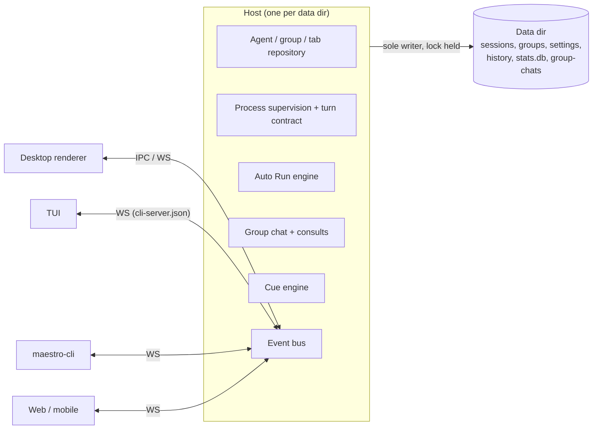
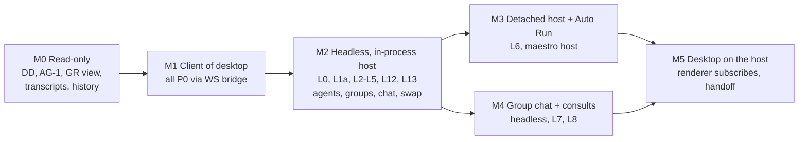

# Maestro TUI: Requirements

| Field     | Value                                                                                                                                               |
| --------- | --------------------------------------------------------------------------------------------------------------------------------------------------- |
| Status    | Draft, for review                                                                                                                                   |
| Date      | 2026-09-25                                                                                                                                          |
| Purpose   | Define a terminal UI for Maestro that runs on `maestro-lib` alone, and use it to prove the library can host Maestro with no Electron                |
| Builds on | `Plans/maestro-lib-decisions.md`, `Plans/maestro-lib-verification.md`, `Plans/maestro-lib-turn-contract.md`, `Plans/maestro-lib-migration-audit.md` |
| Base      | `feat/maestro-lib-integration`                                                                                                                      |

---

## 1. Why a TUI

The TUI is a **test harness for maestro-lib that happens to be useful**. If a
second, independent surface can create agents, chat, run Auto Run, run group
chats, and swap providers using only the library, then the library is real.
If it cannot, every workaround the TUI needs is a library gap with a name.

**Boundary rule (hard):** code under `src/tui/` imports only from the public
entry of `src/shared/maestro-lib/` and from `src/tui/` itself. An ESLint
`no-restricted-imports` rule enforces this, in the same spirit as the existing
`no-desktop-framework.smoke.test.ts`. A TUI feature that needs to reach around
the library is blocked until the library grows the missing piece (section 7).

The second goal: a headless Maestro on a server or over SSH, with the same data
the desktop app would see if it were opened on that machine.

---

## 2. Where things stand

`maestro-lib` today is the **turn execution layer**: provider definitions,
capabilities, output parsers, argument building, SSH wrapping, binary
detection, the streaming line reader, and `resolveTurnOutcome`. It does not yet
hold the **domain layer**: agents, groups, tabs, Auto Run, group chat. That
layer is where the TUI's four feature areas live.

| Area                    | Logic lives today                                                                                                                       | Headless today?                               |
| ----------------------- | --------------------------------------------------------------------------------------------------------------------------------------- | --------------------------------------------- |
| Agent CRUD, edit        | Renderer hooks: `useSessionCrud`, `useSessionLifecycle.handleSaveEditAgent`; duplicated in `useAppRemoteEventListeners`                 | No. Main is a dumb `sessions:setAll` store    |
| Groups                  | Renderer: `useGroupManagement`; main stores via `groups:setAll`                                                                         | No                                            |
| Prompt assembly         | Renderer: `useInputProcessing`, `agentStore`, `useAgentExecution`                                                                       | No                                            |
| Spawn and stream        | Main `ProcessManager` (streaming) and CLI `spawnAgent` (no streaming callbacks)                                                         | Partly. Parsers and args are in the library   |
| Auto Run, document mode | Two engines: renderer `useBatchRunner` (1,560 lines, IPC bound) and CLI `batch-processor.ts` (generator, no IPC)                        | CLI engine yes, but lacks worktrees, steering |
| Auto Run, goal mode     | Two engines: renderer `useGoalRunner` and CLI `goal-runner.ts`; shared rules in `src/shared/goalDriven/`                                | CLI engine yes                                |
| Spec packs              | `speckit-manager.ts`, `openspec-manager.ts` via `spec-command-manager.ts` (imports Electron `app`)                                      | No                                            |
| Group chat              | Main `src/main/group-chat/` (about 5k lines); turn progression in `process-listeners/exit-listener.ts`; UI via `webContents.send`       | No                                            |
| Cross-agent `@mention`  | Parsed in renderer (`crossAgentMentions.ts`), routed in main (`cross-agent-router.ts`); `maestro-cli ask` goes main to renderer to main | No                                            |
| Provider swap           | Renderer `switchTabProvider` (preserves tabs). CLI `update-agent --provider` path **destroys tabs** (`aiTabs: [freshTab]`)              | No, and the two paths disagree                |

The CLI proves reading the data directory without Electron works. It also
shows the limit: every CLI mutation of agents or groups requires the desktop app
to be running, because the renderer owns that state.

---

## 3. The central decision: who owns the data directory

"TUI and desktop share one data directory" sounds like a path problem. It is an
ownership problem.

- The desktop renderer holds agents and groups in memory and rewrites
  `maestro-sessions.json` and `maestro-groups.json` wholesale (`setAll`) every
  few seconds while an agent streams. Main does not watch those files. **Any
  outside write is silently overwritten.**
- The CLI writes `maestro-settings.json` and `maestro-agent-configs.json`
  directly with a plain read-modify-write, no lock, no atomic rename. It works
  because main watches those two files and the writes are rare.
- `stats.db`, `cue.db`, and group chat directories have one writer: main.

A TUI that writes these files beside a running desktop loses data. So:

### D1. One host per data directory

Exactly one process, the **host**, owns writes to a data directory. Every
surface (desktop renderer, TUI, `maestro-cli`, web, mobile) is a **client** of
that host.



The host is either:

- **Desktop main**, when the app is running. The TUI connects over the existing
  WebSocket bridge, discovered through `cli-server.json`.
- **A headless host**, `maestro host`, when it is not. It takes a data-dir lock
  (PID, boot time, heartbeat; generalize `cue-engine-lock.ts` from the
  standalone Cue stack), and publishes `cli-server.json` exactly as the desktop
  does, so the TUI and `maestro-cli` cannot tell the difference.

### D2. The TUI talks to one interface

The TUI programs against a `MaestroClient` interface in the library. One
implementation speaks the WebSocket protocol. The TUI never learns which host
it is attached to beyond a status-bar label.

### D3. The headless host is the standalone Cue engine, grown

`cue-headless-pipeline-export.md` already withdrew a separate daemon and
extended `maestro-cli cue engine start`. The headless host should be that same
process with more services in it, not a second daemon competing for the same
lock.

### D4. The host is a library object first, a process second

The library exports `createMaestroRuntime(dataDir)`: the repository, process
supervision, event bus, and lock, with no network in it. Three things wrap it:

1. Electron main, today's desktop.
2. The TUI itself, **in-process**, when no host holds the data dir. This is the
   first headless milestone (M2) and it exercises the library directly, with
   no protocol in between.
3. `maestro host`, a detached process that serves the same object over the
   WebSocket bridge (M3). Auto Runs and group chats take a long time and an SSH
   drop must not kill them, so the TUI starts a detached host when asked, and
   quitting the TUI leaves it running. `maestro host stop` refuses while work is
   in flight unless `--force`.

Until M3, a long run over SSH needs `tmux`. That is an acceptable v1 limit.

### How this squares with the launch-and-control RFC

That RFC (section 7, Q1) declines a central "runner kernel" every surface must
spawn through, and keeps completion policy with each caller. The host does not
reopen that. It owns **writes, process lifetime, and events**; how a caller
decides a turn ended stays with the caller, via the turn contract.

### Options considered

| Option                                                         | Verdict                                                                                                                                    |
| -------------------------------------------------------------- | ------------------------------------------------------------------------------------------------------------------------------------------ |
| O1. TUI is only a client of a running desktop                  | Fails the headless goal. Kept as the first milestone (M1) because it costs little                                                          |
| O2. TUI writes the store files itself, with a lock             | Rejected. The desktop renderer overwrites sessions and groups; a lock does not stop that                                                   |
| O3. One host per data dir, all surfaces are clients (D1 to D4) | **Chosen.** Headless needs a library-side repository (L1a). The desktop keeps its renderer ownership until M5, which retires the duplicate |
| O4. Detached daemon from day one                               | Rejected for v1. The in-process host (D4.2) proves the library sooner; the daemon is the same object behind a socket, added in M3          |

> [!NOTE]
> The desktop does **not** have to change for the TUI to run headless. Its
> renderer stays the owner of agent state while it runs, and the TUI reaches it
> over the bridge (M1). Headless, the library repository (L1a) owns the files.
> The two never run against one data dir at once (CO-5, Q1). Moving the desktop
> onto the library repository (L1b, M5) is what removes the duplicate CRUD, and
> it is the riskiest change here, but it is cleanup, not the critical path.

---

## 4. Functional requirements

Priority: **P0** ships in v1, **P1** follows directly, **P2** later.

### 4.1 Data directory (DD)

| ID   | P   | Requirement                                                                                                                                                                                                       |
| ---- | --- | ----------------------------------------------------------------------------------------------------------------------------------------------------------------------------------------------------------------- |
| DD-1 | P0  | Resolve the data dir with the library's `resolveUserDataDir()` (from the standalone Cue stack): `MAESTRO_USER_DATA`, then platform default with the correct `Maestro` / `maestro` spelling, then the dev redirect |
| DD-2 | P0  | Honor `maestro-bootstrap.json` `customSyncPath` for sessions, groups, settings, group chats, and session images. The CLI ignores it today and reads stale files when a sync path is set                           |
| DD-3 | P0  | `--data-dir <path>` and `--dev` override. The resolved path is always visible (status bar, `maestro tui --doctor`)                                                                                                |
| DD-4 | P0  | Never create an empty data dir. If none resolves, say which paths were tried                                                                                                                                      |
| DD-5 | P0  | Round-trip unknown fields. A record written by a newer desktop (rc has fields main does not) must survive a TUI edit byte for byte outside the changed keys                                                       |
| DD-6 | P1  | Refuse writes when an on-disk schema version is newer than the library understands, and say so, instead of guessing                                                                                               |

### 4.2 Coexistence (CO)

| ID   | P   | Requirement                                                                                                                                             |
| ---- | --- | ------------------------------------------------------------------------------------------------------------------------------------------------------- |
| CO-1 | P0  | The TUI never writes a store file directly. Every mutation goes to the host                                                                             |
| CO-2 | P0  | Changes made in the desktop appear in the TUI live (event subscription), and the reverse                                                                |
| CO-3 | P0  | Several TUIs attach to one host at once                                                                                                                 |
| CO-4 | P0  | The TUI never changes the desktop's active agent, active tab, or window state. Its own selection, collapse state, and layout live in a TUI-local file   |
| CO-5 | P1  | Desktop started while a headless host holds the lock: a handoff (Q1). Until decided, the desktop refuses to start and names the host PID                |
| CO-6 | P1  | If the host dies, the TUI shows it, keeps the screen readable, and reconnects when a host returns. A stale lock (dead PID or no heartbeat) is reclaimed |

### 4.3 Agents (AG)

| ID   | P   | Requirement                                                                                                                                                                                                                                |
| ---- | --- | ------------------------------------------------------------------------------------------------------------------------------------------------------------------------------------------------------------------------------------------ |
| AG-1 | P0  | Agent list with state color (green idle, yellow busy, red error, orange connecting), unread marker, provider badge, and group tree                                                                                                         |
| AG-2 | P0  | Create: name (default from folder via `defaultAgentNameForPath`), provider (installed ones only, with detected version), working directory (path completion, checked with `unusableCwdReason`), group, model, effort                       |
| AG-3 | P0  | Create and edit, advanced: custom binary path, custom args, env vars (blank value means unset, per `isBlankEnvValue`), SSH remote from the configured list, Auto Run folder (default `.maestro/playbooks`), nudge and new-session messages |
| AG-4 | P0  | Edit every field above. A working-directory change is blocked when `workingDirectoryChangeBlocker` says so, with its reason                                                                                                                |
| AG-5 | P0  | Rename, delete. Delete confirms and states what is removed and what is kept (history, transcripts)                                                                                                                                         |
| AG-6 | P1  | Create a worktree agent under a parent (same path as `maestro-cli create-worktree`, landing in the configured Worktree Directory)                                                                                                          |
| AG-7 | P1  | SSH agents fail loudly when the remote cannot be resolved. Never run locally in its place                                                                                                                                                  |

### 4.4 Groups (GR)

| ID   | P   | Requirement                                                                                      |
| ---- | --- | ------------------------------------------------------------------------------------------------ |
| GR-1 | P0  | Create (name, emoji), rename, delete. Deleting a group moves its agents out; it deletes no agent |
| GR-2 | P0  | Move an agent between groups, and to ungrouped                                                   |
| GR-3 | P0  | Collapse and expand in the TUI only (CO-4)                                                       |

### 4.5 Chat (CH)

Not in the original list, but group chat, mentions, and provider swap are
meaningless without it. Treated as P0.

| ID   | P   | Requirement                                                                                                                                                                 |
| ---- | --- | --------------------------------------------------------------------------------------------------------------------------------------------------------------------------- |
| CH-1 | P0  | AI tabs per agent: list, new, switch, rename, close. Close moves to closed-tab history; it never destroys a transcript                                                      |
| CH-2 | P0  | Multi-line composer. Send. The turn gets the same system prompt, conductor profile, nudge, and template variables the desktop would send (L12)                              |
| CH-3 | P0  | Streamed output rendered as terminal markdown: headings, lists, tables, code fences with highlighting, collapsed tool calls, thinking shown or hidden per the thinking mode |
| CH-4 | P0  | Interrupt the turn. Messages sent while busy go to the same execution queue the desktop uses                                                                                |
| CH-5 | P0  | A tab started in the TUI resumes in the desktop with its transcript, and the reverse                                                                                        |
| CH-6 | P1  | Status line: provider, model, effort, context usage, cost                                                                                                                   |
| CH-7 | P1  | Read-only mode toggle; provider slash commands passed through                                                                                                               |
| CH-8 | P2  | Images by file path                                                                                                                                                         |

### 4.6 Auto Run (AR)

| ID    | P   | Requirement                                                                                                                                                                 |
| ----- | --- | --------------------------------------------------------------------------------------------------------------------------------------------------------------------------- |
| AR-1  | P0  | Browse the agent's Auto Run folder: documents, task counts (done / total), last run                                                                                         |
| AR-2  | P0  | Create a document: blank from a template, opened in `$EDITOR`; validated for the mandatory `- [ ]` task format with line-level warnings                                     |
| AR-3  | P1  | Create documents with the agent: run a SpecKit or OpenSpec command, or the planning prompt, and land the resulting phase documents in the folder                            |
| AR-4  | P0  | **Spec-driven run** (document mode): select documents; selection order is run order; loop and reset-on-completion; per-run model and effort override                        |
| AR-5  | P0  | **Goal-driven run**: goal text, exit condition, iteration cap, using `src/shared/goalDriven/` rules                                                                         |
| AR-6  | P0  | Live progress: current document and task, run clock (paused time excluded), tokens and cost, output tail                                                                    |
| AR-7  | P0  | Controls: stop; on error pause, resume / skip / abort; answer a HITL gate; halt marker honored; stall guard (`evaluateStall`) trips at the same point as the other surfaces |
| AR-8  | P0  | Runs record AUTO history entries in the shared schema, so the desktop History panel and Usage Dashboard count them                                                          |
| AR-9  | P1  | Run in a worktree                                                                                                                                                           |
| AR-10 | P2  | Steering notes mid-run                                                                                                                                                      |

### 4.7 Group chat (GC)

| ID   | P   | Requirement                                                                                      |
| ---- | --- | ------------------------------------------------------------------------------------------------ |
| GC-1 | P0  | List, create (name, moderator, participant agents), rename, delete                               |
| GC-2 | P0  | Send a message; watch the moderator route, participants reply (streamed), and the synthesis land |
| GC-3 | P0  | Per-participant status; stop the chat                                                            |
| GC-4 | P0  | Same storage as the desktop. A chat started in one surface continues in the other                |
| GC-5 | P1  | `@participant` addressing inside the chat                                                        |

### 4.8 Cross-agent mentions (XM)

| ID   | P   | Requirement                                                                                                                                            |
| ---- | --- | ------------------------------------------------------------------------------------------------------------------------------------------------------ |
| XM-1 | P0  | `@` in the composer opens fuzzy autocomplete over agents. Picking a group expands into its member agents; a group is never a target itself             |
| XM-2 | P0  | A consult is single-turn and fully background on the consulted agent: no tab chip, no unread signal there. The answer renders inline in the asking tab |
| XM-3 | P0  | Read-only by default. A writable delegation states the permission it grants                                                                            |
| XM-4 | P1  | Fan-out to several agents in one message, answers shown per agent                                                                                      |

### 4.9 Provider swap (PS)

| ID   | P   | Requirement                                                                                                                                                                        |
| ---- | --- | ---------------------------------------------------------------------------------------------------------------------------------------------------------------------------------- |
| PS-1 | P0  | Change an agent's provider from edit. Every tab survives. Each tab's provider session, usage, model, and effort are parked under the old provider and restored when switching back |
| PS-2 | P0  | A turn in flight finishes and is attributed to the provider that started it                                                                                                        |
| PS-3 | P0  | Provider-specific agent overrides (custom path, args, env, model) are parked per provider, not cleared. Whatever is cleared is listed in a notice                                  |
| PS-4 | P0  | Only installed providers are offered                                                                                                                                               |
| PS-5 | P0  | One implementation in the library, used by desktop, TUI, and `maestro-cli update-agent --provider` (which today destroys tabs)                                                     |

### 4.10 Settings (ST)

| ID   | P   | Requirement                                                                                                                                                 |
| ---- | --- | ----------------------------------------------------------------------------------------------------------------------------------------------------------- |
| ST-1 | P0  | Read the shared settings: provider defaults, per-provider agent configs, SSH remotes, conductor profile, prompt customizations, thinking mode, Encore flags |
| ST-2 | P0  | Encore gating is shared: a feature the user switched off in the desktop is off in the TUI                                                                   |
| ST-3 | P1  | Edit the settings above through the host                                                                                                                    |
| ST-4 | P1  | Theme: map the active desktop theme to truecolor, degrade to 256 colors                                                                                     |
| ST-5 | P0  | TUI-only preferences (keymap, layout, view state) live in `maestro-tui.json`, not in `maestro-settings.json`                                                |

---

## 5. Interaction design

### 5.1 Layout

```text
┌ Agents ─────────────┬ Maestro · claude-code · opus · tab: lib-audit ─────────────┐
│ ▾ 🎼 Core            │                                                            │
│   ● Maestro      2  │  transcript (markdown, streaming)                          │
│   ● Cue             │                                                            │
│   ◐ Pedsidian       │                                                            │
│ ▸ 🌐 Web (3)         │                                                            │
│ ─ Group Chats ─     │                                                            │
│   💬 lib review      ├────────────────────────────────────────────────────────────┤
│                     │ > @Cue does the engine lock survive a PID namespace?_      │
├─────────────────────┴────────────────────────────────────────────────────────────┤
│ host: desktop pid 4121 · data: ~/Library/Application Support/Maestro · ctx 38% $1.12 │
└──────────────────────────────────────────────────────────────────────────────────┘
```

Views: **Agents** (left), **Conversation** (center: AI tab or group chat),
**Auto Run** (replaces center: document list, run config, live progress),
**Edit** forms (overlay). Minimum size 80 by 24; the agent pane collapses below
100 columns.

### 5.2 Reaching things

Every view has three ways in, adapted from the desktop rule: a **key**, a
**command palette** entry (`Ctrl-K`), and a place in the **agent menu** (`m` on
an agent). Every overlay leaves with `Esc` and shows that hint on screen.

| Key              | Action                         |
| ---------------- | ------------------------------ |
| `Ctrl-K`         | Command palette                |
| `Tab` / `S-Tab`  | Cycle panes                    |
| `j` `k` / arrows | Move in lists                  |
| `Enter`          | Open agent / send message      |
| `n` / `e` / `d`  | New / edit / delete agent      |
| `g`              | Group actions                  |
| `t` / `T`        | New tab / tab switcher         |
| `a`              | Auto Run view                  |
| `c`              | Group chats                    |
| `p`              | Swap provider                  |
| `Ctrl-C`         | Interrupt turn (twice to quit) |
| `?`              | Key help                       |

Bindings match the desktop's where a terminal can carry them (no `Cmd`), and
are rebindable in `maestro-tui.json`.

---

## 6. Non-functional requirements

| ID   | Requirement                                                                                                                                           |
| ---- | ----------------------------------------------------------------------------------------------------------------------------------------------------- |
| NF-1 | Runs on a Linux server over SSH with no Electron and no display installed                                                                             |
| NF-2 | Node version and native modules match `maestro-cli`. The headless host also needs `better-sqlite3` and `node-pty` (maestro-p); ship prebuilt binaries |
| NF-3 | First paint under 500 ms on attach to a running host                                                                                                  |
| NF-4 | Streaming a long turn does not flicker or re-render finished transcript entries                                                                       |
| NF-5 | macOS and Linux at v1. Windows (Windows Terminal) at P2, and the host inherits the Windows spawn rules from the launch-and-control RFC                |
| NF-6 | Keyboard-only operation. Mouse is optional                                                                                                            |
| NF-7 | A TUI crash leaves no orphan agent process and no torn file: the host owns processes and writes                                                       |
| NF-8 | Library tests carry the domain logic. TUI tests cover rendering and key handling (`ink-testing-library` or equivalent)                                |
| NF-9 | No em or en dashes in UI copy, per repo rule                                                                                                          |

---

## 7. Library gaps the TUI forces

This is the real backlog. Each gap blocks the TUI requirements listed.

| ID  | Gap                                                                                                                                                                                                                                                                               | Blocks             |
| --- | --------------------------------------------------------------------------------------------------------------------------------------------------------------------------------------------------------------------------------------------------------------------------------- | ------------------ |
| L0  | **A public entry point and a client in the library.** `src/shared/maestro-lib/index.ts` does not exist; consumers import module paths. `MaestroClient` lives in `src/cli/services/maestro-client.ts`, outside the library. Both move before the TUI boundary rule can be enforced | Section 1, D2      |
| L1a | **Agent, group, and tab repository with domain commands** (create, edit, delete, move, rename tab, close tab) in the library, with the same rules the renderer hooks apply today. Required for any headless host                                                                  | AG, GR, CH-1, CO-1 |
| L1b | **Desktop moves onto L1a.** The renderer becomes a subscriber; `useSessionCrud`, `useGroupManagement`, and the duplicate in `useAppRemoteEventListeners` are deleted. Cleanup, gated to M5                                                                                        | M5, R1             |
| L2  | **Host runtime** `createMaestroRuntime(dataDir)`: owns the repository, process supervision, event bus, and data-dir lock. Electron main, the TUI (in-process), and `maestro host` (detached, publishes `cli-server.json`) wrap it                                                 | D1 to D4, CO       |
| L3  | **Streaming turn API** for clients: event stream per turn (text, tool, usage, outcome). `ProcessManager` streams but imports `@sentry/electron` through `utils/sentry`; the CLI `spawnAgent` does not stream                                                                      | CH-3, AR-6, GC-2   |
| L4  | **Paths provider**: `resolveUserDataDir()` plus `customSyncPath`, replacing `app.getPath` in group chat storage, `spec-command-manager`, `prompt-manager`, `history-manager`                                                                                                      | DD, GC, AR-3       |
| L5  | **Store I/O without `electron-store`**: same tab-indented JSON, atomic write, unknown keys preserved, corrupt-store quarantine (`createStoreDeserializer`)                                                                                                                        | DD-5, L2           |
| L6  | **One Auto Run engine**: CLI `batch-processor` and `goal-runner` as the base; port error pause, HITL, worktrees, and steering from the renderer engine; desktop moves onto it                                                                                                     | AR                 |
| L7  | **Group chat off Electron**: turn progression out of `exit-listener.ts`, `groupChatEmitters` behind the event bus                                                                                                                                                                 | GC                 |
| L8  | **Consults without the renderer**: `maestro-cli ask` currently goes main, renderer, main                                                                                                                                                                                          | XM                 |
| L9  | **Provider swap in the library** (`switchTabProvider` plus per-provider override parking); CLI path fixed to use it                                                                                                                                                               | PS                 |
| L10 | **Execution queue** semantics in the library, including dispatch-failure recovery                                                                                                                                                                                                 | CH-4               |
| L11 | **Transcript entry model** shared, so each surface renders what the other wrote                                                                                                                                                                                                   | CH-5               |
| L12 | **Prompt assembly**: system prompt, conductor profile, nudge, new-session message, template variables. In the renderer today; without it a TUI turn is a different agent than a desktop turn                                                                                      | CH-2, XM, AR       |
| L13 | **History and stats writes** through the host, so TUI work appears in History, Usage Dashboard, and the agent-run ledger                                                                                                                                                          | AR-8, CH           |

---

## 8. Milestones



| Milestone | Exit test                                                                                                                                                               |
| --------- | ----------------------------------------------------------------------------------------------------------------------------------------------------------------------- |
| M0        | TUI opens the same data dir as the installed app, on macOS and Linux, and lists agents, groups, tabs, and transcripts identical to the desktop                          |
| M1        | With the desktop running, every P0 requirement works from the TUI, and every change shows in the desktop live. Nothing in `src/tui/` imports outside the library        |
| M2        | Desktop not installed, TUI hosting in-process. Create an agent, chat, swap provider and back with all tabs intact, then open the data dir in the desktop and see it all |
| M3        | `maestro host` detached. A spec-driven and a goal-driven run complete headless, survive an SSH disconnect, and show in desktop History                                  |
| M4        | A group chat started in the TUI finishes headless and reads correctly in the desktop; an `@mention` consult returns inline                                              |
| M5        | The desktop renderer holds no authoritative agent state; desktop start with a headless host running follows the Q1 decision                                             |

M1 is not throwaway: the WebSocket `MaestroClient` it builds is the same client
M2 onward uses. The rc bridge's generic `bridge.invoke` reaches any IPC handler,
which makes M1 cheap, but the TUI must call named library client methods, not
raw IPC channel names, or M2 breaks it.

---

## 9. Non-goals (v1)

File preview and editor, Document Graph, Usage Dashboard, Director's Notes, Cue
pipeline editor (Cue runs in the host; editing stays in YAML and the desktop),
plugins, marketplace, Symphony, browser and terminal tabs, media player, image
annotation, mobile, live sync between two machines.

---

## 10. Risks

| ID  | Risk                                                                                                                 | Mitigation                                                                                  |
| --- | -------------------------------------------------------------------------------------------------------------------- | ------------------------------------------------------------------------------------------- |
| R1  | L1b moves the desktop's source of truth. Regressions land in the main product, not the TUI                           | Library repository first, renderer mirrors it behind a flag, then flip (M5)                 |
| R2  | main and rc store different shapes; a surface on one drops the other's fields                                        | DD-5 round-trip tests with rc-shaped fixtures                                               |
| R3  | `customSyncPath` on iCloud or Dropbox: two machines share one data dir, and a PID lock means nothing across machines | Detect a cloud-synced path and refuse a headless host there unless `--force`                |
| R4  | Terminal rendering cost on long streamed turns                                                                       | Finished entries render once (Ink `<Static>` or equivalent); only the live entry re-renders |
| R5  | Native modules (`node-pty`, `better-sqlite3`) in a headless install                                                  | Same prebuilt set the CLI and standalone Cue engine ship                                    |
| R6  | Parity pull: every desktop feature asks to be in the TUI                                                             | Section 9 is the gate; new TUI scope needs a library gap to justify it                      |
| R7  | The library stack is off `rc` and unmerged; building the TUI on `main` would fork it                                 | Base the TUI branch on the top of the maestro-lib stack                                     |

---

## 11. Open questions

| ID  | Question                                                                             | Recommendation                                                                                                                                                                     |
| --- | ------------------------------------------------------------------------------------ | ---------------------------------------------------------------------------------------------------------------------------------------------------------------------------------- |
| Q1  | Desktop launched while a headless host owns the data dir                             | Desktop offers **Take over**: host waits for or stops in-flight work with consent, flushes, releases; TUIs reconnect to the desktop. Desktop-as-client is the end state but not v1 |
| Q2  | Distribution: `maestro-cli tui` subcommand or a separate `maestro` binary            | Separate bundle (`maestro-tui.js`) in app Resources, launched by `maestro-cli tui`, so the CLI does not load React on every call                                                   |
| Q3  | Framework: Ink (React 18, same idiom as the renderer) or OpenTUI (faster, Bun-first) | Ink. The team knows React, and R4 has a known fix                                                                                                                                  |
| Q4  | Is 1:1 chat (section 4.5) in v1 scope                                                | Yes. Three of the four requested areas depend on it                                                                                                                                |
| Q5  | Does the headless host run Cue by default                                            | Yes, if Cue is enabled in Encore settings, since it is the same process (D3)                                                                                                       |
| Q6  | Is the TUI a Maestro product surface (docs, releases) or an internal proving tool    | Internal until M2 passes, then decide                                                                                                                                              |
