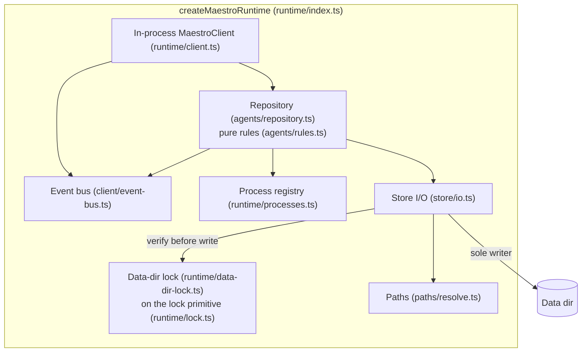
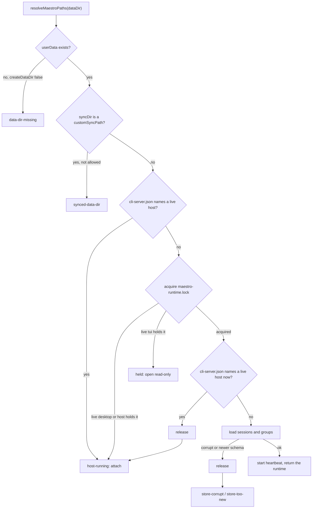

# Maestro TUI: the library runtime

| Field      | Value                                                                                                     |
| ---------- | --------------------------------------------------------------------------------------------------------- |
| Status     | Design. Phase 5, task 1: written before any runtime code                                                  |
| Date       | 2026-10-04                                                                                                |
| Covers     | Requirements section 3 (req-D1, req-D4), gaps L1a, L2, L4, L5, requirements CO-5, DD-5, DD-6              |
| Implements | `MaestroClient` (`Plans/maestro-tui-client-api.md`) in process, for the agent, group, tab, settings parts |
| Surveyed   | `maestro-tui` at `379a40b68`, and the store files of a live install (formats only, no contents)           |

Decision names: `req-Dn` is in `Plans/maestro-tui-requirements.md`, `lib-Dn` in `Plans/maestro-lib-decisions.md`, `Cn` in the client API doc. Decisions made here are `RT1` to `RT16` (section 12).

---

## 1. What the runtime is

`createMaestroRuntime()` returns the object that owns writes to one data directory when no desktop does. The requirements call it the host (req-D4); the code calls it the runtime because `src/shared/maestro-lib/host.ts` already names the seam for services the library borrows (logger, error reporter, capability snapshots, image refs).

It has no network in it. Three wrappers hold it (req-D4): the TUI in process (Phase 5, task 7), `maestro-cli host` detached and serving the bridge (Phase 7), and Electron main behind a setting (Phase 9).



### 1.1 What it owns, and how that respects lib-D2

lib-D2 keeps the run layer thin: the library starts, frames, and stops a process and reports how it ended, and each caller keeps its own rule for what a turn amounted to. The runtime hosts that layer. It is not a kernel that absorbs the callers' policies.

| The runtime owns                                                                                                                                                            | It does not own                                                                                                                                                                                           |
| --------------------------------------------------------------------------------------------------------------------------------------------------------------------------- | --------------------------------------------------------------------------------------------------------------------------------------------------------------------------------------------------------- |
| **Writes.** While it holds the data-dir lock it is the only writer of the files it changes (section 5), and it writes nothing it does not own.                              | **Completion policy.** Auto Run's "the box is checked", group chat's "a participant that printed text has responded", a consult's "exit 0 plus text". Those engines consume runtime events (Phases 7, 8). |
| **Process lifetime.** Every agent process it starts is registered; every stop goes through `stopProcess()` at the caller's first stage (lib-D5) and the quit cap (lib-D5b). | **Stream interpretation.** Turn events come from the library parsers through `startTurn`. The desktop keeps `StdoutHandler` (lib-D3).                                                                     |
| **Events.** One bus. An event leaves only after its change is on disk.                                                                                                      | **Outcomes.** `resolveTurnOutcome` is reported as is: no retry, no reinterpretation.                                                                                                                      |
|                                                                                                                                                                             | **Prompt assembly (L12) and the execution queue (L10).** Library modules the runtime calls in Phase 6, not runtime internals.                                                                             |
|                                                                                                                                                                             | **View state (CO-4).** Active agent, which tab type is shown, selection, collapse. The runtime keeps stored view fields valid and never moves them otherwise.                                             |

---

## 2. API

```ts
// src/shared/maestro-lib/runtime/index.ts

export type RuntimeLockMode = 'desktop' | 'tui' | 'host';

export interface MaestroRuntimeOptions {
	/** The user data dir the caller resolved (`resolveUserDataDir`, `--data-dir`, `--dev`). Never read from env here. */
	dataDir: string;
	/** Agent configs directory in a dev run. Default: `resolveProductionDataDir(dataDir)`. */
	productionDataDir?: string;
	/** Who hosts, written into the lock: `tui` (Phase 5), `host` (Phase 7), `desktop` (Phase 9). */
	mode: RuntimeLockMode;
	/** Create `dataDir` when it does not exist. Default false: DD-4 never creates one implicitly. */
	createDataDir?: boolean;
	/** Host on a `customSyncPath` anyway (risk R3). Default false. */
	allowSyncedDataDir?: boolean;
	/** Quarantine a corrupt sessions or groups file as the desktop does, and start from defaults. Default false. */
	quarantineCorruptStores?: boolean;
	/** Test seams: clock, pid, pid probe, boot time, hostname, id factory. */
	deps?: Partial<RuntimeDeps>;
}

export type RuntimeStart =
	| { ok: true; runtime: MaestroRuntime }
	| { ok: false; refusal: RuntimeRefusal };

export type RuntimeRefusal =
	/** A desktop or a detached host serves this dir. `attachable` is false while it has not published `cli-server.json` yet. */
	| { reason: 'host-running'; host: HostInfo; attachable: boolean; message: string }
	/** Another runtime that serves nothing (a TUI hosting in process) holds the lock. Open read-only. */
	| { reason: 'held'; holder: RuntimeLockInfo; message: string }
	| { reason: 'data-dir-missing'; tried: string[]; message: string }
	| { reason: 'synced-data-dir'; syncDir: string; message: string }
	| { reason: 'store-corrupt'; file: string; detail: string; message: string }
	| { reason: 'store-too-new'; file: string; version: number; message: string }
	| { reason: 'lock-failed'; file: string; detail: string; message: string };

export interface MaestroRuntime extends MaestroClient {
	readonly paths: MaestroPaths;
	readonly lock: RuntimeLockInfo;
}

export function createMaestroRuntime(options: MaestroRuntimeOptions): Promise<RuntimeStart>;
```

- **Async**, because the stores are large: `maestro-sessions.json` was 12.6 MB on the surveyed install, `maestro-settings.json` 2.2 MB.
- **Refusals are values** (C4). `message` is safe to show and names the holder, its pid, mode, and start time (CO-5).
- **`connection.close()` is the shutdown**: flush, stop registered processes with the lib-D5b quit cap, stop the heartbeat, release the lock. The TUI already calls it on quit (`src/tui/index.tsx`). Calls after it answer `host-unavailable`.
- **`HostInfo`** is `{ kind: 'in-process', label: 'this TUI', startedAt }` with no `pid`, as the client API defines for a host that is this process.
- **Paths (L4).** The runtime resolves `MaestroPaths` once with `resolveMaestroPaths` (honoring `customSyncPath` and the dev production dir) and every store it touches, now and in later phases (history, group chats, session images), comes from that object, never from `app.getPath`.

---

## 3. Start rule

The first failing step refuses. No store file is written before step E holds the lock.



- **A live `cli-server.json`:** it parses (`parseCliServerInfo`), its pid answers `isPidAlive` (EPERM counts as alive: for a refusal the conservative answer is right), and its `startedAt` is after this boot began (boot time minus the 60 s tolerance). The last check stops a file left by a desktop that crashed in an earlier boot, whose pid now belongs to a stranger, from blocking every start.
- **Step F** closes the window where a desktop or host wrote `cli-server.json` between D and E.
- **The TUI's branch per refusal (task 7):**

| Refusal            | TUI                                                                                                         |
| ------------------ | ----------------------------------------------------------------------------------------------------------- |
| `host-running`     | Attach with `createWsMaestroClient`, as today. Not yet attachable: wait for discovery (`waiting-for-host`). |
| `held`             | Read-only file readers. Status: `read-only (TUI pid 812 holds this data dir)`.                              |
| `data-dir-missing` | Read-only with the paths tried. Offer to create it, which retries with `createDataDir: true`.               |
| `synced-data-dir`  | Read-only. `--force` retries with `allowSyncedDataDir: true`.                                               |
| `store-corrupt`    | Read-only, naming the file. `--recover` retries with `quarantineCorruptStores: true`.                       |
| `store-too-new`    | Read-only, naming the file and its version: "update maestro-cli".                                           |
| `lock-failed`      | Read-only, naming the file and the error.                                                                   |

---

## 4. Locks

### 4.1 The primitive (`runtime/lock.ts`)

It is today's Cue engine lock (`src/main/cue/cue-engine-lock.ts`) with the file name, timings, and environment lifted into parameters. Its history sets the bar: `558ae99e2` ("stop trusting a live PID alone as proof of the engine lock") was written after a SIGKILLed engine's lock named a pid that a reboot or container restart had handed to an unrelated process. The engine refused to start, `cue engine status` reported the stranger, and `cue engine stop` sent it SIGTERM (reproduced in a Linux container, where it killed an unrelated `sleep`). The fix added the boot time, a heartbeat, and atomic `wx` creation. The primitive keeps all three.

```ts
export interface ProcessLockSpec {
	/** File name inside the directory: 'cue-engine.lock', 'maestro-runtime.lock'. */
	fileName: string;
	/** How often the owner refreshes the heartbeat. 30_000 for both locks. */
	heartbeatMs: number;
	/** A heartbeat older than this is stale even with a live pid. 180_000: six missed beats. */
	staleMs: number;
	/** Two boot-time readings closer than this are one boot. 60_000: os.uptime() is coarse. */
	bootToleranceMs: number;
}

export interface ProcessLockDeps {
	pid: number;
	now(): number;
	/** Epoch ms the system booted: Date.now() - os.uptime() * 1000. */
	bootTime(): number;
	isPidAlive(pid: number): boolean;
	hostname(): string | undefined;
}

export interface ProcessLockInfo<M extends string = string> {
	pid: number;
	mode: M;
	/** ISO time the lock was acquired. */
	startedAt: string;
	/** ISO time of the last beat. Older files lack it; startedAt stands in. */
	heartbeatAt?: string;
	/** Epoch ms the owner's system booted. Older files lack it. */
	bootTime?: number;
	/** A hint for a person reading the file. Never trusted. */
	host?: string;
}

export type ProcessLockState<M extends string = string> =
	| { state: 'none' }
	| { state: 'unreadable' }
	| { state: 'live'; info: ProcessLockInfo<M> }
	| {
			state: 'stale';
			info: ProcessLockInfo<M>;
			reason: 'process gone' | 'earlier boot' | 'heartbeat quiet';
	  };

export interface ProcessLock<M extends string = string> {
	readonly file: string;
	/** Full answer, with the reason a lock is stale. The doctor reads this. */
	inspect(): ProcessLockState<M>;
	/** The live holder, or null for missing, corrupt, or stale. */
	holder(): ProcessLockInfo<M> | null;
	acquire(mode: M): { acquired: true } | { acquired: false; heldBy: ProcessLockInfo<M> };
	touch(mode: M): 'held' | 'lost';
	release(): void;
}

export function createProcessLock<M extends string>(
	dir: string,
	spec: ProcessLockSpec,
	deps?: Partial<ProcessLockDeps>
): ProcessLock<M>;

/** setInterval(spec.heartbeatMs), unref'd. Calls onLost once when touch() answers 'lost', then stops. */
export function startLockHeartbeat<M extends string>(
	lock: ProcessLock<M>,
	mode: M,
	spec: ProcessLockSpec,
	onLost: () => void
): () => void;
```

Behavior, identical to the Cue lock today:

| Operation | Rule                                                                                                                                                                                                                                                                    |
| --------- | ----------------------------------------------------------------------------------------------------------------------------------------------------------------------------------------------------------------------------------------------------------------------- |
| File      | `JSON.stringify(info, null, 2)`, UTF-8. A file without a numeric `pid` and a string `mode` is unreadable. A missing `startedAt` reads as epoch 0.                                                                                                                       |
| Live      | pid alive, AND (no `bootTime` or within the tolerance of this boot), AND `now - (heartbeatAt ?? startedAt) <= staleMs`. Checked in that order, which gives `inspect()` its reason.                                                                                      |
| `acquire` | Creates the directory. Up to 3 attempts: a live other holder refuses; a live self rewrites the file (re-acquire is a no-op success); a stale or corrupt file is unlinked and recreated with `wx`; `EEXIST` loops. After 3 attempts it refuses with the holder it reads. |
| `touch`   | A live other holder answers `lost` and the file is left alone. Otherwise the heartbeat is rewritten, keeping this process's `startedAt`; a missing file is recreated. A failed write is ignored (the next beat retries).                                                |
| `release` | A no-op while another live process holds it. Otherwise unlink, ignoring a missing file.                                                                                                                                                                                 |
| Sync fs   | All calls stay synchronous: the Cue engine calls them from `start()` and `stop()`, which are synchronous.                                                                                                                                                               |

**The pid probe is a per-lock dependency (RT4).** The Cue lock keeps its own probe, where any error from `process.kill(pid, 0)` (EPERM included) means "not alive", so its behavior does not change. The data-dir lock uses the discovery probe `isPidAlive`, where EPERM means "alive": a sandboxed process can get EPERM for a live process of the same user, and for a lock that guards two writers, refusing is the safe mistake. Boot time and heartbeat still catch a reused pid.

### 4.2 The Cue lock, re-pointed (task 3)

`src/main/cue/cue-engine-lock.ts` keeps its path, exports, and signatures: `cue-engine.ts`, `cli/commands/cue-engine.ts`, and `cue-trigger.ts` import it, and 12 Cue test files `vi.mock` it by path. Each function builds `createProcessLock(dataDir ?? resolveUserDataDir(), CUE_ENGINE_LOCK_SPEC, cueLockDeps)` per call, so a `MAESTRO_USER_DATA` a test sets before a call is read at that call, as today. `CUE_ENGINE_LOCK_HEARTBEAT_MS` and `CUE_ENGINE_LOCK_STALE_MS` stay exported with the same values. `src/__tests__/main/cue/cue-engine-lock.test.ts` runs unmodified.

`paths/doctor.ts` duplicates the Cue staleness rule today (`DOCTOR_CUE_LOCK_STALE_MS`, `DOCTOR_CUE_BOOT_TOLERANCE_MS`, `CUE_ENGINE_LOCK_FILE_NAME`), with a parity test, only because shared code could not import `src/main`. With the primitive in the library the doctor reads both locks through `inspect()` with its injected deps, the three constants become fields of `CUE_ENGINE_LOCK_SPEC`, and the parity test checks the spec against main's exported values. The doctor's output does not change; it gains a line for `maestro-runtime.lock`.

### 4.3 The data-dir lock (`runtime/data-dir-lock.ts`)

| Property  | Value                                                                                                                                                                                                        |
| --------- | ------------------------------------------------------------------------------------------------------------------------------------------------------------------------------------------------------------ |
| File      | `<userData>/maestro-runtime.lock`, beside `cli-server.json` and `cue-engine.lock`. In userData, not the sync dir: a pid means nothing on another machine, so a synced dir is refused instead (risk R3, RT9). |
| Spec      | The Cue lock's timings: 30 s beat, 180 s stale, 60 s boot tolerance.                                                                                                                                         |
| Modes     | `desktop` (the desktop app, task 6, and Phase 9), `tui` (a TUI hosting in process; serves nothing, so others open read-only), `host` (`maestro-cli host`, Phase 7; serves the bridge, so others attach).     |
| Acquire   | `acquireDataDirLock(paths, mode, deps)`: steps D, E, F of section 3. Returns the lock or a `RuntimeRefusal`.                                                                                                 |
| Heartbeat | `startLockHeartbeat`. On each beat it also re-checks `cli-server.json`.                                                                                                                                      |
| Fence     | Before every store write, the lock must still name this pid and `cli-server.json` must name no other live host. If either fails, or the heartbeat answers `lost`, the runtime is **fenced** (below).         |

**Fenced** means: every later mutation answers `host-lost` ("Another Maestro took over this data directory"), registered processes are stopped at the terminate stage (their output could no longer be recorded), `host.lost` is emitted with the reason, and the TUI drops to read-only. The realistic trigger is a TUI suspended with Ctrl-Z past the stale window while a second one started: without the check, its next write would overwrite the new owner's state.

### 4.4 The desktop guard (CO-5, task 6)

`claimDataDirForDesktop(userDataDir, deps)` in `src/main/app-lifecycle/data-dir-guard.ts`, testable with the lock mocked.

- **Where it runs (RT3).** In `src/main/index.ts` right after `process.env.MAESTRO_USER_DATA = app.getPath('userData')` and before `initializeStores()`. Store setup writes at module load (`installationId`, `hasPriorInstallation`, `runSettingsMigrations`), and `requestSingleInstanceLock` runs about 470 lines later, after those writes. A guard placed beside the single-instance lock would already have written the settings file under a headless runtime.
- **What it does (RT2).** It acquires the data-dir lock in mode `desktop`, not only checks it:

| Lock state               | Desktop                                                                                                                                                                                                                                  |
| ------------------------ | ---------------------------------------------------------------------------------------------------------------------------------------------------------------------------------------------------------------------------------------- |
| Free, stale, or corrupt  | Acquire. Start the heartbeat when the app is ready; the quit handler releases it.                                                                                                                                                        |
| Live `tui` or `host`     | `dialog.showErrorBox` naming the pid, mode, start time, and host, with how to stop it (quit that TUI, or `maestro-cli host stop` from Phase 7), then `app.exit(0)`. `showErrorBox` is safe before `ready`; on Linux it prints to stderr. |
| Live `desktop` (another) | Continue without touching the lock. `requestSingleInstanceLock` quits this instance and focuses the first, as today.                                                                                                                     |

- **Why acquire.** The desktop writes `cli-server.json` only once its window and web server are up, seconds after its stores load. A TUI starting in that gap sees no desktop and would host beside it. Holding the lock from before the first store write makes the two exclusive, and it is the state Phase 9 reaches anyway (the runtime inside main takes this lock in mode `desktop`).
- **Q1 (take over) stays out.** The dialog only quits, per CO-5 until Q1 is decided.
- **Older desktops** neither take nor check the lock. Against them the runtime has the `cli-server.json` checks (start, every beat, every write) and the fence. Writes made after such a desktop loaded its stores and before it published `cli-server.json` can be overwritten by its next flush (risk R-RT1).

### 4.5 Beside a standalone Cue engine

The two locks are independent and guard different files, so a standalone engine and a runtime run side by side on one data dir.

| Process                                         | Lock                   | Writes                                                                    | Reads                                                        |
| ----------------------------------------------- | ---------------------- | ------------------------------------------------------------------------- | ------------------------------------------------------------ |
| Standalone Cue (`maestro-cli cue engine start`) | `cue-engine.lock`      | `cue.db`, its lock, its trigger inbox                                     | `maestro-sessions.json`, settings, agent configs, `cue.yaml` |
| Runtime, mode `tui` (Phase 5)                   | `maestro-runtime.lock` | sessions, groups, closed-tab archive, an agent's playbooks file on delete | settings, agent configs                                      |
| Runtime, mode `host` (Phase 7)                  | both, when Cue runs    | the runtime's files, plus Cue's when it hosts Cue                         | the same                                                     |

- Neither writes the other's files. The engine reads `maestro-sessions.json`; the runtime writes it by rename, so a reader always sees a whole file.
- What both append to later (history JSONL, Phase 6) is append-only with `O_APPEND`, which two processes can share, as the CLI and desktop already do.
- **The in-process runtime never runs Cue (RT10).** The TUI is short-lived and interactive. Cue runs in the standalone engine or, from Phase 7, inside `maestro-cli host`, which takes the data-dir lock first and then tries the Cue lock: if a standalone engine holds it, the host runs without Cue and says so in `status` (req-D3, Q5). One primitive serves both locks in that process.
- The desktop's own Cue engine holds the Cue lock in mode `desktop`; that changes nothing here, since the runtime never runs beside a desktop.

---

## 5. Store I/O (`store/io.ts`, gap L5)

| Concern            | Rule                                                                                                                                                                                                                                                                                                                                                                                                                                                                                                           |
| ------------------ | -------------------------------------------------------------------------------------------------------------------------------------------------------------------------------------------------------------------------------------------------------------------------------------------------------------------------------------------------------------------------------------------------------------------------------------------------------------------------------------------------------------- |
| Format             | What electron-store (conf) writes: `JSON.stringify(doc, null, '\t')`, UTF-8, no BOM, no trailing newline. Verified on the live install: sessions, groups, settings, and both session-origin stores are tab-indented with no trailing newline and carry no `__internal__` key and no version marker.                                                                                                                                                                                                            |
| Round trip         | Parse with `parseStoreJson` (a BOM is tolerated). A command changes only the keys it owns on the object it read and writes that object back. `JSON.parse` keeps string keys in file order, so a conf-written file comes back byte-identical outside the changed keys (DD-5). A hand-edited file is normalized to conf's format on the first write, as the desktop's next write would do.                                                                                                                       |
| Atomic write       | `atomicWriteFile` moves from `src/main/utils/atomic-json-store.ts` into the library (`store/atomic-write.ts`) and main re-exports it, the same hoist as `keyedWriteQueue`: `${file}.tmp` in the same directory, then rename, EPERM and EBUSY retried 3 times at 100, 200, 400 ms (the Windows OneDrive and antivirus case `group-chat-storage.ts` hit). `assertSerializedJsonIsSafe` gates the payload before the temp file exists. A crash between the temp write and the rename leaves the original intact.  |
| Wipe backup        | A write that would replace a non-empty sessions or groups list with an empty one first snapshots the old list to `maestro-sessions.backup.json` or `maestro-groups.backup.json` (`backupRegistryBeforeWipe`, hoisted with the same file names).                                                                                                                                                                                                                                                                |
| Schema (DD-6, RT7) | No store has a marker today, so the library defines one: a top-level integer `maestroSchemaVersion`. Absent means 1, today's shapes. Reads always work. A write to a file whose marker exceeds the library's known version for that file refuses with `store-too-new`, naming the file and the version. The library never stamps the marker: stamping would break byte identity and tells no current build anything. The change that first makes an incompatible shape stamps it, in the writer of that shape. |
| Corrupt            | The desktop recovers a corrupt store by quarantining it to `<name>.corrupt-<stamp>.json` and starting from defaults. The runtime refuses by default and quarantines only when asked (RT8): a torn read of a file another process is writing (a sync client mid-download, an older desktop) looks like corruption, and a headless surface that silently started empty would then write that emptiness back.                                                                                                     |
| Missing            | Sessions and groups start from conf's defaults (`{ "sessions": [] }`, `{ "groups": [] }`) and are created on the first write.                                                                                                                                                                                                                                                                                                                                                                                  |
| Writes             | Serialized per file through `createKeyedWriteQueue`, and preceded by the fence check (4.3).                                                                                                                                                                                                                                                                                                                                                                                                                    |

The runtime writes only sessions, groups, the closed-tab archive (6.5), and an agent's playbooks file on delete in Phase 5. Settings and agent configs are read fresh on each call, because the CLI writes them directly (`writeSettingValue`, `writeAgentConfigValue`); a runtime write to them (ST-3) is later work and would re-read before writing.

---

## 6. Repository (`agents/repository.ts`, gap L1a)

### 6.1 State and the mutation queue

- **One in-memory copy** of each owned document, as read (DD-5). Records handed to a client are projections without `aiTabs[].logs` (R6); a stored object is never handed out.
- **Commands are pure rules plus an executor.** A rule in `agents/rules.ts` takes the documents and the input and returns the next documents, the events, and any effects (stop processes, archive a tab, delete a file). Rules are generic over structural record types, as `switchAgentProvider` already is, so the desktop can call the same functions on its own state in L1b (Phase 9).
- **Write-through, commit after write (RT5).** One queue per runtime runs commands one at a time. A command computes its next documents, performs its effects in order, writes, and only then replaces the in-memory copy and emits. A failed write leaves memory and listeners as they were and answers `failed` with the error. So `ok` means applied and on disk, and a failure leaves no trace (stronger than the bridge's C13, which can report `appliedFields`).
- **Phase 6 composes with this.** Turn output is folded into the in-memory documents through the same queue (no write per chunk) and flushed on a debounce (2 s, like the desktop) and at turn end. A command's write carries those folds along, and since nothing else mutates memory while a command's write is in flight, reverting a failed command cannot drop a fold.
- **Multi-file commands** write in the order whose partial result is safe:

| Command       | Order                                         | If the second write fails                                                          |
| ------------- | --------------------------------------------- | ---------------------------------------------------------------------------------- |
| `removeGroup` | sessions (ungroup members), then groups       | Members ungrouped, the group still listed and empty. Nothing lost.                 |
| `closeTab`    | closed-tab archive, then sessions             | The tab is still open and also archived. Reopen dedupes by tab id. Nothing lost.   |
| `removeAgent` | sessions, then the archive and playbooks file | The agent is gone; an orphaned file stays. Logged, the command still answers `ok`. |

### 6.2 Commands

Every command validates against LIVE process state from the registry (6.6), never the stored `state` or `aiPid`: the desktop persists every agent as idle, so the stored values cannot say whether a process runs. A tab command on a hidden consult tab answers `not-found` (hidden tabs are not listed and raise no events).

| Command            | Client method      | Replaces (desktop / remote duplicate)                                                                                                           | Rules (ported to `agents/rules.ts` unless noted)                                                                                                                                                                                                                                                                                                                                                                                                                                                                                                                                                                                                                                                                                                                                                                                                                                                              | Writes                       | Events                                         |
| ------------------ | ------------------ | ----------------------------------------------------------------------------------------------------------------------------------------------- | ------------------------------------------------------------------------------------------------------------------------------------------------------------------------------------------------------------------------------------------------------------------------------------------------------------------------------------------------------------------------------------------------------------------------------------------------------------------------------------------------------------------------------------------------------------------------------------------------------------------------------------------------------------------------------------------------------------------------------------------------------------------------------------------------------------------------------------------------------------------------------------------------------------- | ---------------------------- | ---------------------------------------------- |
| `createAgent`      | `agents.create`    | `useSessionCrud.createNewSession` / `maestro:remoteCreateSession`                                                                               | Name trimmed, 1 to 100 characters, unique case-insensitively (`validateNewSession`); the same-directory warning stays a warning the form shows by calling the rule. Provider a known id, not `terminal`. Local cwd usable (`unusableCwdReason`). Blank env dropped (`stripBlankEnvVars`). One fresh AI tab, `saveToHistory` and `showThinking` from the settings defaults (as `buildSettingsSnapshot` reads them). `cwd`, `fullPath`, `projectRoot`, `shellCwd` all the cwd. `autoRunFolderPath` `<cwd>/.maestro/playbooks` unless given. `customEffort` trimmed. `contextWindowSource: 'user-edited'` only with a window. `claudeInteractive: { mode: 'api', modeReason: 'auto' }` for `claude-code`. `unifiedTabOrder` holds the tab.                                                                                                                                                                       | sessions                     | `agent.added`                                  |
| `updateAgent`      | `agents.update`    | `useSessionLifecycle.handleSaveEditAgent` / `remoteUpdateSessionCwd`, `remoteUpdateSessionSsh`, `remoteUpdateSessionConfig`, `setAutoRunFolder` | One transaction (RT12). `cwd`: `withWorkingDirectory` (its pure half, ported), refused whole by `workingDirectoryChangeBlocker` while a process runs. `ssh`: merged, `enabled ?? false`, `remoteId ?? null`, refused while a process runs. `provider`: `switchAgentProvider`, its `unparked` messages become `notices`, the other fields applied on top (the desktop order). Config: the remote allowlist (`customModel`, `customEffort`, `customContextWindow`, `contextWindowSource`, `customPath`, `customArgs`, `customEnvVars`, `nudgeMessage`, `newSessionMessage`, `bookmarked`, and the maestro-p keys), `null` clears, clearing the window clears its provenance. Auto Run folder: must list (local only in Phase 5; an SSH agent answers `unsupported`), the first document becomes `autoRunSelectedFile`, the cached `autoRunContent` is cleared and its version bumped so the desktop reloads it. | sessions                     | `tab.updated` per changed tab, `agent.updated` |
| `renameAgent`      | `agents.rename`    | `useSessionCrud.finishRenamingSession` / `maestro:remoteRenameSession`                                                                          | Trimmed, 1 to 100 characters, unique (`validateEditSession`).                                                                                                                                                                                                                                                                                                                                                                                                                                                                                                                                                                                                                                                                                                                                                                                                                                                 | sessions                     | `agent.updated`                                |
| `removeAgent`      | `agents.remove`    | `useSessionLifecycle.performDeleteSession` / `maestro:remoteDeleteSession`                                                                      | Stop every process of the agent first, every tab, not only the legacy `-ai` id (fixes G6 here). Remove the record. If `activeSessionId` named it, it moves to the first survivor in stored order, or `''` when none survive (the survivor the desktop picks; unlike the desktop, a pointer naming another agent is left alone, CO-4). Delete `<userData>/playbooks/<id>.json` and the agent's closed-tab archive. Kept: history, provider session files, the working directory (AG-5). Worktree children keep their dangling `parentSessionId`, as on the desktop.                                                                                                                                                                                                                                                                                                                                            | sessions, archive, playbooks | `agent.removed`                                |
| `createGroup`      | `groups.create`    | `CreateGroupModal` / `maestro:remoteCreateGroup`                                                                                                | Name trimmed, non-empty, upper-cased. `validateGroupAppearance`. Emoji defaults to U+1F4C2. Id `group-<uuid>`. `kind: 'user'`, `collapsed: false`. A parent must pass `canCreateGroupInside` (one level).                                                                                                                                                                                                                                                                                                                                                                                                                                                                                                                                                                                                                                                                                                     | groups                       | `groups.changed`                               |
| `renameGroup`      | `groups.rename`    | `useGroupManagement.finishRenamingGroup` / `maestro:remoteRenameGroup`                                                                          | Trimmed, non-empty, upper-cased.                                                                                                                                                                                                                                                                                                                                                                                                                                                                                                                                                                                                                                                                                                                                                                                                                                                                              | groups                       | `groups.changed`                               |
| `removeGroup`      | `groups.remove`    | Left Bar delete / `maestro:remoteDeleteGroup`                                                                                                   | Members become ungrouped, child groups move up (`removeGroupAndPromoteChildren`). No agent is deleted, a `worktree` group included (GR-1): `useSessionCrud.deleteWorktreeGroup`, which deletes the group's agents, is not ported.                                                                                                                                                                                                                                                                                                                                                                                                                                                                                                                                                                                                                                                                             | sessions, groups             | `agent.updated` per member, `groups.changed`   |
| `moveAgentToGroup` | `groups.moveAgent` | `useGroupManagement.handleDropOnGroup`, `handleDropOnUngrouped`, `useSessionCrud.handleGroupCreated` / `maestro:remoteMoveSessionToGroup`       | The group must exist; `null` is ungrouped. Worktree children (`parentSessionId`) follow their parent.                                                                                                                                                                                                                                                                                                                                                                                                                                                                                                                                                                                                                                                                                                                                                                                                         | sessions                     | `agent.updated` per moved agent                |
| `createTab`        | `tabs.create`      | `createTab` (`tabHelpers`) as the `new_tab` handler calls it, in the background                                                                 | A fresh tab with the settings defaults, inserted after the active tab in `unifiedTabOrder` (`insertAfterActiveInUnifiedTabOrder`, ported). `activeTabId` unchanged (CO-4).                                                                                                                                                                                                                                                                                                                                                                                                                                                                                                                                                                                                                                                                                                                                    | sessions                     | `tab.added`, `agent.updated`                   |
| `renameTab`        | `tabs.rename`      | `useSessionLifecycle.handleRenameTab`, AI branch / `rename_tab`                                                                                 | Trimmed; empty clears the name to `null` so the session id label shows again. `isGeneratingName` cleared.                                                                                                                                                                                                                                                                                                                                                                                                                                                                                                                                                                                                                                                                                                                                                                                                     | sessions                     | `tab.updated`, `agent.updated`                 |
| `closeTab`         | `tabs.close`       | `closeTab` (`tabHelpers`) as `close_tab` calls it                                                                                               | Archive first (6.5). Remove from `aiTabs` and `unifiedTabOrder`. If it was active, `activeTabId` moves to the visible left neighbor in strip order. A fresh tab is created only when no tab of any type survives; `''` when only non-AI tabs survive. Never touches the file, terminal, or browser active ids or `inputMode` (CO-4), where the desktop helper may switch the view to a terminal tab.                                                                                                                                                                                                                                                                                                                                                                                                                                                                                                          | archive, sessions            | `tab.removed` (+ `tab.added`), `agent.updated` |
| `starTab`          | `tabs.star`        | `useSessionLifecycle.toggleTabStar` / `star_tab`                                                                                                | Sets the value; it does not toggle, so a retry is harmless.                                                                                                                                                                                                                                                                                                                                                                                                                                                                                                                                                                                                                                                                                                                                                                                                                                                   | sessions                     | `tab.updated`, `agent.updated`                 |
| `updateTab`        | `tabs.update`      | `maestro:remoteUpdateSessionConfig`, tab branch                                                                                                 | The `TAB_EDITABLE_KEYS` allowlist with its type checks (`asThinkingMode` for `showThinking`); `null` drops the override.                                                                                                                                                                                                                                                                                                                                                                                                                                                                                                                                                                                                                                                                                                                                                                                      | sessions                     | `tab.updated`, `agent.updated`                 |

Rules reused as they are: `switchAgentProvider`, `workingDirectoryChangeBlocker`, `isSameDirectory`, `rebasePathOntoRoot`, `canCreateGroupInside`, `canSetGroupParent`, `removeGroupAndPromoteChildren`, `validateGroupAppearance`, `stripBlankEnvVars`, `unusableCwdReason`, `visibleAiTabsOf`. Rules ported out of the renderer into `agents/rules.ts`: `validateNewAgent` (from `validateNewSession`), `validateAgentRename` (from `validateEditSession`), `buildAgentRecord`, `buildTabRecord`, `withWorkingDirectory` (the path half; the renderer version keeps clearing its own file-tree caches on top), `applyAgentConfigPatch` with `AGENT_EDITABLE_KEYS`, `applyTabPatch` with `TAB_EDITABLE_KEYS`, `mergeSshPatch`, `buildGroupRecord`, `normalizeGroupName`, `insertAfterActiveInUnifiedTabOrder`, `closeTabRecord`. The WebSocket client's inline input checks (name required and at most 100 characters, known provider, non-empty cwd) move into the same file, so a client-side pre-check and the runtime cannot disagree.

### 6.3 Where the two renderer copies disagree today

The duplicate in `useAppRemoteEventListeners.ts` has drifted from the hooks, and group creation has a third copy in `CreateGroupModal`. The library takes one side for each (RT13):

| Rule                             | Desktop hook                                      | Remote listener           | Library                             |
| -------------------------------- | ------------------------------------------------- | ------------------------- | ----------------------------------- |
| Unique name on create            | refused (`validateNewSession`)                    | not checked               | refused                             |
| Unique name on rename            | Edit dialog checks; inline rename does not        | not checked               | refused                             |
| `customEffort` trimmed           | yes                                               | no                        | yes                                 |
| `claudeInteractive` default      | `api`, `auto` for Claude                          | unset                     | the desktop's                       |
| Local cwd exists on create       | not checked (the form validates only an SSH path) | not checked               | refused (`unusableCwdReason`, AG-2) |
| Delete: per-agent playbooks file | deleted                                           | kept                      | deleted                             |
| Delete: a busy tab's process     | only the legacy `-ai` id is killed (G6)           | same                      | every process of the agent          |
| Move to group: worktree children | follow the parent                                 | stay behind               | follow                              |
| Group create (id, case, emoji)   | `CreateGroupModal`                                | the listener, same values | one rule                            |

### 6.4 Side effects the desktop performs that Phase 5 does not

| Effect                                                                                                          | Desktop trigger                    | Runtime                                                                                      |
| --------------------------------------------------------------------------------------------------------------- | ---------------------------------- | -------------------------------------------------------------------------------------------- |
| Provider session name and star into `maestro-claude-session-origins.json`, `maestro-agent-session-origins.json` | agent rename, tab rename, tab star | Phase 6, with L13, through store I/O. They key on provider session ids, which turns produce. |
| History relabel (`history:updateSessionName`)                                                                   | tab rename                         | Phase 6, with the history writer.                                                            |
| Starred transcript mirror                                                                                       | tab star                           | Desktop only until L1b.                                                                      |
| Stats: agent created, closed                                                                                    | create, delete                     | Phase 6, with `stats.db`.                                                                    |
| Git probe (`isGitRepo`, branches, tags)                                                                         | create                             | Not ported: a cache the desktop refreshes when it opens the dir.                             |
| Active agent, window ownership, focus                                                                           | create                             | Never (CO-4).                                                                                |
| Trash the working directory                                                                                     | delete, opt-in                     | Never in v1 (AG-5 keeps it).                                                                 |
| Worktree re-discovery suppression                                                                               | delete                             | With worktree agents (AG-6).                                                                 |

### 6.5 Closed tabs (CH-1, G13)

The desktop keeps closed tabs only in memory: `useDebouncedPersistence` strips `closedTabHistory`, and `useSessionRestoration` resets it to `[]` on load. A closed tab the runtime wrote into the agent record would therefore be erased by the desktop's first flush. So the runtime keeps its own archive (RT6):

- `<syncDir>/closed-tabs/<agentId>.json` (ids are UUIDs; any other character is percent-encoded), in the store format: `{ "closedTabs": [ { "tab": {...}, "index": 3, "closedAt": 1759600000000 } ] }`, newest first. The entry is the desktop's `ClosedTab` shape, so L1b can load it straight into `closedTabHistory`.
- Bounded like the desktop: 25 tabs per agent (`MAX_CLOSED_TAB_HISTORY`), each tab's logs capped at `MAX_PERSISTED_SESSION_LOGS` (100), the cap the sessions file already applies. A tab that falls off the end still has its provider session file (resumable by `agentSessionId`) and its History entries, as on the desktop.
- Written before the sessions record (6.1), so a close can never lose a transcript.
- `tabs.closed` and `tabs.reopen` stay deferred methods; the archive is what lets them exist without a desktop.

### 6.6 Process registry (`runtime/processes.ts`)

The seam for process lifetime. Empty in Phase 5; Phase 6 registers every turn it starts.

```ts
export interface ProcessRegistry {
	register(agentId: string, tabId: string, turn: TurnHandle): void;
	isBusy(agentId: string, tabId?: string): boolean;
	stopTab(agentId: string, tabId: string, firstStage: StopStage): Promise<void>;
	stopAgent(agentId: string, firstStage: StopStage): Promise<void>;
	/** Quit: lib-D5b caps a pipe-backed agent at SIGTERM. */
	stopAll(options: { upTo: 'terminate' }): Promise<void>;
}
```

- A user interrupt starts at the interrupt stage; a tab close, an agent delete, and a fence start at terminate (lib-D5).
- `workingDirectoryChangeBlocker` and the SSH refusal read `isBusy`, not the stored record.
- NF-7: the runtime registers a `process.on('exit')` handler that releases the lock and kills registered children best-effort, so a crash leaves no orphan it could have stopped. Signals belong to the wrapper (the TUI owns Ctrl-C), which calls `connection.close()`. A torn file is impossible by construction (atomic rename).

---

## 7. Event bus (`client/event-bus.ts`)

The WebSocket client already has a bus: a listener set, `emit` with per-listener try/catch through the library `logger`, and `matchesFilter` (`ws-client.ts`). It moves into `client/event-bus.ts` and both implementations use it (RT15), so delivery and filtering cannot differ between them.

- Same `MaestroEvent` and `EventFilter` as the client API (section 4.9 there). Listeners run synchronously in emit order; a throwing listener is logged and the others still run.
- **Emitted only after commit (RT16):** a listener never sees a change that is not on disk.
- **Order per command**, matching the client's rule: `tab.*` first, then one `agent.updated` (6.2 lists them per command). Group removal emits the members' `agent.updated` before `groups.changed`.
- Records carry no transcripts (R6). Hidden tabs raise no tab events.
- `snapshot` follows `host.connected` on the first `connection.connect()`.
- `settings.changed`: the runtime watches the settings file (the CLI writes it directly), debounced 250 ms, and emits the top-level keys whose values changed (`valuesEqual` from `client/mirror.ts`).
- `host.lost` when fenced (4.3), with the reason.

---

## 8. The `MaestroClient`, in process (task 5)

| Namespace    | Phase 5                                                                                                                                                                                                                                                                       | Later                                                                    |
| ------------ | ----------------------------------------------------------------------------------------------------------------------------------------------------------------------------------------------------------------------------------------------------------------------------- | ------------------------------------------------------------------------ |
| `connection` | `discover`, `connect`, `reconnect` answer the runtime's `HostInfo`; the first `connect` emits `host.connected` and `snapshot`; `state()` is `connected` until `close()`, which shuts the runtime down (section 2).                                                            | Phase 7 serves the same object over the bridge, so other clients attach. |
| `agents`     | `list` and `get` from memory, projected; `create`, `update`, `rename`, `remove` through the repository. `update` never returns `appliedFields`: it is all or nothing.                                                                                                         | `createWorktree` with AG-6.                                              |
| `groups`     | `list` from memory; `create`, `rename`, `remove`, `moveAgent` through the repository.                                                                                                                                                                                         |                                                                          |
| `tabs`       | `list` is `visibleAiTabsOf`; `create`, `rename`, `close`, `star`, `update` through the repository; `transcript` reads the stored logs through `transcriptOf` with `sinceMs` and `tail`, the slicing helper moved out of `ws-client.ts` into `store/transcript.ts` and shared. | `closed`, `reopen` over the archive.                                     |
| `turns`      | Every method answers `unsupported`. `subscribe` returns a no-op unsubscribe.                                                                                                                                                                                                  | Phase 6.                                                                 |
| `autoRun`    | `unsupported`.                                                                                                                                                                                                                                                                | Phase 7.                                                                 |
| `groupChats` | `unsupported`.                                                                                                                                                                                                                                                                | Phase 8.                                                                 |
| `consults`   | `unsupported`.                                                                                                                                                                                                                                                                | Phase 8.                                                                 |
| `settings`   | `get` reads `maestro-settings.json` fresh; `subscribe` per section 7; `sshRemotes` is the `sshRemotes` key.                                                                                                                                                                   | `set` (ST-3).                                                            |
| `providers`  | `list`: `getVisibleAgentDefinitions()` with `checkBinaryExists`, or `checkCustomPath` for a provider-level custom path in the agent configs; local only, cached 60 s. An `sshRemoteId` answers `unsupported`. `models` answers `unsupported`.                                 | Phase 6: SSH probing and model lists through the run layer.              |
| `events`     | The bus.                                                                                                                                                                                                                                                                      |                                                                          |

The TUI needs `providers.list` to create an agent in process (AG-2), so it is in Phase 5 although the task names only agents, groups, tabs, and settings.

---

## 9. Module layout and the Phase 5 tasks

All under `src/shared/maestro-lib/`, imports limited to the library, `src/shared`, and Node (the `no-shared-to-main-imports` rule and `no-desktop-framework.smoke.test.ts`). No `host/` directory.

| File                                              | Holds                                                                                    | Task |
| ------------------------------------------------- | ---------------------------------------------------------------------------------------- | ---- |
| `store/atomic-write.ts`                           | `atomicWriteFile`, moved from `src/main/utils/atomic-json-store.ts`, which re-exports it | 2    |
| `store/io.ts`                                     | Read and write in the store format, schema marker, wipe backup, corrupt-file handling    | 2    |
| `runtime/lock.ts`                                 | `createProcessLock`, `startLockHeartbeat`, the spec and deps types                       | 3    |
| `src/main/cue/cue-engine-lock.ts`                 | Thin wrappers over the primitive, same exports                                           | 3    |
| `runtime/data-dir-lock.ts`                        | `RUNTIME_LOCK_SPEC`, `acquireDataDirLock`, the live `cli-server.json` rule               | 3    |
| `paths/doctor.ts`                                 | Reads both locks through `inspect()`                                                     | 3    |
| `agents/rules.ts`                                 | The pure rules of 6.2                                                                    | 4    |
| `agents/closed-tabs.ts`                           | The archive (6.5)                                                                        | 4    |
| `agents/repository.ts`                            | The executor: queue, effects, writes, events                                             | 4    |
| `client/event-bus.ts`                             | The bus, moved out of `ws-client.ts`                                                     | 5    |
| `runtime/processes.ts`                            | The registry (6.6)                                                                       | 5    |
| `runtime/client.ts`                               | The in-process `MaestroClient`                                                           | 5    |
| `runtime/index.ts`                                | `createMaestroRuntime`                                                                   | 5    |
| `src/main/app-lifecycle/data-dir-guard.ts`        | `claimDataDirForDesktop` (4.4), called from `src/main/index.ts`                          | 6    |
| `src/tui/index.tsx`, `src/tui/app/agentSource.ts` | The three start branches and their status labels                                         | 7    |

`index.ts` exports `createMaestroRuntime` with its option, result, and refusal types, the lock primitive and data-dir lock (the desktop guard and the doctor use them), store I/O, and the pure rules (for L1b).

---

## 10. Testing

Every test that touches the filesystem uses a temp dir and passes it explicitly; the runtime never reads `MAESTRO_USER_DATA` itself, and the Cue lock tests already override it per test.

| Area           | Tests                                                                                                                                                                                                                                                             |
| -------------- | ----------------------------------------------------------------------------------------------------------------------------------------------------------------------------------------------------------------------------------------------------------------- |
| Store I/O      | rc-shaped fixtures round-trip byte-identical outside changed keys; unknown keys survive an edit; a crash between temp write and rename (rename failure injected) leaves the original; a newer marker refuses; an emptying write backs up first; EPERM is retried. |
| Lock primitive | Injected clock, pid probe, and boot time over a temp dir: acquire, refuse a live holder, each stale reason, re-acquire, `touch` `held` and `lost`, `release` leaves another holder's file. The Cue lock suite runs unmodified.                                    |
| Data-dir lock  | A live `cli-server.json` refuses (fake file and probe); one from an earlier boot does not; a holder in mode `tui` is named in the refusal; the step F re-check releases.                                                                                          |
| Repository     | Each command of 6.2, including: deleting a group deletes no agent; a failed write leaves memory and listeners unchanged; the archive is written before the sessions file; DD-5 unknown keys survive every command.                                                |
| Runtime        | Two runtimes on one temp dir: the second is refused and names the first (pid, mode). Recommended beside it: the contract suite of the client API doc (`client/__tests__/contract.ts`) run against both implementations for agents, groups, and tabs.              |
| Desktop guard  | The lock mocked: acquire, a live `tui` holder (dialog, exit), another desktop (continue).                                                                                                                                                                         |
| TUI            | Fakes for the three branches: desktop attach, in-process host (`host: this TUI`), held (read-only); the lock is released on quit.                                                                                                                                 |

---

## 11. What Phase 6 inherits

- Turn output folds through the mutation queue and flushes on a debounce; the storage-boundary transforms the desktop applies on `sessions:setAll` (`compactSessionToolOutputs`, the 100-entry log cap, image relocation) apply at the same boundary.
- Closing a tab with a running turn: the desktop keeps such a tab in `orphanedThinkingTabs` until the turn ends. Phase 6 decides the runtime's equivalent; the archive entry then receives the finished turn.
- The origin and history writes of 6.4 land with L13.
- Quitting the TUI stops its turns (lib-D5b cap). Long work needs `tmux` until Phase 7's detached host (req-D4, v1 limit).

---

## 12. Decisions

| ID   | Decision                                                                                                                                         | Why                                                                                                                                                                                 |
| ---- | ------------------------------------------------------------------------------------------------------------------------------------------------ | ----------------------------------------------------------------------------------------------------------------------------------------------------------------------------------- |
| RT1  | The code says runtime; the lock file is `<userData>/maestro-runtime.lock` with modes `desktop`, `tui`, `host`.                                   | `host.ts` already means the borrowed-services seam. userData because a pid means nothing on another machine.                                                                        |
| RT2  | The desktop acquires the data-dir lock (mode `desktop`) at startup, not only checks it.                                                          | Its `cli-server.json` appears seconds after its stores load; only the lock closes that start race. It is also the Phase 9 state.                                                    |
| RT3  | The desktop guard runs before `initializeStores()`, not beside the single-instance lock.                                                         | Store setup writes at module load, about 470 lines before `requestSingleInstanceLock`.                                                                                              |
| RT4  | One lock primitive serves the Cue lock and the data-dir lock; the pid probe is per lock.                                                         | One implementation, as the task asks. The Cue lock's behavior stays unchanged; the data-dir lock treats EPERM as alive because refusing is the safe mistake for a two-writer guard. |
| RT5  | Commands run one at a time and commit after their write lands.                                                                                   | `ok` means on disk, and a failure leaves no trace. Phase 6 folds stream output through the same queue without writing per chunk.                                                    |
| RT6  | Closed tabs go to a per-agent archive in the sync dir, bounded like the desktop, written before the sessions record.                             | The desktop erases `closedTabHistory` on load and on every flush, so the record cannot hold them.                                                                                   |
| RT7  | Schema marker: top-level `maestroSchemaVersion`, absent means 1, never stamped by the library.                                                   | No store has a marker today. Stamping would break DD-5 byte identity and tell no current build anything.                                                                            |
| RT8  | A corrupt sessions or groups file refuses the start; quarantine is opt-in.                                                                       | A torn read looks like corruption; starting empty would write the emptiness back.                                                                                                   |
| RT9  | A `customSyncPath` data dir refuses the start unless allowed.                                                                                    | Risk R3's recommended mitigation: a pid lock cannot see the other machine.                                                                                                          |
| RT10 | The in-process runtime never runs Cue; `maestro-cli host` composes the standalone engine (Phase 7).                                              | A TUI is short-lived. req-D3 and Q5 put Cue in the long-lived host.                                                                                                                 |
| RT11 | Lost lock, a desktop appearing, or a failed fence check fences the runtime: no further writes, processes stopped.                                | A suspended TUI resumed after another took over must not overwrite the new owner.                                                                                                   |
| RT12 | `agents.update` is one transaction in process.                                                                                                   | The bridge's ordering and `appliedFields` (C13) exist only because the bridge has no transaction.                                                                                   |
| RT13 | Where the renderer copies disagree, the library takes the desktop hook's rule (6.3). Two rules are new: the local cwd check (AG-2) and G6's fix. | The hooks are the GUI's tested path; the remote listener drifted from them.                                                                                                         |
| RT14 | The runtime validates against live process state, never the stored `state` or `aiPid`.                                                           | The desktop persists every agent as idle.                                                                                                                                           |
| RT15 | The WebSocket client's bus and filter move to `client/event-bus.ts`, shared by both implementations.                                             | One delivery rule, not two.                                                                                                                                                         |
| RT16 | Events leave only after their change is on disk.                                                                                                 | A listener never acts on a change a failed write undid.                                                                                                                             |

---

## 13. Risks

| ID    | Risk                                                                                                                                                                     | Mitigation                                                                                                      |
| ----- | ------------------------------------------------------------------------------------------------------------------------------------------------------------------------ | --------------------------------------------------------------------------------------------------------------- |
| R-RT1 | A desktop built before this change neither takes nor checks the lock. Started beside a TUI runtime, its next flush can overwrite writes made after it loaded its stores. | `cli-server.json` checked at start, on every beat, and before every write; the runtime fences when one appears. |
| R-RT2 | A desktop crashed in this boot and its pid was reused: `cli-server.json` looks live, so the runtime refuses and the TUI's attach is refused by the port.                 | The TUI shows both facts and `maestro-cli tui --doctor` reports the file. Rare on a desktop OS within one boot. |
| R-RT3 | Every command rewrites the whole sessions file (12.6 MB on the surveyed install).                                                                                        | Fine for commands a person issues. Turn output is folded in memory and flushed on a debounce (Phase 6).         |
| R-RT4 | A tab closed in the TUI is not in the desktop's reopen list (Cmd+Shift+T) until L1b reads the archive.                                                                   | Its transcript is safe in the archive, and the TUI's close message says where it went.                          |
