# ACP Message Flow - Sequence Diagram

## Complete Round-Trip Flow: User Message → OpenCode → UI Response

```mermaid
sequenceDiagram
    autonumber
    participant UI as InputArea.tsx<br/>(Renderer)
    participant App as App.tsx<br/>(Renderer)
    participant IPC as IPC Layer<br/>(Main)
    participant Handler as process.ts<br/>IPC Handler
    participant PM as ProcessManager<br/>(Main)
    participant ACP_Proc as ACPProcess<br/>(Main)
    participant ACP_Client as ACPClient<br/>(Main)
    participant Adapter as ACP Adapter<br/>(Main)
    participant OpenCode as OpenCode Process<br/>(External)
    participant Terminal as Terminal.tsx<br/>(Renderer)

    rect rgb(240, 248, 255)
        Note over UI,Terminal: PHASE 1: User Sends Message
        UI->>App: handleSubmit(message)
        App->>App: setSessions({ state: 'busy' })
        App->>IPC: window.maestro.process.spawn({<br/>prompt, useACP: true, acpShowStreaming })
    end

    rect rgb(255, 250, 240)
        Note over IPC,Handler: PHASE 2: IPC Routing
        IPC->>Handler: ipcMain.handle('process:spawn')
        Handler->>Handler: Check agentConfigValues.useACP
        Handler->>PM: processManager.spawn({<br/>useACP: true, acpShowStreaming })
    end

    rect rgb(240, 255, 240)
        Note over PM,ACP_Proc: PHASE 3: ACP Process Creation
        PM->>ACP_Proc: new ACPProcess(config)
        PM->>ACP_Proc: acpProcess.start()
        PM->>PM: Wire event handlers:<br/>acpProcess.on('data')
        Note over PM: Event handler converts<br/>ParsedEvent → string
    end

    rect rgb(255, 240, 240)
        Note over ACP_Proc,ACP_Client: PHASE 4: ACP Client Initialization
        ACP_Proc->>ACP_Client: client.connect()
        ACP_Client->>ACP_Client: spawn('opencode', ['acp'])
        ACP_Client->>OpenCode: stdin: {"jsonrpc":"2.0","method":"initialize",...}
        Note over ACP_Client: [ACP Transport]<br/>OUTBOUND REQUEST<br/>method: initialize
        
        OpenCode->>OpenCode: Start ACP server
        OpenCode->>ACP_Client: stdout: {"jsonrpc":"2.0","result":{agentInfo,...}}
        Note over ACP_Client: [ACP Transport]<br/>INBOUND RESPONSE<br/>initialized
        
        ACP_Client->>ACP_Proc: resolve(initResponse)
    end

    rect rgb(240, 240, 255)
        Note over ACP_Proc,OpenCode: PHASE 5: Session Creation
        ACP_Proc->>ACP_Client: client.newSession(cwd)
        ACP_Client->>OpenCode: stdin: {"jsonrpc":"2.0","method":"session/new",...}
        Note over ACP_Client: [ACP Transport]<br/>OUTBOUND REQUEST<br/>method: session/new
        
        OpenCode->>OpenCode: Create session in<br/>~/.local/share/opencode/storage/
        OpenCode->>ACP_Client: stdout: {"jsonrpc":"2.0","result":{sessionId:"..."}}
        Note over ACP_Client: [ACP Transport]<br/>INBOUND RESPONSE<br/>sessionId returned
        
        ACP_Client->>ACP_Proc: resolve({ sessionId })
        ACP_Proc->>ACP_Proc: this.acpSessionId = sessionId
        ACP_Proc->>Adapter: createSessionIdEvent(sessionId)
        ACP_Proc->>PM: emit('data', {type:'init', sessionId})
        PM->>IPC: emit('session-id', sessionId)
        IPC->>App: window.maestro.process.onSessionId()
    end

    rect rgb(255, 240, 255)
        Note over ACP_Proc,OpenCode: PHASE 6: Send Prompt
        ACP_Proc->>ACP_Proc: Reset tracking:<br/>streamedText = ''<br/>emittedTextLength = 0
        ACP_Proc->>ACP_Client: client.prompt(sessionId, text)
        ACP_Client->>OpenCode: stdin: {"jsonrpc":"2.0","method":"session/prompt",<br/>params:{sessionId, messages:[{role:"user",...}]}}
        Note over ACP_Client: [ACP Transport]<br/>OUTBOUND REQUEST<br/>method: session/prompt
    end

    rect rgb(240, 255, 255)
        Note over OpenCode,Terminal: PHASE 7: Streaming Response (Loop)
        loop For each text chunk
            OpenCode->>OpenCode: Generate response chunk
            OpenCode->>ACP_Client: stdout: {"jsonrpc":"2.0","method":"session/update",<br/>params:{sessionUpdate:"agent_message_chunk",<br/>content:{type:"text",text:"chunk"}}}
            Note over ACP_Client: [ACP Transport]<br/>INBOUND NOTIFICATION<br/>method: session/update
            
            ACP_Client->>ACP_Client: handleNotification()
            ACP_Client->>ACP_Client: normalizeSessionUpdate()
            Note over ACP_Client: Convert OpenCode format to ACP spec:<br/>{sessionUpdate:"agent_message_chunk",...}<br/>→ {agent_message_chunk:{content:...}}
            
            ACP_Client->>ACP_Proc: emit('session:update', sessionId, update)
            ACP_Proc->>Adapter: acpUpdateToParseEvent(update)
            Adapter->>Adapter: extractText(chunk.content)
            Adapter->>ACP_Proc: {type:'text', text:'chunk', isPartial:true}
            
            ACP_Proc->>ACP_Proc: Accumulation & Deduplication:<br/>streamedText += text<br/>if (length > emittedTextLength) {<br/>  newText = substring(emittedTextLength)<br/>  emittedTextLength = length<br/>  emit delta<br/>}
            
            ACP_Proc->>PM: emit('data', sessionId, {type:'text', text:deltaText})
            
            PM->>PM: Event handler logic:<br/>if (acpShowStreaming) {<br/>  emit('data', text)<br/>}<br/>if (isPartial) {<br/>  emit('thinking-chunk', text)<br/>}
            
            alt Streaming Enabled
                PM->>IPC: webContents.send('process:data', sessionId, deltaText)
                IPC->>App: window.maestro.process.onData(sessionId, data)
                App->>App: batchedUpdater.appendLog(<br/>sessionId, tabId, true, data)
                App->>App: setSessions: append to aiTabs[].logs[]
                App->>Terminal: React re-render with new log entry
                Terminal->>Terminal: Display chunk to user
            end
        end
    end

    rect rgb(255, 245, 230)
        Note over OpenCode,Terminal: PHASE 8: Completion
        OpenCode->>OpenCode: Response complete
        OpenCode->>ACP_Client: stdout: {"jsonrpc":"2.0","id":3,<br/>result:{stopReason:"end_turn"}}
        Note over ACP_Client: [ACP Transport]<br/>INBOUND RESPONSE<br/>prompt completed
        
        ACP_Client->>ACP_Proc: resolve({ stopReason: 'end_turn' })
        ACP_Proc->>Adapter: createResultEvent(sessionId, streamedText, stopReason)
        ACP_Proc->>PM: emit('data', sessionId, {type:'result', text:streamedText})
        
        alt Streaming Disabled
            PM->>IPC: webContents.send('process:data', sessionId, fullText)
            IPC->>App: window.maestro.process.onData(sessionId, fullText)
            App->>App: batchedUpdater.appendLog(<br/>sessionId, tabId, true, fullText)
            App->>App: setSessions: append to aiTabs[].logs[]
            App->>Terminal: React re-render with complete response
        end
        
        ACP_Proc->>PM: emit('exit', sessionId, 0)
        PM->>IPC: webContents.send('process:exit', sessionId, 0)
        IPC->>App: window.maestro.process.onExit(sessionId, 0)
        App->>App: setSessions({ state: 'idle' })
    end

    rect rgb(245, 245, 245)
        Note over UI,Terminal: PHASE 9: Follow-up Message (Reuses Session)
        UI->>App: handleSubmit(nextMessage)
        App->>App: setSessions({ state: 'busy' })
        App->>IPC: window.maestro.process.write(sessionId, nextMessage)
        IPC->>PM: processManager.write(sessionId, data)
        PM->>ACP_Proc: acpProcess.write(data)
        ACP_Proc->>ACP_Proc: Reset tracking:<br/>streamedText = ''<br/>emittedTextLength = 0
        ACP_Proc->>ACP_Client: client.prompt(acpSessionId, nextMessage)
        Note over ACP_Client,OpenCode: Repeat PHASE 6-8
    end
```



## Key Components

### 1. **Deduplication Logic** (ACP Process)
```typescript
// Track what we've accumulated vs emitted
streamedText += event.text;  // Accumulate ALL
if (currentLength > emittedTextLength) {
  newText = streamedText.substring(emittedTextLength);  // Extract delta
  emittedTextLength = currentLength;  // Update tracker
  emit('data', deltaEvent);  // Emit only new portion
}
```

### 2. **Streaming Control** (Process Manager)
```typescript
if (event.type === 'text' && acpShowStreaming) {
  emit('data', sid, event.text);  // Stream to UI
}
if (event.type === 'result' && !acpShowStreaming) {
  emit('data', sid, event.text);  // Final text only
}
```

### 3. **Transport Layer Logging**
All JSON-RPC messages logged with `[ACP Transport]` category:
- **OUTBOUND REQUEST**: `initialize`, `session/new`, `session/prompt`
- **INBOUND RESPONSE**: Method responses with results
- **INBOUND NOTIFICATION**: `session/update` events
- **OUTBOUND RESPONSE**: Responses to OpenCode's requests

### 4. **Session Persistence**
- Each `session/new` creates persistent session in OpenCode's storage
- Follow-up messages reuse same `sessionId`
- Session contains full conversation history
- Can be resumed later with `session/load`

### 5. **UI State Management**
- **Busy State**: Set when message sent, cleared on exit
- **Logs Array**: Accumulated in `aiTabs[].logs[]`
- **Batched Updates**: Multiple chunks batched for performance
- **Tab Isolation**: Each tab has own `agentSessionId`

## Config Flags

| Flag | Default | Effect |
|------|---------|--------|
| `useACP` | `false` | Enable ACP protocol (vs JSON stdout) |
| `acpShowStreaming` | `false` | Show chunks as they arrive (vs final only) |

## Debug Logging Categories

| Category | Content |
|----------|---------|
| `[ACP Transport]` | All JSON-RPC messages in/out |
| `[ACPClient]` | Connection, session lifecycle |
| `[ACPProcess]` | Process orchestration |
| `[ACPAdapter]` | Event conversion |
| `[ProcessManager]` | Process management |
