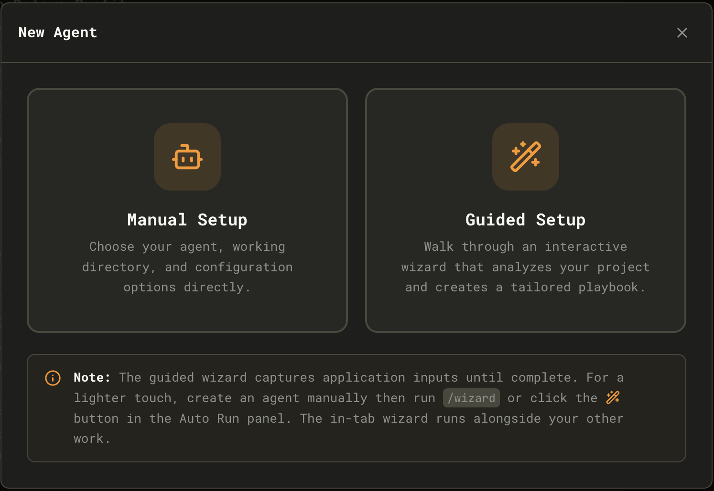

This guide gets you from install to a first productive session with Maestro.

## 1. Install and launch

Follow the [Installation](./installation) instructions for your platform, then launch Maestro.

## 2. Create an agent

Maestro detects installed, authenticated providers from the shared provider registry. For the documented provider capabilities and configuration guidance, see [Provider Notes](./provider-notes); the registry is the authority and the provider page is its public capability guide.

<Note>
Maestro is a pass-through to your provider. Your MCP tools, custom skills, permissions, and authentication all work in Maestro exactly as they do when running the provider directly. The only difference is batch mode execution - Maestro sends a prompt and receives a response rather than running an interactive session.
</Note>

Click the **New Agent** button in the bottom-left sidebar (or press `Cmd+N` / `Ctrl+N`). Choose **Manual Setup** to select a detected provider, working directory, optional name, and provider configuration; choose **Guided Setup** to let the Onboarding Wizard configure the same foundations through a project-discovery conversation.

The Wizard saves its initial Auto Run documents under `.maestro/playbooks/Initiation/`. It captures application input until it completes. For a lighter touch, create an agent manually, then run `/wizard` or click the wand button in the Auto Run panel; the in-tab wizard runs alongside your other work.

For provider-specific custom paths, arguments, environment variables, models, and effort settings, use [Provider Notes](./provider-notes#custom-configuration).

### Introductory Tour

After completing the Wizard, you'll be offered an **Introductory Tour** that highlights key UI elements:

- The AI Terminal and how to interact with it
- The Auto Run panel and how document processing works
- File Explorer and preview features
- Keyboard shortcuts for power users

You can skip the tour and access it later via **Quick Actions** (`Cmd+K` / `Ctrl+K`) → "Start Tour".

## 3. Open a project

Point your new agent at a project directory. Maestro will detect git repos automatically and enable git-aware features like diffs, logs, and worktrees.

## 4. Start a conversation

Use the **AI Terminal** to talk with your AI provider, and the **Command Terminal** for shell commands. Toggle between them with `Cmd+J` / `Ctrl+J`. Each tab in the AI Terminal is a separate session.

## 5. Try Auto Run

Create a markdown checklist, then run it through Auto Run to see the spec-driven workflow in action. See [Auto Run + Playbooks](./autorun-playbooks) for a full walkthrough.
