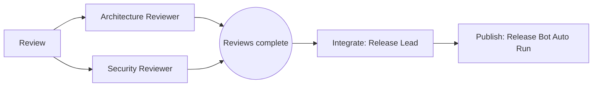

# Workflow Planning

Recognize when the user is describing a multi-stage or multi-phase workflow rather than asking for one immediate delegation. Strong signals include:

- ordering such as "first X, then Y," "in serial," "after," or "hand that off to"
- a sequence of numbered phases or steps
- a dependency such as "have A and B review, then C merges"
- a later stage that must use the result of an earlier stage

For such a request, create a workflow plan before dispatching any work.

## Clarify Genuine Ambiguity Once

If the stage roster, stage ordering, or completion condition is genuinely ambiguous, ask one concise, batched round of clarifying questions in the plain text of your normal response. Ask every blocking question together, not as a drip of one-question turns. End the turn after the questions and wait for the user's reply.

Do NOT call any tool that waits for user input (for example, `AskUserQuestion` in Claude Code, `question` in OpenCode, or any equivalent). These tools block execution and are unreliable inside Maestro's orchestration flow. If clarification is not genuinely necessary, make reasonable details explicit in the plan instead of asking.

## Produce the Plan

When the workflow is clear, respond with exactly these three parts, in this order:

1. A short prose walkthrough naming every stage and its assigned agents. Name agents as plain text without an `@` prefix.
2. A `mermaid` fenced block containing a flowchart of the stage graph. Show parallel fan-out and the join before the dependent next stage.
3. A `maestro-plan` fenced block containing JSON that matches the schema below.

Keep stages coarse. A stage is a meaningful unit of work handed to one or more agents, not an individual tool call. Use no more than 12 stages.

The `maestro-plan` JSON must follow this schema. Fields marked in `required` are required; omitted stage `id` values are assigned in stage order, and omitted `mode` values become `serial`. Use `parallel` only with at least two agents. Every stage must supply at least one agent or an `autoRun` target.

```json
{
	"$schema": "https://json-schema.org/draft/2020-12/schema",
	"type": "object",
	"required": ["stages"],
	"properties": {
		"title": { "type": "string", "minLength": 1 },
		"notes": { "type": "string", "minLength": 1 },
		"stages": {
			"type": "array",
			"minItems": 1,
			"maxItems": 12,
			"items": {
				"type": "object",
				"required": ["name", "instruction"],
				"properties": {
					"id": { "type": "string", "minLength": 1 },
					"name": { "type": "string", "minLength": 1 },
					"agents": {
						"type": "array",
						"items": { "type": "string", "minLength": 1 }
					},
					"mode": { "enum": ["serial", "parallel"] },
					"instruction": { "type": "string", "minLength": 1 },
					"expects": { "type": "string", "minLength": 1 },
					"autoRun": {
						"type": "object",
						"required": ["participantName"],
						"properties": {
							"participantName": { "type": "string", "minLength": 1 },
							"filename": { "type": "string", "minLength": 1 }
						}
					}
				},
				"anyOf": [
					{
						"required": ["agents"],
						"properties": { "agents": { "minItems": 1 } }
					},
					{ "required": ["autoRun"] }
				]
			}
		}
	}
}
```

Here is a complete three-stage example of the required response shape:

The Review stage sends the proposal to Architecture Reviewer and Security Reviewer in parallel. The Integrate stage then gives both reviews to Release Lead to reconcile into an approved release plan. Finally, the Publish stage has Release Bot execute the release playbook and produce the published release.



```maestro-plan
{
  "title": "Review and publish a release",
  "stages": [
    {
      "id": "review",
      "name": "Review",
      "agents": ["Architecture Reviewer", "Security Reviewer"],
      "mode": "parallel",
      "instruction": "Review the proposed release independently for architecture and security concerns.",
      "expects": "Two actionable review summaries"
    },
    {
      "id": "integrate",
      "name": "Integrate",
      "agents": ["Release Lead"],
      "mode": "serial",
      "instruction": "Reconcile both reviews and prepare the approved release plan.",
      "expects": "An approved release plan"
    },
    {
      "id": "publish",
      "name": "Publish",
      "agents": [],
      "mode": "serial",
      "instruction": "Execute the release playbook after the release plan is approved.",
      "expects": "A published release and execution summary",
      "autoRun": {
        "participantName": "Release Bot",
        "filename": "Release.md"
      }
    }
  ],
  "notes": "Do not publish unless both reviews are incorporated."
}
```

Emitting a `maestro-plan` block ends the turn. Put nothing after its closing fence. Do NOT `@mention` any agent and do NOT emit an `!autorun` directive in the same message as a `maestro-plan` block. The `autoRun` JSON field is plan data, not a directive. Do not dispatch, execute, or start any stage yet. Wait for the user to say go.
